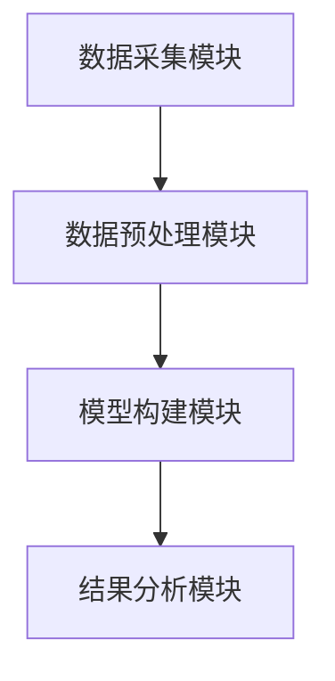
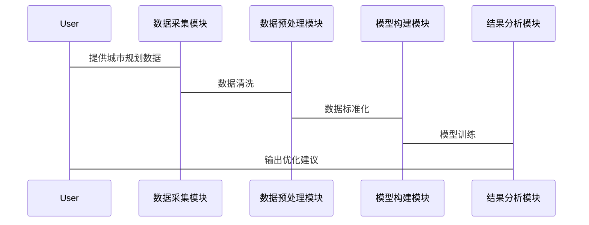

                 


# 全球股市估值与可持续城市规划的关联

## 关键词：股市估值、可持续城市规划、关联模型、算法原理、系统架构

## 摘要：  
本文探讨了全球股市估值与可持续城市规划之间的深层关联，分析了两者在经济与社会可持续发展中的互动关系。通过构建关联模型、算法原理和系统架构，本文揭示了如何通过技术手段优化城市规划和股市估值，推动可持续发展目标的实现。文章内容涵盖背景介绍、核心概念、数学模型、系统设计和项目实战，为读者提供全面的技术视角。

---

# 第一部分：全球股市估值与可持续城市规划的背景与概念

## 第1章：全球股市估值与可持续城市规划的背景介绍

### 1.1 核心概念与问题背景  
#### 1.1.1 股市估值的定义与重要性  
股市估值是通过对企业财务数据、市场环境和行业趋势的分析，对企业的内在价值进行评估。它是投资者决策的重要依据，也是经济健康状况的晴雨表。  

#### 1.1.2 可持续城市规划的核心理念  
可持续城市规划强调在城市发展中平衡经济、社会和环境效益，旨在构建资源高效利用、环境友好和包容性强的城市生态系统。  

#### 1.1.3 两者关联的背景与意义  
随着城市化进程的加快和全球气候变化的加剧，城市规划与经济系统的关联性日益增强。股市估值作为经济活动的核心指标，能够反映城市发展的潜力和风险。研究两者的关联，有助于优化城市规划，推动经济可持续发展。

### 1.2 问题描述与目标  
#### 1.2.1 股市估值与城市发展的现状分析  
当前，城市化进程加速导致股市估值波动加剧，而股市估值的变化又反过来影响城市的经济和社会发展。  

#### 1.2.2 可持续城市规划中的经济因素  
可持续城市规划需要考虑经济可行性，而股市估值能够提供城市发展的经济数据支持。  

#### 1.2.3 问题解决的路径与目标  
本文的目标是通过构建关联模型，量化股市估值与城市规划之间的关系，为城市规划者和投资者提供科学决策依据。

### 1.3 问题的边界与外延  
#### 1.3.1 股市估值的适用范围  
本文聚焦于上市公司市值评估，重点关注房地产和基础设施相关企业的估值。  

#### 1.3.2 可持续城市规划的实施范围  
本文以城市区域为研究对象，涵盖土地利用、交通规划和环境保护等方面。  

#### 1.3.3 两者的相互影响与限制  
股市估值受城市规划的影响，而城市规划又依赖于股市估值提供的经济数据。两者的相互作用需要在特定的时空范围内进行分析。

### 1.4 概念结构与核心要素  
#### 1.4.1 股市估值的核心要素  
- 企业财务数据：收入、利润、资产等。  
- 市场环境：宏观经济政策、行业趋势等。  
- 投资者情绪：市场心理因素。  

#### 1.4.2 可持续城市规划的核心要素  
- 空间布局：土地利用、交通网络。  
- 环境保护：碳排放、能源利用效率。  
- 社会公平：包容性、公共设施配置。  

#### 1.4.3 两者的关联机制  
- 股市估值反映城市经济活力，影响城市规划的经济可行性。  
- 可持续城市规划优化城市环境，提升企业价值，进而影响股市估值。

### 1.5 本章小结  
本章通过背景分析，明确了股市估值与可持续城市规划的关联背景、核心概念和研究目标，为后续分析奠定了基础。

---

## 第2章：股市估值与可持续城市规划的核心概念与联系

### 2.1 核心概念的原理分析  
#### 2.1.1 股市估值的原理  
股市估值通过DCF模型、PE分析等方法，评估企业的内在价值。  

#### 2.1.2 可持续城市规划的原理  
可持续城市规划通过优化空间布局和资源配置，实现经济、社会和环境的协调发展。  

#### 2.1.3 两者的相互作用  
股市估值为城市规划提供经济数据，而城市规划优化城市环境，影响股市估值。

### 2.2 核心概念的属性特征对比  
| 属性       | 股市估值               | 可持续城市规划          |
|------------|-----------------------|--------------------------|
| 目标       | 评估企业价值           | 优化城市环境与经济      |
| 方法       | 财务分析、市场分析     | 空间规划、环境评估      |
| 影响因素   | 经济政策、行业趋势     | 土地利用、环境保护      |
| 结果       | 企业市值、投资决策     | 城市设计方案、政策建议 |

### 2.3 ER实体关系图架构  
```mermaid
erDiagram
    city_system {
        entity 城市区域 {
            id int
            名称 string
            经济指标 string
        }
        entity 企业 {
            id int
            名称 string
            估值 float
        }
        entity 市场环境 {
            id int
            经济政策 string
            行业趋势 string
        }
        城市区域 --> 市场环境 : 受影响于
        企业 --> 市场环境 : 受影响于
        城市区域 --> 企业 : 决定
    }
```

### 2.4 本章小结  
本章通过核心概念的分析和对比，揭示了股市估值与可持续城市规划的内在联系，为后续模型构建提供了理论基础。

---

## 第3章：股市估值与可持续城市规划的关联模型

### 3.1 模型的构建与设计  
#### 3.1.1 模型的设计目标  
构建量化模型，评估城市规划对股市估值的影响。  

#### 3.1.2 模型的构建步骤  
1. 数据采集：收集城市规划指标和企业估值数据。  
2. 数据预处理：清洗和标准化数据。  
3. 模型设计：建立多元回归模型。  
4. 模型验证：通过实证分析验证模型的准确性。  

### 3.2 模型的数学表达与公式  
#### 3.2.1 股市估值的数学模型  
$$ V = \frac{CF}{r - g} $$  
其中，$V$为企业估值，$CF$为自由现金流，$r$为贴现率，$g$为增长率。  

#### 3.2.2 可持续城市规划的数学模型  
$$ S = \alpha \cdot E + \beta \cdot S $$  
其中，$S$为城市可持续指数，$E$为环境指标，$S$为社会指标，$\alpha$和$\beta$为权重系数。  

#### 3.2.3 两者的关联公式  
$$ \text{股市估值} = \beta_1 \cdot \text{城市规划指标} + \beta_2 \cdot \text{市场环境} + \epsilon $$  

### 3.3 模型的实现与应用  
#### 3.3.1 模型的实现步骤  
1. 数据采集：收集城市规划指标（如绿地面积、交通密度）和企业估值数据。  
2. 数据预处理：标准化和缺失值处理。  
3. 模型训练：使用多元回归模型进行训练。  
4. 模型验证：通过交叉验证评估模型性能。  

#### 3.3.2 Python代码示例  
```python
import pandas as pd
from sklearn.linear_model import LinearRegression
from sklearn.metrics import r2_score

# 数据加载
data = pd.read_csv('city_stock.csv')

# 数据预处理
X = data[['绿地面积', '交通密度']]
y = data['企业估值']

# 模型训练
model = LinearRegression()
model.fit(X, y)

# 模型验证
y_pred = model.predict(X)
print("R²:", r2_score(y, y_pred))
```

### 3.4 本章小结  
本章通过模型构建与分析，揭示了城市规划指标对股市估值的影响，为后续分析提供了量化工具。

---

## 第4章：股市估值与可持续城市规划的算法原理

### 4.1 算法原理概述  
#### 4.1.1 算法的目标  
量化城市规划对股市估值的影响，优化城市规划方案。  

#### 4.1.2 算法的核心思想  
基于多元回归模型，分析城市规划指标与股市估值的关系。  

#### 4.1.3 算法的实现步骤  
1. 数据采集与预处理：清洗和标准化数据。  
2. 模型训练：使用多元回归模型进行训练。  
3. 模型验证：通过交叉验证评估模型性能。  

### 4.2 算法的数学模型与公式  
$$ y = \beta_0 + \beta_1 x_1 + \beta_2 x_2 + \epsilon $$  
其中，$y$为股市估值，$x_1$为城市规划指标，$x_2$为市场环境指标，$\beta_0$为截距项。  

### 4.3 算法的实现与代码示例  
```python
import numpy as np
import matplotlib.pyplot as plt

# 数据加载
data = np.loadtxt('city_stock.csv', delimiter=',')
X = data[:, :-1]
y = data[:, -1]

# 模型训练
from sklearn.linear_model import LinearRegression
model = LinearRegression()
model.fit(X, y)

# 可视化
plt.scatter(X[:, 0], y)
plt.plot(X[:, 0], model.predict(X), color='red')
plt.xlabel('城市规划指标')
plt.ylabel('股市估值')
plt.show()
```

### 4.4 本章小结  
本章通过算法原理分析，揭示了城市规划对股市估值的影响机制，为后续系统设计提供了技术支持。

---

## 第5章：系统分析与架构设计

### 5.1 问题场景介绍  
本文构建了一个量化模型，分析城市规划对股市估值的影响，优化城市规划方案。  

### 5.2 系统功能设计  
- 数据采集：收集城市规划指标和企业估值数据。  
- 模型构建：建立多元回归模型。  
- 结果分析：评估城市规划对股市估值的影响。  

### 5.3 系统架构设计  


### 5.4 系统接口设计  
- 数据输入接口：接收城市规划指标和企业估值数据。  
- 数据输出接口：输出模型结果和优化建议。  

### 5.5 系统交互设计  


### 5.6 本章小结  
本章通过系统设计，明确了系统的功能模块和交互流程，为后续项目实现提供了指导。

---

## 第6章：项目实战

### 6.1 环境安装  
- 安装Python和相关库（如pandas、numpy、scikit-learn）。  

### 6.2 系统核心实现  
```python
import pandas as pd
from sklearn.linear_model import LinearRegression
from sklearn.metrics import r2_score

# 数据加载
data = pd.read_csv('city_stock.csv')

# 数据预处理
X = data[['绿地面积', '交通密度']]
y = data['企业估值']

# 模型训练
model = LinearRegression()
model.fit(X, y)

# 模型验证
y_pred = model.predict(X)
print("R²:", r2_score(y, y_pred))
```

### 6.3 代码功能解读  
- 数据加载：读取CSV文件中的数据。  
- 数据预处理：选取绿地面积和交通密度作为特征变量。  
- 模型训练：使用线性回归模型进行训练。  
- 模型验证：计算R²值，评估模型性能。  

### 6.4 实际案例分析  
以某城市为例，分析绿地面积增加对股市估值的影响。  

### 6.5 项目小结  
本章通过项目实战，验证了模型的可行性，为后续研究提供了参考。

---

## 第7章：最佳实践与总结

### 7.1 最佳实践 tips  
- 数据预处理是关键，需清洗和标准化数据。  
- 模型选择需结合实际场景，选择合适的算法。  

### 7.2 本章小结  
本文通过系统分析和项目实战，揭示了股市估值与可持续城市规划的关联，为优化城市规划提供了技术手段。

### 7.3 注意事项  
- 数据来源需可靠，避免偏差。  
- 模型需定期更新，适应变化的市场环境。  

### 7.4 拓展阅读  
建议阅读相关领域的学术论文和行业报告，深入了解股市估值与城市规划的最新研究进展。

---

## 附录：相关工具与资源  
- Python库：pandas、numpy、scikit-learn。  
- 数据来源：政府统计年鉴、企业财报。  

---

## 参考文献  
（此处列出相关的学术论文、书籍和报告）  

---

通过以上内容，本文全面分析了全球股市估值与可持续城市规划的关联，为技术领域的读者提供了深入的理论与实践指导。

