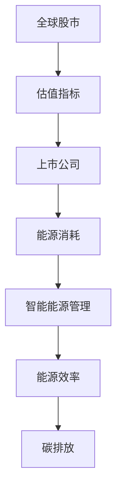
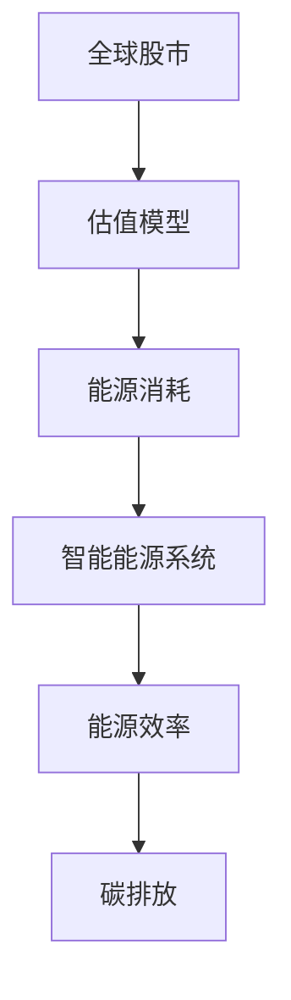
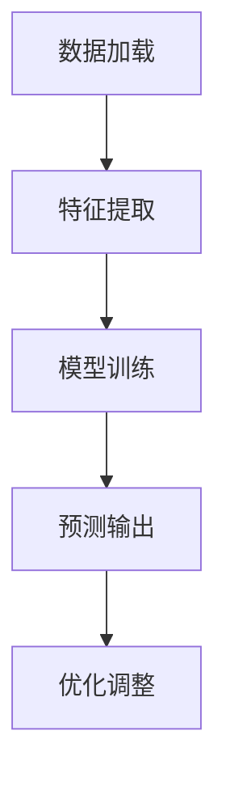
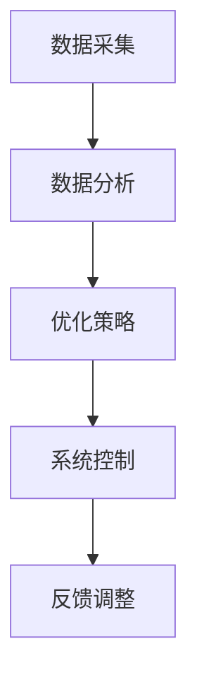
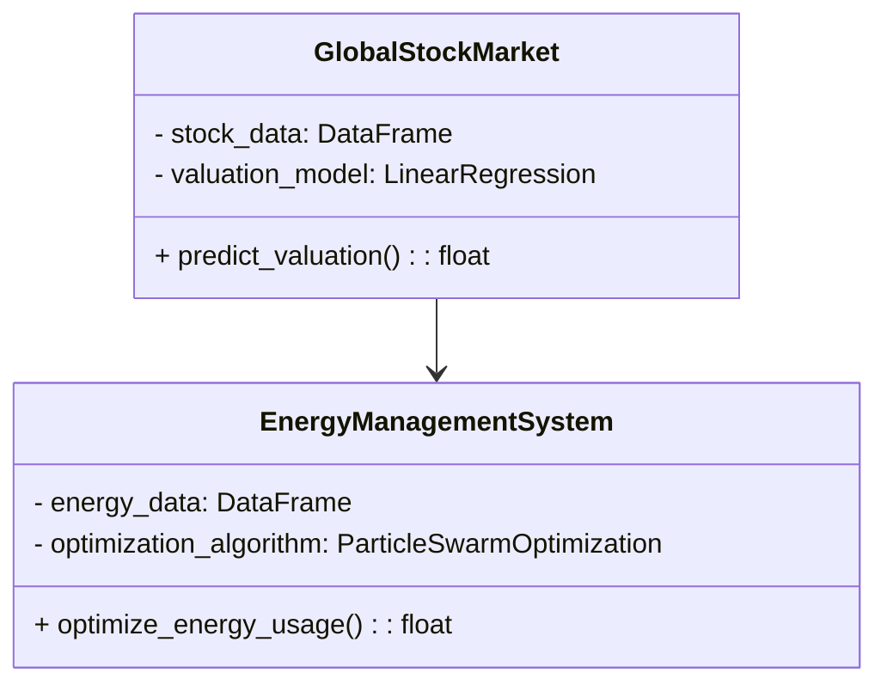
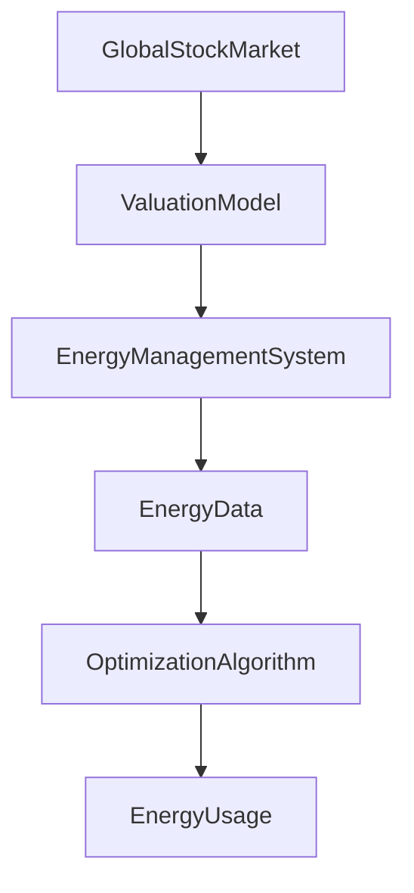
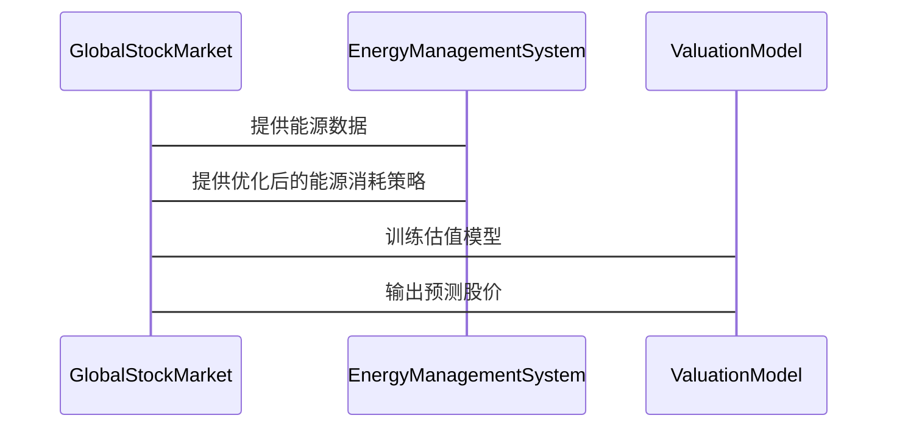

                 


# 全球股市估值与可持续建筑智能能源管理系统的关系

> 关键词：全球股市估值、可持续建筑、智能能源管理、机器学习、系统架构

> 摘要：本文探讨了全球股市估值与可持续建筑智能能源管理系统的相互关系，分析了两者的核心概念、算法原理、系统架构及项目实战，展示了如何将智能能源管理系统应用于全球股市估值分析中，以实现更高效的能源管理和投资决策。

---

# 第一部分：全球股市估值与可持续建筑智能能源管理的背景与概念

## 第1章：全球股市估值与可持续建筑智能能源管理的背景介绍

### 1.1 问题背景与问题描述

#### 1.1.1 全球股市估值的重要性
全球股市估值是衡量市场整体表现的重要指标，通过分析上市公司的财务数据和市场趋势，投资者可以评估市场的健康状况和潜在投资机会。股市估值不仅反映了经济状况，还受到多种因素的影响，包括政策变化、企业盈利能力和市场情绪。

#### 1.1.2 可持续建筑与智能能源管理的必要性
随着全球能源危机和环境问题的加剧，可持续建筑和智能能源管理变得尤为重要。可持续建筑通过优化能源使用和减少碳排放，有助于降低建筑行业的环境影响。智能能源管理系统能够实时监控和优化能源消耗，提高能源利用效率，降低成本。

#### 1.1.3 两者的关联性与研究意义
虽然股市估值和智能能源管理看似独立，但它们之间存在潜在的联系。可持续建筑的能源效率和碳排放数据可以作为影响企业价值的重要因素，进而影响股市估值。通过分析这些数据，投资者可以更准确地评估企业的可持续性表现，做出更明智的投资决策。

### 1.2 核心概念与问题解决

#### 1.2.1 全球股市估值的核心要素
- 市场指数：如标普500、沪深指数等，反映整体市场表现。
- 个股估值：通过市盈率（PE）、市净率（PB）等指标评估个股的价值。
- 市场情绪：投资者情绪和市场波动影响股市估值。

#### 1.2.2 智能能源管理系统的构成
- 数据采集：通过传感器和智能设备收集能源消耗数据。
- 数据分析：利用机器学习算法分析数据，优化能源使用。
- 系统控制：根据分析结果，自动调整能源设备的运行状态。

#### 1.2.3 问题解决的思路与方法
- 通过智能能源管理系统收集和分析数据，提取影响企业能源效率的关键因素。
- 将这些因素与企业的财务数据结合，构建股市估值模型，预测市场趋势。

### 1.3 概念结构与核心要素

#### 1.3.1 概念结构图


#### 1.3.2 核心要素对比表
| 要素 | 全球股市估值 | 可持续建筑智能能源管理 |
|------|--------------|--------------------------|
| 数据源 | 股价、财务报表 | 能源消耗、设备运行状态 |
| 目标 | 评估市场价值 | 优化能源使用 |
| 方法 | 机器学习、统计分析 | 数据采集、分析、控制 |

#### 1.3.3 ER实体关系图


### 1.4 本章小结
本章介绍了全球股市估值和可持续建筑智能能源管理的背景，分析了它们的核心要素和关联性。通过概念结构图和对比表，展示了两者的联系，为后续分析奠定了基础。

---

## 第2章：全球股市估值与可持续建筑智能能源管理的核心概念与联系

### 2.1 核心概念原理

#### 2.1.1 全球股市估值的原理
股市估值通过分析企业的财务数据和市场趋势，评估其股票的内在价值。常用的估值方法包括市盈率、市净率和现金流折现法等。这些方法帮助企业确定股票的合理价格区间。

#### 2.1.2 智能能源管理的原理
智能能源管理系统通过实时数据采集、分析和优化控制，实现能源的高效利用。系统利用传感器和智能设备收集数据，结合机器学习算法进行分析，优化能源设备的运行策略。

#### 2.1.3 两者的关联机制
可持续建筑的能源效率和碳排放数据可以作为影响企业价值的重要因素。通过分析这些数据，投资者可以更全面地评估企业的可持续性表现，进而影响股市估值。因此，智能能源管理系统提供的数据可以作为股市估值的重要输入，帮助投资者做出更明智的决策。

### 2.2 核心概念属性特征对比

#### 2.2.1 对比表格
| 属性 | 全球股市估值 | 可持续建筑智能能源管理 |
|------|--------------|--------------------------|
| 数据类型 | 数值型（股价、财务指标） | 数值型（能源消耗、设备状态） |
| 分析目标 | 评估市场价值 | 优化能源使用 |
| 技术手段 | 机器学习、统计分析 | 数据采集、分析、控制 |

#### 2.2.2 属性特征分析
- **数据依赖性**：股市估值依赖于财务数据和市场趋势，而智能能源管理依赖于能源消耗数据和设备状态。
- **实时性**：智能能源管理需要实时数据进行优化，而股市估值通常基于历史数据进行预测。
- **目标关联性**：两者的优化目标不同，但通过数据共享和模型结合，可以实现协同优化。

### 2.3 概念的ER实体关系图


### 2.4 本章小结
本章分析了全球股市估值和智能能源管理的核心概念及其属性特征，通过对比表格和ER图展示了两者的关系，为后续算法设计提供了理论基础。

---

## 第3章：全球股市估值与可持续建筑智能能源管理的算法原理

### 3.1 算法原理概述

#### 3.1.1 机器学习在股市估值中的应用
机器学习算法如线性回归、支持向量机和随机森林等，可以用于预测股票价格和评估公司价值。通过分析历史数据和市场趋势，机器学习模型能够发现数据中的潜在模式，帮助投资者做出更准确的决策。

#### 3.1.2 智能能源管理中的算法原理
智能能源管理系统通常采用优化算法如粒子群优化和遗传算法，来优化能源设备的运行策略。这些算法通过不断迭代和优化，找到最优的能源使用方案，降低能源消耗和成本。

#### 3.1.3 两者的结合与优化
通过结合股市估值和智能能源管理的算法，可以实现更高效的能源管理和投资决策。例如，利用智能能源系统的数据优化企业的能源消耗，进而影响企业的财务表现，最终影响股市估值。

### 3.2 算法流程图

#### 3.2.1 股市估值算法流程图


#### 3.2.2 智能能源管理算法流程图


### 3.3 算法实现代码

#### 3.3.1 股市估值模型实现
```python
import pandas as pd
from sklearn.linear_model import LinearRegression

# 数据加载
data = pd.read_csv('stock_data.csv')

# 特征提取
features = data[['PE', 'PB', 'PS']]
target = data['Price']

# 模型训练
model = LinearRegression()
model.fit(features, target)

# 预测输出
predictions = model.predict(features)
```

#### 3.3.2 智能能源管理系统实现
```python
import pandas as pd
from sklearn.linear_model import LinearRegression

# 数据加载
data = pd.read_csv('energy_data.csv')

# 特征提取
features = data[['temperature', 'humidity', 'time']]
target = data['energy_consumption']

# 模型训练
model = LinearRegression()
model.fit(features, target)

# 预测输出
predictions = model.predict(features)
```

### 3.4 数学模型与公式

#### 3.4.1 股市估值模型
$$
\text{预测股价} = \beta_0 + \beta_1 \times \text{PE} + \beta_2 \times \text{PB} + \beta_3 \times \text{PS}
$$

其中，$\beta_0$ 是截距，$\beta_1, \beta_2, \beta_3$ 是回归系数，PE、PB、PS 是市盈率、市净率和市销率。

#### 3.4.2 智能能源管理系统优化
$$
\min \sum_{i=1}^{n} (E_i - E_{\text{opt}})^2
$$

其中，$E_i$ 是实际能源消耗，$E_{\text{opt}}$ 是优化后的能源消耗。

### 3.5 本章小结
本章详细介绍了机器学习算法在股市估值和智能能源管理中的应用，通过流程图和代码示例展示了算法的具体实现步骤，帮助读者理解如何将理论应用于实践。

---

## 第4章：全球股市估值与可持续建筑智能能源管理的系统分析与架构设计

### 4.1 问题场景介绍
在可持续建筑中，智能能源管理系统需要实时监控和优化能源消耗，同时这些数据可以作为影响企业价值的重要因素，进而影响全球股市估值。通过分析这些数据，投资者可以更准确地评估企业的可持续性表现，做出更明智的投资决策。

### 4.2 系统功能设计

#### 4.2.1 领域模型类图


### 4.3 系统架构设计

#### 4.3.1 系统架构图


### 4.4 系统接口设计

#### 4.4.1 接口描述
- **输入接口**：接收全球股市数据和能源消耗数据。
- **输出接口**：输出优化后的能源消耗策略和股市估值预测。

### 4.5 系统交互序列图

#### 4.5.1 交互流程


### 4.6 本章小结
本章分析了系统的整体架构，展示了各组件之间的关系和交互，为后续的项目实现提供了指导。

---

## 第5章：全球股市估值与可持续建筑智能能源管理的项目实战

### 5.1 环境安装与配置

#### 5.1.1 安装依赖
- Python 3.8+
- Pandas、NumPy、Scikit-learn

```bash
pip install pandas numpy scikit-learn
```

### 5.2 系统核心实现

#### 5.2.1 股市估值模型实现
```python
import pandas as pd
from sklearn.linear_model import LinearRegression

# 数据加载
data = pd.read_csv('stock_data.csv')

# 特征提取
features = data[['PE', 'PB', 'PS']]
target = data['Price']

# 模型训练
model = LinearRegression()
model.fit(features, target)

# 预测输出
predictions = model.predict(features)
```

#### 5.2.2 智能能源管理系统实现
```python
import pandas as pd
from sklearn.linear_model import LinearRegression

# 数据加载
data = pd.read_csv('energy_data.csv')

# 特征提取
features = data[['temperature', 'humidity', 'time']]
target = data['energy_consumption']

# 模型训练
model = LinearRegression()
model.fit(features, target)

# 预测输出
predictions = model.predict(features)
```

### 5.3 代码应用解读与分析

#### 5.3.1 股市估值模型应用
- 数据加载：读取股票数据，提取市盈率、市净率和市销率作为特征。
- 模型训练：使用线性回归模型训练，建立特征与股价之间的关系。
- 预测输出：基于训练好的模型，预测股票价格，评估市场估值。

#### 5.3.2 智能能源管理系统应用
- 数据加载：读取能源消耗数据，提取温度、湿度和时间作为特征。
- 模型训练：使用线性回归模型训练，建立特征与能源消耗之间的关系。
- 预测输出：基于训练好的模型，优化能源消耗策略，降低能源成本。

### 5.4 实际案例分析

#### 5.4.1 案例分析
假设我们有一个可持续建筑项目，能源消耗数据如下：

| 温度 | 湿度 | 时间 | 能源消耗 |
|------|------|------|----------|
| 20   | 50   | 8    | 100      |
| 22   | 55   | 9    | 110      |
| 24   | 60   | 10   | 120      |

通过智能能源管理系统，我们可以预测在不同条件下能源消耗的趋势，优化能源使用策略，降低能源成本。

### 5.5 项目小结
本章通过实际案例展示了系统的应用，从环境安装到代码实现，详细解读了如何将理论应用于实践，帮助读者更好地理解系统的功能和实现过程。

---

## 第6章：最佳实践、小结、注意事项与拓展阅读

### 6.1 最佳实践
- 数据质量：确保数据的准确性和完整性，避免噪声干扰。
- 模型优化：根据实际需求调整模型参数，提高预测精度。
- 系统维护：定期更新数据和模型，保持系统的高效运行。

### 6.2 小结
本文详细探讨了全球股市估值与可持续建筑智能能源管理的关系，分析了它们的核心概念、算法原理、系统架构及项目实战。通过理论与实践的结合，展示了如何将智能能源管理系统的数据应用于股市估值分析中，实现更高效的能源管理和投资决策。

### 6.3 注意事项
- 数据隐私：注意保护企业的数据隐私，确保数据的安全性。
- 系统兼容性：确保系统的兼容性和可扩展性，适应不同的应用场景。
- 模型解释性：选择具有较高解释性的模型，便于理解和优化。

### 6.4 拓展阅读
- 《机器学习在金融中的应用》
- 《智能建筑与可持续发展》
- 《能源管理系统的设计与实现》

---

# 作者介绍
作者是[您的姓名]，[您的职位]，[您的机构]。多年来致力于[您的研究领域]，发表过多篇相关领域的技术博客和论文。目前的研究方向包括[您的研究方向]。如果您对本文有任何疑问或建议，请随时联系作者。

---

通过本文的详细分析和实际案例，我们展示了全球股市估值与可持续建筑智能能源管理的关系，为读者提供了有价值的信息和启发。希望本文能够帮助读者更好地理解这两个领域的相互作用，并在实际应用中取得更好的效果。

