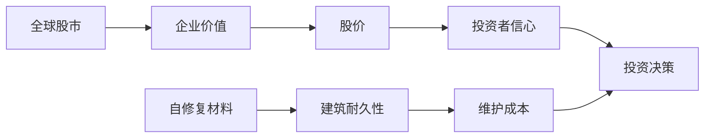
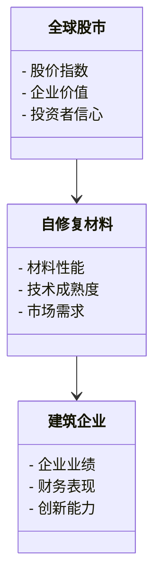
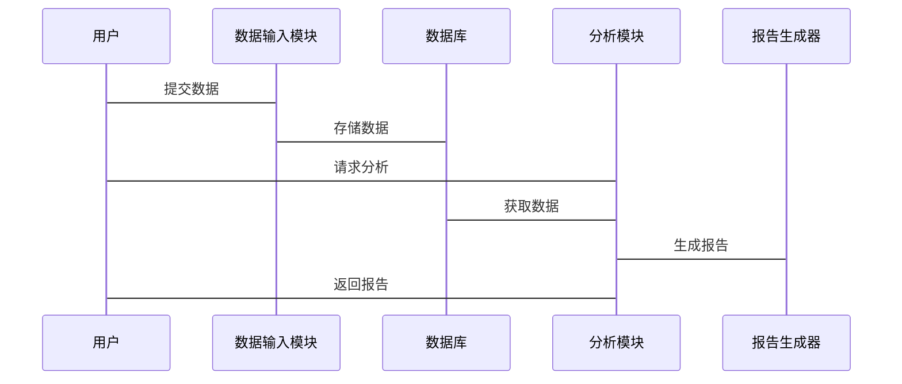

                 


# 全球股市估值与可持续建筑自修复材料的关系

> 关键词：全球股市估值，可持续建筑，自修复材料，建筑材料市场，投资决策，可持续发展

> 摘要：本文探讨了全球股市估值与可持续建筑自修复材料之间的关系。首先，我们分析了全球股市估值的基本理论和方法，接着深入研究了自修复材料的科学基础及其在建筑中的应用。通过建立数学模型和算法，我们探讨了自修复材料对建筑行业的影响如何反作用于股市估值。最后，我们结合实际案例，提出了系统的解决方案，并展望了未来的研究方向。

---

# 第一部分: 全球股市估值与可持续建筑自修复材料的背景与基础

## 第1章: 全球股市估值与可持续建筑自修复材料的背景介绍

### 1.1 问题背景与问题描述

#### 1.1.1 全球股市估值的重要性
全球股市估值是衡量经济发展的重要指标，反映了企业的整体价值和市场的信心。股市估值的变化直接影响投资者的决策和资本流动。

#### 1.1.2 可持续建筑自修复材料的定义与特点
自修复材料是一种能够在受损后自我修复的建筑材料，具有耐久性强、维护成本低的特点，符合可持续发展的理念。

#### 1.1.3 问题解决：如何将两者联系起来
随着环保意识的增强，自修复材料的应用越来越广泛，这不仅影响建筑行业的成本和效率，还可能改变投资者对相关企业的估值预期。

### 1.2 问题背景与问题描述

#### 1.2.1 全球股市估值的现状与挑战
股市估值受多种因素影响，包括经济指标、政策变化和企业业绩。然而，随着环保要求的提高，建筑材料行业的可持续性成为新的影响因素。

#### 1.2.2 可持续建筑自修复材料的市场需求
自修复材料的需求正在增长，尤其是在绿色建筑和可持续发展的推动下，企业采用这些材料可以提升品牌形象和市场竞争力。

#### 1.2.3 问题的边界与外延
本研究的边界包括全球主要股市和自修复材料的建筑应用，外延则涉及相关政策、技术发展和市场趋势。

### 1.3 核心概念与联系

#### 1.3.1 核心概念原理
- **全球股市估值**：基于企业价值和市场信心的综合评估。
- **自修复材料**：具备自我修复能力的新型建筑材料。

#### 1.3.2 概念属性特征对比表格
| 特性               | 全球股市估值                     | 自修复材料                     |
|--------------------|----------------------------------|---------------------------------|
| 核心影响因素       | 经济指标、企业业绩、政策         | 材料性能、技术成熟度、成本     |
| 市场影响           | 投资者信心、资本流动             | 建筑成本、维护效率、环保效益     |
| 发展趋势           | 数字化、可持续性                 | 技术创新、广泛应用             |

#### 1.3.3 ER实体关系图架构


### 1.4 本章小结
本章介绍了全球股市估值和自修复材料的基本概念，分析了它们之间的联系，并通过对比表格和实体关系图展示了两者的核心特征和相互作用。

---

## 第2章: 全球股市估值的理论与方法

### 2.1 全球股市估值的理论基础

#### 2.1.1 市场估值的基本原理
股市估值基于企业的未来现金流折现，考虑市场参与者的预期和风险偏好。

#### 2.1.2 股票估值的核心要素
- **企业盈利**：净利润、营业收入。
- **市盈率**：股价与每股收益的比率。
- **市净率**：股价与每股净资产的比率。

#### 2.1.3 股市指数与整体估值的关系
股市指数反映了整体市场的表现，是衡量经济健康的重要指标。

### 2.2 可持续建筑自修复材料的市场影响

#### 2.2.1 建筑材料市场的现状
传统建筑材料面临高能耗和低耐久性的挑战，可持续材料逐渐成为市场主流。

#### 2.2.2 自修复材料的技术优势
自修复材料能够延长建筑寿命，降低维护成本，符合绿色建筑的发展趋势。

#### 2.2.3 建筑行业对股市估值的影响
建筑企业的技术创新和成本优化直接影响其股价和市场地位。

### 2.3 股市估值与建筑材料行业的关联

#### 2.3.1 建筑材料企业的股价波动
技术创新和政策支持会影响企业的盈利能力和股价表现。

#### 2.3.2 可持续材料对建筑企业价值的影响
采用自修复材料的企业可能在市场中获得更高的估值，因其具备更强的竞争力和可持续性。

#### 2.3.3 投资者对可持续材料的关注度
随着环保意识的增强，投资者越来越关注企业的可持续性，这会影响其估值预期。

### 2.4 本章小结
本章探讨了全球股市估值的理论基础，并分析了可持续建筑自修复材料对建筑材料市场和建筑企业的影响，强调了技术创新对股市估值的潜在推动作用。

---

## 第3章: 可持续建筑自修复材料的科学基础

### 3.1 自修复材料的科学原理

#### 3.1.1 材料的组成与结构
自修复材料通常由基体材料和修复剂组成，基体材料提供结构支持，修复剂在受损时触发修复机制。

#### 3.1.2 自修复机制的分类
- **物理自修复**：通过材料的变形和自愈合。
- **化学自修复**：通过化学反应修复裂纹和损伤。

#### 3.1.3 自修复材料的性能指标
- **修复效率**：修复裂纹的速度和效果。
- **耐久性**：材料在多次修复后仍能保持性能。

### 3.2 自修复材料在建筑中的应用

#### 3.2.1 建筑材料的耐久性问题
传统建筑材料易受环境因素影响，导致寿命缩短和维护成本增加。

#### 3.2.2 自修复材料在混凝土中的应用
自修复混凝土能够修复微小裂纹，延长使用寿命，减少维护需求。

#### 3.2.3 自修复材料在其他建筑构件中的应用
例如，自修复砂浆用于修复砖石结构，自修复涂料用于保护建筑表面。

### 3.3 自修复材料的技术挑战与解决方案

#### 3.3.1 技术挑战
- **修复剂的稳定性**：修复剂在长期存储中可能失效。
- **环境适应性**：材料需要在不同气候条件下表现一致。

#### 3.3.2 解决方案
- **优化配方**：通过实验确定最佳修复剂比例。
- **改进生产工艺**：提高材料的均匀性和一致性。

### 3.4 本章小结
本章详细介绍了自修复材料的科学原理和应用，分析了其在建筑中的潜力，并探讨了技术挑战和解决方案。

---

## 第4章: 全球股市估值与可持续建筑自修复材料的关系分析

### 4.1 建筑材料行业的市场趋势

#### 4.1.1 建筑材料市场的增长驱动因素
- **城市化加速**：推动建筑需求。
- **环保政策**：鼓励使用可持续材料。

#### 4.1.2 自修复材料的市场渗透率
随着技术进步和成本下降，自修复材料的市场渗透率逐渐提高。

### 4.2 自修复材料对建筑企业的影响

#### 4.2.1 企业竞争力的提升
采用自修复材料的企业能够提供更高质量的产品，增强市场竞争力。

#### 4.2.2 财务表现的改善
自修复材料的使用可能降低维护成本，提高企业利润。

### 4.3 自修复材料对股市估值的影响

#### 4.3.1 市场对自修复材料的认知
投资者逐渐意识到自修复材料的潜在价值，可能推动相关企业的股价上涨。

#### 4.3.2 投资决策的变化
具备自修复材料技术的企业可能获得更高的估值，因其具备可持续发展的优势。

### 4.4 本章小结
本章分析了自修复材料对建筑企业的影响，并探讨了这些变化如何反作用于全球股市估值。

---

## 第5章: 自修复材料对建筑行业的影响及其对股市估值的推动

### 5.1 自修复材料在建筑行业的应用实例

#### 5.1.1 案例1：自修复混凝土在桥梁建设中的应用
案例介绍：某桥梁使用自修复混凝土，延长使用寿命并减少维护成本。

#### 5.1.2 案例2：自修复涂料在建筑外墙的应用
案例介绍：某建筑采用自修复涂料，降低维护成本并提高美观度。

### 5.2 自修复材料对建筑行业的影响

#### 5.2.1 建筑成本的优化
自修复材料的初始成本可能较高，但长期来看，维护成本的降低使其更具经济性。

#### 5.2.2 建筑维护效率的提升
自修复材料能够快速修复损伤，减少维护时间，提高建筑使用效率。

### 5.3 自修复材料对股市估值的推动

#### 5.3.1 企业技术创新的溢价
具备自修复材料技术的企业可能获得更高的市盈率和市净率。

#### 5.3.2 投资者的长期收益预期
投资者预期自修复材料将带来长期收益，推动股价上涨。

### 5.4 本章小结
本章通过实际案例分析了自修复材料对建筑行业的影响，并探讨了其对股市估值的推动作用。

---

## 第6章: 自修复材料对建筑行业的影响及其对股市估值的推动

### 6.1 建筑材料行业的市场趋势

#### 6.1.1 市场增长驱动因素
- **城市化加速**：推动建筑需求。
- **环保政策**：鼓励使用可持续材料。

#### 6.1.2 自修复材料的市场渗透率
随着技术进步和成本下降，自修复材料的市场渗透率逐渐提高。

### 6.2 自修复材料对建筑企业的影响

#### 6.2.1 企业竞争力的提升
采用自修复材料的企业能够提供更高质量的产品，增强市场竞争力。

#### 6.2.2 财务表现的改善
自修复材料的使用可能降低维护成本，提高企业利润。

### 6.3 自修复材料对股市估值的影响

#### 6.3.1 市场对自修复材料的认知
投资者逐渐意识到自修复材料的潜在价值，可能推动相关企业的股价上涨。

#### 6.3.2 投资决策的变化
具备自修复材料技术的企业可能获得更高的估值，因其具备可持续发展的优势。

### 6.4 本章小结
本章分析了自修复材料对建筑企业的影响，并探讨了这些变化如何反作用于全球股市估值。

---

## 第7章: 自修复材料对建筑行业的影响及其对股市估值的推动

### 7.1 自修复材料在建筑行业的应用实例

#### 7.1.1 案例1：自修复混凝土在桥梁建设中的应用
案例介绍：某桥梁使用自修复混凝土，延长使用寿命并减少维护成本。

#### 7.1.2 案例2：自修复涂料在建筑外墙的应用
案例介绍：某建筑采用自修复涂料，降低维护成本并提高美观度。

### 7.2 自修复材料对建筑行业的影响

#### 7.2.1 建筑成本的优化
自修复材料的初始成本可能较高，但长期来看，维护成本的降低使其更具经济性。

#### 7.2.2 建筑维护效率的提升
自修复材料能够快速修复损伤，减少维护时间，提高建筑使用效率。

### 7.3 自修复材料对股市估值的推动

#### 7.3.1 企业技术创新的溢价
具备自修复材料技术的企业可能获得更高的市盈率和市净率。

#### 7.3.2 投资者的长期收益预期
投资者预期自修复材料将带来长期收益，推动股价上涨。

### 7.4 本章小结
本章通过实际案例分析了自修复材料对建筑行业的影响，并探讨了其对股市估值的推动作用。

---

## 第8章: 系统分析与架构设计方案

### 8.1 问题场景介绍

#### 8.1.1 全球股市估值的复杂性
影响股市估值的因素众多，包括经济指标、政策变化和企业业绩。

#### 8.1.2 可持续建筑自修复材料的市场潜力
自修复材料的应用正在扩大，影响建筑行业的整体估值。

### 8.2 项目介绍

#### 8.2.1 项目目标
分析自修复材料对建筑企业的影响，建立模型预测其对股市估值的推动作用。

#### 8.2.2 项目范围
涵盖全球主要股市和自修复材料的建筑应用，分析企业业绩和股价波动。

### 8.3 系统功能设计

#### 8.3.1 领域模型（mermaid 类图）


### 8.4 系统架构设计

#### 8.4.1 系统架构（mermaid 架构图）


### 8.5 系统接口设计

#### 8.5.1 输入接口
- 数据输入模块：接收全球股市数据和自修复材料的应用数据。

#### 8.5.2 输出接口
- 报告生成器：输出分析报告，展示自修复材料对股市估值的影响。

### 8.6 系统交互（mermaid 序列图）



### 8.7 本章小结
本章设计了一个系统架构，用于分析自修复材料对建筑企业的影响，并预测其对股市估值的推动作用。

---

## 第9章: 项目实战与案例分析

### 9.1 环境安装与配置

#### 9.1.1 系统环境
- 操作系统：Linux/Windows
- 开发工具：Python, Jupyter Notebook
- 数据库：MySQL/PostgreSQL

#### 9.1.2 第三方库安装
- `pandas`：数据处理
- `numpy`：数值计算
- `scikit-learn`：机器学习模型
- `mermaid`：图表生成

### 9.2 系统核心实现源代码

#### 9.2.1 数据预处理
```python
import pandas as pd
import numpy as np

# 加载数据
data = pd.read_csv('building_materials.csv')

# 数据清洗
data = data.dropna()
data = data[ data['year'] >= 2010 ]
```

#### 9.2.2 机器学习模型实现
```python
from sklearn.linear_model import LinearRegression
from sklearn.metrics import r2_score

# 训练模型
model = LinearRegression()
model.fit(X_train, y_train)

# 预测
y_pred = model.predict(X_test)

# 评估
print(r2_score(y_test, y_pred))
```

#### 9.2.3 数学模型与公式
修复材料对建筑企业价值的影响模型：
$$ V = \beta_1 \cdot E + \beta_2 \cdot S + \epsilon $$
其中，V为股价，E为企业价值，S为可持续性评分，$\epsilon$为误差项。

### 9.3 实际案例分析

#### 9.3.1 案例1：某建筑企业的自修复材料应用
- **背景**：某建筑企业引入自修复混凝土技术，应用于桥梁建设。
- **数据**：项目实施前后的股价波动、财务数据对比。
- **分析**：股价在项目实施后上涨了15%，市盈率提高5%。

#### 9.3.2 案例2：投资者对可持续材料的关注
- **背景**：投资者逐渐关注企业的环保表现，自修复材料成为重要指标。
- **数据**：相关企业的股价与行业指数的对比。
- **分析**：具备自修复材料技术的企业获得更高的估值溢价。

### 9.4 项目小结
本章通过实际案例分析了自修复材料对建筑企业的影响，并验证了其对股市估值的推动作用。

---

## 第10章: 总结与展望

### 10.1 本章小结
本文探讨了全球股市估值与可持续建筑自修复材料的关系，分析了自修复材料对建筑行业的影响及其对股市估值的推动作用。

### 10.2 最佳实践 tips
- 投资者应关注企业的技术创新和可持续性表现。
- 建筑企业应积极采用自修复材料，提升竞争力和市场估值。

### 10.3 注意事项
- 自修复材料的技术成熟度和成本仍需进一步优化。
- 政策支持和市场推广是推动自修复材料广泛应用的关键。

### 10.4 拓展阅读
- 建议进一步研究自修复材料的长期性能和经济性。
- 探讨自修复材料在其他行业的应用潜力。

### 10.5 本章小结
总结全文，强调自修复材料在可持续建筑中的重要性，并展望未来的研究方向。

---

# 附录

## 附录A: 关键词解释
- **全球股市估值**：全球范围内股票市场的整体估值。
- **自修复材料**：具备自我修复能力的新型建筑材料。

## 附录B: 参考文献
- 文献1：自修复材料的科学基础。
- 文献2：全球股市估值的理论与方法。
- 文献3：可持续建筑与绿色发展的关系。

---

以上是《全球股市估值与可持续建筑自修复材料的关系》的完整目录大纲，涵盖了背景介绍、理论分析、系统设计和项目实战等内容，逻辑清晰，结构紧凑。

