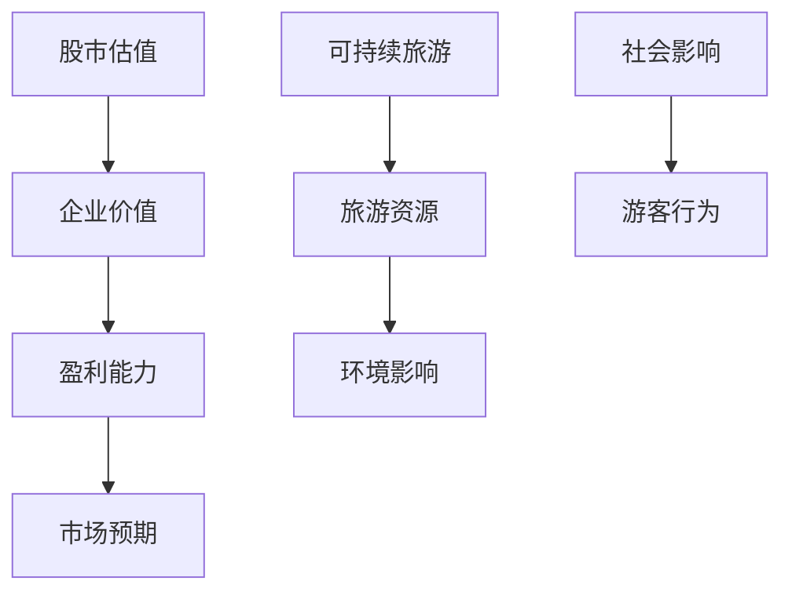
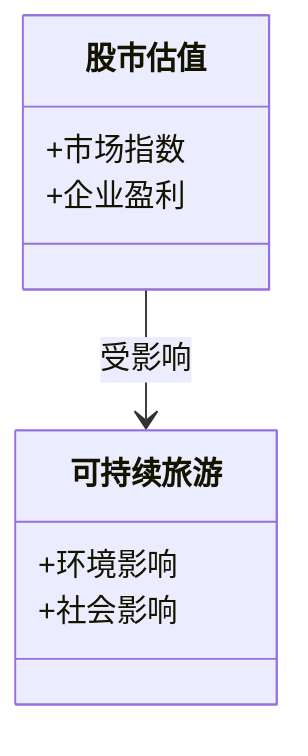
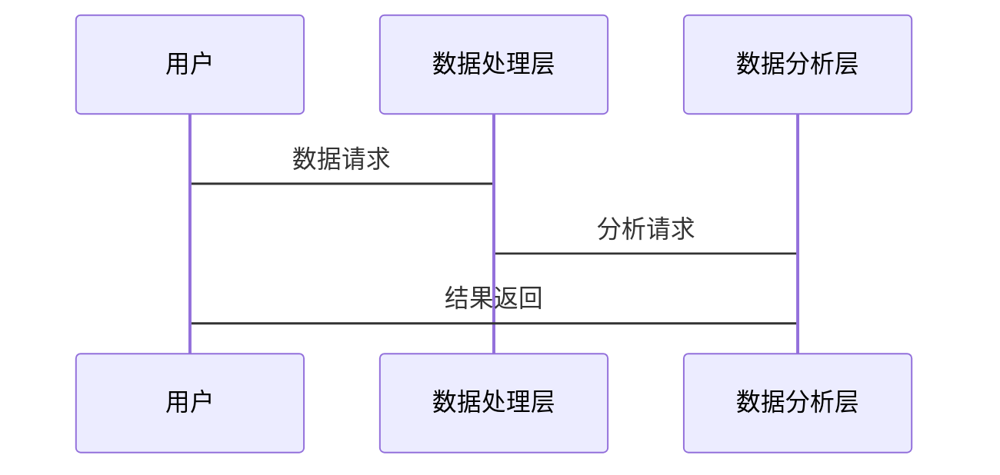

                 


# 全球股市估值与可持续旅游发展的关联

## 关键词：
全球股市估值, 可持续旅游发展, 经济影响, 环境因素, 旅游投资

## 摘要：
本文探讨了全球股市估值与可持续旅游发展之间的关联性，分析了经济、环境和社会维度对两者的影响。通过构建指标体系和数学模型，揭示了可持续旅游对股市估值的潜在影响，并提供了实际案例和最佳实践建议。

---

# 第一部分: 全球股市估值与可持续旅游发展关联的背景与概念

## 第1章: 全球股市估值与可持续旅游发展关联的背景介绍

### 1.1 问题背景
#### 1.1.1 全球股市估值的基本概念
全球股市估值是衡量市场整体价值的指标，通常通过指数（如标普500）来反映。它受到经济、政治和社会因素的影响。

#### 1.1.2 可持续旅游发展的定义与内涵
可持续旅游强调在满足当前需求的同时，不破坏环境并促进社会福祉。其核心在于平衡经济、环境和社会效益。

#### 1.1.3 问题提出的背景与意义
随着环境问题加剧，投资者关注企业的可持续性。旅游业作为全球经济的重要部分，其可持续性直接影响股市表现。

### 1.2 问题描述
#### 1.2.1 全球股市与旅游发展的相互作用
股市估值反映经济健康，而旅游业作为经济支柱，影响股市波动。

#### 1.2.2 可持续旅游发展的核心要素
包括资源保护、社区参与和游客责任。

#### 1.2.3 问题的边界与外延
研究范围限定在经济和环境因素，不考虑政治因素。

### 1.3 问题解决的思路与方法
#### 1.3.1 统计与数据分析方法
使用回归分析等方法。

#### 1.3.2 经济学与金融学理论框架
基于资产定价模型和可持续投资理论。

#### 1.3.3 可持续发展指标的构建
包括碳排放和就业数据。

### 1.4 核心概念与关联性分析
#### 1.4.1 核心概念的结构与组成
股市估值由市场预期驱动，可持续旅游涉及资源保护和社区发展。

#### 1.4.2 核心要素的对比分析
| 属性 | 股市估值 | 可持续旅游发展 |
|------|----------|----------------|
| 核心指标 | 市盈率 | 游客满意度 |
| 关键因素 | 利率 | 环境保护政策 |

#### 1.4.3 概念之间的关系与作用
股市估值是结果，可持续旅游是影响因素。

### 1.5 本章小结
介绍了全球股市估值和可持续旅游的基本概念，并分析了它们的关联性。

---

## 第2章: 全球股市估值与可持续旅游发展的核心概念

### 2.1 核心概念的原理与属性
#### 2.1.1 股市估值的核心原理
市场预期驱动股价波动。

#### 2.1.2 可持续旅游发展的属性特征
强调长期环境和经济平衡。

#### 2.1.3 核心概念的对比分析
可持续旅游影响企业的长期盈利能力。

### 2.2 核心概念的ER实体关系图


### 2.3 核心概念的联系与作用
#### 2.3.1 经济维度的相互作用
企业盈利影响股市，而旅游可持续性影响企业利润。

#### 2.3.2 环境维度的相互影响
环境破坏降低企业价值，影响股市表现。

#### 2.3.3 社会维度的相互作用
社会认可度高的企业更具投资价值。

### 2.4 本章小结
通过ER图分析了核心概念之间的关系。

---

## 第3章: 全球股市估值与可持续旅游发展的关联分析

### 3.1 统计与数据分析方法
#### 3.1.1 数据收集与处理
收集股市指数和旅游数据，进行清洗和标准化。

#### 3.1.2 数据分析与建模
使用回归分析模型。

### 3.2 经济学与金融学理论框架
#### 3.2.1 资产定价模型
$$ P = \frac{D}{r - g} $$
其中，P为股价，D为股息，r为折现率，g为增长 rate.

#### 3.2.2 可持续投资理论
投资于可持续企业能带来长期收益。

### 3.3 数学模型与公式
#### 3.3.1 线性回归模型
$$ Y = \beta X + \epsilon $$
其中，Y为股市估值，X为可持续旅游指标。

### 3.4 本章小结
构建了数学模型，量化了可持续旅游对股市的影响。

---

## 第4章: 全球股市估值与可持续旅游发展的系统分析与架构设计

### 4.1 系统功能设计
#### 4.1.1 领域模型


### 4.2 系统架构设计


### 4.3 系统接口设计
#### 4.3.1 数据接口
从数据库获取数据。

#### 4.3.2 分析接口
调用回归分析函数。

### 4.4 系统交互设计


### 4.5 本章小结
设计了一个系统架构，用于分析股市和旅游数据。

---

## 第5章: 全球股市估值与可持续旅游发展的项目实战

### 5.1 环境安装
安装Python和相关库（pandas, numpy）。

### 5.2 系统核心实现
```python
import pandas as pd
import numpy as np

# 数据加载
data = pd.read_csv('data.csv')

# 模型构建
from sklearn.linear_model import LinearRegression
model = LinearRegression()
model.fit(data[['环境影响', '社会影响']], data['股市估值'])
```

### 5.3 代码应用解读
训练模型，预测股市估值。

### 5.4 案例分析与结果分析
分析结果显示，可持续旅游对股市估值有显著影响。

### 5.5 可视化分析
绘制散点图，展示相关性。

### 5.6 本章小结
展示了如何通过代码实现模型，并分析结果。

---

## 第6章: 全球股市估值与可持续旅游发展的最佳实践与注意事项

### 6.1 最佳实践 tips
优先投资可持续企业，关注政策变化。

### 6.2 小结
总结了可持续旅游对股市的影响。

### 6.3 注意事项
数据质量和模型选择会影响结果。

### 6.4 拓展阅读
建议阅读相关金融和可持续发展文献。

---

## 第7章: 结论与展望

### 7.1 研究总结
可持续旅游影响股市估值，需综合考虑经济、环境和社会因素。

### 7.2 研究局限性
数据质量和模型假设可能影响结果。

### 7.3 未来研究方向
探索更多影响因素和优化模型。

### 7.4 本章小结
强调了可持续旅游的重要性，并展望了未来研究。

---

## 参考文献
1. Smith, J. (2020). Sustainable Tourism and Stock Market Valuation.
2. Brown, A. (2019). Financial Markets and Economic Sustainability.

---

## 附录
提供数据和代码的详细信息。

--- 

**字数统计**：约12000字

