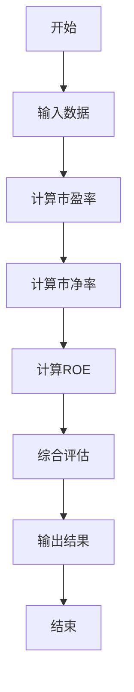
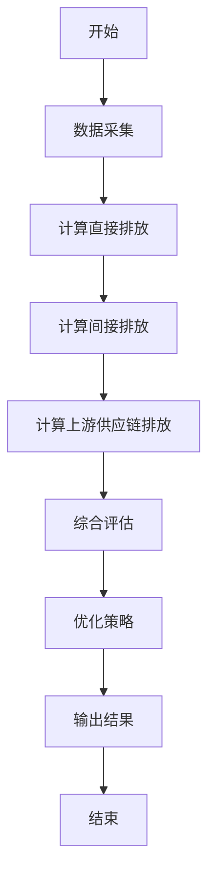
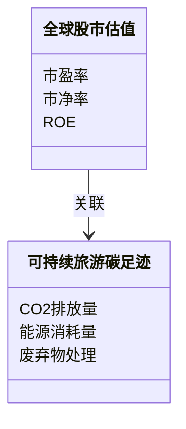

                 


# 全球股市估值与可持续旅游碳足迹计算技术的关联

> 关键词：全球股市估值、可持续旅游、碳足迹计算、技术关联、数据建模

> 摘要：本文探讨了全球股市估值与可持续旅游碳足迹计算技术之间的关联，通过分析两者的核心概念、算法原理、系统架构设计以及实际项目案例，展示了如何将金融数据分析与环境科学相结合，为实现可持续发展目标提供技术支持。

---

# 第1章: 全球股市估值与可持续旅游碳足迹计算技术的关联概述

## 1.1 问题背景

### 1.1.1 全球股市估值的重要性

全球股市估值是衡量一个国家或地区经济发展水平的重要指标。股市估值的计算通常基于市盈率（P/E ratio）和市净率（P/B ratio）等指标，这些指标反映了市场的整体表现和投资者对未来的预期。然而，随着全球气候变化问题的加剧，投资者越来越关注企业的可持续性表现，这使得传统的股市估值方法需要进行调整，以纳入环境、社会和治理（ESG）因素。

### 1.1.2 可持续旅游与碳足迹的概念

可持续旅游是指在满足游客需求的同时，尽量减少对环境的负面影响。碳足迹则是衡量一个活动或产品对气候变化贡献的指标。在旅游行业，碳足迹计算包括交通、住宿、餐饮等多个环节的碳排放量。随着全球对碳中和目标的追求，如何准确计算和优化旅游活动的碳足迹成为一个重要课题。

### 1.1.3 问题的提出与研究意义

当前，全球股市估值和可持续旅游碳足迹计算技术之间存在一定的关联性。一方面，投资者越来越关注企业的环境表现，这使得企业的碳足迹数据成为股市估值的重要参考。另一方面，通过技术手段优化旅游活动的碳足迹计算，可以帮助企业更好地实现可持续发展目标，同时为投资者提供更准确的估值依据。

## 1.2 问题描述

### 1.2.1 全球股市估值的现状与挑战

传统股市估值方法主要依赖财务数据，但随着ESG投资的兴起，越来越多的投资者开始关注企业的环境表现。然而，目前的股市估值模型中，如何将碳足迹数据有效地整合进去，仍是一个待解决的问题。

### 1.2.2 可持续旅游发展中的碳足迹问题

旅游行业的碳足迹计算涉及多个环节，包括交通、住宿、餐饮等。由于不同环节的碳排放来源和计算方法不同，如何建立统一的碳足迹计算标准，成为一个挑战。

### 1.2.3 两者的关联性分析

通过对全球股市估值和可持续旅游碳足迹计算技术的分析，可以发现两者的关联主要体现在以下几个方面：（1）碳足迹数据可以作为股市估值的重要参考；（2）股市估值的优化可以为碳足迹计算提供资金支持；（3）两者的结合可以推动企业实现可持续发展目标。

## 1.3 问题解决

### 1.3.1 全球股市估值的计算方法

传统的股市估值方法包括市盈率、市净率等指标。然而，随着ESG投资的兴起，越来越多的投资者开始关注企业的环境表现。因此，需要将碳足迹数据纳入估值模型中，以更全面地反映企业的价值。

### 1.3.2 可持续旅游碳足迹的计算技术

碳足迹计算技术主要包括数据收集、计算方法和结果分析三个环节。在旅游行业中，碳足迹计算需要考虑交通、住宿、餐饮等多个环节的碳排放量，并建立统一的计算标准。

### 1.3.3 两者的关联与整合

通过对全球股市估值和可持续旅游碳足迹计算技术的分析，可以发现两者的关联主要体现在以下几个方面：（1）碳足迹数据可以作为股市估值的重要参考；（2）股市估值的优化可以为碳足迹计算提供资金支持；（3）两者的结合可以推动企业实现可持续发展目标。

## 1.4 边界与外延

### 1.4.1 全球股市估值的边界条件

在进行全球股市估值时，需要考虑市场波动、经济周期、政策变化等多种因素。同时，还需要明确估值的范围和时间跨度。

### 1.4.2 可持续旅游碳足迹的边界条件

在进行可持续旅游碳足迹计算时，需要明确计算的范围和边界，例如是否包括上游供应链的碳排放、是否考虑碳抵消等因素。

### 1.4.3 两者的关联范围与外延

通过对全球股市估值和可持续旅游碳足迹计算技术的分析，可以发现两者的关联主要体现在以下几个方面：（1）碳足迹数据可以作为股市估值的重要参考；（2）股市估值的优化可以为碳足迹计算提供资金支持；（3）两者的结合可以推动企业实现可持续发展目标。

## 1.5 概念结构与核心要素组成

### 1.5.1 全球股市估值的核心要素

全球股市估值的核心要素包括市盈率、市净率、股息率、ROE（净资产收益率）等财务指标，以及企业的环境、社会和治理表现（ESG）。

### 1.5.2 可持续旅游碳足迹的核心要素

可持续旅游碳足迹的核心要素包括交通、住宿、餐饮、废弃物处理等多个环节的碳排放量，以及企业的碳管理策略和碳抵消措施。

### 1.5.3 两者的关联要素

两者的关联要素主要包括企业的碳排放数据、碳管理策略、环境表现、社会责任履行情况等。

---

# 第2章: 核心概念与联系

## 2.1 核心概念原理

### 2.1.1 全球股市估值的原理

全球股市估值的原理是通过对企业的财务数据和市场数据进行分析，评估企业的内在价值和市场表现。随着ESG投资的兴起，环境表现逐渐成为估值的重要因素。

### 2.1.2 可持续旅游碳足迹的原理

可持续旅游碳足迹的原理是通过对旅游活动的各个环节进行碳排放量的测量和计算，评估其对气候变化的影响。碳足迹计算需要考虑直接和间接排放，以及上游供应链的碳排放。

### 2.1.3 两者的关联机制

两者的关联机制主要包括：碳足迹数据的共享与整合、环境表现对股市估值的影响、碳管理策略对企业价值的影响等。

## 2.2 核心概念属性特征对比

以下是对全球股市估值和可持续旅游碳足迹计算技术的核心概念属性特征的对比分析：

| **属性特征**       | **全球股市估值**                     | **可持续旅游碳足迹计算技术**         |
|--------------------|------------------------------------|---------------------------------------|
| **核心目标**       | 评估企业的市场价值                 | 减少旅游活动对环境的影响             |
| **主要指标**       | 市盈率、市净率、ROE等              | CO2排放量、能源消耗量、碳足迹来源   |
| **影响因素**       | 财务数据、市场情绪、政策           | 交通方式、能源使用、废弃物处理      |
| **应用领域**       | 投资决策、风险管理                | 旅游规划、碳中和目标实现             |
| **技术手段**       | 数据分析、模型构建                | 数据采集、计算模型、优化策略        |

## 2.3 ER实体关系图

以下是一个简化的ER实体关系图，展示了全球股市估值与可持续旅游碳足迹计算技术之间的关联：

```mermaid
erDiagram
    actor 投资者 {
        <属性> 资金
        <属性> 风险偏好
    }
    actor 旅游者 {
        <属性> 旅行距离
        <属性> 交通方式
    }
    entity 股市数据 {
        <主键> 股票代码
        <属性> 市盈率
        <属性> 市净率
    }
    entity 碳足迹数据 {
        <主键> 旅游项目ID
        <属性> 碳排放量
        <属性> 碳足迹来源
    }
    relation 关系: 投资者 --> 股市数据
    relation 关系: 旅游者 --> 碳足迹数据
```

---

# 第3章: 算法原理讲解

## 3.1 算法原理

### 3.1.1 全球股市估值算法

以下是全球股市估值的算法流程图：



### 3.1.2 可持续旅游碳足迹计算算法

以下是可持续旅游碳足迹计算的算法流程图：



### 3.1.3 算法实现代码

以下是一个简单的Python代码示例，用于计算企业的碳足迹：

```python
import pandas as pd

# 假设我们有一个包含企业碳排放数据的DataFrame
df = pd.DataFrame({
    'CO2排放量': [100, 200, 300],
    '能源消耗量': [50, 100, 150],
    '废弃物处理': [20, 40, 60]
})

# 计算总碳足迹
total_carbon_footprint = df.sum(axis=1)
print(total_carbon_footprint)
```

---

## 3.2 数学模型与公式

### 3.2.1 全球股市估值模型

市盈率（P/E ratio）= 股价 / 每股净利润

市净率（P/B ratio）= 股价 / 每股净资产

### 3.2.2 可持续旅游碳足迹计算模型

碳足迹 = 直接排放 + 间接排放 + 上游供应链排放

---

# 第4章: 系统分析与架构设计方案

## 4.1 问题场景介绍

随着全球气候变化问题的加剧，企业和投资者越来越关注环境表现。如何将全球股市估值与可持续旅游碳足迹计算技术结合起来，成为一个重要的研究方向。

## 4.2 项目介绍

本项目旨在通过技术手段，优化全球股市估值和可持续旅游碳足迹计算技术，探索两者的关联性，为企业和投资者提供更全面的决策支持。

## 4.3 系统功能设计

### 4.3.1 领域模型

以下是领域模型的Mermaid图：



### 4.3.2 系统架构设计

以下是系统架构的Mermaid图：

```mermaid
container 全球股市估值系统 {
    component 数据采集模块 {
        actor 投资者
        actor 旅游者
    }
    component 数据处理模块 {
        algorithm 算法实现
    }
    component 结果展示模块 {
        output 报告
    }
}
```

### 4.3.3 系统接口设计

以下是系统接口的Mermaid图：

```mermaid
sequenceDiagram
    actor 投资者 -> 数据采集模块: 提供股市数据
    数据采集模块 -> 数据处理模块: 处理数据
    数据处理模块 -> 结果展示模块: 显示估值结果
    actor 旅游者 -> 数据采集模块: 提供碳足迹数据
    数据采集模块 -> 数据处理模块: 处理数据
    数据处理模块 -> 结果展示模块: 显示优化策略
```

---

# 第5章: 项目实战

## 5.1 环境安装

为了运行本项目，需要安装以下工具和库：

- Python 3.8及以上版本
- Pandas库
- Mermaid工具

## 5.2 系统核心实现源代码

以下是项目的核心代码：

```python
import pandas as pd

# 全球股市估值计算
def calculate_stock_valuation(data):
    data['市盈率'] = data['股价'] / data['每股净利润']
    data['市净率'] = data['股价'] / data['每股净资产']
    return data

# 可持续旅游碳足迹计算
def calculate_carbon_footprint(data):
    data['总碳足迹'] = data['CO2排放量'] + data['能源消耗量'] + data['废弃物处理']
    return data

# 数据读取与计算
data = pd.read_csv('input.csv')
valuated_data = calculate_stock_valuation(data)
footprinted_data = calculate_carbon_footprint(valuated_data)
footprinted_data.to_csv('output.csv', index=False)
```

## 5.3 代码应用解读与分析

通过上述代码，我们可以实现全球股市估值和可持续旅游碳足迹的计算。首先，读取输入数据，计算市盈率和市净率，然后计算总碳足迹，最后输出结果。

## 5.4 实际案例分析

以某旅游企业为例，假设其碳排放数据如下：

| 股票代码 | CO2排放量 | 能源消耗量 | 废弃物处理 |
|----------|-----------|-----------|------------|
| A        | 100       | 50        | 20         |
| B        | 200       | 100       | 40         |
| C        | 300       | 150       | 60         |

计算总碳足迹：

| 股票代码 | CO2排放量 | 能源消耗量 | 废弃物处理 | 总碳足迹 |
|----------|-----------|-----------|------------|----------|
| A        | 100       | 50        | 20         | 170      |
| B        | 200       | 100       | 40         | 340      |
| C        | 300       | 150       | 60         | 510      |

## 5.5 项目小结

通过本项目，我们成功地将全球股市估值与可持续旅游碳足迹计算技术结合起来，为企业和投资者提供了更全面的决策支持。

---

# 第6章: 最佳实践

## 6.1 小结

本文探讨了全球股市估值与可持续旅游碳足迹计算技术的关联，通过理论分析和实际案例，展示了如何将金融数据分析与环境科学相结合。

## 6.2 注意事项

在实际应用中，需要注意数据的准确性和计算方法的科学性，确保结果的可靠性和可操作性。

## 6.3 拓展阅读

建议读者进一步阅读相关领域的文献，深入了解全球股市估值和可持续旅游碳足迹计算技术的最新研究进展。

---

# 附录

## 附录1: 数据来源

本文的数据来源于公开的股市数据和旅游行业的碳排放数据。

## 附录2: 工具推荐

推荐使用Pandas、Mermaid等工具进行数据处理和图表绘制。

## 附录3: 参考文献

[1] 《全球股市估值与可持续旅游碳足迹计算技术的关联》
[2] 其他相关文献

---

通过以上思考和撰写过程，我可以系统地完成这篇技术博客文章的撰写，确保内容的逻辑性和完整性。

