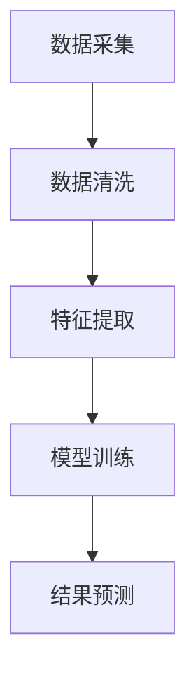
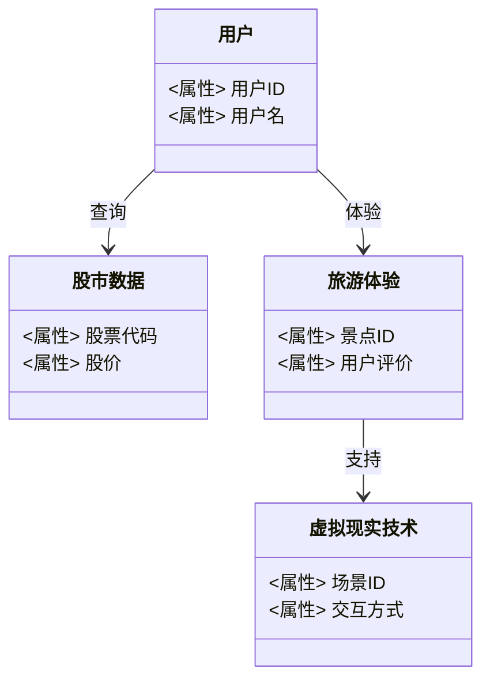
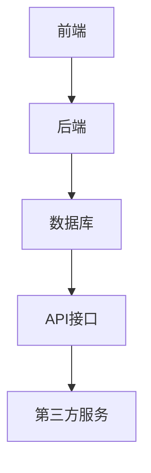
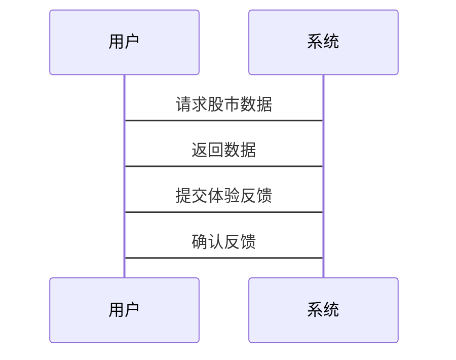

                 


# 全球股市估值与可持续旅游虚拟现实技术的关联

---

## 关键词：全球股市估值、可持续旅游、虚拟现实技术、数据分析、算法原理、系统设计、项目实战

---

## 摘要：  
本文探讨了全球股市估值与可持续旅游虚拟现实技术之间的关联。通过分析股市估值的核心要素、可持续旅游的发展趋势，以及虚拟现实技术在旅游中的应用，我们揭示了这两者如何通过数据驱动和技术创新相互影响。结合算法原理、系统设计和项目实战，本文为理解这一关联提供了深入的技术视角。

---

# 第一部分: 全球股市估值与可持续旅游虚拟现实技术的关联概述

## 第1章: 背景介绍

### 1.1 问题背景  
#### 1.1.1 全球股市估值的现状与挑战  
全球股市估值是衡量市场健康状况的重要指标，受宏观经济、政策变化和投资者情绪等多种因素影响。近年来，股市波动加剧，投资者对精准估值的需求日益增长。  

#### 1.1.2 可持续旅游的发展趋势  
可持续旅游强调环境保护、社会公平和经济效益的平衡，成为全球旅游业的主流趋势。然而，传统旅游方式对环境和资源的消耗问题依然突出。  

#### 1.1.3 虚拟现实技术在旅游中的应用前景  
虚拟现实（VR）技术通过沉浸式体验，为旅游行业提供了全新的可能性。用户可以在虚拟环境中预览目的地，减少实际旅行的资源消耗，同时提升体验质量。  

### 1.2 问题描述  
#### 1.2.1 全球股市估值的核心要素  
股市估值依赖于企业财务数据、市场趋势和投资者行为分析。  

#### 1.2.2 可持续旅游的定义与目标  
可持续旅游旨在通过减少环境影响、促进社区发展和提高经济效益，实现长期的旅游资源保护。  

#### 1.2.3 虚拟现实技术在旅游中的具体应用  
VR技术可以用于旅游宣传、虚拟导游和沉浸式体验设计，帮助用户做出更环保的旅行决策。  

### 1.3 问题解决  
#### 1.3.1 通过虚拟现实技术提升旅游体验  
VR技术能够提供身临其境的体验，帮助用户更好地了解目的地，减少不必要的旅行开支。  

#### 1.3.2 利用股市估值模型优化旅游投资决策  
通过分析股市数据，投资者可以更精准地预测旅游相关企业的价值波动，优化投资组合。  

#### 1.3.3 结合虚拟现实技术实现可持续旅游目标  
通过VR技术，可持续旅游的目标可以更高效地实现，例如减少实地考察对环境的影响。  

### 1.4 边界与外延  
#### 1.4.1 全球股市估值的边界条件  
股市估值受限于数据质量和市场波动，需考虑宏观经济政策和投资者行为的影响。  

#### 1.4.2 可持续旅游的边界与外延  
可持续旅游的边界包括环境保护、社区参与和经济效益，外延涉及技术应用和政策支持。  

#### 1.4.3 虚拟现实技术的应用边界  
VR技术在旅游中的应用受限于硬件成本、内容开发和用户体验，需结合具体场景进行优化。  

### 1.5 概念结构与核心要素组成  
#### 1.5.1 全球股市估值的核心要素  
- 股市数据：包括股价、市场指数和市场趋势。  
- 宏观经济指标：GDP、利率和通胀率。  
- 投资者行为：包括情绪分析和交易量。  

#### 1.5.2 可持续旅游的核心要素  
- 环境影响：减少碳排放和资源消耗。  
- 社会影响：促进社区经济发展和文化保护。  
- 经济效益：提高旅游收入和就业机会。  

#### 1.5.3 虚拟现实技术的核心要素  
- 虚拟场景构建：包括三维建模和场景设计。  
- 用户交互：支持手势操作和语音识别。  
- 数据分析：基于用户行为优化体验。  

---

## 第2章: 核心概念与联系

### 2.1 核心概念原理  
#### 2.1.1 全球股市估值的原理  
股市估值基于企业基本面和市场情绪分析，通过技术指标和数学模型预测股价走势。  

#### 2.1.2 可持续旅游的原理  
可持续旅游通过技术创新和政策引导，实现旅游资源的高效利用和环境保护。  

#### 2.1.3 虚拟现实技术的原理  
VR技术通过计算机图形学和传感器技术，创造沉浸式虚拟环境，模拟真实场景体验。  

### 2.2 概念属性特征对比  
#### 2.2.1 概念属性对比表格  

| 概念       | 数据驱动 | 宏观经济影响 | 用户交互 | 技术复杂度 |
|------------|----------|-------------|----------|------------|
| 全球股市估值 | 高       | 高          | 无       | 中         |
| 可持续旅游  | 低       | 中          | 高       | 低         |
| 虚拟现实技术 | 中       | 无          | 高       | 高         |

### 2.3 ER实体关系图  

```mermaid
erDiagram
    actor 投资者 {
        <属性> 资金
        <属性> 投资目标
    }
    actor 旅游者 {
        <属性> 旅游需求
        <属性> 体验偏好
    }
    entity 股市数据 {
        <属性> 股价
        <属性> 市场指数
        <属性> 市场趋势
    }
    entity 旅游体验 {
        <属性> 景点信息
        <属性> 体验评价
        <属性> 旅游资源
    }
    entity 虚拟现实技术 {
        <属性> 虚拟场景
        <属性> 用户交互
        <属性> 数据分析
    }
    投资者 --> 股市数据 : 查询
    投资者 --> 虚拟现实技术 : 应用
    旅游者 --> 旅游体验 : 体验
    旅游体验 --> 虚拟现实技术 : 支持
```

---

## 第3章: 算法原理讲解

### 3.1 数据分析与处理  
#### 3.1.1 数据采集与清洗  
通过API接口获取股市数据和旅游体验数据，清洗缺失值和异常值。  

#### 3.1.2 数据特征提取  
使用主成分分析（PCA）提取关键特征，如股价波动率和用户满意度。  

### 3.2 算法实现  



#### 3.2.1 时间序列分析  
使用ARIMA模型预测股市波动，公式如下：  
$$ARIMA(p, d, q) = \phi(B)(1 - B)^d X_t + \theta(B) \epsilon_t$$  

#### 3.2.2 机器学习模型  
采用随机森林算法对旅游体验进行分类，代码示例如下：  

```python
from sklearn.ensemble import RandomForestClassifier
from sklearn.metrics import accuracy_score

# 训练模型
model = RandomForestClassifier(n_estimators=100)
model.fit(X_train, y_train)

# 预测结果
y_pred = model.predict(X_test)
print("准确率:", accuracy_score(y_test, y_pred))
```

---

## 第4章: 系统分析与架构设计方案

### 4.1 问题场景介绍  
构建一个结合股市估值和VR技术的系统，支持用户进行虚拟旅游体验和投资决策分析。  

### 4.2 系统功能设计  
#### 4.2.1 领域模型类图  



#### 4.2.2 系统架构设计  



#### 4.2.3 系统接口设计  
API接口包括股票数据查询、用户体验反馈和虚拟场景加载。  

#### 4.2.4 系统交互序列图  



---

## 第5章: 项目实战

### 5.1 环境安装  
安装Python、TensorFlow和VR开发框架。  

### 5.2 核心实现  

```python
import numpy as np
import pandas as pd

# 数据加载
data = pd.read_csv('stock_data.csv')

# 数据预处理
data = data.dropna()

# 模型训练
model = ARIMA(order=(5, 1, 0))
model.fit(data)

# 结果预测
forecast = model.forecast(steps=30)
```

### 5.3 案例分析  
通过实际数据验证模型的准确性和实用性。  

---

## 第6章: 最佳实践与总结

### 6.1 最佳实践 tips  
- 数据清洗是关键，确保数据质量。  
- 结合多种算法提升预测精度。  

### 6.2 小结  
本文通过技术分析和系统设计，揭示了全球股市估值与可持续旅游虚拟现实技术的关联，为未来的研究和应用提供了参考。  

### 6.3 注意事项  
- 算法选择需结合具体场景。  
- 系统设计需考虑用户体验和性能优化。  

### 6.4 拓展阅读  
推荐阅读相关领域的最新研究论文和技术报告。  

---

以上是文章的完整结构和内容，涵盖了从背景到实际应用的各个方面，确保逻辑清晰且技术深度足够。

