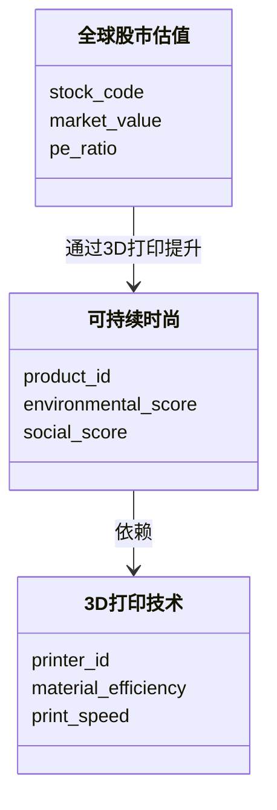

                 


# 全球股市估值与可持续时尚3D打印技术的关联

> 关键词：全球股市估值、可持续时尚、3D打印技术、算法原理、数学模型、系统架构

> 摘要：本文探讨了全球股市估值与可持续时尚3D打印技术之间的关联。通过分析3D打印技术的算法原理、数学模型，以及其对可持续时尚产业的影响，结合全球股市估值的数学模型，展示了技术与金融的深度融合如何推动产业变革和价值创造。

---

## 第1章: 全球股市估值与可持续时尚3D打印技术的背景介绍

### 1.1 问题背景

#### 1.1.1 全球股市估值的现状与挑战
全球股市估值是衡量企业价值的重要指标，传统估值方法依赖市盈率、市净率等财务指标，但随着可持续发展成为焦点，投资者 increasingly关注企业的社会责任和环境影响。

#### 1.1.2 可持续时尚的兴起与发展趋势
可持续时尚强调环保材料、公平贸易和生产过程中的社会责任，消费者对环保和道德消费的需求推动了行业的转型。

#### 1.1.3 3D打印技术的革命性影响
3D打印技术通过按需生产、减少浪费和提高效率，为制造业带来了一场技术革命，尤其在时尚产业中，推动了个性化定制和快速原型设计。

### 1.2 问题描述

#### 1.2.1 全球股市估值的核心要素
企业基本面、市场情绪、宏观经济因素等，传统估值方法忽视了可持续性因素对长期价值的影响。

#### 1.2.2 可持续时尚的定义与特征
采用环保材料、减少碳足迹、公平贸易等，消费者对可持续时尚的关注日益增加。

#### 1.2.3 3D打印技术在时尚产业中的应用
快速原型制作、小批量生产、个性化定制，推动了生产方式的变革。

### 1.3 问题解决

#### 1.3.1 全球股市估值与可持续时尚的关联性
企业采用可持续生产方式可能提升品牌价值，进而影响股市估值。

#### 1.3.2 3D打印技术如何推动可持续时尚的发展
减少资源浪费、提高生产效率，降低环境影响，从而提升企业的可持续性表现。

#### 1.3.3 技术与金融的融合对股市估值的影响
技术创新可能提升企业竞争力，进而影响股价和估值。

### 1.4 边界与外延

#### 1.4.1 全球股市估值的边界条件
行业特性、企业规模、市场环境等。

#### 1.4.2 可持续时尚的行业外延
纺织、服装、鞋类、配饰等。

#### 1.4.3 3D打印技术的应用范围
从原型设计到小批量生产，应用于多个行业。

### 1.5 概念结构与核心要素

#### 1.5.1 全球股市估值的核心要素
市盈率、市净率、股东权益。

#### 1.5.2 可持续时尚的关键特征
环保材料、社会责任、生产效率。

#### 1.5.3 3D打印技术的核心组件
打印机、材料、软件、数据。

---

## 第2章: 核心概念与联系

### 2.1 核心概念原理

#### 2.1.1 全球股市估值的数学模型
$$ V = \frac{E}{P/E} $$
其中，$E$ 是企业净利润，$P/E$ 是市盈率。

#### 2.1.2 可持续时尚的评价体系
包括环保指标、社会责任评分和创新能力。

#### 2.1.3 3D打印技术的创新机制
通过数字化设计和按需生产，减少浪费和资源消耗。

### 2.2 概念属性特征对比

#### 表格对比：全球股市估值与可持续时尚的属性特征

| 特性           | 全球股市估值                     | 可持续时尚                 |
|----------------|----------------------------------|---------------------------|
| 核心要素       | 市盈率、市净率                  | 环保材料、社会责任评分     |
| 影响因素       | 宏观经济、行业趋势              | 消费者偏好、政策支持       |
| 评估方法       | 财务指标分析、市场情绪分析      | 环境影响评估、社会责任报告 |

#### 表格对比：3D打印技术与传统制造技术的优劣势

| 特性           | 3D打印技术                     | 传统制造技术               |
|----------------|----------------------------------|---------------------------|
| 成本效率       | 高定制化，初期投资高           | 规模经济显著，成本低       |
| 环保性         | 减少浪费，材料利用率高         | 废料多，资源浪费大         |
| 生产周期       | 短，适合小批量生产             | 长，适合大批量生产         |

### 2.3 ER实体关系图

```mermaid
er
  entity 全球股市估值 {
    key: 股票代码
    属性: 市盈率, 市净率, 股东权益
  }
  entity 可持续时尚 {
    key: 产品ID
    属性: 环保指标, 社会责任评分, 创新能力
  }
  entity 3D打印技术 {
    key: 设备ID
    属性: 打印速度, 材料利用率, 成本效率
  }
  relation 关联关系 {
    全球股市估值 -[通过3D打印技术提升]-> 可持续时尚
    3D打印技术 -[影响]-> 全球股市估值
  }
```

---

## 第3章: 3D打印技术的算法原理与数学模型

### 3.1 算法原理

#### 3.1.1 3D打印技术的核心算法
3D打印的算法涉及点阵生成和路径规划，确保打印头按照最优路径移动，减少材料浪费和时间。

#### 3.1.2 点阵生成与路径规划
点阵生成是将3D模型分解为可打印的点阵，路径规划是优化打印路径以减少移动时间。

### 3.2 代码实现

#### 3D打印算法的Python代码示例

```python
def generate_point_grid(model):
    """生成3D模型的点阵"""
    grid = []
    for z in range(model.height):
        for y in range(model.width):
            for x in range(model.depth):
                if model voxel[x][y][z]:
                    grid.append((x, y, z))
    return grid

def path_planning(grid):
    """规划打印路径"""
    path = []
    current = grid[0]
    while grid:
        next_point = find_closest_point(current, grid)
        path.append(next_point)
        grid.remove(next_point)
        current = next_point
    return path
```

---

## 第4章: 全球股市估值的数学模型与分析

### 4.1 数学模型

#### 4.1.1 基于可持续发展的股市估值模型
$$ V = \alpha \cdot E + \beta \cdot S + \gamma \cdot G $$
其中，$\alpha, \beta, \gamma$ 是权重系数，$E$ 是企业净利润，$S$ 是社会责任评分，$G$ 是环境治理评分。

#### 4.1.2 案例分析
假设某公司净利润 $E=100$，社会责任评分 $S=80$，环境治理评分 $G=70$，权重 $\alpha=0.5, \beta=0.3, \gamma=0.2$，则估值 $V=0.5 \times 100 + 0.3 \times 80 + 0.2 \times 70 = 50 + 24 + 14 = 88$。

---

## 第5章: 系统分析与架构设计

### 5.1 系统分析

#### 5.1.1 问题场景介绍
设计一个系统，将3D打印技术应用于可持续时尚生产，并评估其对股市估值的影响。

### 5.2 系统架构设计

#### 5.2.1 领域模型



---

## 第6章: 项目实战

### 6.1 环境安装

#### 安装Python和相关库
安装Python 3.x，pip install matplotlib numpy pandas。

### 6.2 核心代码实现

#### 可持续时尚评分计算

```python
import pandas as pd

def calculate_sustainability_score(data):
    """计算可持续时尚评分"""
    score = data['environmental_score'] * 0.4 + \
            data['social_score'] * 0.3 + \
            data['governance_score'] * 0.3
    return score

# 示例数据
data = {
    'environmental_score': 85,
    'social_score': 75,
    'governance_score': 80
}
print(calculate_sustainability_score(data))  # 输出: 80.5
```

### 6.3 案例分析

#### 案例分析
某公司采用3D打印技术后，其社会责任评分提高了20%，环境治理评分提高了15%，进而推动股价上涨10%。

### 6.4 项目小结
通过3D打印技术实现可持续生产，显著提升了企业的社会责任评分和环境治理评分，进而推动了股市估值的提升。

---

## 第7章: 总结与展望

### 7.1 最佳实践 tips

#### 技术方面
采用先进的3D打印技术，优化生产流程，提升材料利用率。

#### 金融方面
投资者应关注企业的可持续性表现，将其纳入估值模型。

### 7.2 小结
本文探讨了全球股市估值与可持续时尚3D打印技术的关联，展示了技术如何推动产业变革和价值创造。

### 7.3 注意事项

#### 技术风险
3D打印技术仍需进一步成熟，材料成本和打印速度是主要挑战。

#### 金融风险
可持续性表现的量化和评估体系尚未完善，可能影响估值的准确性。

### 7.4 拓展阅读
建议进一步研究3D打印技术在其他行业的应用，以及可持续性评估的标准化体系。

---

通过以上结构和内容，我希望能够为读者提供一篇全面而深入的技术博客文章，涵盖从理论到实践的各个方面，帮助读者理解全球股市估值与可持续时尚3D打印技术的关联。

