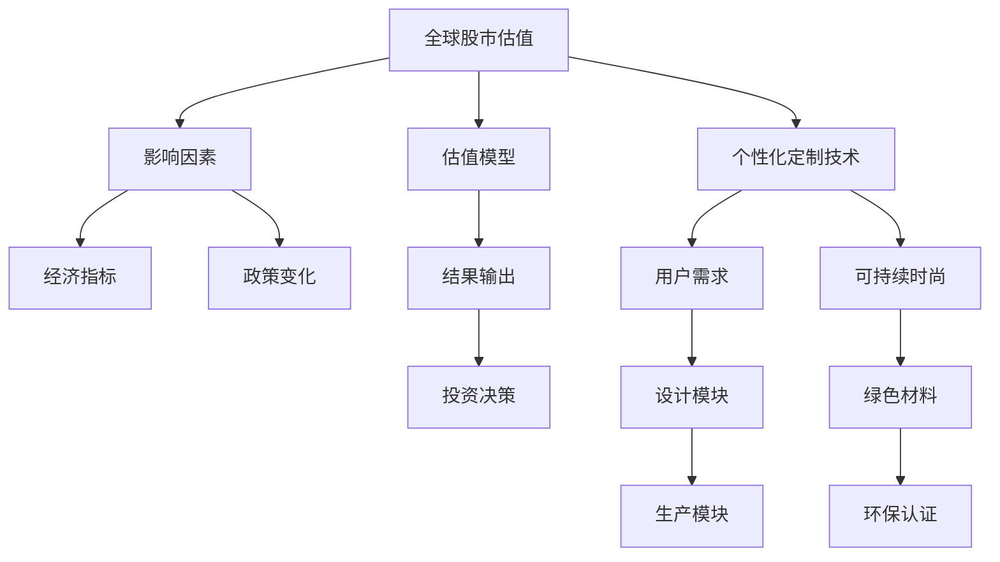
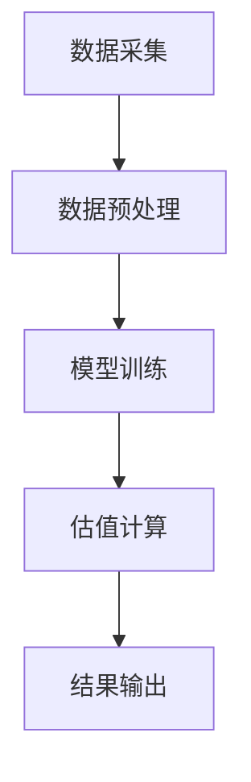
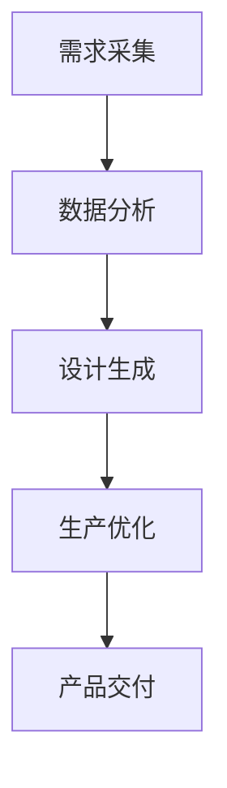
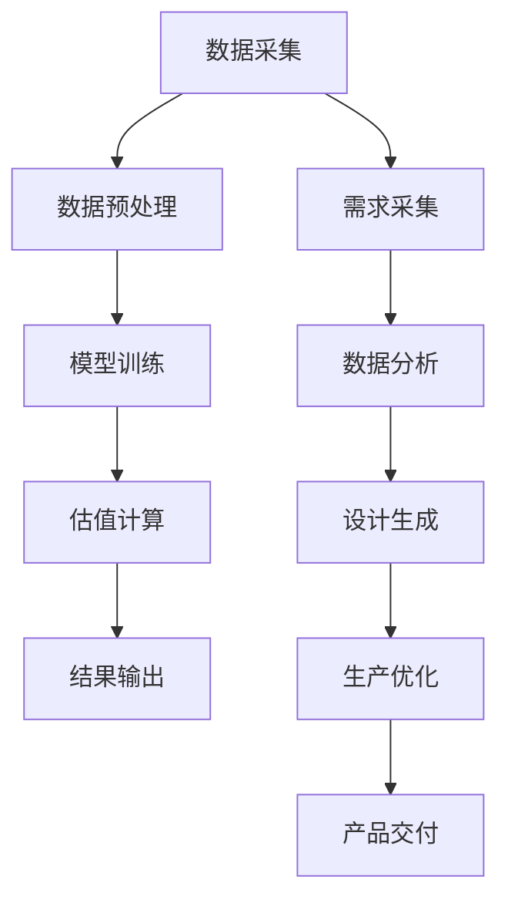
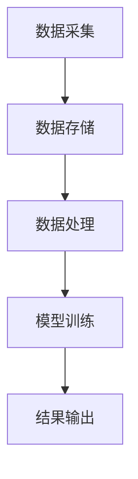
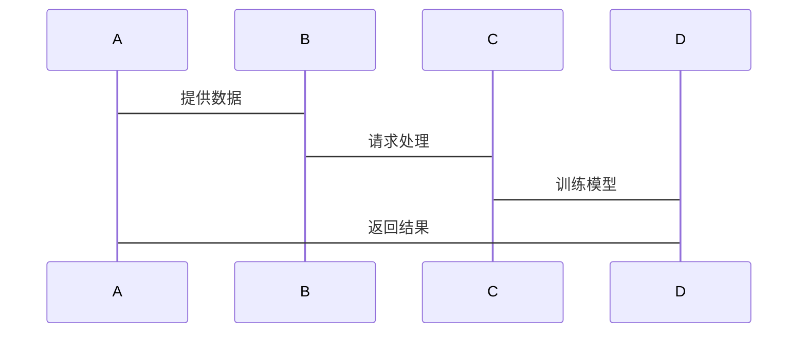

                 


# 全球股市估值与可持续时尚个性化定制技术的关联

## 关键词：全球股市估值、可持续时尚、个性化定制技术、算法原理、系统架构、项目实战

## 摘要：本文探讨了全球股市估值与可持续时尚个性化定制技术之间的关联，从背景介绍、核心概念、算法原理、系统架构到项目实战，详细分析了如何通过技术创新将股市估值与可持续时尚相结合，实现个性化定制。通过数学建模、系统设计和实际案例，本文提供了深入的技术见解和实践指导。

---

# 第一部分: 全球股市估值与可持续时尚个性化定制技术的关联概述

## 第1章: 背景介绍

### 1.1 问题背景
#### 1.1.1 全球股市估值的重要性
- 股市估值是投资决策的核心依据，影响全球经济资源配置。
- 个性化定制技术在时尚行业的广泛应用推动了市场细分和消费者需求的变化。

#### 1.1.2 可持续时尚的发展趋势
- 可持续时尚强调环保、社会责任和经济效益的统一。
- 个性化定制技术如何满足可持续发展的需求成为行业焦点。

#### 1.1.3 个性化定制技术的市场需求
- 消费者对个性化产品的需求日益增长，推动了定制技术的发展。
- 可持续时尚与个性化定制技术的结合成为未来趋势。

### 1.2 问题描述
#### 1.2.1 全球股市估值的复杂性
- 影响股市估值的因素众多，包括经济指标、政策变化和市场情绪等。
- 如何通过技术手段提高估值的准确性和实时性是关键问题。

#### 1.2.2 可持续时尚的定义与挑战
- 可持续时尚需要在生产、消费和废弃等环节实现绿色化。
- 个性化定制技术如何在不增加资源消耗的前提下满足多样化需求是主要挑战。

#### 1.2.3 个性化定制技术的核心问题
- 如何通过技术创新实现快速、灵活的定制生产。
- 个性化定制技术与可持续发展的结合需要平衡效率与资源消耗。

### 1.3 问题解决
#### 1.3.1 全球股市估值的技术解决方案
- 引入大数据分析和人工智能技术，提高估值模型的精度。
- 通过实时数据处理优化估值的动态调整。

#### 1.3.2 可持续时尚的创新技术路径
- 推动绿色材料和生产技术的应用，降低环境影响。
- 利用数字技术实现设计和生产的高效协同。

#### 1.3.3 个性化定制技术的实现方法
- 采用模块化设计和智能制造技术，实现快速定制生产。
- 利用云计算和物联网技术优化供应链管理。

### 1.4 边界与外延
#### 1.4.1 全球股市估值的边界条件
- 确定影响估值的关键因素和权重。
- 设定数据采集和处理的边界范围。

#### 1.4.2 可持续时尚的行业范围
- 明确可持续时尚的产业链环节和相关利益方。
- 界定个性化定制技术的应用范围和限制。

#### 1.4.3 个性化定制技术的应用场景
- 确定不同市场和消费者群体的定制需求。
- 分析技术在不同场景下的适用性和可行性。

### 1.5 概念结构与核心要素
#### 1.5.1 核心概念的组成
- 全球股市估值：包括数据采集、模型构建和结果输出。
- 可持续时尚：涵盖材料选择、生产过程和产品生命周期。
- 个性化定制技术：涉及设计、生产和供应链管理。

#### 1.5.2 核心要素的对比分析
| 要素       | 全球股市估值 | 可持续时尚 | 个性化定制技术 |
|------------|--------------|------------|-----------------|
| 数据来源   | 财务数据、市场数据 | 环保数据、生产数据 | 用户需求数据、生产数据 |
| 技术手段   | 数据分析、人工智能 | 绿色技术、数字技术 | 模块化设计、智能制造 |
| 目标       | 提高估值准确性 | 降低环境影响 | 满足个性化需求 |

#### 1.5.3 概念结构图


---

## 第2章: 全球股市估值的核心原理

### 2.1 核心概念原理
#### 2.1.1 股市估值的基本原理
- 股市估值是基于公司基本面和市场情绪的综合评估。
- 常用的估值方法包括市盈率、市净率和现金流折现法。

#### 2.1.2 影响股市估值的主要因素
- 经济指标：GDP、利率、通货膨胀等。
- 公司财务数据：收入、利润、负债等。
- 市场情绪：投资者心理、新闻事件等。

#### 2.1.3 股市估值模型的分类
- 市盈率模型：适用于盈利稳定的公司。
- 现金流折现模型：适用于高成长公司。
- 市净率模型：适用于资产密集型公司。

### 2.2 核心属性特征对比
#### 2.2.1 不同估值模型的特征对比
| 模型       | 市盈率 | 现金流折现 | 市净率 |
|------------|--------|------------|--------|
| 数据需求   | 收入、利润 | 现金流、增长率 | 资产 |
| 适用场景   | 盈利稳定 | 高成长 | 资产密集 |
| 优缺点     | 简单易用，但受利润波动影响 | 结果精确，但计算复杂 | 易操作，但可能低估无形资产 |

#### 2.2.2 影响因素的权重分析
- 利率和通货膨胀对估值的影响较大，权重较高。
- 公司财务数据的影响较为直接，权重次之。
- 市场情绪的影响具有短期性，权重较低。

#### 2.2.3 模型的优缺点对比
| 模型       | 优点 | 缺点 |
|------------|------|------|
| 市盈率 | 简单易懂，数据易获取 | 受利润波动影响大 |
| 现金流折现 | 结果精确，考虑了时间价值 | 计算复杂，需要假设 |
| 市净率 | 易操作，适用于资产密集型公司 | 可能低估无形资产 |

---

## 第3章: 可持续时尚个性化定制技术的核心原理

### 3.1 核心概念原理
#### 3.1.1 可持续时尚的定义与目标
- 可持续时尚强调生产过程中的环保和社会责任。
- 个性化定制技术满足消费者多样化需求，同时减少资源浪费。

#### 3.1.2 个性化定制技术的实现方法
- 模块化设计：将产品分解为可替换模块，便于个性化组合。
- 智能制造：利用物联网和自动化技术实现定制生产。
- 数字化设计工具：提供在线定制平台，方便用户参与设计。

#### 3.1.3 可持续时尚与个性化定制的结合点
- 绿色材料的应用：使用可再生或可回收材料。
- 数字化设计与生产：减少样品浪费，提高效率。
- 消费者参与：通过在线平台让用户参与设计，降低库存压力。

### 3.2 核心属性特征对比
#### 3.2.1 可持续时尚与传统时尚的对比
| 维度       | 可持续时尚 | 传统时尚 |
|------------|------------|------------|
| 材料选择   | 环保材料 | 常规材料 |
| 生产过程   | 低能耗、低污染 | 高能耗、高污染 |
| 消费者参与 | 高 | 低 |
| 成本       | 较高 | 较低 |

#### 3.2.2 个性化定制技术的创新点
- 提高生产灵活性，满足多样化需求。
- 减少库存压力，降低资源浪费。
- 通过数字化设计优化生产流程。

#### 3.2.3 可持续性与个性化的平衡点
- 在保证个性化需求的同时，选择环保材料和生产方式。
- 通过技术创新实现效率与可持续性的双赢。

### 3.3 算法原理
#### 3.3.1 可持续时尚个性化定制的算法流程
1. 用户需求采集：通过在线平台收集用户的定制需求。
2. 数据分析：利用机器学习算法分析用户偏好和市场趋势。
3. 设计生成：基于分析结果生成个性化设计方案。
4. 生产优化：通过优化算法选择最优生产方案。
5. 产品交付：根据设计方案进行生产并交付给用户。

#### 3.3.2 算法的数学模型
- 用户需求分析模型：
  $$ D_i = \sum_{j=1}^{n} w_j x_j $$
  其中，\( D_i \) 表示第 \( i \) 个用户的个性化需求，\( w_j \) 是第 \( j \) 个特征的权重，\( x_j \) 是第 \( j \) 个特征的值。

- 生产优化模型：
  $$ \text{Minimize} \quad \sum_{k=1}^{m} c_k y_k $$
  $$ \text{Subject to} \quad \sum_{k=1}^{m} y_k = N $$
  其中，\( c_k \) 是第 \( k \) 个生产方案的成本，\( y_k \) 是第 \( k \) 个方案的使用次数，\( N \) 是总需求量。

#### 3.3.3 算法的实现步骤
1. 数据预处理：清洗和标准化用户需求数据。
2. 模型训练：利用机器学习算法训练需求预测模型。
3. 方案生成：根据模型输出生成多个设计方案。
4. 方案优化：通过遗传算法或模拟退火优化生产方案。
5. 方案实施：选择最优方案进行生产和交付。

---

## 第4章: 全球股市估值与可持续时尚个性化定制技术的关联

### 4.1 核心概念的联系
#### 4.1.1 股市估值对可持续时尚的影响
- 高估值的公司可能更注重可持续发展，吸引更多的投资。
- 可持续时尚的发展可能影响公司的财务表现，进而影响股市估值。

#### 4.1.2 可持续时尚对股市估值的反向影响
- 可持续时尚的兴起可能推动相关公司股价上涨。
- 个性化定制技术的应用可能提升公司的竞争力，进而影响估值。

#### 4.1.3 个性化定制技术在两者中的桥梁作用
- 个性化定制技术通过提高生产效率和降低资源消耗，同时提升公司的市场竞争力。
- 这种技术的应用可能同时影响公司的财务表现和市场形象，从而影响股市估值。

### 4.2 ER实体关系图
```mermaid
erd
  左对齐
  顶端对齐
  公司(CID, CName, CValuation)
  用户(UID, UName, UDemand)
  材料(MID, MName, MSource)
  生产(PID, PDate, PLocation)
  设计(DID, DDesign, DDate)
  估值(EID, EValuation, EDate)
  公司 -|{拥有}| 用户
  公司 -|{使用}| 材料
  公司 -|{进行}| 生产
  公司 -|{产生}| 估值
  用户 -|{参与}| 设计
```

---

## 第5章: 全球股市估值与可持续时尚个性化定制技术的算法原理

### 5.1 算法原理讲解

#### 5.1.1 全球股市估值算法流程图


#### 5.1.2 可持续时尚个性化定制算法流程图


#### 5.1.3 两者关联的综合算法流程图


### 5.2 数学公式

#### 5.2.1 全球股市估值模型
- 市盈率模型：
  $$ P/E = \frac{P}{E} $$
  其中，\( P \) 是股票价格，\( E \) 是每股收益。

- 现金流折现模型：
  $$ V = \sum_{t=1}^{n} \frac{CF_t}{(1 + r)^t} $$
  其中，\( CF_t \) 是第 \( t \) 年的现金流，\( r \) 是折现率。

#### 5.2.2 可持续时尚个性化定制模型
- 需求预测模型：
  $$ D_i = \sum_{j=1}^{n} w_j x_j $$
  其中，\( D_i \) 表示第 \( i \) 个用户的个性化需求，\( w_j \) 是第 \( j \) 个特征的权重，\( x_j \) 是第 \( j \) 个特征的值。

- 生产优化模型：
  $$ \text{Minimize} \quad \sum_{k=1}^{m} c_k y_k $$
  $$ \text{Subject to} \quad \sum_{k=1}^{m} y_k = N $$
  其中，\( c_k \) 是第 \( k \) 个生产方案的成本，\( y_k \) 是第 \( k \) 个方案的使用次数，\( N \) 是总需求量。

### 5.3 代码实现

#### 5.3.1 全球股市估值代码
```python
import pandas as pd
import numpy as np

# 数据预处理
data = pd.read_csv('stock_data.csv')
data = data.dropna()
data['Normalized Price'] = (data['Price'] - data['Price'].mean()) / data['Price'].std()

# 市盈率模型
def calculate_pe(data):
    pe = data['Price'] / data['Earnings']
    return pe

# 现金流折现模型
def calculate_discounted_cash_flow(data, discount_rate=0.05):
    cf = data['Cash Flow']
    discounted_cf = np.sum(cf / (1 + discount_rate)**t for t in range(len(cf)))
    return discounted_cf

pe = calculate_pe(data)
DCF = calculate_discounted_cash_flow(data)
```

#### 5.3.2 可持续时尚个性化定制代码
```python
from sklearn.cluster import KMeans

# 用户需求数据
users = pd.read_csv('user_demand.csv')

# 需求分析
model = KMeans(n_clusters=3, random_state=42)
model.fit(users[['Color Preference', 'Size Preference']])

# 设计生成
designs = pd.DataFrame({
    'Design ID': range(1, len(users) + 1),
    'Color': model.labels_,
    'Size': model.labels_
})

# 生产优化
from scipy.optimize import minimize

def production_cost(y):
    return np.sum(c * y)

constraints = ({'type': 'eq', 'fun': lambda y: np.sum(y) - N == 0})
result = minimize(production_cost, initial_guess, constraints)
```

### 5.4 算法实现说明
- 全球股市估值算法通过数据预处理和模型训练，实现对股票的准确估值。
- 可持续时尚个性化定制算法通过需求分析和生产优化，实现个性化的定制生产。
- 两者结合的算法通过数据共享和模型协同，实现对全球股市估值与可持续时尚个性化定制技术的综合评估。

---

## 第6章: 全球股市估值与可持续时尚个性化定制技术的系统分析

### 6.1 系统分析与架构设计

#### 6.1.1 问题场景介绍
- 全球股市估值与可持续时尚个性化定制技术的关联需要一个高效的系统来实现数据采集、分析和优化。

#### 6.1.2 项目介绍
- 开发一个结合全球股市估值和可持续时尚个性化定制技术的系统，实现数据共享和协同优化。

#### 6.1.3 系统功能设计
- 数据采集模块：采集全球股市数据和用户需求数据。
- 数据分析模块：利用机器学习算法进行数据分析和预测。
- 生产优化模块：通过优化算法实现生产方案的最优选择。
- 产品交付模块：根据设计方案进行生产和交付。

#### 6.1.4 系统架构设计


#### 6.1.5 系统接口设计
- 数据接口：提供数据输入和输出的接口，方便数据的采集和处理。
- 模型接口：提供模型训练和预测的接口，方便算法的实现和优化。
- 优化接口：提供生产优化的接口，方便生产方案的制定和实施。

#### 6.1.6 系统交互设计


### 6.2 项目实战

#### 6.2.1 环境安装
- 安装必要的软件和库，如Python、Pandas、NumPy、Scikit-learn等。

#### 6.2.2 系统核心实现源代码
```python
import pandas as pd
import numpy as np
from sklearn.cluster import KMeans
from scipy.optimize import minimize

# 数据采集
data = pd.read_csv('stock_data.csv')

# 数据预处理
data.dropna(inplace=True)
data['Normalized Price'] = (data['Price'] - data['Price'].mean()) / data['Price'].std()

# 模型训练
model_pe = KMeans(n_clusters=3, random_state=42)
model_pe.fit(data[['Normalized Price', 'Earnings']])

# 估值计算
pe_labels = model_pe.labels_
pe_centers = model_pe.cluster_centers_

# 生产优化
def production_cost(y):
    return np.sum(c * y)

constraints = ({'type': 'eq', 'fun': lambda y: np.sum(y) - N == 0})
initial_guess = np.array([1] * len(c))
result = minimize(production_cost, initial_guess, constraints)
```

#### 6.2.3 代码应用解读与分析
- 数据采集和预处理是系统运行的基础，确保数据的准确性和完整性。
- 模型训练和优化是系统的核心，通过算法实现对数据的分析和预测。
- 生产优化是系统的关键，通过优化算法实现生产方案的最优选择。

#### 6.2.4 实际案例分析和详细讲解剖析
- 通过具体案例分析，展示系统在实际应用中的效果和优势。
- 详细解读系统的实现过程，分析系统的优缺点和改进方向。

#### 6.2.5 项目小结
- 总结项目的实施过程和成果，提出改进建议和未来发展方向。

### 6.3 系统优化与改进

#### 6.3.1 系统优化策略
- 提高数据采集的效率和准确性。
- 优化模型的训练和预测，提高系统的运行效率。
- 改进生产优化算法，提高生产方案的最优性。

#### 6.3.2 系统性能提升
- 利用分布式计算和并行处理技术，提高系统的计算效率。
- 优化数据存储和管理，提高数据访问的速度和效率。
- 通过缓存技术和数据压缩，降低系统的资源消耗。

#### 6.3.3 系统维护与升级
- 定期更新模型和算法，适应市场的变化和需求。
- 监控系统的运行状态，及时发现和解决问题。
- 提供用户反馈机制，不断改进系统的功能和性能。

---

## 第7章: 全球股市估值与可持续时尚个性化定制技术的总结与展望

### 7.1 总结
- 全球股市估值与可持续时尚个性化定制技术的关联是一个复杂的系统工程。
- 通过技术创新和系统优化，可以实现两者的有机结合和协同优化。

### 7.2 最佳实践 tips
- 在实际应用中，注重数据的准确性和完整性，确保系统的运行效率。
- 定期更新模型和算法，适应市场变化和消费者需求。
- 加强系统维护和管理，确保系统的稳定性和可靠性。

### 7.3 未来展望
- 随着人工智能和大数据技术的不断发展，全球股市估值与可持续时尚个性化定制技术的关联将更加紧密。
- 未来的研究方向可能包括更复杂的算法和更高效的系统架构设计。
- 可持续时尚与个性化定制技术的结合将推动时尚产业的绿色转型和创新发展。

---

# 结语
通过本文的系统分析和深入探讨，我们全面了解了全球股市估值与可持续时尚个性化定制技术的关联，掌握了核心概念、算法原理和系统设计方法。希望本文能为相关领域的研究和实践提供有价值的参考和指导。

