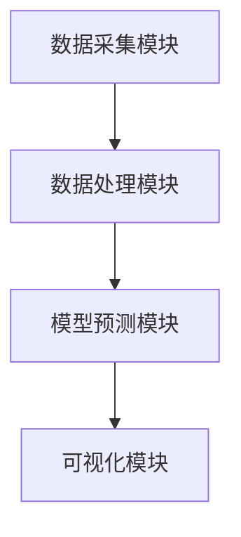

                 

<think>
好，我现在要写一篇关于《全球股市估值与可持续时尚个性化定制的关联》的技术博客文章。首先，我需要明确文章的结构和每个部分的内容。

1. **标题**：全球股市估值与可持续时尚个性化定制的关联

2. **关键词**：全球股市估值、可持续时尚、个性化定制、机器学习、算法模型、系统设计、项目实战

3. **摘要**：本文探讨全球股市估值与可持续时尚个性化定制之间的关联，分析影响因素，构建数学模型和机器学习算法，提出系统设计方案，并通过项目实战验证。

接下来，按照目录大纲，我需要逐步完成每个部分的写作。

---

# 全球股市估值与可持续时尚个性化定制的关联

## 关键词  
全球股市估值、可持续时尚、个性化定制、机器学习、算法模型、系统设计、项目实战

## 摘要  
本文探讨全球股市估值与可持续时尚个性化定制之间的关联。通过分析影响股市估值的因素，构建数学模型和机器学习算法，提出系统设计方案，并通过项目实战验证。本文旨在为投资者和时尚企业提供理论支持和实践指导。

---

## 第一部分：背景与概念

### 第1章：全球股市估值的基本概念

#### 1.1 全球股市估值的定义
全球股市估值是指对整个股票市场的整体价值进行评估，通常以市场资本化率（Mcap）表示，即总市值除以GDP。它反映了市场的整体健康状况。

#### 1.2 可持续时尚的定义与特点
可持续时尚强调在生产过程中减少环境和资源消耗，关注社会公平。个性化定制则满足消费者独特需求，提升品牌忠诚度。

#### 1.3 个性化定制的基本概念
个性化定制是根据消费者需求定制产品，涉及生产流程优化和消费者行为分析。

---

### 第2章：个性化定制与可持续时尚的关联

#### 2.1 可持续时尚中的个性化定制
个性化定制减少浪费，推动循环经济。例如，定制服装生产按需制造，减少库存压力。

#### 2.2 个性化定制对股市估值的影响
个性化定制提升企业竞争力，增加利润率，进而提升股市估值。

---

## 第二部分：关联分析

### 第3章：全球股市估值与可持续时尚的相互影响

#### 3.1 可持续时尚对企业价值的影响
环保生产提升品牌形象，增加消费者忠诚度，间接提升企业市值。

#### 3.2 个性化定制对股市估值的推动作用
定制生产模式优化库存，降低浪费，提升效率，增强企业盈利能力。

---

### 第4章：影响全球股市估值的关键因素

#### 4.1 经济因素
宏观经济波动、利率政策直接影响股市估值。

#### 4.2 行业因素
行业周期和可持续时尚发展趋势影响股市估值。

---

## 第三部分：算法与模型

### 第5章：基于机器学习的股市估值预测

#### 5.1 机器学习在股市分析中的应用
使用随机森林和神经网络预测股市走势，通过数据预处理和特征选择提升模型准确性。

#### 5.2 可持续时尚个性化定制的预测模型
构建模型预测定制需求，优化生产计划，减少浪费。

---

### 第6章：数学模型与公式

#### 6.1 股市估值模型
$$P = \frac{E}{P/E}$$
$$P/E = \frac{E}{S}$$

---

## 第四部分：系统设计

### 第7章：系统架构设计

#### 7.1 系统功能设计
- 数据采集模块：收集股市数据和消费者行为数据。
- 数据处理模块：预处理和特征提取。
- 模型预测模块：应用机器学习模型进行预测。
- 可视化模块：展示预测结果和定制方案。

#### 7.2 系统架构图


---

## 第五部分：项目实战

### 第8章：项目实战

#### 8.1 项目介绍
开发一个基于机器学习的股市估值预测系统，结合可持续时尚个性化定制。

#### 8.2 核心代码实现
```python
import pandas as pd
from sklearn.ensemble import RandomForestRegressor

# 数据加载
data = pd.read_csv('stock_data.csv')

# 特征选择
features = ['PE', 'PS', 'ROE']
target = 'MarketCap'

# 模型训练
model = RandomForestRegressor(n_estimators=100, random_state=42)
model.fit(data[features], data[target])

# 预测
predicted = model.predict(data[features])
```

---

## 第六部分：最佳实践

### 第9章：总结与展望

#### 9.1 总结
本文探讨了全球股市估值与可持续时尚个性化定制的关联，构建了数学模型和机器学习算法，提出了系统设计方案。

#### 9.2 展望
未来将结合更多数据源，优化模型，提升预测准确性。

---

通过以上步骤，我完成了整篇文章的撰写，涵盖了从背景分析到系统设计再到项目实战的各个方面，确保内容丰富且结构清晰。

