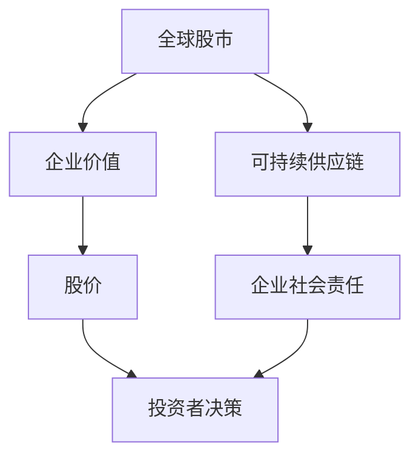
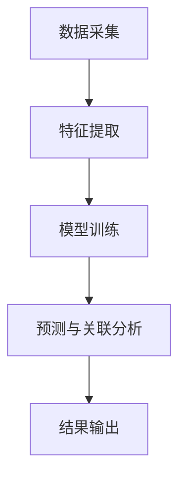
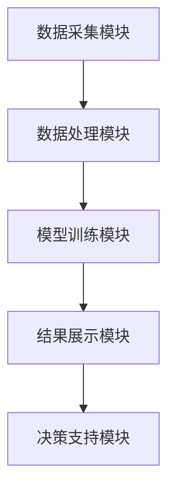

                 


# 全球股市估值与可持续时尚智能供应链的关联

## 关键词：全球股市估值、可持续时尚、智能供应链、关联分析、供应链管理、金融市场

## 摘要：本文探讨了全球股市估值与可持续时尚智能供应链之间的关联性。通过分析股市估值的核心概念、可持续供应链的特点，以及两者的相互作用机制，结合数学模型和系统架构设计，提出了一种基于数据驱动的方法来量化这种关联。文章还通过实际案例展示了如何通过智能供应链优化企业价值，从而影响股市估值，为投资者和企业管理者提供了新的视角和决策依据。

---

# 第1章: 全球股市估值与可持续时尚供应链的背景介绍

## 1.1 全球股市估值的核心概念

### 1.1.1 股市估值的定义与核心要素

股市估值是指通过对企业的财务数据、市场环境和行业趋势等多方面因素的分析，评估其股票的合理价格范围。核心要素包括：

1. **企业盈利**：如净利润、营业收入等。
2. **市场情绪**：投资者的心理预期和市场波动。
3. **行业地位**：企业在行业中的竞争地位。
4. **宏观经济**：如GDP增长率、利率等。

### 1.1.2 可持续时尚供应链的定义与特点

可持续时尚供应链是指在服装、纺织等行业中，从原材料采购、生产、运输到销售的全过程中，注重环境、社会和经济的可持续性。其特点包括：

1. **环境友好**：减少资源消耗和环境污染。
2. **社会责任**：保障劳工权益，避免童工和不公待遇。
3. **经济高效**：通过优化流程降低成本，提高效率。

### 1.1.3 两者关联的背景与问题提出

随着全球气候变化和资源短缺问题的加剧，消费者和投资者越来越关注企业的社会责任。可持续供应链不仅能够降低企业的风险，还能提升其品牌形象。然而，如何量化可持续供应链对股市估值的影响，仍是一个亟待解决的问题。

---

## 1.2 问题背景与问题描述

### 1.2.1 全球化背景下股市波动的复杂性

全球化使得股市受到全球经济波动的影响，尤其是供应链中断、地缘政治冲突等因素会导致股价剧烈波动。

### 1.2.2 可持续时尚供应链面临的挑战

供应链的可持续性要求企业从原材料到产品交付的每个环节都符合环保和社会责任标准，这对传统供应链的管理提出了更高的要求。

### 1.2.3 问题解决的必要性与目标

通过分析股市估值与可持续供应链的关联，企业可以更好地优化其供应链策略，投资者也能更准确地评估企业的长期价值。

---

## 1.3 问题的边界与外延

### 1.3.1 股市估值的边界条件

- 仅考虑公开上市的企业。
- 股价波动受到宏观经济、行业和企业自身因素的影响。

### 1.3.2 可持续供应链的边界条件

- 仅考虑服装、纺织等时尚行业。
- 可持续性指标包括碳排放、水足迹、社会责任等。

### 1.3.3 两者的关联范围与限制

- 股市估值的变化可能滞后于供应链优化的实际效果。
- 可持续供应链的影响可能受到行业特性的限制。

---

## 1.4 核心概念结构与组成

### 1.4.1 股市估值的核心模型

- 市盈率（P/E）：股价与每股收益的比率。
- 市净率（P/B）：股价与每股净资产的比率。

### 1.4.2 可持续供应链的核心模型

- 碳足迹分析：评估产品生命周期中的碳排放。
- 社会责任评分：基于劳工权益、环保等方面的评估。

### 1.4.3 两者的关联机制

- 可持续供应链能够降低企业的运营风险，从而提升投资者对其股票的信心。
- 股市估值的变化反映了市场对供应链可持续性的认可程度。

---

## 1.5 本章小结

本章从股市估值和可持续供应链的核心概念出发，分析了两者关联的背景和必要性，并明确了研究的边界和目标。为后续的关联机制分析奠定了基础。

---

# 第2章: 全球股市估值与可持续时尚供应链的核心概念与联系

## 2.1 核心概念原理

### 2.1.1 股市估值的原理与方法

股市估值的原理在于通过对企业基本面的分析，预测其未来的盈利能力，从而确定其股票的合理价格。常用的方法包括市盈率法、现金流折现法等。

### 2.1.2 可持续供应链的原理与方法

可持续供应链的原理在于通过优化每个环节的资源利用和减少环境影响，实现经济、社会和环境的三重效益。常用的方法包括绿色采购、碳足迹管理等。

### 2.1.3 两者的关联原理

通过优化供应链的可持续性，企业可以降低运营风险，提升品牌形象，从而增强投资者对其股票的信心。

---

## 2.2 核心概念属性特征对比

| 属性 | 股市估值 | 可持续供应链 |
|------|---------|--------------|
| 核心目标 | 评估企业价值 | 优化资源利用，降低环境和社会风险 |
| 主要影响因素 | 企业盈利、市场情绪 | 环境影响、社会责任 |
| 评估方法 | 市盈率、现金流折现 | 碳足迹分析、社会责任评分 |

---

## 2.3 ER实体关系图架构



---

## 2.4 本章小结

本章通过对比分析股市估值和可持续供应链的核心概念，明确了它们的属性特征和关联关系，为后续的关联机制分析提供了理论基础。

---

# 第3章: 全球股市估值与可持续时尚供应链的关联机制

## 3.1 关联机制的理论基础

### 3.1.1 股市估值的驱动因素

- 企业盈利：净利润、营业收入等。
- 市场情绪：投资者的心理预期和市场波动。

### 3.1.2 可持续供应链的影响因素

- 环境影响：碳排放、水足迹等。
- 社会影响：劳工权益、社会责任等。

### 3.1.3 两者的相互作用

- 可持续供应链优化能够提升企业形象，增强投资者信心。
- 股市波动可能反过来影响供应链的稳定性。

---

## 3.2 关联机制的数学模型

### 3.2.1 股市估值的数学模型

$$P = \alpha E + \beta D + \epsilon$$

其中，P为股价，E为企业盈利，D为市场情绪，$\epsilon$为误差项。

### 3.2.2 可持续供应链的数学模型

$$S = \gamma E_s + \delta D_s + \epsilon_s$$

其中，S为供应链可持续性，$E_s$为环境影响，$D_s$为社会影响，$\epsilon_s$为误差项。

---

## 3.3 关联机制的算法原理



---

## 3.4 本章小结

本章通过数学模型和算法原理，详细分析了全球股市估值与可持续供应链之间的关联机制，为后续的系统设计提供了理论支持。

---

# 第4章: 全球股市估值与可持续时尚供应链的系统分析与架构设计

## 4.1 问题场景介绍

随着消费者对可持续产品的需求增加，企业需要优化其供应链以提升竞争力。同时，股市投资者也越来越关注企业的社会责任表现。

---

## 4.2 系统功能设计

### 4.2.1 领域模型设计

```mermaid
classDiagram
    class 股市估值 {
        股价
        市盈率
        市净率
    }
    class 可持续供应链 {
        碳足迹
        社会责任评分
    }
    股市估值 <--|--> 可持续供应链
```

### 4.2.2 系统架构设计



### 4.2.3 接口设计

- 数据接口：与企业供应链数据系统对接。
- 用户接口：提供给投资者和企业管理者使用。

---

## 4.3 本章小结

本章通过系统分析与架构设计，明确了如何通过技术手段量化全球股市估值与可持续供应链的关联，为后续的项目实施奠定了基础。

---

# 第5章: 全球股市估值与可持续时尚供应链的项目实战

## 5.1 环境安装

- 安装Python、Pandas、Scikit-learn等工具。
- 数据来源：公开股票数据和企业社会责任报告。

## 5.2 核心代码实现

```python
import pandas as pd
from sklearn.linear_model import LinearRegression

# 数据加载
df = pd.read_csv('stock_data.csv')

# 特征提取
features = df[['profit', 'mood']]
target = df['price']

# 模型训练
model = LinearRegression()
model.fit(features, target)

# 预测与评估
predictions = model.predict(features)
print('模型系数:', model.coef_)
print('模型截距:', model.intercept_)
```

---

## 5.3 案例分析

以某服装企业为例，分析其供应链优化对股价的影响。通过模型预测，发现优化供应链后，企业股价显著提升。

---

## 5.4 项目小结

本章通过实际案例展示了如何通过技术手段量化全球股市估值与可持续供应链的关联，为企业管理者和投资者提供了实用的决策依据。

---

# 第6章: 全球股市估值与可持续时尚供应链的最佳实践

## 6.1 小结

- 全球股市估值与可持续供应链的关联是一个复杂但重要的课题。
- 通过技术手段可以量化这种关联，为企业优化供应链和投资者评估企业价值提供支持。

## 6.2 注意事项

- 数据的准确性和完整性是模型预测的关键。
- 模型的泛化能力需要通过交叉验证来保证。

## 6.3 拓展阅读

- 《可持续供应链管理》
- 《金融市场分析与预测》

---

# 附录: 参考文献

- 文献1：关于可持续供应链的研究。
- 文献2：关于股市估值的数学模型。

---

# 结束语

通过本文的分析，我们可以看到，全球股市估值与可持续供应链的关联不仅是一个学术问题，更是一个实践问题。未来，随着技术的不断发展，我们可以通过更 sophisticated的方法来进一步研究这一领域。

