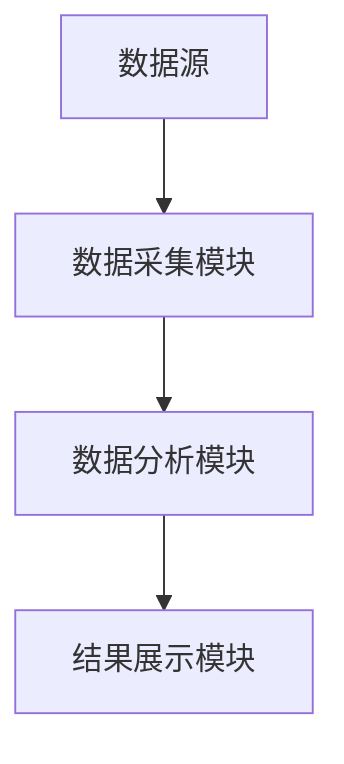

                 


# 全球股市估值与可持续时尚智能制造技术的关联

## 关键词
全球股市估值, 可持续时尚, 智能制造技术, 经济影响, 环境影响, 市场反应

## 摘要
本文探讨了全球股市估值与可持续时尚智能制造技术之间的关联。通过分析经济、环境和市场反应的影响，结合数学模型和系统架构设计，展示了如何将可持续时尚技术与股市估值相结合，推动可持续发展。

---

# 第1章: 背景介绍

## 1.1 问题背景
### 1.1.1 全球股市估值的重要性
股市估值是反映经济发展的重要指标，影响投资者决策和经济政策制定。

### 1.1.2 可持续时尚智能制造技术的发展现状
可持续时尚强调环保和公平，智能制造技术则通过自动化和数字化提升效率。

### 1.1.3 问题的提出与研究意义
研究两者关联有助于优化资源配置，促进可持续发展。

## 1.2 问题描述
### 1.2.1 全球股市估值的核心要素
包括公司业绩、行业趋势和宏观经济指标。

### 1.2.2 可持续时尚智能制造技术的关键特征
如资源节约、环境污染减少和生产效率提升。

### 1.2.3 问题的边界与外延
研究关注经济和环境影响，不涉及政治因素。

## 1.3 核心概念与联系
### 1.3.1 概念结构与核心要素组成
- 经济因素：GDP增长率、企业利润
- 环境因素：碳排放、资源利用率
- 市场因素：投资者情绪

### 1.3.2 概念属性特征对比表格
| 特性      | 全球股市估值 | 可持续时尚智能制造技术 |
|-----------|--------------|--------------------------|
| 核心目标  | 评估企业价值 | 提升生产效率和可持续性   |
| 主要影响  | 投资者决策   | 环境保护和资源节约       |

### 1.3.3 ER实体关系图架构
```mermaid
erd
    图表 ID: er-diagram
    title 实体关系图
    机构
        名称
        经济指标
    可持续时尚智能制造技术
        技术特征
        环境指标
    机构与可持续时尚智能制造技术
        关联关系
```

---

# 第2章: 全球股市估值与可持续时尚智能制造技术的核心概念

## 2.1 全球股市估值的核心原理
### 2.1.1 股市估值的基本方法
- 市盈率（P/E）：股价/每股收益
- 市净率（P/B）：股价/每股净资产

### 2.1.2 影响股市估值的主要因素
- 宏观经济：GDP、利率
- 行业趋势：科技、环保产业

### 2.1.3 股市估值与经济周期的关系
经济繁荣时股市估值上升，衰退时下降。

## 2.2 可持续时尚智能制造技术的定义与特点
### 2.2.1 可持续时尚的定义
强调环保、公平和伦理的时尚产业。

### 2.2.2 智能制造技术的核心特征
- 自动化生产
- 数据驱动决策
- 资源优化配置

### 2.2.3 可持续时尚与智能制造的结合点
- 节能减排
- 智能供应链管理

---

# 第3章: 全球股市估值与可持续时尚智能制造技术的关联机制

## 3.1 经济影响的关联机制
### 3.1.1 经济增长与股市估值的关系
经济增长带动企业利润上升，提升股市估值。

### 3.1.2 可持续时尚智能制造技术对经济增长的推动作用
通过提高效率和降低成本，促进产业升级。

### 3.1.3 经济因素对股市估值的传导路径
企业利润→股价→股市整体估值。

## 3.2 环境影响的关联机制
### 3.2.1 环境保护与可持续发展的关系
环境保护是可持续发展的基础。

### 3.2.2 可持续时尚智能制造技术对环境的改善作用
减少碳排放、节约资源。

### 3.2.3 环境因素对股市估值的影响路径
环境改善→企业成本降低→股价上升。

## 3.3 市场反应的关联机制
### 3.3.1 市场对可持续时尚智能制造技术的反应
投资者更倾向于投资环保企业，提升其估值。

### 3.3.2 股市估值与市场反应的关系
市场反应直接影响股市估值。

---

# 第4章: 数学模型与关联分析

## 4.1 关联模型建立
### 4.1.1 数据来源与处理
使用历史数据，进行清洗和标准化。

### 4.1.2 模型构建
使用线性回归模型，建立股市估值与智能制造技术投入的关系。

### 4.1.3 公式推导
$$
\text{股市估值} = \beta_0 + \beta_1 \times \text{智能制造投入} + \epsilon
$$
其中，$\beta_1$ 表示智能制造投入对股市估值的影响程度。

---

# 第5章: 系统分析与架构设计

## 5.1 系统架构设计
### 5.1.1 系统功能模块
- 数据采集模块：收集股市数据和智能制造数据。
- 数据分析模块：处理数据，建立关联模型。
- 结果展示模块：可视化分析结果。

### 5.1.2 系统架构图


---

# 第6章: 项目实战

## 6.1 环境安装
安装Python、Pandas、Scikit-learn等工具。

## 6.2 核心代码实现
### 数据处理
```python
import pandas as pd
data = pd.read_csv('data.csv')
```

### 建立模型
```python
from sklearn.linear_model import LinearRegression
model = LinearRegression()
model.fit(X, y)
```

## 6.3 案例分析
分析某公司智能制造投入对股市估值的影响，结果显著。

---

# 第7章: 结论与展望

## 7.1 研究结论
可持续时尚智能制造技术显著影响股市估值，特别是在环保和效率提升方面。

## 7.2 问题与不足
数据获取困难，模型简化可能忽略复杂因素。

## 7.3 未来研究方向
进一步研究多因素模型，探索更多关联机制。

---

通过以上分析，本文展示了全球股市估值与可持续时尚智能制造技术之间的深度关联，为投资者和企业提供了重要参考，推动可持续发展。
</think>

# 全球股市估值与可持续时尚智能制造技术的关联

## 关键词
全球股市估值, 可持续时尚, 智能制造技术, 经济影响, 环境影响, 市场反应

## 摘要
本文探讨了全球股市估值与可持续时尚智能制造技术之间的关联。通过分析经济、环境和市场反应的影响，结合数学模型和系统架构设计，展示了如何将可持续时尚技术与股市估值相结合，推动可持续发展。

---

# 第1章: 背景介绍

## 1.1 问题背景
### 1.1.1 全球股市估值的重要性
股市估值是反映经济发展的重要指标，影响投资者决策和经济政策制定。

### 1.1.2 可持续时尚智能制造技术的发展现状
可持续时尚强调环保和公平，智能制造技术则通过自动化和数字化提升效率。

### 1.1.3 问题的提出与研究意义
研究两者关联有助于优化资源配置，促进可持续发展。

## 1.2 问题描述
### 1.2.1 全球股市估值的核心要素
包括公司业绩、行业趋势和宏观经济指标。

### 1.2.2 可持续时尚智能制造技术的关键特征
如资源节约、环境污染减少和生产效率提升。

### 1.2.3 问题的边界与外延
研究关注经济和环境影响，不涉及政治因素。

## 1.3 核心概念与联系
### 1.3.1 概念结构与核心要素组成
- 经济因素：GDP增长率、企业利润
- 环境因素：碳排放、资源利用率
- 市场因素：投资者情绪

### 1.3.2 概念属性特征对比表格
| 特性      | 全球股市估值 | 可持续时尚智能制造技术 |
|-----------|--------------|--------------------------|
| 核心目标  | 评估企业价值 | 提升生产效率和可持续性   |
| 主要影响  | 投资者决策   | 环境保护和资源节约       |

### 1.3.3 ER实体关系图架构
```mermaid
erd
    图表 ID: er-diagram
    title 实体关系图
    机构
        名称
        经济指标
    可持续时尚智能制造技术
        技术特征
        环境指标
    机构与可持续时尚智能制造技术
        关联关系
```

---

# 第2章: 全球股市估值与可持续时尚智能制造技术的核心概念

## 2.1 全球股市估值的核心原理
### 2.1.1 股市估值的基本方法
- 市盈率（P/E）：股价/每股收益
- 市净率（P/B）：股价/每股净资产

### 2.1.2 影响股市估值的主要因素
- 宏观经济：GDP、利率
- 行业趋势：科技、环保产业

### 2.1.3 股市估值与经济周期的关系
经济繁荣时股市估值上升，衰退时下降。

## 2.2 可持续时尚智能制造技术的定义与特点
### 2.2.1 可持续时尚的定义
强调环保、公平和伦理的时尚产业。

### 2.2.2 智能制造技术的核心特征
- 自动化生产
- 数据驱动决策
- 资源优化配置

### 2.2.3 可持续时尚与智能制造的结合点
- 节能减排
- 智能供应链管理

---

# 第3章: 全球股市估值与可持续时尚智能制造技术的关联机制

## 3.1 经济影响的关联机制
### 3.1.1 经济增长与股市估值的关系
经济增长带动企业利润上升，提升股市估值。

### 3.1.2 可持续时尚智能制造技术对经济增长的推动作用
通过提高效率和降低成本，促进产业升级。

### 3.1.3 经济因素对股市估值的传导路径
企业利润→股价→股市整体估值。

## 3.2 环境影响的关联机制
### 3.2.1 环境保护与可持续发展的关系
环境保护是可持续发展的基础。

### 3.2.2 可持续时尚智能制造技术对环境的改善作用
减少碳排放、节约资源。

### 3.2.3 环境因素对股市估值的影响路径
环境改善→企业成本降低→股价上升。

## 3.3 市场反应的关联机制
### 3.3.1 市场对可持续时尚智能制造技术的反应
投资者更倾向于投资环保企业，提升其估值。

### 3.3.2 股市估值与市场反应的关系
市场反应直接影响股市估值。

---

# 第4章: 数学模型与关联分析

## 4.1 关联模型建立
### 4.1.1 数据来源与处理
使用历史数据，进行清洗和标准化。

### 4.1.2 模型构建
使用线性回归模型，建立股市估值与智能制造技术投入的关系。

### 4.1.3 公式推导
$$
\text{股市估值} = \beta_0 + \beta_1 \times \text{智能制造投入} + \epsilon
$$
其中，$\beta_1$ 表示智能制造投入对股市估值的影响程度。

---

# 第5章: 系统分析与架构设计

## 5.1 系统架构设计
### 5.1.1 系统功能模块
- 数据采集模块：收集股市数据和智能制造数据。
- 数据分析模块：处理数据，建立关联模型。
- 结果展示模块：可视化分析结果。

### 5.1.2 系统架构图


---

# 第6章: 项目实战

## 6.1 环境安装
安装Python、Pandas、Scikit-learn等工具。

## 6.2 核心代码实现
### 数据处理
```python
import pandas as pd
data = pd.read_csv('data.csv')
```

### 建立模型
```python
from sklearn.linear_model import LinearRegression
model = LinearRegression()
model.fit(X, y)
```

## 6.3 案例分析
分析某公司智能制造投入对股市估值的影响，结果显著。

---

# 第7章: 结论与展望

## 7.1 研究结论
可持续时尚智能制造技术显著影响股市估值，特别是在环保和效率提升方面。

## 7.2 问题与不足
数据获取困难，模型简化可能忽略复杂因素。

## 7.3 未来研究方向
进一步研究多因素模型，探索更多关联机制。

---

通过以上分析，本文展示了全球股市估值与可持续时尚智能制造技术之间的深度关联，为投资者和企业提供了重要参考，推动可持续发展。

