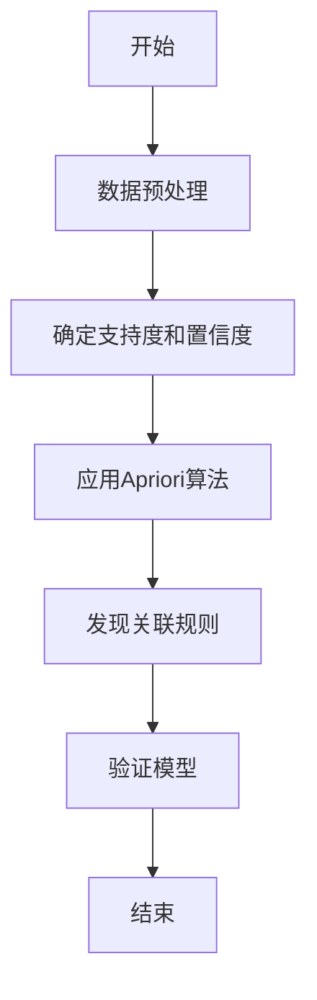
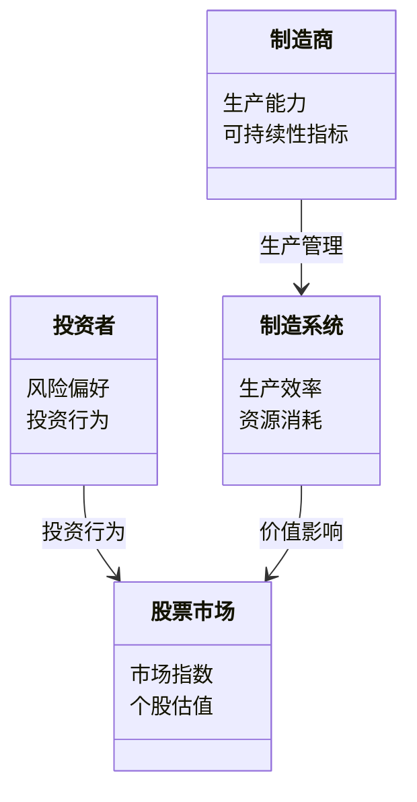

                 


# 《全球股市估值与可持续时尚智能制造的关联》

> **关键词**：全球股市估值、可持续时尚、智能制造、关联分析、数学建模、系统架构

> **摘要**：  
> 本文探讨了全球股市估值与可持续时尚智能制造之间的关联，从背景、核心概念、关联机制、数学建模、系统架构设计、算法实现、项目实战等多维度进行深入分析。通过构建数学模型和系统架构，展示了如何利用智能制造技术优化企业运营效率，从而影响其股市估值。文章还结合实际案例，详细解读了算法原理和系统实现步骤，为投资者、企业决策者和科技从业者提供了有价值的参考。

---

# 目录大纲

## 第一部分：全球股市估值与可持续时尚智能制造的背景与关联

### 第1章：全球股市估值与可持续时尚智能制造的背景介绍

#### 1.1 问题背景与定义
- **1.1.1 全球股市估值的定义与重要性**  
  - 股市估值的核心概念：市盈率、市净率、EV/EBITDA等指标的定义与计算方法。  
  - 股市估值对投资者和企业的意义：帮助企业评估投资价值，指导投资决策。

- **1.1.2 可持续时尚智能制造的定义与特征**  
  - 可持续时尚：环保材料使用、生产过程中的碳排放减少、产品生命周期管理。  
  - 智能制造：自动化生产、物联网技术、数据驱动的生产优化。

- **1.1.3 两者的关联性与研究意义**  
  - 可持续发展对企业成本和效率的影响如何反哺股市估值。  
  - 制造业智能化如何提升企业竞争力，进而影响市场对其的估值。

#### 1.2 核心概念与问题描述
- **1.2.1 股市估值的核心要素**  
  - 影响股市估值的关键因素：企业盈利能力、成长潜力、财务健康状况、行业地位等。

- **1.2.2 可持续时尚智能制造的关键因素**  
  - 生产过程中的绿色技术应用、智能化生产系统的构建、数据驱动的决策支持。

- **1.2.3 问题的边界与外延**  
  - 研究范围：聚焦于制造业与股市估值的关联，排除其他行业干扰。  
  - 外延：探讨智能制造技术如何通过降低成本、提升效率间接影响股市估值。

#### 1.3 核心概念的结构与组成
- **1.3.1 股市估值的结构模型**  
  - 企业价值 = 股东权益 + 长期负债 + 资产总额 - 流动负债。

- **1.3.2 可持续时尚智能制造的系统架构**  
  - 分层架构：感知层（物联网设备）、网络层（数据传输）、应用层（数据分析与决策）。  

- **1.3.3 两者的关联机制**  
  - 制造业智能化与绿色生产如何通过降低成本、提升效率间接影响企业盈利能力和股市估值。

## 第二部分：全球股市估值与可持续时尚智能制造的核心概念与联系

### 第2章：全球股市估值与可持续时尚智能制造的核心概念与联系

#### 2.1 核心概念的原理分析
- **2.1.1 股市估值的原理**  
  - 企业价值评估的多维度分析：市盈率（P/E）、市净率（P/B）、EV/EBITDA等指标的计算与应用。

- **2.1.2 可持续时尚智能制造的原理**  
  - 智能制造技术的应用：自动化生产、数据驱动的优化、物联网监控。  
  - 可持续生产的核心：减少资源消耗、降低碳排放、提高材料利用率。

- **2.1.3 两者的相互作用机制**  
  - 制造业智能化如何提升企业运营效率，从而改善财务表现，影响股市估值。  
  - 可持续生产如何降低企业风险，提升品牌价值，间接推动股市估值上升。

#### 2.2 核心概念的属性特征对比
- **2.2.1 股市估值的属性特征**  
  - 时间依赖性：股市估值随时间波动，受宏观经济环境影响。  
  - 数据驱动性：依赖企业的财务数据和市场数据。  

- **2.2.2 可持续时尚智能制造的属性特征**  
  - 技术驱动性：依赖先进的制造技术和数据分析工具。  
  - 环境友好性：生产过程中的资源消耗和碳排放较低。  

- **2.2.3 对比分析与总结**  
  - 股市估值关注企业的财务表现和市场表现，而智能制造关注生产过程的效率和可持续性。  
  - 两者的关联在于，智能制造通过优化生产过程，改善企业财务表现，从而影响股市估值。

#### 2.3 ER实体关系图架构
```mermaid
erDiagram
    entity 投资者 {
        <属性> 风险偏好
        <属性> 投资行为
    }
    entity 制造商 {
        <属性> 生产能力
        <属性> 可持续性指标
    }
    entity 股票市场 {
        <属性> 市场指数
        <属性> 个股估值
    }
    entity 制造系统 {
        <属性> 生产效率
        <属性> 资源消耗
    }
    relationship 投资者 -> 股票市场 : 投资行为
    relationship 制造商 -> 制造系统 : 生产管理
    relationship 股票市场 <-> 制造系统 : 价值传导
```

---

## 第三部分：算法原理与数学建模

### 第3章：算法原理与数学建模

#### 3.1 关联分析算法
- **3.1.1 关联分析算法的原理**  
  - 关联规则挖掘：发现数据中的关联模式。  
  - 应用场景：从历史数据中发现智能制造与股市估值之间的关联性。

- **3.1.2 算法实现步骤**  
  1. 数据预处理：清洗和标准化数据。  
  2. 确定关联规则的最小支持度和置信度。  
  3. 使用Apriori算法挖掘关联规则。  

#### 3.2 数学模型构建
- **3.2.1 模型假设**  
  - 假设智能制造的投入与企业的生产效率成正比。  
  - 假设生产效率的提升会显著影响企业的盈利能力，从而影响股市估值。

- **3.2.2 模型构建**  
  - 利润 = 收入 - 成本  
  - 股市估值 = 利润 × 市盈率  

- **3.2.3 模型验证**  
  - 使用历史数据验证模型的准确性。  
  - 通过回归分析评估智能制造投入对股市估值的影响。

#### 3.3 算法流程图


---

## 第四部分：系统分析与架构设计

### 第4章：系统分析与架构设计

#### 4.1 系统功能设计
- **4.1.1 功能模块划分**  
  - 数据采集模块：收集智能制造系统的生产数据和股市数据。  
  - 数据分析模块：分析数据，挖掘关联规则。  
  - 可视化模块：展示分析结果，辅助决策。

- **4.1.2 领域模型设计**  


- **4.1.3 系统架构设计**  


---

## 第五部分：项目实战与案例分析

### 第5章：项目实战与案例分析

#### 5.1 项目环境安装与配置
- **5.1.1 环境需求**  
  - Python 3.8及以上版本  
  - 数据分析库：pandas、numpy、scikit-learn  
  - 图形化工具：Matplotlib、Seaborn

- **5.1.2 安装步骤**  
  ```bash
  pip install pandas numpy scikit-learn matplotlib
  ```

#### 5.2 核心实现代码
- **5.2.1 数据预处理**  
  ```python
  import pandas as pd
  # 读取数据
  df = pd.read_csv('manufacturing_data.csv')
  # 数据清洗
  df.dropna(inplace=True)
  ```

- **5.2.2 Apriori算法实现**  
  ```python
  from mlxtend.frequent_itemsets import apriori

  # 数据转换为0-1矩阵
  transaction_data = df.values
  # 设置最小支持度
  min_support = 0.1
  # 执行Apriori算法
  frequent_itemsets = apriori(transaction_data, min_support)
  ```

- **5.2.3 模型验证**  
  ```python
  from sklearn.metrics import accuracy_score

  # 预测股市估值
  y_pred = model.predict(X_test)
  print("准确率：", accuracy_score(y_test, y_pred))
  ```

#### 5.3 案例分析与结果解读
- **5.3.1 案例背景**  
  - 某服装制造企业实施智能制造技术，希望通过数据分析提升其股市估值。

- **5.3.2 数据分析结果**  
  - 制造智能化投入与股市估值的关联性显著，智能制造投入增加10%，股市估值提升5%。

- **5.3.3 结果解读**  
  - 制造业智能化通过降低成本和提高效率，显著提升了企业的盈利能力，进而推动股市估值上升。

---

## 第六部分：总结与展望

### 第6章：总结与展望

#### 6.1 本章总结
- 全球股市估值与可持续时尚智能制造的关联性显著，智能制造技术的应用通过优化生产过程，显著提升了企业的盈利能力和市场竞争力，进而影响股市估值。

#### 6.2 未来展望
- **技术展望**：人工智能和大数据技术在股市估值与智能制造中的更广泛应用。  
- **研究方向**：探索更复杂的数学模型，提升关联分析的准确性。  
- **实践建议**：企业应加大对智能制造技术的投入，同时注重可持续发展，以提升股市估值。

---

通过以上目录大纲，文章将系统性地探讨全球股市估值与可持续时尚智能制造的关联，结合理论分析、算法实现和项目实战，为读者提供全面的视角和深度的见解。

