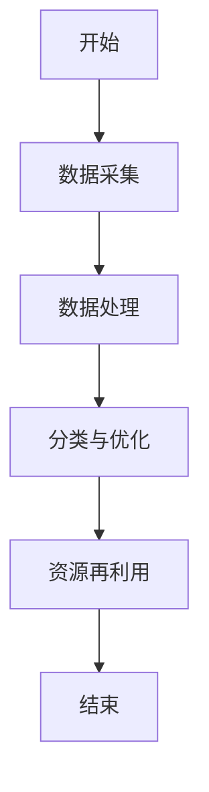

                 


# 全球股市估值与可持续时尚智能回收技术的关联

**关键词：全球股市估值、可持续时尚、智能回收技术、经济影响、技术关联**

**摘要：**  
随着全球经济向可持续发展的转型，全球股市估值与可持续时尚智能回收技术之间的关联性日益显著。本文将深入分析全球股市估值的核心概念、可持续时尚智能回收技术的创新模式，以及两者之间的相互作用。通过理论分析与实际案例结合，探讨智能回收技术如何影响企业价值和股市估值，为投资者、企业和技术开发者提供有价值的参考。

---

# 第一章: 全球股市估值与可持续时尚智能回收技术的背景介绍

## 1.1 全球股市估值的定义与作用

### 1.1.1 股市估值的基本概念  
股市估值是通过对企业的财务数据、市场表现和行业前景进行分析，确定其股票的合理价格范围。它是投资者评估企业价值和市场风险的重要工具。

### 1.1.2 股市估值在经济中的作用  
股市估值不仅是资本市场的晴雨表，还反映了企业的经营状况和行业的整体发展趋势。它为投资者提供决策依据，同时影响资本流动和经济资源配置。

### 1.1.3 股市估值与企业价值的关系  
企业价值是股市估值的核心依据，包括资产价值、盈利能力、成长潜力等因素。股市估值的合理性直接影响市场的稳定性和投资者信心。

---

## 1.2 可持续时尚与智能回收技术的定义

### 1.2.1 可持续时尚的定义与特点  
可持续时尚是指在服装生产和消费过程中，注重资源节约、环境保护和社会责任的时尚产业模式。其特点包括减少资源消耗、降低碳排放和推动循环经济。

### 1.2.2 智能回收技术的核心概念  
智能回收技术利用人工智能、物联网和大数据等技术，实现废弃物的高效分类、处理和再利用。它通过自动化和智能化提升回收效率，降低回收成本。

### 1.2.3 可持续时尚与智能回收技术的结合  
可持续时尚与智能回收技术的结合，不仅推动了服装行业的绿色转型，还为资源循环利用提供了新的技术手段。

---

## 1.3 问题背景与问题描述

### 1.3.1 全球经济与环境问题的双重挑战  
全球经济的快速发展带来了资源枯竭、环境污染等问题，传统经济发展模式面临转型压力。

### 1.3.2 可持续发展与智能技术的结合需求  
随着环保意识的增强，企业和消费者对可持续产品的需求日益增长，智能技术成为推动可持续发展的关键。

### 1.3.3 股市估值与智能回收技术的关联性  
智能回收技术的广泛应用可能影响企业的生产成本、市场竞争力和品牌形象，从而对股市估值产生深远影响。

---

## 1.4 问题解决与边界外延

### 1.4.1 可持续时尚智能回收技术的解决方案  
通过技术创新和模式创新，实现废弃物的高效回收和资源再利用，推动时尚产业的可持续发展。

### 1.4.2 股市估值与智能回收技术的边界  
智能回收技术的影响范围、企业的市场地位和行业政策是影响股市估值的主要边界条件。

### 1.4.3 关联性研究的范围与限制  
本文主要探讨智能回收技术对股市估值的间接影响，不涉及企业的直接财务数据。

---

## 1.5 核心概念与结构组成

### 1.5.1 核心概念的构成要素  
- 股市估值：企业价值、市场表现、行业趋势  
- 智能回收技术：人工智能、物联网、大数据  
- 可持续时尚：绿色生产、循环经济、环保理念  

### 1.5.2 概念结构图  
  

### 1.5.3 核心要素的相互关系  
智能回收技术通过降低生产成本和提升企业形象，间接影响企业的盈利能力，从而影响股市估值。

---

## 1.6 本章小结  
本章从全球股市估值和可持续时尚智能回收技术的定义出发，分析了两者的背景和关联性，为后续的深入研究奠定了基础。

---

# 第二章: 全球股市估值与可持续时尚智能回收技术的核心概念与联系

## 2.1 核心概念的原理与属性

### 2.1.1 股市估值的核心原理  
股市估值基于企业的财务数据和市场预期，通过分析企业盈利能力、成长潜力和行业地位，确定其股票的合理价格。

### 2.1.2 智能回收技术的原理  
智能回收技术利用传感器、AI算法和大数据分析，实现废弃物的高效分类和资源化利用。

### 2.1.3 核心概念的属性对比  
| 属性 | 股市估值 | 智能回收技术 |
|------|---------|-------------|
| 核心 | 企业价值 | 资源利用效率 |
| 影响 | 投资者信心 | 企业成本 |
| 技术 | 金融模型 | AI与物联网 |

---

## 2.2 核心概念的ER实体关系图

```mermaid
erDiagram
    customer[投资者] {
        string id
        string name
    }
    enterprise[企业] {
        string id
        string name
    }
    technology[智能回收技术] {
        string id
        string type
    }
    market[股市] {
        string id
        string name
    }
    customer --> enterprise : 投资
    enterprise --> technology : 应用
    technology --> market : 影响
```

---

## 2.3 核心概念的联系与影响

### 2.3.1 股市估值对可持续时尚的影响  
股市估值反映了企业的可持续发展能力，影响投资者对可持续时尚企业的信心。

### 2.3.2 智能回收技术对股市估值的推动作用  
智能回收技术降低企业成本、提升企业形象，间接提高企业的市场价值，从而影响股市估值。

### 2.3.3 两者关联的经济与环境意义  
通过智能回收技术推动可持续时尚，可以实现经济发展与环境保护的双赢。

---

## 2.4 本章小结  
本章详细分析了全球股市估值与可持续时尚智能回收技术的核心概念及其相互联系，为后续的算法原理分析奠定了基础。

---

# 第三章: 全球股市估值与可持续时尚智能回收技术的算法原理

## 3.1 算法原理的数学模型

### 3.1.1 股市估值模型的建立  
$$ P = \frac{E}{(r - g) \times (1 + g)} $$  
其中，P为股票价格，E为每股收益，r为贴现率，g为增长速率。

### 3.1.2 智能回收技术的算法模型  
智能回收算法通过分类和优化，最大化资源利用率，最小化回收成本。

### 3.1.3 模型的数学公式  
$$ \text{收益最大化} = \sum_{i=1}^{n} (r_i - c_i) \times q_i $$  
其中，$r_i$为资源价值，$c_i$为回收成本，$q_i$为回收量。

---

## 3.2 算法原理的详细讲解

### 3.2.1 股市估值的计算方法  
通过分析企业的财务数据和市场预期，使用 discounted cash flow（DCF）模型计算股票的合理价格。

### 3.2.2 智能回收技术的实现步骤  
1. 数据采集：通过传感器获取废弃物信息。  
2. 数据分析：利用AI算法进行分类和优化。  
3. 资源再利用：实现废弃物的高效回收和再利用。

### 3.2.3 算法的优缺点分析  
- 优点：提高效率，降低成本。  
- 缺点：依赖技术设备和数据质量。

---

## 3.3 算法原理的mermaid流程图



---

## 3.4 本章小结  
本章通过数学模型和流程图详细讲解了全球股市估值与可持续时尚智能回收技术的算法原理。

---

# 结语  
通过本文的分析，我们可以看到，全球股市估值与可持续时尚智能回收技术的关联不仅体现在经济层面，更体现了科技对可持续发展的推动作用。未来，随着技术的不断进步，这种关联将更加紧密，为企业和投资者带来新的机遇与挑战。

