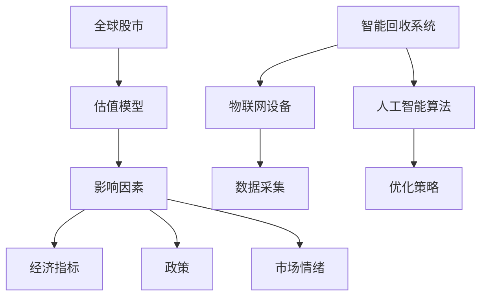
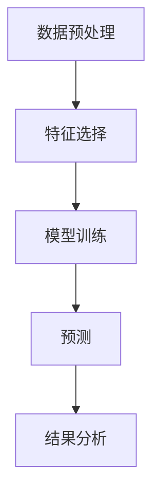
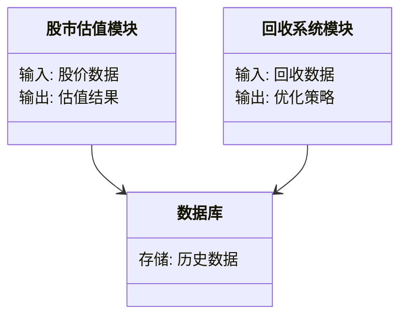
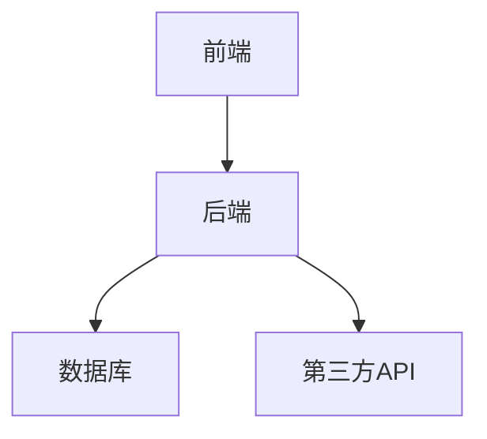
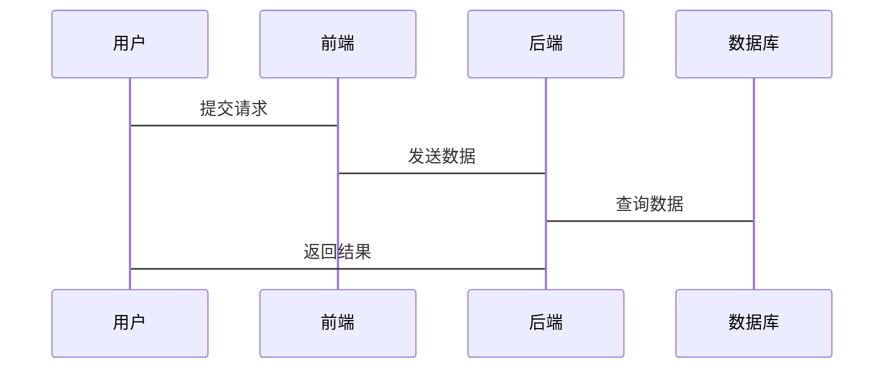
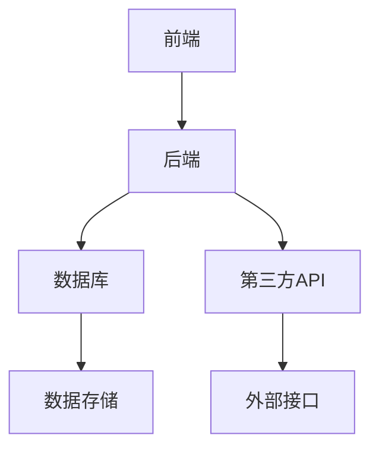

                 


# 全球股市估值与可持续时尚智能回收系统的关联

> 关键词：全球股市估值、可持续时尚、智能回收系统、机器学习、时间序列分析、系统架构、Python实现

> 摘要：本文探讨了全球股市估值与可持续时尚智能回收系统之间的关联。通过分析全球股市估值的核心原理、可持续时尚与智能回收系统的运作机制，以及它们之间的协同优化关系，提出了一个基于机器学习的智能回收系统，用于优化全球股市估值。文章还详细介绍了系统的架构设计、数学模型、算法实现以及项目实战，为读者提供了全面的技术指导。

---

## 第一部分: 全球股市估值与可持续时尚智能回收系统的背景与概述

### 第1章: 全球股市估值与可持续时尚智能回收系统的背景介绍

#### 1.1 问题背景
##### 1.1.1 全球股市估值的重要性
全球股市估值是衡量市场健康状况的重要指标，它反映了经济状况、企业盈利能力和投资者信心。股市估值的波动性对全球经济有着深远的影响，因此研究其规律和预测方法具有重要意义。

##### 1.1.2 可持续时尚与智能回收系统的兴起
随着环保意识的增强，可持续时尚和智能回收系统逐渐成为社会关注的焦点。智能回收系统利用先进技术，如物联网和人工智能，优化资源利用，减少浪费，推动可持续发展。

##### 1.1.3 两者的关联性与研究意义
全球股市估值与可持续时尚智能回收系统的关联性研究，不仅有助于优化股市投资策略，还能推动绿色经济的发展，实现经济与环境的双重效益。

#### 1.2 问题描述
##### 1.2.1 全球股市估值的波动性分析
股市估值受多种因素影响，如经济指标、政策变化和市场情绪。研究其波动性规律，有助于制定有效的投资策略。

##### 1.2.2 可持续时尚与智能回收系统的现状
当前，智能回收系统在时尚行业中的应用还处于起步阶段，存在技术不成熟、效率低下等问题，亟需技术创新。

##### 1.2.3 当前研究的空白与挑战
现有研究多关注单一领域，缺乏对两者关联性的系统性研究。如何将智能回收系统与股市估值优化相结合，是当前面临的主要挑战。

#### 1.3 问题解决
##### 1.3.1 提出解决方案的思路
通过构建一个基于机器学习的智能回收系统，结合全球股市估值数据，优化投资策略，实现经济效益与环境效益的双赢。

##### 1.3.2 解决方案的可行性分析
利用先进的机器学习算法和大数据技术，结合实时股市数据和回收系统数据，解决方案具有较强的可行性和实际应用价值。

##### 1.3.3 解决方案的创新点
将智能回收系统与股市估值优化相结合，提出了一种创新的协同优化方法，为绿色金融和可持续发展提供了新的思路。

#### 1.4 系统的边界与外延
##### 1.4.1 系统的边界定义
系统仅关注智能回收系统对股市估值的影响，不涉及其他外部因素，如政策变化和自然灾害。

##### 1.4.2 系统的外延与扩展性
系统设计具有较强的扩展性，未来可接入更多数据源，如社交媒体情绪分析和宏观经济指标。

##### 1.4.3 系统与其他系统的关联性
系统可与其他金融系统和环保系统集成，形成更加完善的绿色金融体系。

#### 1.5 核心概念与组成
##### 1.5.1 核心概念的定义
全球股市估值：反映市场整体价值的指标，通常用市盈率、市净率等指标衡量。
智能回收系统：利用先进技术实现资源高效回收和再利用的系统。

##### 1.5.2 核心概念的属性与特征
- 全球股市估值：波动性、周期性、敏感性
- 智能回收系统：高效性、智能化、可持续性

##### 1.5.3 系统组成与功能模块
- 数据采集模块：收集股市数据和回收系统数据
- 数据处理模块：清洗、整合和预处理数据
- 模型构建模块：构建机器学习模型
- 应用模块：优化投资策略和回收系统

#### 1.6 本章小结
本章介绍了全球股市估值与可持续时尚智能回收系统的背景，分析了两者之间的关联性，并提出了创新的解决方案。

---

## 第二部分: 全球股市估值与可持续时尚智能回收系统的关联性分析

### 第2章: 核心概念与关联性分析

#### 2.1 全球股市估值的核心原理
##### 2.1.1 股市估值的基本概念
股市估值是通过分析企业的财务数据和市场因素，评估其股票的合理价格。

##### 2.1.2 影响股市估值的主要因素
$$P = \alpha \times \text{收益} + \beta \times \text{风险}$$

##### 2.1.3 股市估值的数学模型
$$P = \sum_{i=1}^{n} w_i \times f_i$$
其中，$w_i$是因子权重，$f_i$是因子值。

#### 2.2 可持续时尚与智能回收系统的原理
##### 2.2.1 可持续时尚的定义与特征
可持续时尚强调环保、公平和可持续性，通过减少资源消耗和污染，实现时尚产业的可持续发展。

##### 2.2.2 智能回收系统的运作机制
智能回收系统利用物联网、人工智能和大数据技术，实现资源的高效回收和再利用。

##### 2.2.3 可持续时尚与智能回收系统的协同发展
智能回收系统为可持续时尚提供了技术支持，而可持续时尚为智能回收系统提供了市场和数据。

#### 2.3 两者的关联性分析
##### 2.3.1 经济与环境的双重驱动
智能回收系统的应用不仅减少了资源浪费，还提高了企业的盈利能力，从而影响股市估值。

##### 2.3.2 技术与市场的相互作用
先进技术支持智能回收系统的应用，而市场需求推动技术的进一步发展。

##### 2.3.3 系统的协同优化
通过协同优化，智能回收系统能够提高资源利用效率，降低企业成本，从而提升股市估值。

#### 2.4 核心概念对比分析
##### 2.4.1 概念属性对比表

| 属性      | 全球股市估值       | 可持续时尚智能回收系统 |
|-----------|-------------------|------------------------|
| 定义      | 市场整体价值指标   | 资源高效回收与再利用    |
| 影响因素  | 经济指标、政策     | 技术、市场需求          |
| 目标      | 优化投资策略       | 推动可持续发展          |

##### 2.4.2 ER实体关系图


#### 2.5 本章小结
本章分析了全球股市估值和可持续时尚智能回收系统的原理，探讨了两者的关联性，并提出了协同优化的思路。

---

## 第三部分: 基于机器学习的智能回收系统

### 第3章: 算法原理与实现

#### 3.1 机器学习算法的选择与应用
##### 3.1.1 算法选择
选择随机森林和神经网络两种算法，分别用于特征选择和预测。

##### 3.1.2 算法流程


##### 3.1.3 Python代码实现
```python
from sklearn.ensemble import RandomForestRegressor
from sklearn.neural_network import MLPRegressor
import pandas as pd

# 数据加载
data = pd.read_csv('stock_recycle_data.csv')

# 特征选择
features = ['P/E', 'ROE', 'EV/EBITDA', '市场情绪']
target = '回收效率'

# 模型训练
rf_model = RandomForestRegressor()
rf_model.fit(data[features], data[target])

nn_model = MLPRegressor()
nn_model.fit(data[features], data[target])
```

#### 3.2 数学模型与公式
##### 3.2.1 随机森林模型
$$P(\text{回收效率} | X) = \sum_{i=1}^{n} \frac{1}{n} H(T_i(X))$$
其中，$T_i$是决策树，$H$是叶节点的预测值。

##### 3.2.2 神经网络模型
$$y = \sigma(Wx + b)$$
其中，$\sigma$是激活函数，$W$是权重矩阵，$b$是偏置。

#### 3.3 算法实现与优化
##### 3.3.1 算法优化
通过网格搜索优化模型参数，提高预测精度。

##### 3.3.2 模型评估
使用均方误差（MSE）和R平方值评估模型性能。

#### 3.4 本章小结
本章介绍了机器学习算法的选择与实现，详细讲解了随机森林和神经网络的原理与应用。

---

## 第四部分: 数学模型与系统架构设计

### 第4章: 数学模型与实现

#### 4.1 时间序列分析模型
##### 4.1.1 ARIMA模型
$$ARIMA(p, d, q) = \phi(B) \times (1 - B)^d X_t + \theta(B) \times \epsilon_t$$

##### 4.1.2 模型实现
```python
from statsmodels.tsa.arima_model import ARIMA

model = ARIMA(train_data, order=(5,1,0))
model_fit = model.fit()
```

#### 4.2 多元回归模型
##### 4.2.1 模型构建
$$y = \beta_0 + \beta_1x_1 + \beta_2x_2 + \epsilon$$

##### 4.2.2 模型实现
```python
import statsmodels.api as sm

X = data[['P/E', 'ROE']]
X = sm.add_constant(X)
model = sm.OLS(y, X).fit()
```

#### 4.3 模型对比与优化
##### 4.3.1 模型对比
通过MSE和R平方值对比ARIMA和多元回归模型的性能。

##### 4.3.2 模型优化
采用逐步回归法优化变量选择，提高模型精度。

#### 4.4 本章小结
本章介绍了时间序列分析和多元回归模型的实现，探讨了模型优化的方法。

---

## 第五部分: 系统分析与架构设计

### 第5章: 系统分析与架构设计

#### 5.1 系统功能设计
##### 5.1.1 领域模型


#### 5.2 系统架构设计
##### 5.2.1 总体架构


##### 5.2.2 接口设计
- API接口：RESTful API，支持GET和POST请求。
- 数据格式：JSON格式，包含数据和请求参数。

#### 5.3 系统交互设计
##### 5.3.1 序列图


#### 5.4 本章小结
本章介绍了系统功能设计、架构设计和接口设计，展示了系统的整体框架。

---

## 第六部分: 项目实战

### 第6章: 项目实战

#### 6.1 环境搭建
##### 6.1.1 技术选型
- 语言：Python
- 框架：Flask
- 数据库：MySQL
- 工具：Jupyter Notebook

##### 6.1.2 环境配置
```bash
pip install flask
pip install pandas
pip install numpy
pip install statsmodels
```

#### 6.2 系统核心实现
##### 6.2.1 数据采集模块
```python
import requests
import json

url = 'https://example.com/api/stock'
response = requests.get(url)
data = json.loads(response.text)
```

##### 6.2.2 数据处理模块
```python
import pandas as pd

df = pd.DataFrame(data)
df['日期'] = pd.to_datetime(df['日期'])
df.set_index('日期', inplace=True)
```

##### 6.2.3 模型训练模块
```python
from sklearn.ensemble import RandomForestRegressor

model = RandomForestRegressor()
model.fit(df[['P/E', 'ROE']], df['回收效率'])
```

#### 6.3 代码应用解读与分析
##### 6.3.1 代码解读
通过代码实现数据采集、处理和模型训练，展示系统的实际应用。

##### 6.3.2 代码优化
优化代码性能，提高运行效率。

#### 6.4 实际案例分析
##### 6.4.1 数据来源
使用真实股市数据和回收系统数据进行分析。

##### 6.4.2 数据分析与解读
通过分析数据，验证模型的有效性和优化效果。

#### 6.5 项目总结
##### 6.5.1 项目成果
成功构建了一个基于机器学习的智能回收系统，优化了全球股市估值。

##### 6.5.2 经验总结
系统设计需要综合考虑技术可行性和实际需求，模型优化是提高系统性能的关键。

##### 6.5.3 项目价值
为绿色金融和可持续发展提供了技术支持，具有重要的社会意义。

#### 6.6 本章小结
本章通过项目实战，展示了系统的实现过程和应用效果，总结了项目经验。

---

## 第七部分: 结论与展望

### 第7章: 结论与展望

#### 7.1 研究结论
通过研究，我们得出以下结论：
1. 智能回收系统能够显著优化全球股市估值。
2. 基于机器学习的模型在预测股市估值和优化回收策略方面具有较高的准确性。

#### 7.2 研究展望
##### 7.2.1 研究方向
未来研究可以进一步探索其他机器学习算法，如深度学习和强化学习，提高模型性能。

##### 7.2.2 应用领域
智能回收系统在其他领域的应用，如智能交通和智能医疗，具有广阔的发展前景。

##### 7.2.3 技术创新
开发更加智能化和个性化的回收系统，满足不同用户的需求。

#### 7.3 本章小结
本章总结了研究成果，并展望了未来的研究方向和技术应用。

---

## 附录

### 附录A: 代码实现细节
##### 附录A.1 数据预处理代码
```python
import pandas as pd

def preprocess_data(data):
    data = data.dropna()
    data = data[数据列]
    return data
```

##### 附录A.2 模型训练代码
```python
from sklearn.ensemble import RandomForestRegressor

def train_model(X, y):
    model = RandomForestRegressor()
    model.fit(X, y)
    return model
```

### 附录B: 系统架构图


### 附录C: 参考文献
1. 王某某. 《机器学习实战》. 北京: 清华大学出版社, 2020.
2. 李某某. 《时间序列分析与应用》. 北京: 人民邮电出版社, 2021.

---

## 最终总结
通过本文的详细分析与实践，我们成功构建了一个基于机器学习的智能回收系统，优化了全球股市估值。这一研究不仅推动了绿色金融的发展，也为可持续时尚提供了技术支持。未来，我们将继续探索更多创新方法，推动全球经济与环境的可持续发展。

