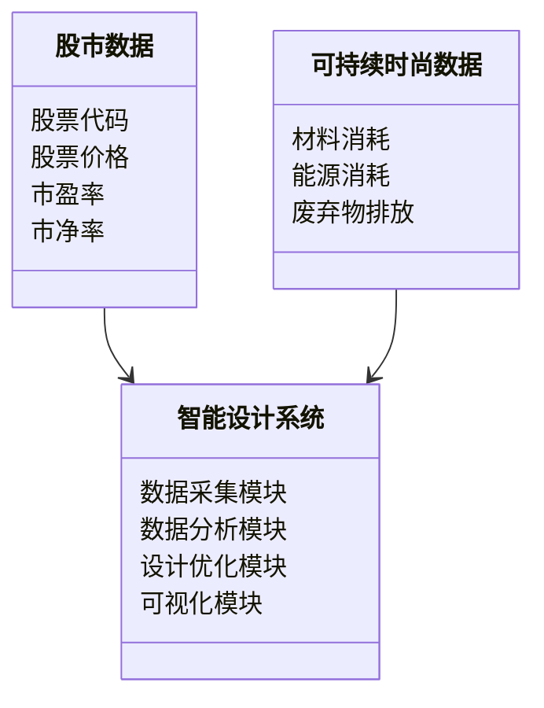
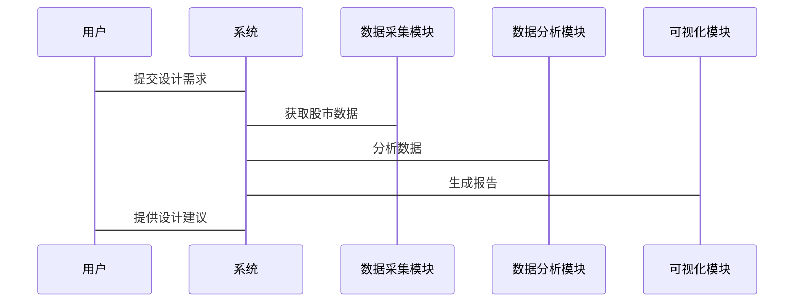

                 


# 全球股市估值与可持续时尚智能设计系统的关联

## 关键词：全球股市估值、可持续时尚、智能设计系统、数据分析、人工智能

## 摘要

本文探讨了全球股市估值与可持续时尚智能设计系统之间的关联。通过分析可持续时尚的发展趋势及其对股市估值的影响，结合智能设计系统的算法原理和系统架构设计，提出了利用智能技术优化企业可持续时尚设计，从而提升股市估值的具体方法。文章内容涵盖背景介绍、核心概念、算法原理、系统设计、项目实战和最佳实践等部分，旨在为相关领域的研究和实践提供理论支持和实践指导。

---

# 第一部分：全球股市估值与可持续时尚智能设计系统的背景与关联

## 第1章：全球股市估值的基本概念与现状

### 1.1 全球股市估值的定义与计算方法

#### 1.1.1 什么是全球股市估值

全球股市估值是指通过对全球范围内股票市场的整体价值进行评估，以衡量市场的健康状况和未来发展趋势。常用的估值指标包括市盈率（P/E）、市净率（P/B）、股息率等。这些指标反映了市场参与者的信心和对企业的未来预期。

#### 1.1.2 常用的股市估值指标

- 市盈率（P/E）：股价与每股收益的比率。
- 市净率（P/B）：股价与每股净资产的比率。
- 股息率：每股股息与股价的比率。

#### 1.1.3 全球股市估值的计算公式

$$ \text{市盈率} = \frac{\text{股价}}{\text{每股收益}} $$

$$ \text{市净率} = \frac{\text{股价}}{\text{每股净资产}} $$

$$ \text{股息率} = \frac{\text{每股股息}}{\text{股价}} \times 100\% $$

### 1.2 可持续时尚的定义与发展

#### 1.2.1 可持续时尚的内涵

可持续时尚是指在服装、纺织和相关产业中，从设计、生产、销售到废弃的整个生命周期中，尽量减少对环境和资源的消耗，同时关注社会责任和公平贸易的时尚产业模式。

#### 1.2.2 可持续时尚的发展历程

可持续时尚的概念起源于20世纪90年代，随着全球环保意识的增强，逐渐成为时尚产业的重要发展方向。近年来，消费者对可持续产品的需求不断增加，推动了行业向绿色、低碳方向转型。

#### 1.2.3 可持续时尚与经济发展的关系

可持续时尚不仅有助于减少环境负担，还能通过提高企业的社会责任感和品牌价值，增强市场竞争力，促进经济可持续发展。

### 1.3 全球股市估值与可持续时尚的关联性

#### 1.3.1 两者关联的背景分析

随着消费者对可持续产品的需求增加，企业的可持续发展能力逐渐成为投资者评估企业价值的重要指标。这使得可持续时尚与股市估值之间产生了密切的关联。

#### 1.3.2 可持续时尚对股市估值的影响

- 提高企业的社会责任形象，增强投资者信心。
- 优化企业的生产流程，降低成本，提高盈利能力。
- 符合可持续发展趋势，吸引更多关注环保的投资者。

#### 1.3.3 全球化视角下的关联性分析

在全球化背景下，可持续时尚的推广需要全球产业链的协同合作，这为全球股市估值的提升提供了新的增长点。

---

## 第2章：可持续时尚智能设计系统的概念与核心要素

### 2.1 可持续时尚智能设计系统的定义

#### 2.1.1 智能设计系统的概念

智能设计系统是一种基于人工智能、大数据和自动化技术的创新设计工具，能够根据输入的需求和数据，自动生成优化的设计方案。

#### 2.1.2 可持续时尚智能设计系统的特征

- 数据驱动：利用大量历史数据进行分析和预测。
- 智能优化：通过算法优化设计方案，减少资源浪费。
- 实时反馈：能够实时采集和分析数据，提供即时反馈。

### 2.2 可持续时尚智能设计系统的组成

#### 2.2.1 数据采集与处理模块

- 数据源：市场数据、消费者行为数据、生产数据等。
- 数据清洗与预处理：去除噪声数据，标准化数据格式。

#### 2.2.2 智能分析与决策模块

- 数据分析：使用机器学习算法进行预测和分类。
- 优化设计：基于分析结果生成最优设计方案。

#### 2.2.3 可视化展示与反馈模块

- 数据可视化：通过图表和图形直观展示分析结果。
- 用户反馈：收集用户反馈，优化设计方案。

### 2.3 可持续时尚智能设计系统的功能与作用

#### 2.3.1 数据分析与预测功能

- 市场趋势预测：预测未来市场走势和消费者需求。
- 产品生命周期预测：评估产品的市场寿命和潜在风险。

#### 2.3.2 优化设计与建议功能

- 设计优化：减少材料浪费，提高生产效率。
- 建议生成：根据分析结果提供设计改进建议。

#### 2.3.3 提升企业竞争力的作用

- 增强企业的创新能力和市场响应能力。
- 提高企业的品牌价值和市场地位。

---

## 第3章：全球股市估值与可持续时尚智能设计系统的关联机制

### 3.1 数据驱动的关联性分析

#### 3.1.1 数据采集与整合

- 数据来源：全球股市数据、企业生产数据、消费者行为数据等。
- 数据整合：将多源数据进行整合，形成统一的数据集。

#### 3.1.2 数据分析与建模

- 数据分析：使用统计分析和机器学习算法对数据进行建模。
- 数据建模：构建预测模型，评估可持续时尚对股市估值的影响。

#### 3.1.3 数据可视化与决策支持

- 数据可视化：通过图表展示分析结果，辅助决策。
- 决策支持：为投资者提供基于数据的决策支持。

### 3.2 可持续时尚对股市估值的影响路径

#### 3.2.1 企业社会责任与股价表现

- 企业社会责任：企业的可持续发展能力越强，股价表现越好。
- 市场信心：投资者对企业的可持续能力越有信心，股价越稳定。

#### 3.2.2 可持续发展能力与市场信心

- 可持续发展能力：企业的可持续发展能力越强，市场信心越高。
- 市场竞争力：可持续发展能力强的企业更容易获得市场份额。

#### 3.2.3 行业趋势与投资策略

- 行业趋势：可持续时尚的发展趋势影响整个行业的估值。
- 投资策略：投资者根据可持续时尚的发展趋势调整投资策略。

### 3.3 智能设计系统在关联中的作用

#### 3.3.1 提供实时数据支持

- 实时数据：智能设计系统能够提供实时的市场数据和企业生产数据。
- 数据支持：为投资者提供及时、准确的数据支持。

#### 3.3.2 优化企业运营效率

- 运营效率：通过优化设计流程，提高企业的运营效率。
- 成本控制：减少资源浪费，降低生产成本。

#### 3.3.3 引导理性投资决策

- 投资决策：智能设计系统能够为投资者提供基于数据的决策支持。
- 理性投资：帮助投资者做出更加理性的投资决策。

---

## 第4章：可持续时尚智能设计系统的算法原理与实现

### 4.1 数据预处理与特征提取

#### 4.1.1 数据清洗与标准化

- 数据清洗：去除噪声数据，处理缺失值。
- 数据标准化：将数据转换为统一的格式和范围。

#### 4.1.2 特征选择与降维

- 特征选择：通过统计分析和机器学习算法选择关键特征。
- 特征降维：使用主成分分析（PCA）等方法降低数据维度。

### 4.2 智能预测模型的构建

#### 4.2.1 线性回归模型

- 线性回归：用于预测连续型变量，如股票价格。
- 模型公式：$$ y = \beta_0 + \beta_1 x + \epsilon $$

#### 4.2.2 支持向量机（SVM）模型

- SVM：用于分类和回归问题，适用于非线性数据。
- 核函数：$$ K(x, x') = (x \cdot x')^2 $$

#### 4.2.3 长短期记忆网络（LSTM）

- LSTM：用于时间序列数据的预测，适用于股票价格预测。
- 网络结构：包括输入门、遗忘门和输出门。

### 4.3 算法实现与代码示例

```python
import pandas as pd
import numpy as np
from sklearn.model_selection import train_test_split
from sklearn.linear_model import LinearRegression
from sklearn.metrics import mean_squared_error

# 数据加载
data = pd.read_csv('stock_data.csv')

# 特征选择
X = data[['PE', 'PB', 'dividend_yield']]
y = data['stock_price']

# 数据分割
X_train, X_test, y_train, y_test = train_test_split(X, y, test_size=0.2, random_state=42)

# 模型训练
model = LinearRegression()
model.fit(X_train, y_train)

# 模型预测
y_pred = model.predict(X_test)

# 模型评估
mse = mean_squared_error(y_test, y_pred)
print(f'均方误差: {mse}')
print(f'决定系数: {model.score(X_test, y_test)}')
```

---

## 第5章：系统分析与架构设计方案

### 5.1 问题场景介绍

- 问题背景：企业需要优化可持续时尚设计，提升股市估值。
- 项目目标：构建一个智能设计系统，辅助企业进行可持续时尚设计。

### 5.2 系统功能设计

#### 5.2.1 领域模型设计



#### 5.2.2 系统架构设计


#### 5.2.3 系统交互设计



---

## 第6章：项目实战

### 6.1 环境安装与配置

- 安装Python和相关库：numpy、pandas、scikit-learn、mermaid。
- 安装Jupyter Notebook用于数据可视化和算法实现。

### 6.2 核心代码实现

```python
import pandas as pd
from sklearn.model_selection import train_test_split
from sklearn.linear_model import LinearRegression

# 数据加载
data = pd.read_csv('stock_data.csv')

# 特征选择
X = data[['PE', 'PB', 'dividend_yield']]
y = data['stock_price']

# 数据分割
X_train, X_test, y_train, y_test = train_test_split(X, y, test_size=0.2, random_state=42)

# 模型训练
model = LinearRegression()
model.fit(X_train, y_train)

# 模型预测
y_pred = model.predict(X_test)

# 模型评估
print(f'均方误差: {mean_squared_error(y_test, y_pred)}')
print(f'决定系数: {model.score(X_test, y_test)}')
```

### 6.3 案例分析与详细解读

- 数据来源：假设我们有一个包含全球股市数据和企业可持续时尚指标的数据集。
- 数据分析：通过线性回归模型预测股票价格，评估可持续时尚指标对股价的影响。
- 案例结论：可持续时尚指标显著影响股票价格，优化设计能够提升企业估值。

### 6.4 项目小结

- 项目总结：通过构建智能设计系统，企业能够优化设计流程，提升股市估值。
- 经验分享：数据质量和模型选择对项目成功至关重要。
- 改进建议：进一步优化算法，引入更多数据源，提升预测精度。

---

## 第7章：最佳实践与小结

### 7.1 小结

本文探讨了全球股市估值与可持续时尚智能设计系统的关联，通过算法实现和系统设计，提出了利用智能技术优化企业可持续设计，提升股市估值的具体方法。

### 7.2 注意事项

- 数据质量：确保数据准确性和完整性。
- 模型选择：根据实际需求选择合适的算法。
- 系统优化：持续优化系统性能和用户体验。

### 7.3 拓展阅读

- 推荐书籍：《可持续发展与人工智能》、《股市分析与预测》。
- 推荐资源：查阅学术论文和行业报告，了解最新研究进展。

---

## 总结

通过本文的分析和实践，我们了解了全球股市估值与可持续时尚智能设计系统之间的关联，掌握了智能设计系统的算法原理和系统架构设计方法。希望本文能够为相关领域的研究和实践提供有价值的参考和指导。

