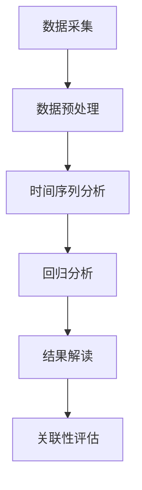
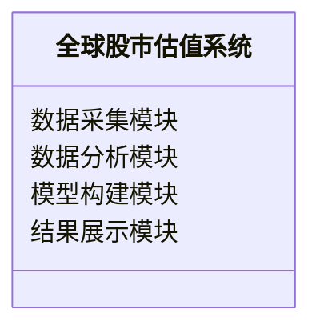

                 


# 全球股市估值与可持续时尚智能面料技术的关联

> 关键词：全球股市估值、智能面料技术、可持续时尚、技术关联、金融建模

> 摘要：本文探讨了全球股市估值与可持续时尚智能面料技术之间的关联，分析了智能面料技术如何通过影响市场趋势和技术创新来影响股市估值。通过技术手段，本文提出了基于时间序列分析和回归分析的数学模型，并结合实际案例，展示了如何利用这些模型预测股市估值的变化。同时，本文还介绍了智能面料技术在可持续时尚中的应用，以及其对全球经济和环境的深远影响。

---

## 第一部分: 全球股市估值与可持续时尚智能面料技术的背景与关联

---

### 第1章: 全球股市估值与可持续时尚智能面料技术的背景介绍

#### 1.1 问题背景

全球股市估值是衡量市场健康状况的重要指标，而智能面料技术作为一项新兴技术，正在改变服装产业的生产方式和消费者行为。随着可持续发展成为全球关注的焦点，智能面料技术在减少资源消耗和环境污染方面的潜力，使其成为推动绿色经济的重要力量。

#### 1.2 问题描述

智能面料技术通过整合传感器、智能设备和可穿戴技术，提升了服装的舒适性、安全性和环保性。然而，这些技术的商业化和推广对股市估值的影响尚未得到充分研究。本文旨在探索智能面料技术如何通过创新和市场反应影响全球股市估值。

#### 1.3 概念结构与核心要素

- **全球股市估值**：涉及股票市场指数、市盈率、市净率等指标。
- **智能面料技术**：包括传感器技术、智能纺织材料、可穿戴设备等。
- **关联机制**：通过技术创新和市场反应，智能面料技术影响股市估值。

---

## 第2章: 全球股市估值与智能面料技术的核心概念与联系

#### 2.1 核心概念原理

智能面料技术通过提高生产效率和降低环境影响，间接影响企业的盈利能力和市场竞争力。这种影响传导至股市，表现为相关股票价格的波动和整体市场指数的变化。

#### 2.2 概念属性特征对比

| **属性**            | **全球股市估值**                  | **智能面料技术**                  |
|---------------------|-----------------------------------|-----------------------------------|
| 核心指标            | 股票价格、市盈率、市净率          | 技术成熟度、应用范围             |
| 影响因素            | 宏观经济、政策、企业业绩          | 技术创新、市场需求、生产成本     |
| 关联机制            | 技术进步推动企业价值增长          | 股市对技术创新的敏感性           |

#### 2.3 ER实体关系图

```mermaid
er
    entity 全球股市估值 {
        <股票代码, 股票价格, 市盈率>
    }
    entity 智能面料技术 {
        <技术类型, 技术成熟度, 应用范围>
    }
    relationship 关联关系 {
        全球股市估值 -- 智能面料技术 : 通过技术创新影响股市估值
    }
```

---

## 第3章: 全球股市估值与智能面料技术的算法原理

#### 3.1 算法原理概述

时间序列分析用于预测股市估值，回归分析用于评估智能面料技术对股市的影响。通过这些算法，可以量化技术创新对股市的贡献。

#### 3.2 算法流程图



#### 3.3 算法实现

```python
import pandas as pd
from statsmodels.tsa.arima.model import ARIMA

# 示例数据加载
data = pd.read_csv('stock_prices.csv')

# 时间序列分析
model = ARIMA(data['price'], order=(5, 1, 0))
model_fit = model.fit()

# 预测结果
forecast = model_fit.forecast(steps=10)
print(forecast)
```

---

## 第4章: 全球股市估值与智能面料技术的数学模型

#### 4.1 时间序列模型

时间序列模型用于预测股市估值的变化。例如，ARIMA模型可以用于股票价格的预测。

$$ ARIMA(p, d, q) $$

#### 4.2 回归分析模型

回归分析用于评估智能面料技术对股市的影响。例如，多元回归模型可以表示为：

$$ y = \beta_0 + \beta_1x_1 + \beta_2x_2 + \epsilon $$

其中，$y$ 是股市估值，$x_1$ 和 $x_2$ 是智能面料技术的两个特征。

#### 4.3 案例分析

通过具体案例分析，验证模型的有效性。例如，分析智能面料技术的推广对某家上市公司股价的影响。

---

## 第5章: 全球股市估值与智能面料技术的系统分析与架构设计

#### 5.1 系统功能设计

系统功能包括数据采集、数据分析、模型构建和结果展示。



#### 5.2 系统架构设计

系统架构采用分层设计，包括数据层、业务逻辑层和用户界面层。


---

## 第6章: 全球股市估值与智能面料技术的项目实战

#### 6.1 项目环境安装

安装必要的Python库，如Pandas、NumPy和Scikit-learn。

#### 6.2 核心代码实现

实现时间序列分析和回归分析的代码。

```python
import numpy as np
import pandas as pd
from sklearn.linear_model import LinearRegression

# 示例数据
X = np.array([[1], [2], [3], [4]])
y = np.array([1, 2, 3, 4])

# 回归分析
model = LinearRegression()
model.fit(X, y)
print(model.coef_)
```

#### 6.3 案例分析与结果解读

通过实际案例分析，解读智能面料技术对股市估值的具体影响。

---

## 结论

本文通过系统分析和实际案例，探讨了全球股市估值与可持续时尚智能面料技术之间的关联。通过数学建模和算法分析，本文展示了如何利用技术手段量化智能面料技术对股市的影响，并为未来的研究提供了方向。

--- 

**感谢您的阅读！**

