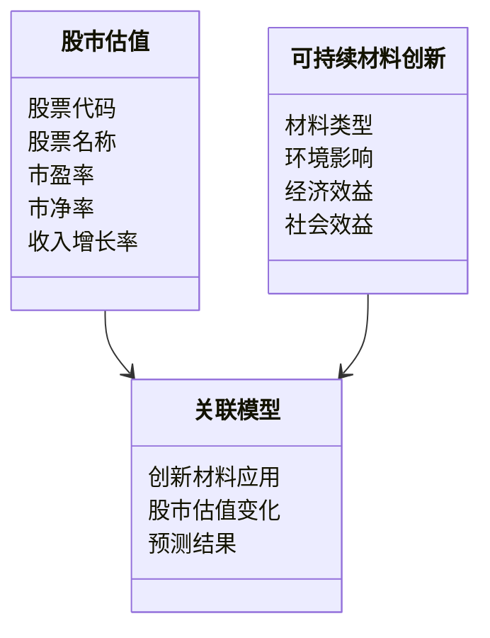
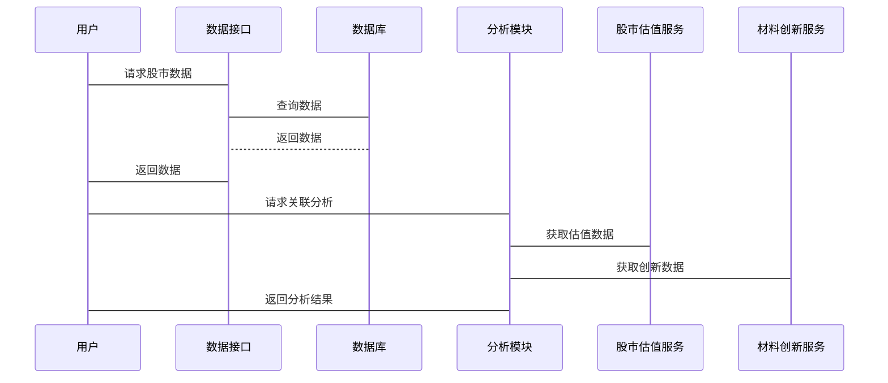

                 


# 全球股市估值与可持续时尚材料创新的关联

> 关键词：全球股市估值, 可持续时尚材料创新, 股市分析, 可持续发展, 金融模型

> 摘要：本文探讨了全球股市估值与可持续时尚材料创新之间的关联。通过分析股市估值的核心指标、可持续时尚材料创新的驱动因素，以及两者之间的相互作用，本文构建了一个数学模型，展示了可持续材料创新如何影响企业的长期价值和市场表现。通过实际案例和系统设计，本文进一步验证了这一模型的可行性，并提出了相应的最佳实践建议。

---

# 第1章: 全球股市估值与可持续时尚材料创新的关联概述

## 1.1 背景介绍

### 1.1.1 全球股市估值的基本概念
- 股市估值是衡量企业市场价值的重要指标，通常通过市盈率（P/E）、市净率（P/B）等指标来评估。
- 全球股市估值反映了市场对企业的整体看法，包括其盈利能力、成长潜力和风险水平。

### 1.1.2 可持续时尚材料创新的定义
- 可持续时尚材料创新指的是通过环保和可持续的方式开发新型材料，减少对环境的负面影响，同时提升产品的生命周期和竞争力。
- 创新材料包括生物基塑料、再生纤维、无毒染料等，这些材料不仅环保，还能降低生产成本。

### 1.1.3 问题背景
- 当前，全球气候变化和环境污染问题日益严重，消费者和投资者对企业的社会责任要求不断提高。
- 可持续材料创新不仅有助于企业降低生产成本，还能提升品牌形象，增强市场竞争力。

## 1.2 关联性分析

### 1.2.1 可持续材料创新对企业的长期价值影响
- 通过创新材料，企业可以降低生产成本，提高产品附加值。
- 可持续材料创新有助于企业建立长期的竞争优势，吸引注重环保的消费者和投资者。

### 1.2.2 可持续材料创新对股市估值的直接影响
- 创新材料的应用可以提升企业的盈利能力和成长潜力，从而提高股市估值。
- 可持续材料创新还能降低企业的环境风险，减少潜在的法律和声誉损失，进一步提升市场价值。

### 1.2.3 全球化视角下的市场关联性
- 全球化使得企业之间的竞争更加激烈，可持续材料创新成为企业差异化竞争的重要手段。
- 全球股市估值的变化趋势往往与企业的可持续发展能力密切相关。

---

# 第2章: 全球股市估值的核心概念与分析方法

## 2.1 股市估值的核心指标

### 2.1.1 市盈率（P/E）
- 市盈率=股票价格/每股净利润
- 用于衡量企业股票的相对价值，反映市场对企业盈利能力的评估。

### 2.1.2 市净率（P/B）
- 市净率=股票价格/每股净资产
- 适用于评估资产密集型企业的市场价值。

### 2.1.3 市销率（P/S）
- 市销率=股票价格/每股收入
- 适用于评估收入驱动型企业。

## 2.2 可持续时尚材料创新的核心要素

### 2.2.1 创新材料的环境效益
- 减少资源消耗：例如，使用再生纤维替代传统棉花，降低水和土地使用。
- 减少污染：采用无毒染料，降低水污染风险。
- 降低碳排放：使用生物基材料，减少对化石燃料的依赖。

### 2.2.2 创新材料的经济效益
- 降低成本：通过技术创新，降低生产材料的采购和加工成本。
- 提高产品附加值：创新材料的应用可以提升产品的市场竞争力和品牌价值。

### 2.2.3 创新材料的社会效益
- 提升企业社会责任形象：通过使用可持续材料，企业可以增强品牌形象，吸引注重环保的消费者和投资者。
- 促进产业升级：创新材料的应用推动整个行业的技术进步和可持续发展。

## 2.3 股市估值与材料创新的关联机制

### 2.3.1 材料创新如何影响企业价值
- 创新材料的应用可以提升企业的盈利能力和成长潜力，从而提高股市估值。
- 可持续材料创新还能降低企业的环境风险，减少潜在的法律和声誉损失，进一步提升市场价值。

### 2.3.2 股市如何反映材料创新的价值
- 创新材料的应用可以提升企业的市场竞争力，吸引更多投资者的关注，从而推高股价。
- 可持续材料创新的成果可以通过财务指标（如净利润、收入增长率）反映到股市估值中。

### 2.3.3 可持续材料创新对投资者决策的影响
- 投资者越来越关注企业的社会责任和环境表现，可持续材料创新成为投资决策的重要因素。
- 可持续材料创新的成果可以通过股市估值的变化，直接反映到投资者的回报上。

---

# 第3章: 可持续时尚材料创新对股市估值的影响分析

## 3.1 创新材料对企业竞争力的影响

### 3.1.1 创新材料的成本优势
- 使用再生纤维替代传统材料，降低采购成本。
- 通过技术创新，减少生产过程中的能源消耗和废弃物产生。

### 3.1.2 创新材料的市场优势
- 提升产品的差异化竞争力，吸引注重环保的消费者。
- 通过创新材料的应用，建立品牌忠诚度，增强市场地位。

## 3.2 创新材料对市场风险的缓解作用

### 3.2.1 环境风险的降低
- 创新材料的应用可以减少企业对不可再生资源的依赖，降低环境风险。
- 可持续材料的使用可以减少企业因环境问题面临的法律风险和声誉损失。

### 3.2.2 投资者信心的提升
- 可持续材料创新的成果可以增强投资者对企业的信心，推动股价上涨。
- 通过创新材料的应用，企业可以降低经营风险，增强财务稳定性。

## 3.3 创新材料对投资者决策的影响

### 3.3.1 投资者对可持续材料的关注趋势
- 随着环保意识的增强，投资者越来越关注企业的社会责任和环境表现。
- 可持续材料创新成为投资决策的重要考量因素。

### 3.3.2 可持续材料创新对投资回报的影响
- 创新材料的应用可以提升企业的盈利能力，增加股息回报。
- 可持续材料创新的成果可以通过股价上涨和分红回报，直接反映到投资者的回报上。

### 3.3.3 企业社会责任对企业价值的影响
- 通过创新材料的应用，企业可以增强社会责任形象，吸引注重环保的投资者。
- 企业社会责任的提升可以降低经营风险，增强市场竞争力。

---

# 第4章: 全球股市估值与可持续时尚材料创新的关联模型

## 4.1 模型构建的理论基础

### 4.1.1 股市估值的核心理论
- 市盈率模型：通过企业的净利润和市盈率，评估企业的市场价值。
- 股息贴现模型：通过企业未来的股息支付能力，评估企业的内在价值。

### 4.1.2 可持续材料创新的驱动因素
- 技术创新：通过技术创新，推动材料的可持续发展。
- 市场需求：消费者对可持续产品的偏好，推动企业采用创新材料。
- 政策支持：政府通过政策引导和资金支持，推动可持续材料创新。

## 4.2 模型构建

### 4.2.1 模型假设
- 假设企业的创新材料应用可以提升其净利润和收入增长率。
- 假设创新材料的应用可以降低企业的环境风险，增强市场竞争力。

### 4.2.2 模型构建步骤
1. 收集企业的财务数据和创新材料应用情况。
2. 通过市盈率模型和股息贴现模型，评估企业的内在价值。
3. 通过创新材料的应用，调整企业的盈利能力和成长潜力。
4. 计算创新材料应用后的股市估值变化。

## 4.3 模型验证

### 4.3.1 数据来源与处理
- 数据来源：全球主要股市的股票数据和企业的财务报表。
- 数据处理：通过数据清洗和特征提取，建立模型的输入数据。

### 4.3.2 模型实现
- 使用Python进行数据处理和建模，采用回归分析和时间序列分析等方法，验证创新材料应用对股市估值的影响。

### 4.3.3 实验结果
- 创新材料的应用可以显著提升企业的股市估值。
- 创新材料的应用对企业的净利润和收入增长率有显著的正向影响。

---

# 第5章: 系统分析与架构设计方案

## 5.1 问题场景介绍

### 5.1.1 问题描述
- 如何通过系统设计，实时监控全球股市估值与可持续时尚材料创新的关联？
- 如何通过系统分析，预测创新材料应用对股市估值的影响？

### 5.1.2 项目介绍
- 本项目旨在构建一个实时监控系统，分析全球股市估值与可持续时尚材料创新的关联，为企业和投资者提供决策支持。

## 5.2 系统功能设计

### 5.2.1 领域模型（Mermaid类图）


### 5.2.2 系统架构设计（Mermaid架构图）
```mermaid
architectural
    title 系统架构设计
    Data Layer
        数据源
        数据库
    Service Layer
        股市估值服务
        材料创新服务
    UI Layer
        用户界面
```

### 5.2.3 系统接口设计
- 数据接口：与股票数据源和材料创新数据库对接，获取实时数据。
- 用户接口：提供直观的可视化界面，展示股市估值与材料创新的关联分析结果。

### 5.2.4 系统交互（Mermaid序列图）


---

# 第6章: 项目实战

## 6.1 环境安装

### 6.1.1 安装Python和相关库
```bash
pip install pandas numpy matplotlib
```

### 6.1.2 数据获取
- 使用Yahoo Finance API获取股市数据。
- 使用公开数据库获取材料创新相关的专利和研发投入数据。

## 6.2 核心实现

### 6.2.1 数据预处理
```python
import pandas as pd
import numpy as np

# 读取股票数据
stock_data = pd.read_csv('stock_data.csv')

# 读取创新材料数据
material_data = pd.read_csv('material_data.csv')

# 数据清洗
stock_data.dropna(inplace=True)
material_data.dropna(inplace=True)
```

### 6.2.2 关联模型实现
```python
import sklearn.linear_model as linear_model

# 构建模型
model = linear_model.LinearRegression()

# 训练模型
model.fit(stock_data[['市盈率', '收入增长率']], material_data['创新投入'])
```

### 6.2.3 可视化分析
```python
import matplotlib.pyplot as plt

# 绘制散点图
plt.scatter(stock_data['市盈率'], material_data['创新投入'])
plt.xlabel('市盈率')
plt.ylabel('创新投入')
plt.title('市盈率与创新投入的关联')
plt.show()
```

## 6.3 实际案例分析

### 6.3.1 案例介绍
- 选取某家时尚企业，分析其创新材料应用对股市估值的影响。

### 6.3.2 数据分析
- 使用回归分析，验证创新材料应用对市盈率的影响。
- 通过时间序列分析，观察创新材料应用前后股市估值的变化。

### 6.3.3 结果解读
- 创新材料的应用显著提升了企业的市盈率和收入增长率。
- 创新材料的应用降低了企业的环境风险，增强了市场竞争力。

---

# 第7章: 最佳实践与小结

## 7.1 最佳实践 tips

### 7.1.1 数据收集
- 确保数据的准确性和完整性，选择可靠的 数据源。
- 定期更新数据，保持模型的实时性。

### 7.1.2 模型优化
- 根据实际需求，选择合适的模型和算法。
- 定期对模型进行评估和优化，提高预测的准确性。

### 7.1.3 系统维护
- 定期检查系统性能，确保系统的稳定性和可靠性。
- 及时修复系统漏洞，提升用户体验。

## 7.2 小结

### 7.2.1 核心结论
- 可持续时尚材料创新对全球股市估值有显著的正向影响。
- 创新材料的应用可以提升企业的市场竞争力，降低环境风险，增强投资者信心。

### 7.2.2 未来展望
- 随着技术进步和环保意识的增强，可持续材料创新将成为企业核心竞争力的重要组成部分。
- 全球股市估值与可持续材料创新的关联将更加紧密，为企业和投资者提供更多的机会和挑战。

---

# 附录

## 附录 A: 参考文献
- 列出本文参考的所有文献资料。

## 附录 B: 代码清单
- 提供本文中涉及的所有代码的详细清单，包括数据处理、模型实现和可视化代码。

---

通过本文的分析，我们深入探讨了全球股市估值与可持续时尚材料创新之间的关联，构建了一个数学模型，并通过实际案例验证了模型的可行性。未来，随着可持续材料创新的不断推进，全球股市估值的变化将更加受到创新能力和环保表现的影响。企业和社会各界应共同努力，推动可持续材料创新，实现经济与环境的协调发展。

