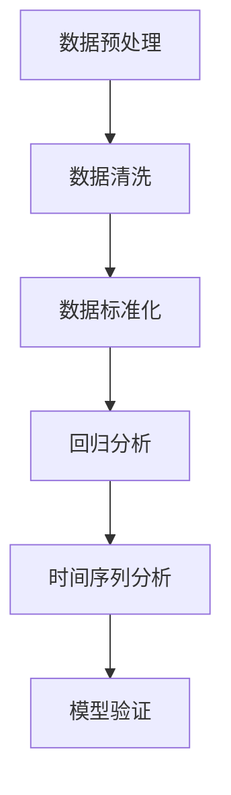
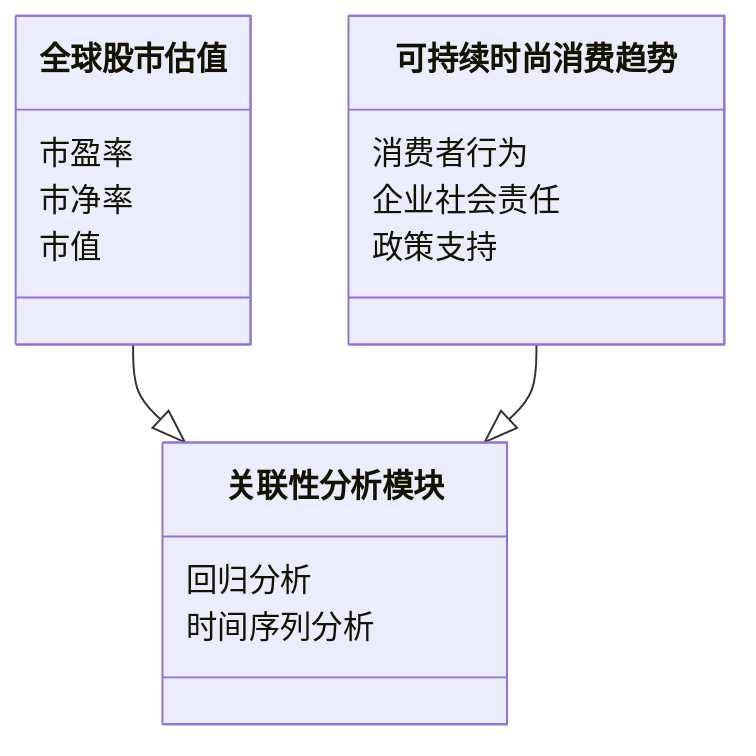

                 


# 全球股市估值与可持续时尚消费趋势的关联

> 关键词：全球股市估值、可持续时尚消费趋势、关联性分析、回归分析、时间序列分析、可持续发展

> 摘要：本文探讨了全球股市估值与可持续时尚消费趋势之间的关联性。通过分析股市估值的核心要素、可持续时尚消费趋势的特征及其对股市的影响路径，结合数据收集、算法原理和数学模型，揭示了两者之间的内在联系。文章还提供了关联性分析的实战案例和系统架构设计，为投资者和企业提供决策支持。

---

## 第一部分：背景介绍

### 第1章：全球股市估值与可持续时尚消费趋势的关联概述

#### 1.1 问题背景

- **全球股市估值的重要性**  
  股市估值是衡量市场健康状况的重要指标，反映了经济表现和投资者信心。近年来，随着可持续发展理念的普及，企业的社会责任和环保表现逐渐成为投资者决策的关键因素。

- **可持续时尚消费趋势的兴起**  
  可持续时尚强调减少资源消耗、减少污染和促进公平贸易。消费者对环保和道德产品的关注日益增加，推动了可持续时尚消费趋势的崛起。

- **问题提出**  
  可持续时尚消费趋势是否会影响企业的业绩和股价？这种影响如何量化？这些问题为本文的研究提供了背景。

#### 1.2 问题描述

- **全球股市估值的波动性分析**  
  股市估值受多种因素影响，包括经济指标、政策变化和企业业绩。本文聚焦于可持续时尚消费趋势对企业业绩的影响。

- **可持续时尚消费趋势的特征**  
  消费者行为的变化、企业社会责任的提升以及政策支持是推动可持续时尚消费趋势的主要因素。

- **问题的边界与外延**  
  本文仅关注可持续时尚消费趋势对股市估值的直接影响，不涉及其他因素（如宏观经济波动）。

#### 1.3 问题解决

- **数据收集与分析方法**  
  通过收集全球主要股市指数和相关企业的财务数据，结合消费者行为调查，分析可持续时尚消费趋势对股市估值的影响。

- **关联性分析的理论基础**  
  采用统计学和机器学习方法，构建回归模型和时间序列模型，量化可持续时尚消费趋势与股市估值的关联。

- **可持续时尚消费对股市估值的影响路径**  
  消费者偏好变化 → 企业收入增长 → 股价上升。

#### 1.4 概念结构与核心要素

- **全球股市估值的核心要素**  
  包括市盈率、市净率、市值等。

- **可持续时尚消费的核心要素**  
  包括消费者行为、企业社会责任、政策支持。

- **关联机制**  
  可持续时尚消费趋势通过影响企业业绩，进而影响股市估值。

---

## 第二部分：核心概念与联系

### 第2章：全球股市估值与可持续时尚消费趋势的核心概念

#### 2.1 全球股市估值的定义与特征

- **定义**  
  股市估值是衡量企业市场价值的指标，通常通过市盈率（P/E）和市净率（P/B）等指标衡量。

- **特征**  
  - 波动性：受多种因素影响。
  - 反映性：反映经济状况和投资者情绪。

#### 2.2 可持续时尚消费趋势的定义与特征

- **定义**  
  可持续时尚消费趋势指消费者倾向于选择环保、道德和可持续产品。

- **特征**  
  - 消费者行为变化：从价格导向转向价值导向。
  - 企业社会责任：企业积极采取环保措施。
  - 政策支持：政府出台相关政策推动可持续发展。

#### 2.3 核心概念对比分析

- **对比表格**

| **核心要素**       | **全球股市估值**             | **可持续时尚消费趋势**             |
|--------------------|-----------------------------|------------------------------------|
| 定义               | 股市的价值评估               | 消费者选择环保、可持续产品的趋势   |
| 主要影响因素       | 经济指标、政策、企业业绩     | 消费者偏好、企业社会责任、政策     |
| 测量指标           | 市盈率、市净率、市值         | 消费者调查、企业环保认证数量       |

- **ER实体关系图**

```mermaid
er
    %%{init: { 'title': 'ER实体关系图' }}
    entity 全球股市估值 {
        id: 市场指数代码
        市盈率
        市净率
    }
    entity 可持续时尚消费趋势 {
        id: 消费者行为代码
        企业社会责任
        政策支持
    }
    relationship 关联性 {
        全球股市估值 -->> 可持续时尚消费趋势: 影响
    }
```

---

## 第三部分：算法原理与数学模型

### 第3章：关联性分析的算法原理

#### 3.1 数据收集与预处理

- **数据来源**  
  收集全球主要股市指数（如标普500、纳斯达克）和相关企业的财务数据，以及消费者行为调查数据。

- **数据清洗**  
  处理缺失值、异常值和重复数据。

#### 3.2 数据分析与关联性建模

- **关联性分析流程**



- **回归分析**  
  通过多元线性回归模型，分析可持续时尚消费趋势对企业收入和股价的影响。

  $$ y = \beta_0 + \beta_1x_1 + \beta_2x_2 + \epsilon $$
  
  其中，$y$ 是股市估值，$x_1$ 是消费者行为指数，$x_2$ 是企业社会责任指数。

- **时间序列分析**  
  使用ARIMA模型预测股市估值的变化趋势。

---

## 第四部分：数学模型

### 第4章：数学模型与公式推导

#### 4.1 回归模型

- **多元回归方程**

$$ y = \beta_0 + \beta_1x_1 + \beta_2x_2 + \beta_3x_3 + \epsilon $$

其中：
- $y$：股市估值
- $x_1$：消费者行为指数
- $x_2$：企业社会责任指数
- $x_3$：政策支持指数

- **回归系数解释**

- $\beta_1$：消费者行为对股市估值的正向影响。
- $\beta_2$：企业社会责任对股市估值的正向影响。
- $\beta_3$：政策支持对股市估值的正向影响。

#### 4.2 时间序列模型

- **ARIMA模型**

$$ ARIMA(p, d, q) $$

其中：
- $p$：自回归阶数
- $d$：差分阶数
- $q$：移动平均阶数

- **模型应用**

通过历史数据训练模型，预测未来股市估值的变化。

---

## 第五部分：系统分析与架构设计

### 第5章：系统分析与架构设计

#### 5.1 问题场景介绍

- **目标**  
  构建一个系统，分析全球股市估值与可持续时尚消费趋势的关联性。

- **用户需求**  
  投资者和企业需要了解可持续时尚消费趋势对股市的影响。

#### 5.2 系统功能设计

- **领域模型**



- **系统架构**


---

## 第六部分：项目实战

### 第6章：项目实战与案例分析

#### 6.1 环境安装

- **Python环境**  
  安装Python和相关库（pandas、numpy、scikit-learn）。

#### 6.2 核心代码实现

```python
import pandas as pd
import numpy as np
from sklearn.linear_model import LinearRegression
from statsmodels.tsa.arima_model import ARIMA

# 数据加载
data = pd.read_csv('data.csv')

# 回归分析
X = data[['消费者行为', '企业社会责任', '政策支持']]
y = data['股市估值']
model = LinearRegression()
model.fit(X, y)

# 时间序列分析
model_arima = ARIMA(data['股市估值'], order=(5, 1, 0))
model_arima_fit = model_arima.fit()
```

#### 6.3 代码解读与分析

- **回归分析**  
  模型系数表示各因素对股市估值的影响。

- **时间序列分析**  
  预测未来股市估值的变化趋势。

#### 6.4 案例分析

- **实际案例**  
  分析某企业的数据，展示可持续时尚消费趋势对股市估值的具体影响。

---

## 第七部分：结论与展望

### 第7章：结论与展望

#### 7.1 小结

- 可持续时尚消费趋势对股市估值有显著影响。
- 回归分析和时间序列分析是有效的工具。

#### 7.2 注意事项

- 数据质量影响分析结果。
- 模型需定期更新以适应市场变化。

#### 7.3 拓展阅读

- 深入研究其他经济指标对股市的影响。
- 探讨可持续时尚消费趋势的具体影响路径。

---

通过以上分析，我们揭示了全球股市估值与可持续时尚消费趋势之间的关联性，并提供了理论支持和实践指导。未来的研究可以进一步探讨其他因素对股市估值的影响。

