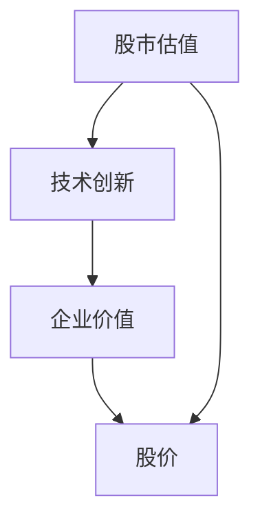
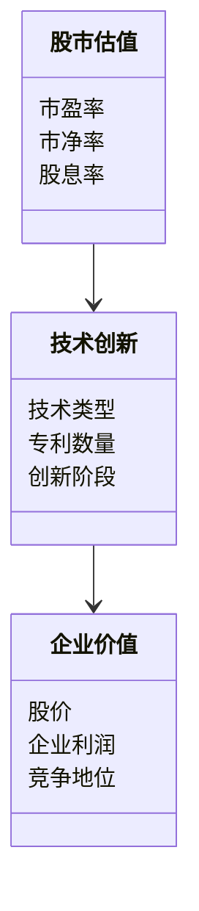
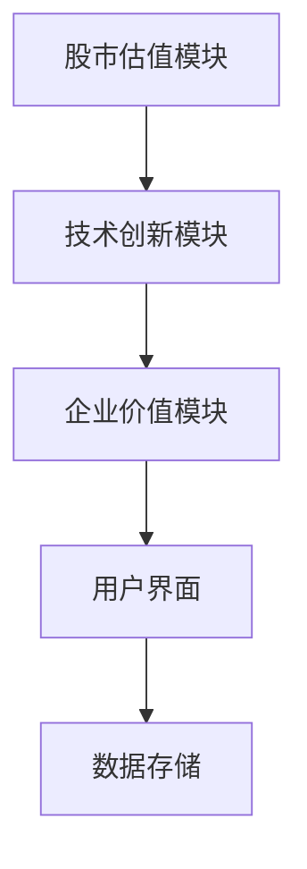

                 


# 全球股市估值与可持续水处理技术创新的关联

> 关键词：全球股市估值，可持续水处理技术创新，关联性，数学模型，系统架构，机器学习

> 摘要：本文探讨了全球股市估值与可持续水处理技术创新之间的关联性，通过分析股市估值的核心指标、可持续水处理技术的创新方向，构建了两者之间的数学模型和关联算法。文章详细介绍了相关数学模型和系统架构，并通过实际案例分析展示了技术创新如何影响股市估值，为投资者和技术创新者提供了重要的参考。

---

## 第一部分：全球股市估值与可持续水处理技术创新的背景与关联

### 第1章：全球股市估值的现状与挑战

#### 1.1 全球股市估值的定义与特点
- **1.1.1 股市估值的基本概念**
  - 股票价值的定义：股票的价值基于公司的盈利能力和市场预期。
  - 核心指标：市盈率（P/E）、市净率（P/B）、股息率等。
  - 示例：某公司的市盈率为20，意味着市场对其未来每股收益的预期为当前股价除以20。

- **1.1.2 股市估值的核心指标**
  - 市盈率（P/E）：衡量股价相对于 earnings 的高低。
  - 市净率（P/B）：衡量股价相对于 book value 的高低。
  - 股息率：衡量股票的分红回报率。

- **1.1.3 全球股市估值的现状分析**
  - 全球股市估值波动性分析：受经济周期、政策变化和市场情绪的影响。
  - 当前主要市场的估值水平：如美国市场的市盈率中位数约为17，新兴市场的市盈率普遍较高。

#### 1.2 可持续水处理技术的定义与特点
- **1.2.1 水处理技术的基本概念**
  - 水处理技术：通过物理、化学或生物方法去除水中的杂质，提高水质。
  - 可持续性：强调资源高效利用和环境友好。

- **1.2.2 可持续水处理技术的核心特征**
  - 技术创新：如膜分离技术、氧化还原反应等。
  - 能耗低：采用节能技术，减少运营成本。
  - 环保：减少二次污染，符合环保要求。

- **1.2.3 水处理技术在环保中的作用**
  - 解决水资源短缺问题。
  - 保护生态系统，减少水污染。
  - 提供可持续的水资源管理解决方案。

#### 1.3 股市估值与水处理技术创新的关联性
- **1.3.1 股市估值与技术创新的互动关系**
  - 技术创新推动股价上涨：新技术的应用提升公司竞争力。
  - 股市估值为技术创新提供资金支持。

- **1.3.2 可持续水处理技术对股市估值的影响**
  - 技术创新带来业绩增长，推动股价上升。
  - 技术的可持续性提升公司的长期价值。

- **1.3.3 全球化背景下的跨领域关联**
  - 全球市场的互联互通，技术革新影响全球股市。
  - 可持续技术成为投资者关注的焦点。

### 第2章：全球股市估值与可持续水处理技术创新的核心概念

#### 2.1 股市估值的核心概念与原理
- **2.1.1 股票价值的评估方法**
  - 基本分析：分析公司的财务状况、行业地位等。
  - 技术分析：通过股价走势预测未来价格。

- **2.1.2 股市估值的关键影响因素**
  - 宏观经济因素：GDP增长率、利率水平。
  - 行业因素：行业发展趋势、竞争格局。
  - 公司特有因素：盈利能力、管理团队。

- **2.1.3 股市估值的数学模型与公式**
  - 市盈率模型：P/E = 市场价格 / 每股收益。
  - 现金流折现模型：DCF模型，预测未来现金流的现值。

#### 2.2 可持续水处理技术创新的核心概念与原理
- **2.2.1 水处理技术的分类与特点**
  - 物理处理：过滤、沉淀。
  - 化学处理：混凝、氧化。
  - 生物处理：利用微生物分解有机物。

- **2.2.2 可持续水处理技术的创新方向**
  - 新材料应用：如纳米材料用于过滤。
  - 节能技术：降低能耗的处理工艺。
  - 智能化：结合物联网和AI，实现智能监控和优化。

- **2.2.3 水处理技术创新的驱动因素**
  - 环保政策：政府出台的环保法规推动技术创新。
  - 市场需求：水资源短缺促使企业研发新技术。
  - 科技进步：新材料和新工艺的应用。

#### 2.3 股市估值与技术创新的关联模型
- **2.3.1 股市估值与技术创新的实体关系图**



- **2.3.2 股市估值与技术创新的对比分析表**

| 指标 | 股市估值 | 技术创新 |
|------|----------|----------|
| 核心 | 股价、市盈率 | 技术类型、专利数量 |
| 影响因素 | 宏观经济、行业趋势 | 技术研发、政策支持 |
| 目标 | 评估企业价值 | 提升企业竞争力 |

- **2.3.3 股市估值与技术创新的关联机制**
  - 技术创新通过提升企业利润和市场地位，影响股市估值。
  - 投资者对技术创新的预期影响股价。

---

## 第二部分：全球股市估值与可持续水处理技术创新的数学模型与算法

### 第3章：全球股市估值的数学模型与算法

#### 3.1 股市估值的数学模型
- **3.1.1 市盈率模型**
  - 公式：$$P/E = \frac{\text{市场价格}}{\text{每股收益}}$$
  - 示例：某公司股价为50元，每股收益为2.5元，则P/E为20。

- **3.1.2 现金流折现模型**
  - 公式：$$\text{企业价值} = \sum_{t=1}^{n} \frac{\text{现金流}_t}{(1 + r)^t}$$
  - 其中，r为折现率，n为预测期数。

- **3.1.3 时间序列分析模型**
  - 使用ARIMA模型预测未来股价走势。

#### 3.2 可持续水处理技术创新的评估模型
- **3.2.1 技术生命周期模型**
  - 描述技术从引入到成熟的过程。

- **3.2.2 技术创新的经济效益评估模型**
  - 公式：$$\text{经济效益} = \text{成本节约} + \text{环境效益}$$

- **3.2.3 技术创新的可持续性评估模型**
  - 包括资源消耗、环境影响等指标。

#### 3.3 股市估值与技术创新的关联算法
- **3.3.1 基于机器学习的关联分析**
  - 使用神经网络模型识别技术创新对股价的影响。

- **3.3.2 时间序列的关联规则挖掘**
  - 分析技术创新与股价波动的相关性。

- **3.3.3 协同演化模型**
  - 描述技术创新与股市估值的互动关系。

---

## 第三部分：全球股市估值与可持续水处理技术创新的系统架构与项目实战

### 第4章：全球股市估值与可持续水处理技术创新的系统架构

#### 4.1 系统架构设计
- **4.1.1 问题场景描述**
  - 需求：分析可持续水处理技术创新对股市估值的影响。
  - 参与者：企业、投资者、监管机构。

- **4.1.2 系统功能设计**
  - 领域模型：绘制领域模型的mermaid类图。



- **4.1.3 系统架构设计**
  - 绘制系统架构的mermaid架构图。



- **4.1.4 系统接口设计**
  - 描述各模块之间的接口和数据流。

- **4.1.5 系统交互流程**
  - 绘制系统交互的mermaid序列图。

### 第5章：项目实战与案例分析

#### 5.1 环境安装与配置
- **5.1.1 环境需求**
  - 安装Python、机器学习库（如scikit-learn、TensorFlow）。

#### 5.2 核心代码实现
- **5.2.1 股市估值预测代码**
  ```python
  import pandas as pd
  from sklearn.linear_model import LinearRegression

  # 加载数据
  data = pd.read_csv('stock_data.csv')
  X = data[['PE', 'PB']]
  y = data['Price']

  # 建立模型
  model = LinearRegression()
  model.fit(X, y)

  # 预测
  predicted_price = model.predict(X)
  ```

- **5.2.2 技术创新评估代码**
  ```python
  import numpy as np

  # 技术创新得分计算
  def calculate_technology_score(patents, citations):
      return (patents + citations) / 2

  # 应用示例
  patents = 100
  citations = 80
  score = calculate_technology_score(patents, citations)
  ```

#### 5.3 案例分析与解读
- **5.3.1 案例背景**
  - 某水处理公司引入新型膜技术。

- **5.3.2 数据分析**
  - 技术创新对股价的影响分析。

- **5.3.3 案例小结**
  - 技术创新显著提升了公司的股价和市场竞争力。

### 第6章：最佳实践与总结

#### 6.1 小结
- 总结文章的主要发现和结论。

#### 6.2 注意事项
- 提醒读者在实际应用中需要注意的问题。

#### 6.3 拓展阅读
- 推荐相关领域的进一步阅读材料。

---

通过以上结构，本文详细探讨了全球股市估值与可持续水处理技术创新的关联性，结合理论分析、数学模型和实际案例，为读者提供了全面的视角。

