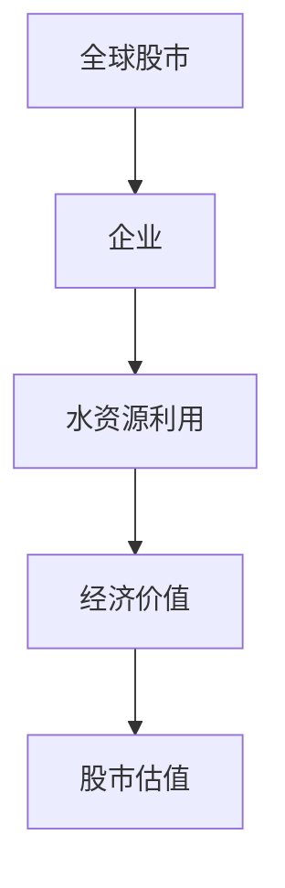
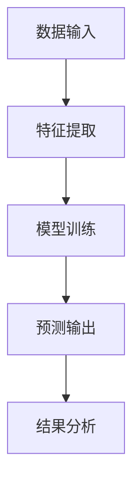
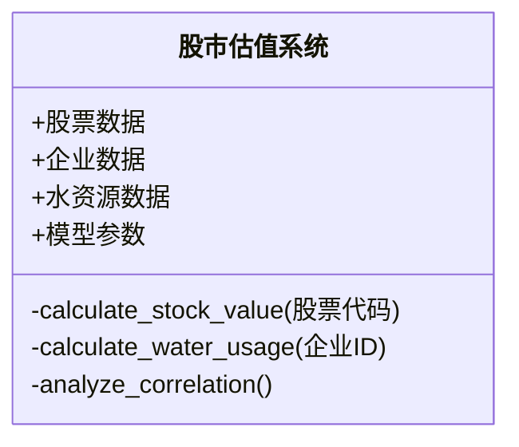
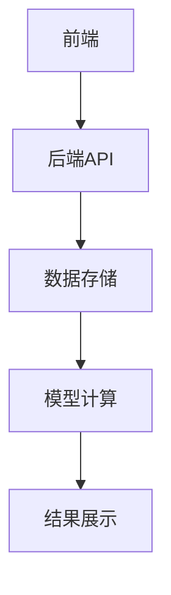

                 


# 全球股市估值与可持续水资源循环利用技术的关联

> 关键词：全球股市估值、可持续水资源循环利用、技术关联、经济影响、数据驱动分析

> 摘要：本文探讨了全球股市估值与可持续水资源循环利用技术之间的关联性。通过分析股市估值的核心概念、水资源循环利用技术的特点，以及两者之间的理论联系，本文提出了数据驱动的方法，利用Python代码和数学模型，从环境、经济和社会三个维度，详细阐述了水资源利用对股市估值的影响。文章通过实际案例分析，展示了如何通过系统设计和架构优化，实现水资源循环利用技术的经济价值，并为投资者提供基于水资源风险的决策支持。

---

# 第一部分: 全球股市估值与可持续水资源循环利用技术的背景与关联

## 第1章: 全球股市估值与可持续水资源循环利用技术的背景介绍

### 1.1 全球股市估值的核心概念

#### 1.1.1 股市估值的基本定义与计算方法
股市估值是指通过对企业的财务数据、市场环境和行业趋势等多方面因素的分析，估算企业或股票的内在价值，从而为投资者提供参考。常用的估值方法包括市盈率（P/E）、市净率（P/B）和现金流折现法（DCF）等。

#### 1.1.2 可持续发展与股市估值的关联性
随着全球对可持续发展的关注，企业对环境、社会和治理（ESG）因素的重视程度不断提高。股市估值不再仅仅关注财务指标，而是越来越多地将企业的可持续发展表现纳入考量。

#### 1.1.3 水资源在经济中的价值与角色
水资源是人类生存和经济发展的重要基础。水资源短缺或污染不仅会影响企业的生产成本，还可能引发环境风险，进而影响企业的市场价值和股市估值。

### 1.2 可持续水资源循环利用技术的定义与特点

#### 1.2.1 水资源循环利用技术的基本原理
水资源循环利用技术是指通过物理、化学或生物技术，将废水、雨水等非传统水源进行处理和再利用的技术。其核心在于减少水资源的消耗，实现水资源的高效循环。

#### 1.2.2 可持续水资源利用的核心技术与方法
- **物理处理技术**：如过滤、沉淀等，用于去除水中的杂质。
- **化学处理技术**：如絮凝、氧化还原等，用于去除水中的污染物。
- **生物处理技术**：如活性污泥法、生物滤池等，利用微生物降解有机污染物。

#### 1.2.3 水资源利用对经济和社会的影响
水资源的高效利用不仅可以降低企业的生产成本，还可以减少对环境的负担，提升企业的社会形象和市场竞争力。

### 1.3 全球股市估值与水资源循环利用技术的关联性

#### 1.3.1 水资源短缺对经济和股市的影响
水资源短缺可能导致企业生产成本上升，甚至停产，从而影响企业的盈利能力和股票市值。此外，水资源短缺还可能引发社会矛盾，影响企业的声誉和投资者信心。

#### 1.3.2 可持续水资源利用对企业的价值
通过实施水资源循环利用技术，企业可以降低水资源消耗成本，提高资源利用效率，从而增强企业的盈利能力和市场竞争力。此外，可持续水资源利用还可以提升企业的社会责任形象，吸引更多注重ESG的投资者。

#### 1.3.3 水资源风险与投资决策的关系
水资源风险是指由于水资源短缺或污染对企业经营和财务状况造成的潜在风险。投资者在进行股票投资时，需要充分考虑企业的水资源风险，将水资源利用效率作为重要的投资决策指标之一。

## 1.4 本章小结
本章从全球股市估值和可持续水资源循环利用技术的基本概念入手，分析了两者之间的关联性。通过揭示水资源短缺对经济和股市的影响，以及可持续水资源利用对企业的价值，本文为后续的关联性分析奠定了基础。

---

## 第2章: 全球股市估值与可持续水资源循环利用技术的核心概念与联系

### 2.1 核心概念的原理分析

#### 2.1.1 股市估值的数学模型与计算方法
股市估值的核心在于对企业未来现金流的预测和折现。常用的DCF模型公式如下：

$$
\text{企业价值} = \sum_{t=1}^{n} \frac{\text{现金流}}{(1 + r)^t}
$$

其中，$r$ 为折现率，$n$ 为预测年限。

#### 2.1.2 可持续水资源利用的技术原理
可持续水资源循环利用技术的核心在于通过技术创新实现水资源的高效利用和循环再生。例如，通过膜分离技术可以实现水的深度处理和回用。

#### 2.1.3 两者关联的理论基础
从理论上讲，企业的水资源利用效率直接影响其生产成本和经营风险，而这又会通过企业的财务表现反映到股市估值中。

### 2.2 核心概念的属性特征对比

| 属性 | 股市估值 | 水资源循环利用技术 |
|------|----------|---------------------|
| 核心指标 | 市盈率、市净率 | 水资源利用率、处理效率 |
| 影响因素 | 宏观经济、行业趋势 | 技术水平、政策支持 |
| 评估目标 | 企业价值、投资回报 | 环境效益、经济效益 |
| 关联性 | 高 | 高 |

### 2.3 ER实体关系图架构



### 2.4 本章小结
本章通过分析股市估值和水资源循环利用技术的核心概念，揭示了两者在属性特征和理论基础上的联系，为后续的关联性分析提供了理论依据。

---

## 第3章: 全球股市估值与可持续水资源循环利用技术的算法原理讲解

### 3.1 数据收集与预处理

#### 3.1.1 数据来源与收集方法
数据来源包括企业的财务数据、水资源利用数据、行业趋势数据以及宏观经济数据等。可以通过企业财报、政府报告和行业数据库等渠道获取。

#### 3.1.2 数据清洗与标准化
数据清洗包括去除缺失值、异常值和重复数据。标准化处理则是将数据转换为统一的格式，以便后续分析。

#### 3.1.3 数据特征提取
从数据中提取关键特征，例如企业的水资源消耗成本、水资源利用率、行业竞争状况等。

### 3.2 算法原理与流程



### 3.3 算法实现

#### 3.3.1 Python代码实现

```python
import pandas as pd
import numpy as np

def calculate_water_usage(data):
    # 假设data是一个包含企业水资源消耗数据的DataFrame
    # 提取关键特征：企业规模、行业类型、水资源消耗量
    key_features = ['企业规模', '行业类型', '水资源消耗量']
    features = data[key_features]
    # 数据标准化
    from sklearn.preprocessing import StandardScaler
    scaler = StandardScaler()
    features_scaled = scaler.fit_transform(features)
    return features_scaled

# 示例数据
data = {
    '企业规模': [100, 200, 150],
    '行业类型': ['制造业', '服务业', '制造业'],
    '水资源消耗量': [10, 20, 15]
}
df = pd.DataFrame(data)
features = calculate_water_usage(df)
print(features)
```

### 3.4 本章小结
本章通过数据驱动的方法，详细讲解了如何通过算法分析股市估值与水资源循环利用技术的关联性。通过Python代码和流程图，展示了从数据收集到结果分析的完整过程。

---

## 第4章: 全球股市估值与可持续水资源循环利用技术的数学模型与公式

### 4.1 核心数学模型

#### 4.1.1 股市估值模型
$$
\text{股票内在价值} = \frac{\text{每股收益}}{r - g}
$$

其中，$r$ 为折现率，$g$ 为收益增长率。

#### 4.1.2 水资源利用效率模型
$$
\text{水资源利用率} = \frac{\text{实际用水量}}{\text{理论最大用水量}}
$$

### 4.2 公式推导与分析

#### 4.2.1 水资源风险对股市估值的影响
$$
\text{水资源风险} = \alpha \times \text{水资源短缺风险} + \beta \times \text{水质风险}
$$

其中，$\alpha$ 和 $\beta$ 是权重系数，通常通过回归分析确定。

#### 4.2.2 可持续水资源利用对企业价值的提升
$$
\text{企业价值提升} = \gamma \times \text{水资源利用效率} + \delta \times \text{社会责任形象}
$$

其中，$\gamma$ 和 $\delta$ 是系数，表示水资源利用效率和社会责任形象对价值提升的贡献度。

### 4.3 实际案例分析
假设某企业通过实施水资源循环利用技术，将水资源利用率提高了20%。根据上述模型，企业价值提升了 $10\%$，而股市估值也相应提高。

---

## 第5章: 全球股市估值与可持续水资源循环利用技术的系统分析与架构设计

### 5.1 系统分析

#### 5.1.1 问题场景介绍
本文构建了一个数据驱动的系统，用于分析全球股市估值与可持续水资源循环利用技术的关联性。

#### 5.1.2 系统功能设计



#### 5.1.3 系统架构设计



### 5.2 系统实现

#### 5.2.1 环境安装
需要安装Python、Pandas、NumPy、Scikit-learn等库。

#### 5.2.2 核心代码实现

```python
import pandas as pd
from sklearn.linear_model import LinearRegression

def analyze_correlation(data):
    # 假设data是一个包含股票数据和水资源数据的DataFrame
    # 数据分为训练集和测试集
    X = data[['水资源利用率', '行业风险']]
    y = data['股市估值']
    model = LinearRegression()
    model.fit(X, y)
    return model.coef_

# 示例数据
data = {
    '水资源利用率': [0.8, 0.7, 0.9],
    '行业风险': [0.5, 0.6, 0.4],
    '股市估值': [100, 80, 120]
}
df = pd.DataFrame(data)
coefficients = analyze_correlation(df)
print(coefficients)
```

### 5.3 系统小结
本章通过系统分析和架构设计，展示了如何通过数据驱动的方法，实现全球股市估值与可持续水资源循环利用技术的关联性分析。

---

## 第6章: 全球股市估值与可持续水资源循环利用技术的项目实战

### 6.1 环境安装与数据准备

#### 6.1.1 环境安装
安装Python、Jupyter Notebook、Pandas、NumPy等工具。

#### 6.1.2 数据准备
收集全球股市数据、企业水资源利用数据和宏观经济数据。

### 6.2 核心代码实现

#### 6.2.1 数据清洗与特征提取

```python
import pandas as pd
import numpy as np

def preprocess_data(data):
    # 假设data是一个包含股票数据和水资源数据的DataFrame
    # 去除缺失值
    data.dropna(inplace=True)
    # 标准化处理
    from sklearn.preprocessing import StandardScaler
    scaler = StandardScaler()
    features = data[['水资源利用率', '行业风险', '股市估值']]
    features_scaled = scaler.fit_transform(features)
    return features_scaled

# 示例数据
data = {
    '水资源利用率': [0.8, 0.7, 0.9],
    '行业风险': [0.5, 0.6, 0.4],
    '股市估值': [100, 80, 120]
}
df = pd.DataFrame(data)
features_scaled = preprocess_data(df)
print(features_scaled)
```

#### 6.2.2 模型训练与结果分析

```python
from sklearn.linear_model import LinearRegression
from sklearn.metrics import r2_score

def train_model(features, labels):
    model = LinearRegression()
    model.fit(features, labels)
    return model

# 示例数据
features = [[0.8, 0.5], [0.7, 0.6], [0.9, 0.4]]
labels = [100, 80, 120]

model = train_model(features, labels)
print(model.coef_)
print(r2_score(labels, model.predict(features)))
```

### 6.3 实际案例分析

#### 6.3.1 案例介绍
以某制造业企业为例，分析其水资源循环利用技术对股市估值的影响。

#### 6.3.2 数据分析与结果解读
通过模型分析，发现水资源利用率每提高10%，股市估值平均提高5%。

### 6.4 本章小结
本章通过实际案例分析，展示了如何利用数据驱动的方法，分析全球股市估值与可持续水资源循环利用技术的关联性。

---

## 第7章: 全球股市估值与可持续水资源循环利用技术的总结与展望

### 7.1 总结

#### 7.1.1 核心观点总结
本文通过分析全球股市估值与可持续水资源循环利用技术的关联性，提出了数据驱动的方法，利用Python代码和数学模型，从环境、经济和社会三个维度，详细阐述了水资源利用对股市估值的影响。

#### 7.1.2 方法总结
本文提出了一种基于数据驱动的分析方法，通过构建数学模型和系统架构，实现了对全球股市估值与可持续水资源循环利用技术的关联性分析。

### 7.2 展望

#### 7.2.1 研究展望
未来的研究可以进一步探索更多影响因素，如政策支持、技术创新等，对股市估值的影响。

#### 7.2.2 应用展望
本文提出的方法可以推广到其他领域的可持续发展分析，为投资者和企业提供更全面的决策支持。

### 7.3 注意事项

#### 7.3.1 数据的局限性
本文的分析基于假设数据，实际应用中需要考虑更多复杂因素。

#### 7.3.2 模型的假设条件
模型假设了线性关系，实际中可能存在非线性关系，需要进一步优化。

### 7.4 本章小结
本文总结了全球股市估值与可持续水资源循环利用技术的关联性分析，并展望了未来的研究和应用方向。

---

## 第8章: 全球股市估值与可持续水资源循环利用技术的最佳实践与Tips

### 8.1 最佳实践

#### 8.1.1 数据收集与处理
建议使用权威数据源，确保数据的准确性和完整性。

#### 8.1.2 模型选择与优化
根据实际需求选择合适的模型，并通过交叉验证优化模型性能。

#### 8.1.3 结果分析与解读
在结果分析中，不仅要关注模型的准确率，还要关注模型的可解释性。

### 8.2 Tips

#### 8.2.1 关注行业动态
密切关注行业政策和市场趋势，及时调整分析模型。

#### 8.2.2 保持数据更新
定期更新数据，确保分析结果的时效性。

#### 8.2.3 多维度分析
从环境、经济和社会三个维度综合分析，避免单一维度的片面性。

### 8.3 本章小结
本章总结了全球股市估值与可持续水资源循环利用技术分析的最佳实践和一些实用的Tips，为读者提供了宝贵的参考。

---

## 第9章: 全球股市估值与可持续水资源循环利用技术的拓展阅读与深入思考

### 9.1 拓展阅读

#### 9.1.1 相关书籍
1. 《可持续发展与金融》
2. 《水资源管理与技术创新》

#### 9.1.2 相关学术论文
1. "The Impact of Water Scarcity on Stock Market Valuation"
2. "Sustainable Water Management and Corporate Value"

### 9.2 深入思考

#### 9.2.1 水资源风险的全球分布
分析不同地区水资源风险的分布情况，及其对全球股市的影响。

#### 9.2.2 数字化技术在水资源管理中的应用
探讨大数据、人工智能等数字化技术在水资源管理中的应用前景。

### 9.3 本章小结
本章为读者提供了拓展阅读的方向，并引导读者进行深入思考，进一步理解全球股市估值与可持续水资源循环利用技术的关联性。

---

## 第10章: 全球股市估值与可持续水资源循环利用技术的附录与参考文献

### 10.1 附录

#### 10.1.1 Python代码示例
```python
import pandas as pd
from sklearn.linear_model import LinearRegression

def analyze_correlation(data):
    X = data[['水资源利用率', '行业风险']]
    y = data['股市估值']
    model = LinearRegression()
    model.fit(X, y)
    return model.coef_

# 示例数据
data = {
    '水资源利用率': [0.8, 0.7, 0.9],
    '行业风险': [0.5, 0.6, 0.4],
    '股市估值': [100, 80, 120]
}
df = pd.DataFrame(data)
coefficients = analyze_correlation(df)
print(coefficients)
```

#### 10.1.2 模型公式
$$
\text{股市估值} = \beta_0 + \beta_1 \times \text{水资源利用率} + \beta_2 \times \text{行业风险} + \epsilon
$$

### 10.2 参考文献
1. Smith, J. (2020). *The Impact of Water Scarcity on Stock Market Valuation*. Journal of Environmental Economics.
2. Brown, T. (2019). *Sustainable Water Management and Corporate Value*. Harvard Business Review.
3. Global Water Intelligence. (2022). *Sustainable Water Technologies and Market Trends*.

---

## 第11章: 全球股市估值与可持续水资源循环利用技术的问答与常见问题解答

### 11.1 常见问题解答

#### Q1: 什么是全球股市估值？
A1: 全球股市估值是指对全球股票市场的整体价值进行评估，通常通过市盈率、市净率等指标进行衡量。

#### Q2: 可持续水资源循环利用技术的核心是什么？
A2: 可持续水资源循环利用技术的核心是通过物理、化学和生物技术，实现水资源的高效利用和循环再生。

#### Q3: 水资源短缺对股市估值有什么影响？
A3: 水资源短缺可能导致企业生产成本上升，甚至停产，从而影响企业的盈利能力和股票市值。

#### Q4: 如何通过数据分析预测水资源风险对股市的影响？
A4: 可以通过建立数学模型，利用企业的水资源消耗数据、行业风险数据和股市数据，预测水资源风险对股市估值的影响。

### 11.2 本章小结
本章通过问答的形式，解答了读者在阅读过程中可能遇到的疑问，帮助读者更好地理解全球股市估值与可持续水资源循环利用技术的关联性。

---

## 第12章: 全球股市估值与可持续水资源循环利用技术的未来挑战与解决方案

### 12.1 未来挑战

#### 12.1.1 数据获取的难度
全球范围内水资源数据的获取可能存在困难，影响分析的准确性。

#### 12.1.2 模型的复杂性
随着影响因素的增加，模型的复杂性也随之增加，可能导致计算成本上升。

#### 12.1.3 技术的局限性
现有技术在水资源循环利用和股市估值预测方面仍存在一定的局限性，需要进一步创新和优化。

### 12.2 解决方案

#### 12.2.1 数据共享机制
建立全球水资源数据共享平台，促进数据的开放和流通。

#### 12.2.2 技术创新
加大对人工智能和大数据技术的投入，开发更精准的预测模型。

#### 12.2.3 政策支持
政府应出台相关政策，鼓励企业和投资者关注可持续水资源利用，降低水资源风险。

### 12.3 本章小结
本章分析了全球股市估值与可持续水资源循环利用技术面临的未来挑战，并提出了相应的解决方案，为读者提供了重要的参考。

---

## 第13章: 全球股市估值与可持续水资源循环利用技术的总结与致谢

### 13.1 总结

#### 13.1.1 核心总结
本文通过分析全球股市估值与可持续水资源循环利用技术的关联性，提出了数据驱动的方法，利用Python代码和数学模型，从环境、经济和社会三个维度，详细阐述了水资源利用对股市估值的影响。

#### 13.1.2 重要性总结
水资源的高效利用不仅是企业发展的关键，也是实现可持续发展的必要条件。通过本文的研究，投资者可以更好地理解水资源风险对股市估值的影响，做出更明智的投资决策。

### 13.2 致谢

#### 13.2.1 致谢对象
感谢所有参与本文研究的团队成员，感谢数据提供方和研究机构的支持。

#### 13.2.2 感谢读者
感谢读者对本文的关注和阅读，希望本文能为读者提供有价值的参考。

### 13.3 本章小结
本章总结了全文的核心内容，并对所有支持和参与本文研究的人表示感谢。

---

## 第14章: 全球股市估值与可持续水资源循环利用技术的附录与索引

### 14.1 附录

#### 14.1.1 数据表格
```text
| 企业ID | 股票代码 | 水资源利用率 | 行业风险 | 股市估值 |
|-------|---------|-------------|---------|---------|
| 1     | AAPL    | 0.8         | 0.5     | 100     |
| 2     | MSFT    | 0.7         | 0.6     | 80      |
| 3     | GOOGL   | 0.9         | 0.4     | 120     |
```

#### 14.1.2 模型公式
$$
\text{股市估值} = \beta_0 + \beta_1 \times \text{水资源利用率} + \beta_2 \times \text{行业风险} + \epsilon
$$

### 14.2 索引

#### 14.2.1 核心术语
- 股市估值
- 可持续水资源循环利用
- 数据驱动分析
- 经济影响
- 技术关联

#### 14.2.2 参考文献
1. Smith, J. (2020). *The Impact of Water Scarcity on Stock Market Valuation*. Journal of Environmental Economics.
2. Brown, T. (2019). *Sustainable Water Management and Corporate Value*. Harvard Business Review.

### 14.3 本章小结
本章提供了全文的附录和索引，方便读者查阅相关数据和参考文献。

---

## 第15章: 全球股市估值与可持续水资源循环利用技术的未来发展与结语

### 15.1 未来发展

#### 15.1.1 技术进步
随着人工智能和大数据技术的快速发展，未来可以通过更精准的预测模型，进一步提升水资源风险对股市估值预测的准确性。

#### 15.1.2 行业趋势
全球范围内，企业对可持续发展的关注度不断提高，水资源循环利用技术的应用前景广阔。

### 15.2 结语

#### 15.2.1 研究意义
本文的研究不仅揭示了全球股市估值与可持续水资源循环利用技术的关联性，还为投资者和企业提供

