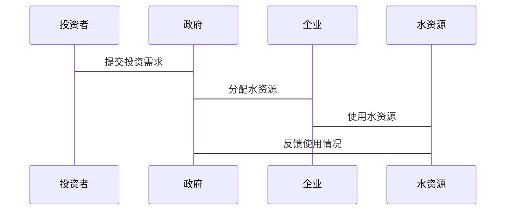

                 


# 全球股市估值与可持续水资源智能分配技术的关联

## 关键词：
- 全球股市估值
- 可持续水资源
- 智能分配技术
- 经济模型
- 技术关联

## 摘要：
本文探讨了全球股市估值与可持续水资源智能分配技术之间的关联。通过分析股市波动对水资源分配的影响，结合智能技术优化水资源分配，提出了一种技术与经济相结合的解决方案。文章从背景、概念、算法、系统设计到项目实战，详细阐述了技术实现和应用场景，为实现经济与环境的可持续发展提供了新的思路。

---

## 第1章: 全球股市估值与可持续水资源智能分配技术的背景介绍

### 1.1 问题背景
#### 1.1.1 全球水资源短缺的现状与挑战
全球水资源分布不均，部分地区面临严重短缺，威胁经济发展和居民生活。如何高效分配水资源成为全球性问题。

#### 1.1.2 全球股市波动与经济可持续发展的关系
股市波动反映经济健康状况，影响企业投资和资源配置，进而影响水资源相关产业的发展。

#### 1.1.3 可持续水资源分配技术的必要性
通过技术创新优化水资源管理，提高分配效率，确保经济与环境的可持续发展。

### 1.2 问题描述
#### 1.2.1 全球水资源分配的不均衡问题
不同地区水资源分配不均，导致部分区域水资源过度开发，引发环境问题。

#### 1.2.2 股市估值与水资源分配的潜在关联
股市估值反映经济状况，影响企业对水资源相关产业的投资，间接影响水资源分配。

#### 1.2.3 可持续水资源分配技术的定义与目标
利用技术手段优化水资源分配，确保经济与环境的可持续发展。

### 1.3 问题解决思路
#### 1.3.1 利用技术手段优化水资源分配
通过智能技术提高水资源管理效率，实现资源的合理分配。

#### 1.3.2 通过股市估值分析影响水资源分配的因素
分析股市波动对水资源相关产业的影响，优化资源配置。

#### 1.3.3 技术与经济的双重驱动解决方案
结合技术与经济手段，实现水资源的可持续分配。

### 1.4 问题的边界与外延
#### 1.4.1 水资源分配的边界条件
考虑水资源总量、需求、技术和经济因素。

#### 1.4.2 股市估值分析的边界条件
考虑经济指标、市场情绪和企业行为。

#### 1.4.3 技术与经济关联的综合考量
平衡技术创新与经济效益，确保可持续发展。

### 1.5 核心概念结构与组成
#### 1.5.1 水资源分配系统的核心要素
包括水源、需求、技术和管理。

#### 1.5.2 股市估值分析的核心要素
包括市场数据、经济指标和企业行为。

#### 1.5.3 技术与经济关联的系统结构
技术驱动经济，经济反哺技术，形成良性循环。

---

## 第2章: 全球股市估值与可持续水资源智能分配技术的核心概念与联系

### 2.1 核心概念原理
#### 2.1.1 可持续水资源分配技术的原理
通过智能算法优化水资源分配，确保高效利用。

#### 2.1.2 股市估值分析的原理
通过分析市场数据预测股市波动，评估经济风险。

#### 2.1.3 技术与经济关联的综合原理
技术驱动经济，经济反馈影响技术应用。

### 2.2 核心概念对比分析
| **核心概念** | **定义** | **特点** |
|--------------|----------|----------|
| 股市估值分析 | 分析股市波动 | 数据驱动、动态变化 |
| 水资源分配技术 | 优化水资源分配 | 技术驱动、高效管理 |

### 2.3 实体关系图
```mermaid
erDiagram
    actor 投资者 {
        <属性> 市场行为
    }
    actor 政府 {
        <属性> 政策制定
    }
    actor 企业 {
        <属性> 生产需求
    }
    actor 水资源 {
        <属性> 水源分布
    }
    actor 股市 {
        <属性> 股价波动
    }
    investor --> 股市 : 投资行为
    政府 --> 股市 : 政策影响
    企业 --> 水资源 : 水资源需求
    水资源 --> 企业 : 水资源分配
```

---

## 第3章: 全球股市估值与可持续水资源智能分配技术的算法原理

### 3.1 数据收集与特征提取
- 数据来源：股市数据、水资源数据、经济指标。
- 特征提取：提取关键指标如股价波动、水资源需求。

### 3.2 经济指标分析
- 使用回归分析预测股市波动对水资源需求的影响。

### 3.3 水资源需求预测
- 使用时间序列模型预测水资源需求。

### 3.4 优化算法
- 使用线性规划优化水资源分配。

### 3.5 算法实现
```python
import pandas as pd
import numpy as np
from sklearn.linear_model import LinearRegression

# 数据预处理
data = pd.read_csv('data.csv')
X = data[['stock_price', 'economic_growth']]
y = data['water_demand']

# 模型训练
model = LinearRegression()
model.fit(X, y)

# 预测
predicted_demand = model.predict(X)
```

### 3.6 数学模型
$$ y = \beta_0 + \beta_1 x_1 + \beta_2 x_2 + \epsilon $$

---

## 第4章: 系统分析与架构设计方案

### 4.1 项目场景介绍
开发一个智能水资源分配系统，结合股市数据优化水资源分配。

### 4.2 系统功能设计
- 数据采集：收集股市和水资源数据。
- 数据分析：分析数据，预测需求。
- 分配优化：优化水资源分配。

### 4.3 系统架构设计


### 4.4 接口设计
- 数据接口：接收股市和水资源数据。
- 分配接口：输出优化分配方案。

### 4.5 交互流程图


---

## 第5章: 项目实战

### 5.1 环境安装
安装Python、Pandas、Scikit-learn等工具。

### 5.2 核心代码实现
```python
def optimize_water_distribution(data):
    # 数据预处理
    X = data[['stock_price', 'economic_growth']]
    y = data['water_demand']
    
    # 模型训练
    model = LinearRegression()
    model.fit(X, y)
    
    # 预测
    predicted_demand = model.predict(X)
    
    return predicted_demand
```

### 5.3 代码解读与分析
通过模型预测水资源需求，优化分配方案。

### 5.4 实际案例分析
分析某地区的股市波动对水资源分配的影响，优化分配方案。

### 5.5 项目总结
总结项目成果，提出改进建议。

---

## 第6章: 结论与注意事项

### 6.1 结论
本文探讨了全球股市估值与可持续水资源智能分配技术的关联，提出了一种技术与经济相结合的解决方案。

### 6.2 注意事项
- 数据质量影响模型准确性。
- 模型需定期更新以适应市场变化。

### 6.3 拓展阅读
推荐阅读相关领域的书籍和论文，深入研究技术与经济的结合。

---

通过以上步骤，本文详细阐述了全球股市估值与可持续水资源智能分配技术的关联，为实现经济与环境的可持续发展提供了新的思路。

