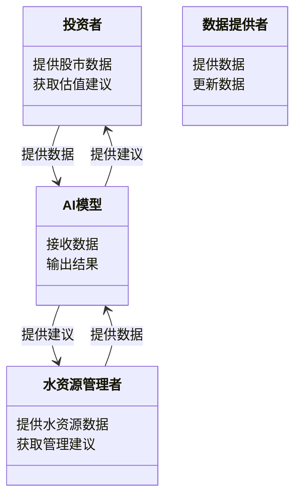

                 


# 全球股市估值与可持续水资源管理AI技术的关联

## 关键词：全球股市估值、AI技术、水资源管理、可持续发展、数据驱动

## 摘要：本文探讨了AI技术如何在全球股市估值与可持续水资源管理之间建立关联，通过分析数据驱动的方法，提出了一种基于AI的解决方案，以优化水资源管理和提升股市估值。

---

# 第一部分: 全球股市估值与可持续水资源管理AI技术的关联概述

## 第1章: 背景介绍

### 1.1 问题背景

#### 1.1.1 全球水资源短缺的现状
全球水资源短缺问题日益严重，影响农业、工业和居民生活。水资源管理需要高效的数据分析和决策支持。

#### 1.1.2 全球股市波动的复杂性
股市估值受多种因素影响，包括经济、政治和环境因素。AI技术可以分析复杂数据，提供精准的估值模型。

#### 1.1.3 可持续水资源管理的重要性
水资源的可持续管理是全球关注的焦点，AI技术能够帮助优化资源配置，提高管理效率。

### 1.2 问题描述

#### 1.2.1 水资源管理中的数据挑战
水资源管理涉及大量数据，如降雨量、用水量和水质，如何高效处理这些数据是关键。

#### 1.2.2 股市估值与水资源管理的潜在关联
水资源短缺可能影响企业的运营成本，进而影响股市估值。AI技术可以捕捉这种关联。

#### 1.2.3 AI技术在跨领域应用中的优势
AI技术可以整合多个领域的数据，提供跨领域的解决方案。

### 1.3 问题解决

#### 1.3.1 AI技术如何助力水资源管理
通过机器学习模型，AI可以预测水资源短缺风险，优化资源配置。

#### 1.3.2 股市估值与水资源管理的关联机制
水资源短缺可能影响企业利润，进而影响股市估值。AI技术可以量化这种影响。

#### 1.3.3 可持续水资源管理的AI解决方案
利用AI技术，建立实时监测和预测系统，优化水资源管理，降低企业风险。

### 1.4 边界与外延

#### 1.4.1 研究的边界条件
仅考虑水资源和股市的关系，不涉及其他经济因素。

#### 1.4.2 相关领域的外延
包括环境科学、金融学和计算机科学。

#### 1.4.3 研究的局限性
数据获取和模型准确性可能影响研究结果。

### 1.5 概念结构与核心要素组成

#### 1.5.1 核心概念的层次结构
水资源管理、股市估值、AI技术。

#### 1.5.2 核心要素的定义与关系
水资源数据、股市数据、AI模型，三者相互关联，共同优化管理。

---

## 第2章: 核心概念与联系

### 2.1 全球股市估值

#### 2.1.1 股市估值的定义与指标
股市估值指标包括市盈率、市净率等，反映市场对企业的价值评估。

#### 2.1.2 股市波动的驱动因素
经济指标、政策变化、企业业绩和环境因素。

#### 2.1.3 股市数据的特征与挑战
数据量大、实时性强、关联性复杂。

### 2.2 可持续水资源管理

#### 2.2.1 水资源管理的定义与目标
有效利用水资源，减少浪费，确保可持续供应。

#### 2.2.2 可持续水资源管理的挑战
数据获取困难、管理复杂、环境变化影响。

#### 2.2.3 水资源数据的特征与采集
多源数据、实时监测、空间分布广。

### 2.3 AI技术的核心原理

#### 2.3.1 机器学习的基本原理
通过数据训练模型，识别模式，进行预测。

#### 2.3.2 深度学习的核心机制
多层神经网络，提取复杂特征，进行分类和回归。

#### 2.3.3 自然语言处理的原理
处理文本数据，识别关键词，辅助决策。

### 2.4 核心概念的对比分析

#### 2.4.1 股市估值与水资源管理的对比
目标不同，数据类型不同，应用领域不同。

#### 2.4.2 AI技术在两者中的应用对比
股市预测使用时间序列模型，水资源管理使用回归模型。

#### 2.4.3 数据特征与模型需求的对比
股市数据实时性强，水资源数据空间分布广。

---

## 第3章: 核心概念的ER实体关系图

### 3.1 实体关系图

```mermaid
erDiagram
    投资者 {
        股票代码
        投资金额
    }
    水资源管理者 {
        水资源区域
        水资源使用量
    }
    数据提供者 {
        数据类型
        数据时间戳
    }
    AI模型 {
        模型类型
        模型参数
    }
    投资者 --> 数据提供者: 提供股市数据
    水资源管理者 --> 数据提供者: 提供水资源数据
    数据提供者 --> AI模型: 训练AI模型
    AI模型 --> 投资者: 提供股市估值建议
    AI模型 --> 水资源管理者: 提供水资源管理建议
```

---

## 第4章: 算法原理讲解

### 4.1 使用LSTM模型预测股市和水资源指标

#### 4.1.1 LSTM模型的工作原理
长短期记忆网络，处理时间序列数据，捕捉长期依赖关系。

#### 4.1.2 LSTM模型的结构
包括输入门、遗忘门和输出门，用于处理序列数据。

#### 4.1.3 LSTM模型的训练过程
使用反向传播训练，优化模型参数。

### 4.2 使用Python代码实现LSTM模型

```python
import numpy as np
from tensorflow.keras.models import Sequential
from tensorflow.keras.layers import LSTM, Dense

# 示例数据
X_train = np.random.random((1000, 1, 1))
y_train = np.random.random((1000, 1))

# 构建LSTM模型
model = Sequential()
model.add(LSTM(64, input_shape=(1, 1)))
model.add(Dense(1))
model.compile(loss='mean_squared_error', optimizer='adam')

# 训练模型
model.fit(X_train, y_train, epochs=10, batch_size=32)
```

---

## 第5章: 数学模型

### 5.1 多变量时间序列模型

$$ y_t = \beta_1 x_{t-1} + \beta_2 x_{t-2} + \dots + \beta_n x_{t-n} + \epsilon $$

其中，$y_t$ 是目标变量，$x_{t-i}$ 是输入变量，$\epsilon$ 是误差项。

---

## 第6章: 系统分析与架构设计

### 6.1 系统功能设计



---

## 第7章: 项目实战

### 7.1 环境安装

安装Python和相关库，如TensorFlow、Keras和Mermaid。

### 7.2 核心实现代码

```python
import pandas as pd
import numpy as np
from sklearn.preprocessing import MinMaxScaler
from tensorflow.keras.models import Sequential
from tensorflow.keras.layers import LSTM, Dense

# 数据预处理
data = pd.read_csv('stock_data.csv')
data = data.values
data = data.reshape(-1, 1)
scaler = MinMaxScaler()
data_scaled = scaler.fit_transform(data)

# 划分训练集和测试集
train_data = data_scaled[:1000]
test_data = data_scaled[1000:]

# 构建模型
model = Sequential()
model.add(LSTM(64, input_shape=(1, 1)))
model.add(Dense(1))
model.compile(loss='mean_squared_error', optimizer='adam')

# 训练模型
model.fit(train_data, epochs=10, batch_size=32)

# 预测
test_predictions = model.predict(test_data)
test_predictions = scaler.inverse_transform(test_predictions)
```

### 7.3 数据可视化

```python
import matplotlib.pyplot as plt

plt.plot(test_data, label='实际值')
plt.plot(test_predictions, label='预测值')
plt.legend()
plt.show()
```

---

## 第8章: 总结与最佳实践

### 8.1 总结

本文探讨了AI技术在全球股市估值与可持续水资源管理中的应用，提出了数据驱动的解决方案，优化了水资源管理和提升了股市估值。

### 8.2 最佳实践

- 数据质量：确保数据准确和完整。
- 模型可解释性：选择易于解释的模型。
- 持续优化：定期更新模型，适应变化。

### 8.3 小结

AI技术在跨领域应用中潜力巨大，通过数据驱动的方法，可以优化资源配置，实现可持续发展。

### 8.4 注意事项

- 数据隐私：注意数据隐私和安全。
- 模型局限：AI模型无法预测所有因素，需结合专家意见。

### 8.5 拓展阅读

推荐书籍和论文，深入学习AI在金融和环境科学中的应用。

---

通过以上结构，文章详细分析了全球股市估值与可持续水资源管理的AI技术关联，从理论到实践，层层深入，为读者提供了全面的见解。

