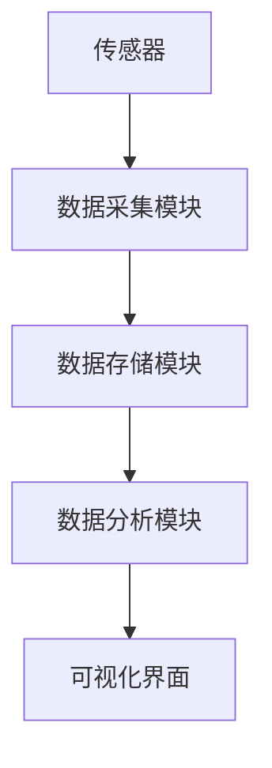
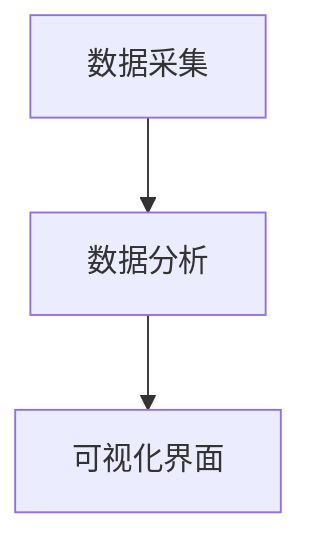
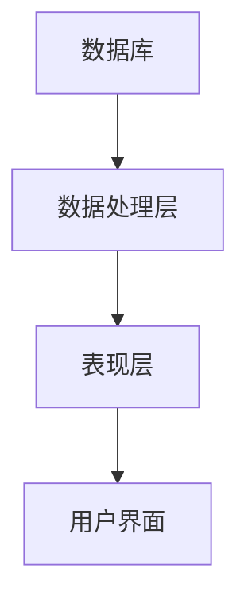

                 


# 全球股市估值与可持续海洋养殖智能监控技术的关系

## 关键词：
全球股市估值、可持续海洋养殖、智能监控技术、算法模型、系统架构

## 摘要：
本文探讨了全球股市估值与可持续海洋养殖智能监控技术之间的关系。首先，介绍了全球股市估值的传统方法及其局限性，然后分析了现代技术在股市估值中的应用。接着，详细讲解了可持续海洋养殖智能监控技术的核心要素，包括物联网、传感器和数据分析平台。随后，通过时间序列分析和机器学习模型，探讨了如何将这些技术应用于股市估值。最后，通过系统架构设计和项目实战，展示了如何构建一个智能化的监控系统，并总结了最佳实践和未来发展方向。

---

## 第1章：全球股市估值与可持续海洋养殖的背景

### 1.1 全球股市估值的现状
全球股市估值是投资者评估企业价值的重要手段。传统估值方法如市盈率和市净率虽然简单易懂，但在复杂多变的市场环境中显得力不从心。近年来，随着大数据和人工智能技术的发展，现代技术在股市估值中的应用越来越广泛。

### 1.2 可持续海洋养殖的挑战
海洋养殖作为重要的经济活动，面临着环境压力和资源管理的双重挑战。传统养殖方式效率低下，资源浪费严重，而智能化监控技术的应用可以有效提高资源利用效率，减少环境负担。

### 1.3 两者关系的初步探讨
股市估值与可持续海洋养殖看似无关，但通过智能监控技术，可以将海洋养殖的数据转化为有价值的金融信息，从而影响股市估值。这种技术的结合不仅提高了养殖效率，还为投资者提供了更准确的估值依据。

---

## 第2章：全球股市估值的核心概念

### 2.1 传统估值方法
传统估值方法主要包括市盈率（P/E）和市净率（P/B）。市盈率衡量的是股价与每股收益的比率，市净率则衡量股价与每股净资产的比率。这些方法简单易懂，但在复杂市场中难以捕捉动态变化。

#### 对比表格
| 方法 | 市盈率 | 市净率 |
|------|--------|--------|
| 定义 | 股价/每股收益 | 股价/每股净资产 |
| 优点 | 简单易懂 | 反映资产价值 |
| 缺点 | 忽略成长性 | 适用于重资产行业 |

### 2.2 现代技术在估值中的应用
现代技术如机器学习和大数据分析为股市估值提供了新的工具。通过分析海量数据，可以构建预测模型，提高估值的准确性。

#### 示例
使用机器学习模型预测股票价格：
- 数据清洗与特征提取
- 模型训练与优化
- 结果验证与评估

### 2.3 概念对比表格
| 概念 | 传统估值 | 现代技术 |
|------|----------|----------|
| 方法 | 市盈率、市净率 | AI算法、大数据分析 |
| 优势 | 简单易懂 | 高度精准 |
| 局限性 | 忽略动态因素 | 计算复杂 |

---

## 第3章：可持续海洋养殖智能监控技术

### 3.1 监控技术的核心要素
智能监控技术主要包括物联网（IoT）、传感器和数据采集与传输技术。这些技术可以实时监测海洋环境参数，如水温、盐度和溶解氧。

#### 实例
使用传感器监测水质参数：
- 传感器类型：温度、盐度、溶解氧传感器
- 数据采集：通过IoT平台实时采集数据
- 数据传输：通过无线网络传输到云端

### 3.2 技术架构
智能监控系统的架构通常包括数据采集模块、数据存储模块和数据分析模块。

#### 架构图


### 3.3 实体关系图
| 实体 | 属性 | 关系 |
|------|-------|------|
| 传感器 | 类型、位置 | 连接数据采集模块 |
| 数据采集模块 | 采集频率、数据格式 | 提供数据给存储模块 |
| 数据存储模块 | 数据类型、存储位置 | 提供数据给分析模块 |

---

## 第4章：相关算法与模型

### 4.1 时间序列分析
时间序列分析是预测股市走势的重要方法。常用的模型包括ARIMA和LSTM。

#### ARIMA模型
ARIMA（自回归积分滑动平均模型）用于预测时间序列数据。其基本公式为：
$$ARIMA(p, d, q)$$
其中，p为自回归阶数，d为差分阶数，q为移动平均阶数。

#### LSTM网络
LSTM（长短期记忆网络）是一种特殊的RNN，适用于长期依赖关系的预测。

#### 示例
使用LSTM预测股票价格：
1. 数据预处理：归一化和分割训练集与测试集。
2. 模型构建：定义LSTM层、 Dense层和编译器。
3. 训练与预测：训练模型并预测未来价格。

### 4.2 机器学习模型
机器学习模型如SVM和神经网络在股市预测中也有广泛应用。

#### 支持向量机（SVM）
SVM通过构建超平面将数据分为两类，适用于分类和回归问题。

#### 示例
使用SVM预测股票涨跌：
1. 数据特征提取：使用技术指标如MACD和RSI。
2. 模型训练：训练SVM分类器。
3. 预测与评估：评估模型准确率。

### 4.3 深度学习在股市预测中的应用
深度学习模型如图神经网络在处理复杂关系时表现优异。

#### 图模型构建
通过构建股票之间的关系图，利用图神经网络进行预测。

---

## 第5章：系统架构设计

### 5.1 系统功能模块
智能监控系统的功能模块包括数据采集、数据分析和可视化。

#### 功能模块图


### 5.2 系统架构
系统架构采用分层设计，包括数据层、业务逻辑层和表现层。

#### 架构图


### 5.3 接口设计
系统接口包括数据接口和用户接口，数据接口用于传感器数据的传输，用户接口提供友好的操作界面。

---

## 第6章：项目实战

### 6.1 环境配置
项目环境配置：
- Python 3.8及以上
- 安装必要的库：numpy、pandas、scikit-learn、tensorflow

### 6.2 系统核心实现源代码
以下是一个简单的LSTM模型代码示例：

```python
import numpy as np
from tensorflow.keras.models import Sequential
from tensorflow.keras.layers import LSTM, Dense

# 数据准备
X_train = np.random.randn(100, 1, 10)
y_train = np.random.randn(100, 1)

# 模型构建
model = Sequential()
model.add(LSTM(64, input_shape=(1, 10)))
model.add(Dense(1))
model.compile(loss='mean_squared_error', optimizer='adam')

# 训练
model.fit(X_train, y_train, epochs=10, batch_size=32)
```

### 6.3 实际案例分析
通过实际案例分析，展示如何利用智能监控技术优化海洋养殖，并如何将这些数据应用于股市估值。

---

## 第7章：总结与展望

### 7.1 最佳实践
- 数据质量是关键，确保数据的准确性和完整性。
- 模型选择要根据具体问题，可能需要多次实验和优化。
- 系统设计要注重可扩展性和可维护性。

### 7.2 小结
本文探讨了全球股市估值与可持续海洋养殖智能监控技术的关系，通过技术手段将两者结合起来，为投资者和养殖业者提供了新的视角。

### 7.3 注意事项
- 数据隐私和安全问题需要重视。
- 技术的更新迭代快，需持续学习和优化。

### 7.4 拓展阅读
推荐阅读相关领域的最新研究论文和书籍，以获取更多深入的知识。

---

## 附录：参考文献
- 《机器学习实战》
- 《时间序列分析》
- 《智能监控系统设计》

---

通过以上内容，本文详细探讨了全球股市估值与可持续海洋养殖智能监控技术的关系，结合实际案例和系统设计，为读者提供了全面的技术解读和实践指导。

