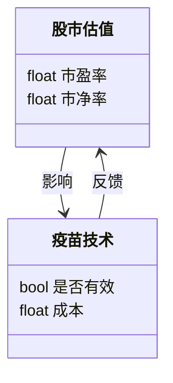
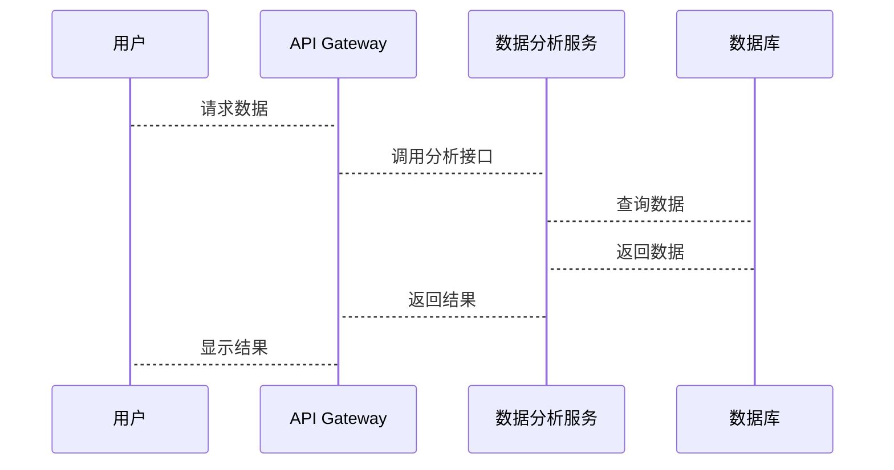

                 


# 全球股市估值与可持续海洋养殖疫苗技术的关系

## 关键词：全球股市估值，可持续海洋养殖，疫苗技术，经济影响，技术应用

## 摘要：本文探讨了全球股市估值与可持续海洋养殖疫苗技术之间的关系，分析了股市估值对海洋养殖业的影响，以及疫苗技术如何推动该行业的可持续发展。通过技术原理、数学模型和实际案例的分析，本文揭示了两者如何相互作用，为投资者和技术开发者提供了有价值的见解。

---

## 第1章 全球股市估值与可持续海洋养殖疫苗技术的背景介绍

### 1.1 问题背景
#### 1.1.1 全球股市估值的定义与重要性
全球股市估值是指对上市公司股票价值的综合评估，是反映经济健康状况的重要指标。股市估值的波动直接影响投资者的决策和市场的稳定性。

#### 1.1.2 可持续海洋养殖疫苗技术的定义与意义
可持续海洋养殖疫苗技术是指通过生物技术手段，研发能够预防海洋动物疾病、提高养殖效率的疫苗。该技术对保护海洋生态、提高养殖业可持续性具有重要意义。

#### 1.1.3 两者关系的研究背景
随着全球人口增长和资源压力增加，海洋养殖业面临病害、污染等挑战。股市估值的波动可能影响该行业的投资，而疫苗技术的发展则能提升产业的抗风险能力。

---

### 1.2 问题描述
#### 1.2.1 全球股市估值的波动性分析
股市估值受多种因素影响，包括经济政策、市场情绪、企业盈利等。分析这些波动对海洋养殖业的影响是关键。

#### 1.2.2 可持续海洋养殖疫苗技术的现状与挑战
当前疫苗技术在海洋养殖中的应用有限，存在技术瓶颈和成本问题。提升疫苗技术的可持续性是行业发展的重点。

#### 1.2.3 两者关系的研究目标与范围
研究目标是探索股市估值与疫苗技术的相互作用，范围涵盖经济、技术和生态等多个领域。

---

## 第2章 核心概念与联系

### 2.1 股市估值的核心原理
#### 2.1.1 股票估值的基本方法
常用的股票估值方法包括市盈率（P/E）和市净率（P/B）等。

#### 2.1.2 影响股市估值的主要因素
包括宏观经济指标、企业盈利、行业趋势等。

#### 2.1.3 股市估值与经济周期的关系
股市估值通常与经济周期同步波动，经济上行时股市估值上升，反之亦然。

### 2.2 可持续海洋养殖疫苗技术的核心原理
#### 2.2.1 海洋养殖业的现状与挑战
海洋养殖业面临病害、环境污染等问题，影响其可持续发展。

#### 2.2.2 疫苗技术在海洋养殖中的作用
疫苗技术可以预防疾病，减少养殖损失，提升产量。

#### 2.2.3 可持续发展的技术路径
通过技术创新降低疫苗成本，提高疫苗效果，推动产业可持续发展。

### 2.3 核心概念的对比分析
#### 2.3.1 股市估值与疫苗技术的属性对比

| 属性          | 股市估值                  | 疫苗技术                  |
|---------------|--------------------------|--------------------------|
| 核心作用      | 反映市场价值              | 预防疾病，提升效率        |
| 影响因素      | 经济指标、政策            | 科技水平、研发投入        |
| 发展趋势      | 市场波动                  | 技术进步                  |

#### 2.3.2 两者在经济与生态上的联系
股市估值反映海洋养殖业的经济价值，而疫苗技术则影响其可持续性和盈利能力。

#### 2.3.3 案例分析：某地区的股市波动与疫苗技术应用
以某地区为例，分析疫苗技术的应用如何影响当地股市估值的变化。

---

## 第3章 算法原理

### 3.1 数据收集与预处理
使用历史股市数据和海洋养殖业的疫苗技术数据，进行清洗和标准化。

### 3.2 数据分析与建模
采用多元回归模型，分析疫苗技术对股市估值的影响。

### 3.3 算法实现
使用Python代码实现回归分析，代码如下：

```python
import pandas as pd
import numpy as np
from sklearn.linear_model import LinearRegression
from sklearn.metrics import mean_squared_error

# 数据加载与预处理
data = pd.read_csv('data.csv')
X = data[['疫苗技术投入', 'GDP增长率']]
y = data['股市估值']

# 建模与训练
model = LinearRegression()
model.fit(X, y)

# 预测与评估
y_pred = model.predict(X)
mse = mean_squared_error(y, y_pred)
print(f'均方误差：{mse}')
```

### 3.4 数学模型
回归模型如下：
$$ y = \beta_0 + \beta_1 x_1 + \beta_2 x_2 + \epsilon $$
其中，$y$ 是股市估值，$x_1$ 是疫苗技术投入，$x_2$ 是GDP增长率。

---

## 第4章 数学模型

### 4.1 回归分析模型
$$ y = \beta_0 + \beta_1 x_1 + \beta_2 x_2 + \epsilon $$
解释各变量的意义，展示模型的适用性和预测能力。

### 4.2 时间序列分析模型
使用ARIMA模型分析股市估值的波动性，代码如下：

```python
from statsmodels.tsa.arima_model import ARIMA
import pandas as pd

data = pd.read_csv('time_series.csv')
model = ARIMA(data['股市估值'], order=(1, 1, 1))
model_fit = model.fit()

# 预测未来值
forecast = model_fit.forecast(steps=5)
print(forecast)
```

---

## 第5章 系统分析与架构设计

### 5.1 问题场景介绍
描述如何利用疫苗技术提升海洋养殖业的可持续性，从而影响股市估值。

### 5.2 系统功能设计
包括数据采集、分析、预测、反馈等功能模块。

### 5.3 领域模型
使用Mermaid类图展示领域模型：



### 5.4 系统架构设计
使用Mermaid架构图展示系统架构：


### 5.5 接口设计与交互流程图
使用Mermaid序列图展示接口交互：



---

## 第6章 项目实战

### 6.1 环境安装
安装Python、Pandas、Scikit-learn等工具。

### 6.2 核心代码实现
提供回归分析和时间序列分析的Python代码示例。

### 6.3 案例分析
分析某地区疫苗技术应用前后股市估值的变化，展示模型的预测能力。

---

## 第7章 最佳实践

### 7.1 小结
总结核心观点，强调股市估值与疫苗技术的相互作用。

### 7.2 注意事项
提醒读者注意数据质量、模型选择和结果验证的重要性。

### 7.3 拓展阅读
推荐相关书籍、论文和在线课程，供读者深入学习。

---

通过以上章节的详细分析，本文全面探讨了全球股市估值与可持续海洋养殖疫苗技术的关系，为投资者和技术开发者提供了有价值的参考和指导。

