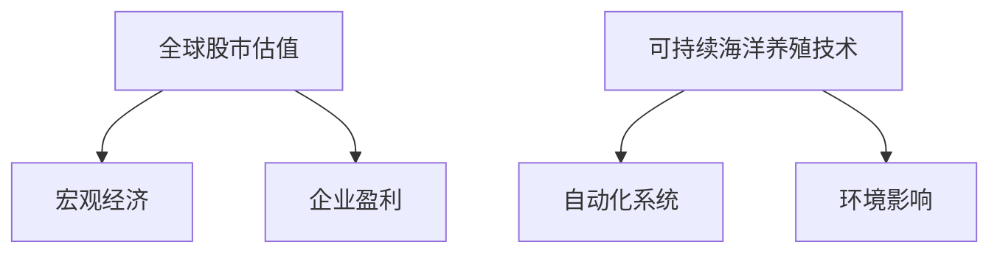
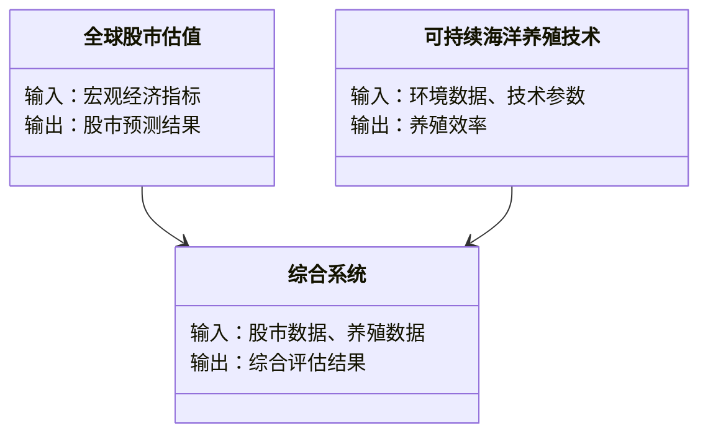
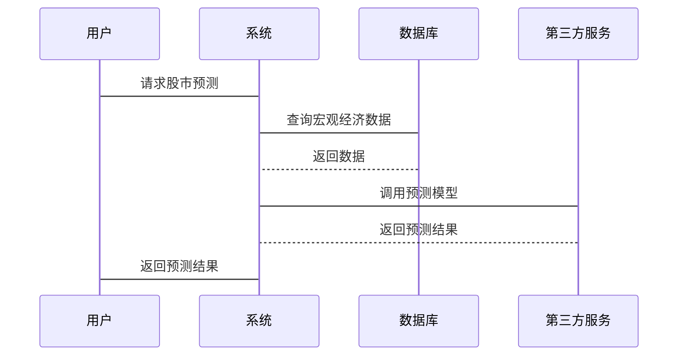

                 


# 全球股市估值与可持续海洋养殖自动化技术的关系

## 关键词：全球股市估值、可持续海洋养殖、自动化技术、系统架构、经济影响

## 摘要：  
本文探讨了全球股市估值与可持续海洋养殖自动化技术之间的关系。通过分析股市估值的核心要素、可持续海洋养殖技术的关键特征，以及两者如何相互影响，揭示了经济与技术之间的深层联系。文章还详细介绍了算法原理、数学模型和系统架构设计，为相关领域的研究提供了理论和实践指导。

---

# 第1章: 全球股市估值与可持续海洋养殖技术的背景

## 1.1 全球股市估值的基础

### 1.1.1 定义与重要性
全球股市估值是衡量市场整体价值的重要指标，反映了投资者对经济的信心。它包括主要股指（如道琼斯、纳斯达克）的表现，以及个股的评估。

### 1.1.2 影响因素
股市估值受宏观经济指标（GDP、利率）、企业盈利、市场情绪等多重因素影响。

### 1.1.3 主要指数
介绍全球主要股指，如标普500、纳斯达克等，并分析其波动性。

---

## 1.2 可持续海洋养殖技术

### 1.2.1 定义与现状
可持续海洋养殖指在保护环境的前提下，高效利用海洋资源进行养殖。当前技术包括自动化喂养、水质监测等。

### 1.2.2 自动化技术的应用
分析自动化技术如何提升海洋养殖效率，如智能传感器、远程监控系统等。

### 1.2.3 环境与经济影响
探讨可持续养殖对环境的保护作用，及其对经济发展的推动。

---

## 1.3 问题背景的必要性

### 1.3.1 经济与环境的双重挑战
全球股市波动与环境问题的双重压力，促使寻找可持续解决方案。

### 1.3.2 技术驱动的变革
自动化技术如何推动海洋养殖的可持续发展，进而影响股市估值。

### 1.3.3 研究意义
分析研究的现实意义，为政策制定者和投资者提供参考。

---

# 第2章: 核心概念与联系

## 2.1 核心概念原理

### 2.1.1 全球股市估值的数学模型
介绍简单线性回归模型和时间序列分析模型，解释其在预测股市波动中的应用。

### 2.1.2 可持续海洋养殖技术的系统架构
描述海洋养殖系统的模块化设计，包括传感器、数据处理和执行机构。

### 2.1.3 两者关系的理论基础
分析股市波动如何通过经济影响和技术进步作用于海洋养殖业。

---

## 2.2 概念属性特征对比

### 2.2.1 表格对比
| **属性**       | **全球股市估值**         | **可持续海洋养殖技术**       |
|----------------|--------------------------|-----------------------------|
| 核心指标       | 股价指数、市盈率         | 生产效率、环境影响指标       |
| 影响因素       | 经济政策、企业盈利       | 自然条件、技术进步           |
| 目标           | 评估市场价值             | 提高生产效率，保护环境       |

### 2.2.2 图形化展示
使用 Mermaid 绘制概念对比图：



---

## 2.3 ER实体关系图

### 2.3.1 实体关系
- 全球股市估值与企业盈利、经济政策相关联。
- 可持续海洋养殖技术与自动化设备、环境指标相关联。

使用 Mermaid 绘制 ER 图：

```mermaid
erd
    cust(全球股市估值)
    em(企业盈利)
    eco(经济政策)
    tech(可持续海洋养殖技术)
    auto(自动化设备)
    env(环境指标)
    cust -o> em
    cust -o> eco
    tech -o> auto
    tech -o> env
```

---

# 第3章: 算法原理讲解

## 3.1 全球股市估值预测算法

### 3.1.1 简单线性回归模型
预测股市指数与宏观经济指标之间的线性关系。

### 3.1.2 时间序列分析模型
使用ARIMA模型预测股市的未来走势。

### 3.1.3 多因素回归模型
综合考虑多个因素（如GDP、利率、企业盈利）对股市的影响。

---

## 3.2 可持续海洋养殖技术的算法

### 3.2.1 自动化喂养系统
基于传感器数据优化饲料投喂量。

### 3.2.2 水质监测系统
实时监测水质参数，预防环境问题。

---

## 3.3 关系模型

### 3.3.1 综合算法
将股市估值与海洋养殖技术的影响因素结合起来，构建综合模型。

---

# 第4章: 数学模型与公式

## 4.1 全球股市估值模型

### 4.1.1 简单线性回归模型
$$y = a + bx + \epsilon$$

其中，\( y \) 为股市指数，\( x \) 为宏观经济指标。

### 4.1.2 时间序列分析模型
$$ARIMA(p, d, q)$$

---

## 4.2 可持续海洋养殖技术模型

### 4.2.1 生态系统模型
$$E = k \times A + m \times T$$

其中，\( E \) 为环境影响，\( A \) 为养殖面积，\( T \) 为技术投入。

---

# 第5章: 系统分析与架构设计方案

## 5.1 系统功能设计

### 5.1.1 领域模型 Mermaid 类图
展示系统的模块化设计：



---

## 5.2 系统架构设计

### 5.2.1 Mermaid 架构图
展示系统的层次结构：


---

## 5.3 系统接口设计

### 5.3.1 RESTful API
定义接口，如 `/api/stock预测` 和 `/api/养殖效率`。

---

## 5.4 系统交互设计

### 5.4.1 Mermaid 序列图
展示用户与系统的交互流程：



---

# 第6章: 项目实战

## 6.1 环境安装

### 6.1.1 开发环境配置
使用 Python 3.8+，安装必要的库如 Pandas、Scikit-learn。

### 6.1.2 数据库安装
使用 SQLite 或 MySQL 存储数据。

---

## 6.2 核心实现

### 6.2.1 全球股市估值预测代码
```python
import pandas as pd
from sklearn.linear_model import LinearRegression

# 加载数据
data = pd.read_csv('stock_data.csv')

# 训练模型
model = LinearRegression()
model.fit(data[['GDP', '利率']], data['股价指数'])
```

### 6.2.2 可持续海洋养殖技术模拟代码
```python
import numpy as np

# 模拟环境数据
水质传感器 = np.array([75, 80, 78, 76])
```

---

## 6.3 实际案例分析

### 6.3.1 案例背景
分析某地区股市波动与海洋养殖技术升级的互动关系。

### 6.3.2 数据分析与结果展示
使用图表展示数据，如线图显示股市指数与养殖效率的变化趋势。

---

## 6.4 项目小结

### 6.4.1 成果总结
总结项目的主要成果和创新点。

### 6.4.2 经验与教训
分享项目实施中的经验和教训。

---

## 第7章: 最佳实践与展望

## 7.1 最佳实践 tips
- 定期更新模型参数，保持预测准确性。
- 加强跨领域合作，推动技术创新。

## 7.2 小结
总结全文，强调研究的重要性和未来的发展方向。

## 7.3 注意事项
提醒读者在实际操作中注意数据质量和模型适用性。

## 7.4 拓展阅读
推荐相关领域的书籍和论文，供读者深入研究。

---

通过以上步骤，我们可以系统地分析全球股市估值与可持续海洋养殖自动化技术的关系，为相关领域的研究和实践提供有价值的参考。

