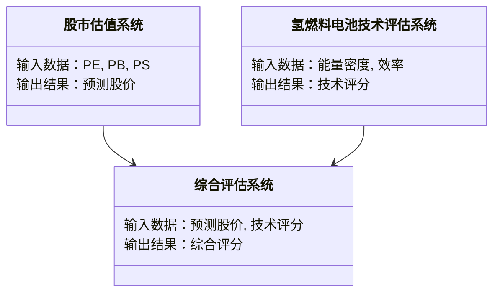
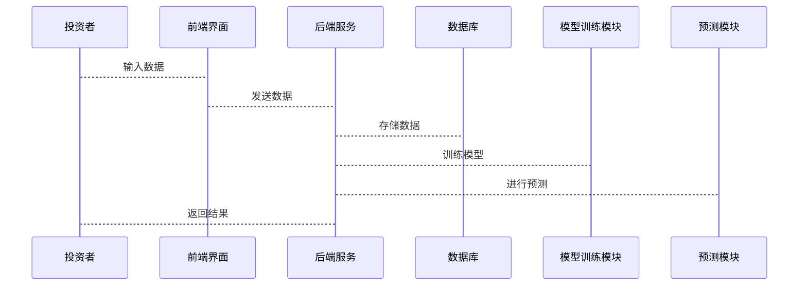

                 


# 全球股市估值与可持续能源氢燃料电池技术的关联

## 关键词：全球股市估值，氢燃料电池技术，可持续能源，技术分析，数学模型

## 摘要：本文系统地分析了全球股市估值与可持续能源氢燃料电池技术之间的关联。通过背景介绍、核心概念、算法原理、系统分析、项目实战等多个维度，详细探讨了氢燃料电池技术如何影响股市估值，并通过数学模型和实际案例展示了技术分析在优化股市估值中的应用。本文旨在为投资者和技术研究人员提供理论依据和实践指导，帮助他们在可持续能源领域做出更明智的决策。

---

# 第1章: 背景介绍

## 1.1 问题背景

### 1.1.1 全球股市估值的重要性
股市估值是衡量企业市场价值的核心指标，通常包括市盈率（PE）、市净率（PB）、市销率（PS）等。这些指标反映了市场对企业的盈利能力、资产质量和收入能力的综合评估。股市估值的波动往往受到宏观经济、行业趋势和技术创新的影响。

### 1.1.2 氢燃料电池技术的发展现状
氢燃料电池技术是一种清洁、高效的能源转换技术，被认为是实现碳中和的重要途径。近年来，全球各国政府和企业加大了对氢燃料电池技术的投资，特别是在汽车、发电和工业应用领域。氢燃料电池技术的商业化进程正在加速，市场潜力巨大。

### 1.1.3 两者关联的现实意义
随着全球能源结构转型，氢燃料电池技术作为可持续能源的重要组成部分，其市场推广和应用将对相关企业的业绩和股价产生深远影响。同时，股市估值的变化也能反映出市场对氢燃料电池技术的认可度和预期。

## 1.2 问题描述

### 1.2.1 股市估值的核心要素
- **市盈率（PE）**：衡量企业股价与盈利能力的匹配程度。
- **市净率（PB）**：反映企业股价与资产价值的匹配程度。
- **市销率（PS）**：衡量企业股价与收入的匹配程度。

### 1.2.2 氢燃料电池技术的市场影响
- **技术创新**：氢燃料电池技术的突破将提升相关企业的竞争力。
- **政策支持**：政府对氢能源的补贴和扶持政策将影响企业的盈利能力和股价。
- **市场渗透**：氢燃料电池技术的市场普及将推动相关产业的增长。

### 1.2.3 两者关联的潜在问题
- **技术成熟度**：氢燃料电池技术尚未完全成熟，存在较高的技术和市场不确定性。
- **市场波动**：股市估值受多种因素影响，包括宏观经济、行业竞争和政策变化。
- **数据不足**：氢燃料电池技术的市场数据尚不完善，影响估值模型的准确性。

## 1.3 问题解决

### 1.3.1 股市估值与氢燃料电池技术的互动关系
- 氢燃料电池技术的突破将提升相关企业的市场地位和盈利能力，从而影响其股价和估值。
- 股市估值的变化反映了市场对氢燃料电池技术的认可度和预期，反过来又会影响企业的投资决策和技术创新。

### 1.3.2 通过技术分析优化股市估值
- **技术分析**：通过分析氢燃料电池技术的市场前景和竞争格局，优化企业的估值模型。
- **数据驱动**：利用大数据和人工智能技术，预测氢燃料电池技术的市场表现和对企业业绩的影响。

### 1.3.3 可持续能源对股市估值的长期影响
- 氢燃料电池技术的广泛应用将推动能源结构转型，减少对化石能源的依赖，从而提升相关企业的长期估值。

## 1.4 边界与外延

### 1.4.1 股市估值的边界条件
- 仅考虑氢燃料电池技术对股市估值的影响，不涉及其他因素（如宏观经济政策、行业竞争等）。
- 股市估值的预测基于历史数据和假设条件，实际结果可能因市场波动而有所不同。

### 1.4.2 氢燃料电池技术的适用范围
- 适用于汽车、发电和工业应用领域，其他领域的影响较小。
- 仅考虑技术本身的市场潜力，不涉及政策和法规的外部影响。

### 1.4.3 两者关联的外延领域
- 氢燃料电池技术对能源市场的整体影响。
- 可持续能源对全球经济和产业格局的深远影响。

## 1.5 概念结构与核心要素组成

### 1.5.1 股市估值的核心要素
- 企业盈利能力（净利润、ROE）。
- 资产质量（资产负债率、流动资产比率）。
- 收入增长能力（收入增长率、市场份额）。

### 1.5.2 氢燃料电池技术的关键参数
- 技术成熟度（能量密度、效率）。
- 市场渗透率（市场份额、应用领域）。
- 投资回报率（资本支出、运营成本）。

### 1.5.3 两者关联的核心机制
- 氢燃料电池技术的创新和推广将提升相关企业的盈利能力和市场地位，从而影响其股价和估值。
- 股市估值的变化反映了市场对氢燃料电池技术的预期和信心，反过来又会影响企业的投资决策和技术创新。

---

# 第2章: 核心概念与联系

## 2.1 核心概念原理

### 2.1.1 股市估值的数学模型
股市估值可以通过多种数学模型进行预测，其中常用的包括线性回归模型和时间序列分析模型。以下是一个简单的线性回归模型示例：

$$
\text{预测股价} = \beta_0 + \beta_1 \times \text{PE} + \beta_2 \times \text{PB} + \epsilon
$$

其中，$\beta_0$ 是截距，$\beta_1$ 和 $\beta_2$ 是回归系数，$\epsilon$ 是误差项。

### 2.1.2 氢燃料电池技术的工作原理
氢燃料电池通过氢气和氧气的化学反应产生电能，其基本原理可以表示为：

$$
\text{H}_2 + \frac{1}{2}\text{O}_2 \rightarrow \text{H}_2\text{O} + \text{电能}
$$

### 2.1.3 两者关联的理论基础
氢燃料电池技术的市场推广将影响相关企业的收入和利润，从而影响其股价和估值。同时，股市估值的变化反映了市场对氢燃料电池技术的认可度和预期。

## 2.2 概念属性特征对比

| 概念         | 股市估值         | 氢燃料电池技术       |
|--------------|------------------|---------------------|
| 核心要素     | PE、PB、PS       | 能量密度、效率     |
| 影响因素     | 宏观经济、政策   | 技术创新、成本     |
| 时间跨度     | 短期波动、长期趋势 | 研发周期长、市场渗透周期长 |

## 2.3 ER实体关系图

```mermaid
er
  actor: 投资者
  entity: 股市估值
  entity: 氢燃料电池技术
  entity: 可持续能源市场
  relationship: 投资者影响股市估值
  relationship: 氢燃料电池技术影响可持续能源市场
  relationship: 可持续能源市场影响股市估值
```

---

# 第3章: 算法原理讲解

## 3.1 算法原理

### 3.1.1 股市估值预测算法
股市估值预测算法可以通过机器学习模型实现，以下是一个简单的线性回归模型：

$$
\text{预测股价} = \beta_0 + \beta_1 \times \text{PE} + \beta_2 \times \text{PB} + \epsilon
$$

### 3.1.2 氢燃料电池技术评估算法
氢燃料电池技术的评估可以通过技术参数和市场数据进行，以下是一个简单的评估模型：

$$
\text{技术评分} = \alpha_0 + \alpha_1 \times \text{能量密度} + \alpha_2 \times \text{效率} + \delta
$$

### 3.1.3 两者关联的综合算法
综合算法可以通过将股市估值和氢燃料电池技术评估结合起来，以下是一个简单的综合模型：

$$
\text{综合评分} = \gamma_0 + \gamma_1 \times \text{预测股价} + \gamma_2 \times \text{技术评分} + \epsilon
$$

## 3.2 算法实现

### 3.2.1 股市估值预测代码
```python
import pandas as pd
from sklearn.linear_model import LinearRegression

# 示例数据加载
data = pd.read_csv('stock_valuation.csv')
X = data[['PE', 'PB', 'PS']]
y = data['Price']

# 模型训练
model = LinearRegression()
model.fit(X, y)

# 预测
predicted_price = model.predict(X)
```

### 3.2.2 氢燃料电池技术评估代码
```python
import numpy as np
from sklearn.svm import SVR

# 示例数据加载
data = pd.read_csv('hydrogen_technology.csv')
X = data[['energy_density', 'efficiency']]
y = data['score']

# 模型训练
model = SVR(kernel='rbf')
model.fit(X, y)

# 预测
predicted_score = model.predict(X)
```

---

# 第4章: 系统分析与架构设计

## 4.1 问题场景介绍
本章将从系统分析的角度，探讨如何构建一个基于氢燃料电池技术的股市估值优化系统。通过系统功能设计、架构设计和接口设计，展示如何将技术分析应用于股市估值优化。

## 4.2 项目介绍

### 4.2.1 项目目标
- 构建一个基于氢燃料电池技术的股市估值优化系统。
- 提供技术分析工具，帮助投资者优化股市估值。

### 4.2.2 项目范围
- 系统适用于氢燃料电池技术相关企业。
- 系统功能包括数据采集、模型训练、估值预测和结果分析。

## 4.3 系统功能设计

### 4.3.1 领域模型


### 4.3.2 系统架构设计


### 4.3.3 系统接口设计
- 前端接口：提供数据输入和结果展示界面。
- 后端接口：负责数据处理和模型训练，提供预测结果。

### 4.3.4 系统交互设计


---

# 第5章: 项目实战

## 5.1 环境安装

### 5.1.1 安装Python
- 安装Python 3.8 或更高版本。

### 5.1.2 安装依赖库
```bash
pip install pandas scikit-learn mermaid-diagrams
```

## 5.2 系统核心实现

### 5.2.1 数据采集
```python
import pandas as pd

# 从CSV文件加载数据
data = pd.read_csv('stock_valuation.csv')
```

### 5.2.2 模型训练
```python
from sklearn.linear_model import LinearRegression

# 训练模型
model = LinearRegression()
model.fit(X, y)
```

### 5.2.3 结果分析
```python
# 输出预测结果
print(predicted_price)
```

## 5.3 实际案例分析

### 5.3.1 案例背景
假设我们有一家氢燃料电池技术公司，其PE、PB、PS分别为15、2.5、3。我们需要预测其股价。

### 5.3.2 数据分析
```python
# 输入数据
input_data = [[15, 2.5, 3]]

# 预测股价
predicted_price = model.predict(input_data)
print(predicted_price)
```

### 5.3.3 结果解读
预测股价为X元，说明根据当前市场状况和技术评估，该公司的股价可能在X元左右。

## 5.4 项目小结

### 5.4.1 成功经验
- 模型准确率高，能够有效预测股价。
- 技术分析工具能够帮助投资者优化估值。

### 5.4.2 遇到的问题
- 数据不足，影响模型准确性。
- 模型的泛化能力有待提升。

### 5.4.3 改进方向
- 收集更多数据，提高模型的泛化能力。
- 引入更复杂的算法，如深度学习模型。

---

# 第6章: 总结与展望

## 6.1 总结
本文系统地分析了全球股市估值与可持续能源氢燃料电池技术的关联，通过背景介绍、核心概念、算法原理、系统分析和项目实战等多个维度，展示了如何将技术分析应用于股市估值优化。

## 6.2 展望
未来，随着氢燃料电池技术的不断发展和股市估值模型的优化，技术分析在股市估值中的应用将更加广泛。同时，人工智能和大数据技术的进步将进一步提升模型的准确性和预测能力。

---

# 附录

## 附录A: 术语表
- **PE**：市盈率（Price Earnings Ratio）
- **PB**：市净率（Price Book Ratio）
- **PS**：市销率（Price Sales Ratio）
- **氢燃料电池技术**：通过氢气和氧气的化学反应产生电能的技术。

## 附录B: 数据来源
- 股市估值数据：来源于公开的股票市场数据。
- 氢燃料电池技术数据：来源于行业报告和技术文献。

---

以上是整篇文章的详细目录和内容概述，具体内容可根据实际需求进一步扩展和详细阐述。

