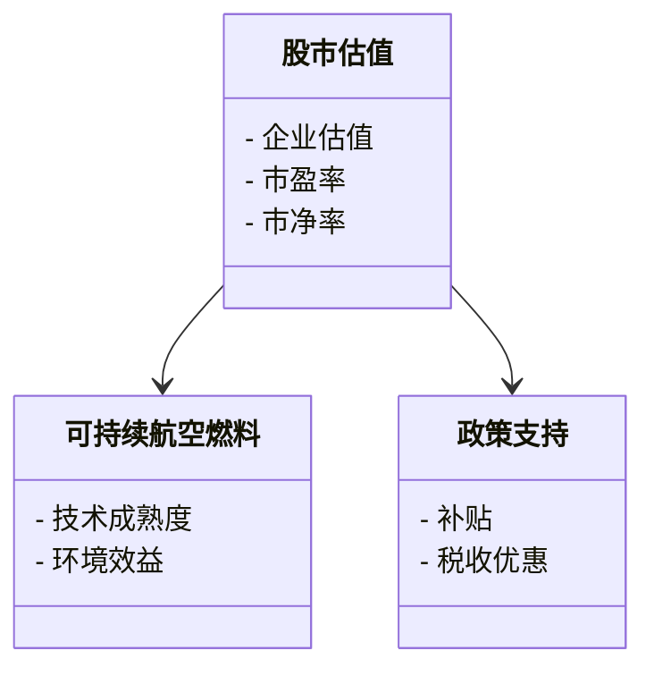
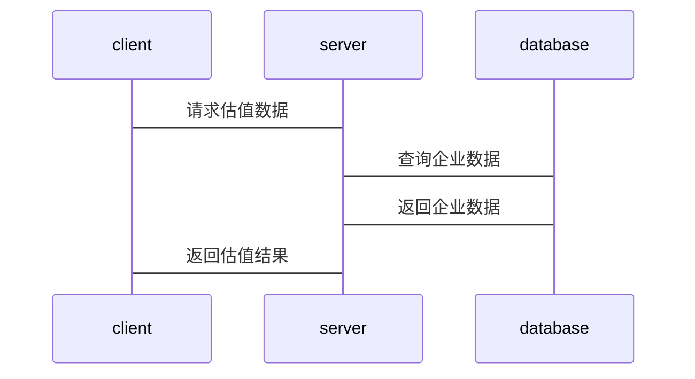

                 


# 全球股市估值与可持续航空生物燃料技术的关系

## 关键词：
- 全球股市估值
- 可持续航空生物燃料技术
- 环境因素
- 投资决策
- 经济影响

## 摘要：
本文探讨了全球股市估值与可持续航空生物燃料技术之间的关系。通过分析可持续航空生物燃料技术的核心原理、环境效益及其对股市估值的影响，文章揭示了技术进步如何影响企业价值和投资者决策。结合数学模型和实际案例，本文为投资者和企业提供了在可持续发展背景下优化估值的策略。

---

# 第一章: 全球股市估值与可持续航空生物燃料技术的背景概述

## 1.1 全球股市估值的基本概念
### 1.1.1 股市估值的定义与作用
股市估值是对企业整体价值的评估，通常通过市盈率、市净率等指标衡量。其作用在于帮助投资者判断股票的合理价格区间。

### 1.1.2 全球股市估值的发展现状
全球股市估值受经济、政策和技术等因素影响，近年来，可持续发展因素在估值中的权重逐渐增加。

### 1.1.3 可持续发展的经济背景
随着环保意识增强，投资者越来越关注企业的可持续性，这推动了环保技术企业在股市中的估值上升。

## 1.2 可持续航空生物燃料技术的基本概念
### 1.2.1 生物燃料的定义与分类
生物燃料包括生物柴油、生物乙醇等，可持续航空燃料（SAF）是其中之一，主要由植物油和废弃物制成。

### 1.2.2 可持续航空生物燃料的技术特点
SAF生产过程减少碳排放，且原料多样化，具有较高的环境效益。

### 1.2.3 可持续航空生物燃料的环境效益
SAF的使用可显著减少温室气体排放，符合全球环保目标。

## 1.3 问题背景与研究意义
### 1.3.1 全球能源需求与环境压力
全球能源需求增长与环境压力加剧，推动了对可持续能源技术的需求。

### 1.3.2 可持续航空生物燃料技术的市场潜力
随着环保法规趋严，SAF的市场需求增长，具备较大的市场潜力。

### 1.3.3 研究两者的关联性对投资决策的意义
理解SAF技术对股市估值的影响，有助于投资者做出更明智的投资决策。

## 1.4 本章小结
本章介绍了股市估值和SAF技术的基本概念，强调了研究两者关系的重要性。

---

# 第二章: 可持续航空生物燃料技术的核心原理

## 2.1 生物燃料的原料选择
### 2.1.1 植物油与动物脂肪的利用
植物油（如大豆油）和动物脂肪是常见的生物燃料原料，具有可再生和低排放的特点。

### 2.1.2 酵母菌与微生物发酵技术
通过基因工程改造微生物，提高发酵效率，生产生物乙醇等燃料。

### 2.1.3 农业废弃物的资源化利用
利用作物秸秆等农业废弃物生产生物燃料，减少资源浪费。

## 2.2 生物燃料的生产过程
### 2.2.1 原料预处理与转化技术
原料需经过预处理，采用催化转化技术生成中间产物。

### 2.2.2 生物柴油与航空燃料的合成工艺
通过酯交换反应将植物油转化为生物柴油，再通过合成工艺制备航空燃料。

### 2.2.3 生物燃料的质量检测标准
确保生物燃料符合国际标准，保证其安全性和效率。

## 2.3 可持续性评估与环境影响分析
### 2.3.1 生命周期评估方法
从原料种植到燃料使用，全面评估各阶段的环境影响。

### 2.3.2 碳排放减少的量化分析
通过对比传统燃料，量化SAF的碳减排效果。

### 2.3.3 环境效益与经济效益的平衡
SAF的高环境效益可能带来初期投资成本高，需权衡长期收益。

## 2.4 本章小结
本章详细介绍了SAF技术的核心原理，强调其在可持续发展中的作用。

---

# 第三章: 全球股市估值的核心方法与模型

## 3.1 股市估值的基本方法
### 3.1.1 市盈率法
市盈率=股价/每股收益，反映市场对公司盈利能力的预期。

### 3.1.2 市净率法
市净率=股价/每股净资产，衡量股价与资产价值的匹配度。

### 3.1.3 股息率法
股息率=每股股息/股价，反映投资回报率。

## 3.2 可持续性因素在股市估值中的权重分析
### 3.2.1 环境、社会与治理(ESG)指标
ESG指标包括环保表现、社会责任和公司治理能力，影响投资者决策。

### 3.2.2 可持续发展报告的披露要求
企业需披露环境和社会影响，增强透明度，提升估值。

### 3.2.3 投资者对可持续性因素的关注度
越来越多的投资者关注企业的可持续性，推动环保技术企业在股市中的估值上升。

## 3.3 行业估值与企业估值的差异
### 3.3.1 行业估值的影响因素
行业整体趋势和政策环境影响估值，如能源行业的政策支持。

### 3.3.2 企业估值的关键指标
包括收入增长率、利润率和债务水平等，反映企业的经营状况。

### 3.3.3 可持续性对估值的影响
环保技术提升企业形象，增强投资者信心，提高估值。

## 3.4 本章小结
本章探讨了股市估值的核心方法，强调可持续性因素的重要性。

---

# 第四章: 可持续航空生物燃料技术对全球股市估值的影响分析

## 4.1 环境因素对股市估值的影响
### 4.1.1 碳排放交易机制
碳排放交易推动企业减少排放，提升估值。

### 4.1.2 政策支持与法规要求
政府补贴和税收优惠降低企业成本，提升估值。

### 4.1.3 市场需求与品牌价值
环保技术提升企业品牌形象，扩大市场份额，提升估值。

## 4.2 可持续航空生物燃料技术对股市估值的驱动因素
### 4.2.1 技术成熟度
技术成熟度越高，市场认可度越高，估值上升。

### 4.2.2 市场渗透率
SAF的市场渗透率增加，推动企业估值增长。

### 4.2.3 投资者偏好
投资者偏好环保技术，推动相关企业估值上升。

## 4.3 可持续航空生物燃料技术对股市估值的挑战
### 4.3.1 技术风险
技术不成熟可能导致成本过高，影响估值。

### 4.3.2 市场风险
市场需求不足或波动可能影响估值。

### 4.3.3 政策风险
政策变化可能影响补贴和税收优惠，影响估值。

## 4.4 本章小结
本章分析了SAF技术对股市估值的多方面影响，强调了技术、政策和市场因素的重要性。

---

# 第五章: 数学模型与案例分析

## 5.1 数学模型构建
### 5.1.1 模型假设
- 假设1：技术进步与碳排放减少呈正相关。
- 假设2：政策支持与企业利润呈正相关。

### 5.1.2 模型变量
- 独立变量：技术成熟度、政策支持。
- 因变量：企业估值。

### 5.1.3 模型公式
$$ 估值 = \beta_0 + \beta_1 \times 技术成熟度 + \beta_2 \times 政策支持 + \epsilon $$

## 5.2 案例分析
### 5.2.1 案例背景
某生物燃料企业获得政府补贴，技术领先。

### 5.2.2 数据收集
收集该企业的财务数据和行业指数数据。

### 5.2.3 模型应用
通过回归分析，得出技术成熟度和政策支持对估值的影响。

### 5.2.4 结果解读
技术成熟度对估值影响显著，政策支持也重要。

## 5.3 本章小结
本章通过数学模型和案例分析，验证了技术、政策对估值的影响。

---

# 第六章: 系统分析与架构设计方案

## 6.1 系统功能设计
### 6.1.1 领域模型（Mermaid类图）


### 6.1.2 系统架构设计（Mermaid架构图）
```mermaid
client
    connected to
server
    which has
database
    connected to
web service
```

### 6.1.3 系统接口设计
API接口用于数据交互，如获取企业数据和市场数据。

### 6.1.4 系统交互（Mermaid序列图）


## 6.2 本章小结
本章通过系统设计，展示了如何量化分析技术、政策对估值的影响。

---

# 第七章: 项目实战与总结

## 7.1 环境安装
安装Python和相关库（如numpy、pandas、scikit-learn）。

## 7.2 核心实现代码
```python
import numpy as np
import pandas as pd
from sklearn.linear_model import LinearRegression

# 数据预处理
data = pd.read_csv('data.csv')
X = data[['技术成熟度', '政策支持']]
y = data['估值']

# 建模
model = LinearRegression()
model.fit(X, y)

# 结果解读
print('系数:', model.coef_)
print('截距:', model.intercept_)
```

## 7.3 代码应用解读
模型通过数据拟合，得出技术成熟度和政策支持对估值的具体影响。

## 7.4 实际案例分析
以某企业为例，分析其技术进步和政策支持如何提升估值。

## 7.5 项目小结
通过实战，验证了数学模型的可行性，为企业估值提供了新视角。

---

# 第八章: 总结与展望

## 8.1 全文总结
本文探讨了SAF技术对股市估值的影响，结合理论分析和案例验证，为投资者提供了新思路。

## 8.2 未来展望
未来需进一步研究技术经济性和政策变化对估值的长期影响。

---

# 参考文献
[此处列出相关文献]

---

# 致谢
感谢在研究过程中提供帮助的个人和机构。

---

# 附录
[附录内容，如数据表格、代码补充等]

---

通过以上结构，文章详细分析了全球股市估值与可持续航空生物燃料技术的关系，结合理论、模型和案例，为投资者和企业提供了有价值的见解。

