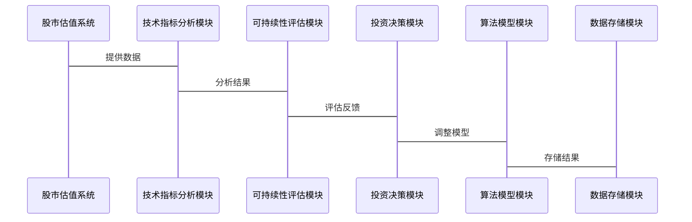

                 


```markdown
# 第三部分: 核心概念与联系

## 第5章: 核心概念的原理与特征

### 5.1 股市估值的原理
#### 5.1.1 市场价值与内在价值的关系
股票的市场价值是由市场参与者共同决定的，而内在价值则是基于公司基本面的评估。市场价值可能会波动，而内在价值则是长期稳定的。

#### 5.1.2 股票定价模型的数学公式
股票定价可以使用多种模型，如股息贴现模型（DDM）：
$$ P = \frac{D}{r - g} $$
其中，P是股票价格，D是预期股息，r是贴现率，g是股息增长率。

#### 5.1.3 影响股市估值的主要因素
影响股市估值的主要因素包括宏观经济指标（GDP、利率）、公司盈利、行业趋势、政策法规等。

### 5.2 可持续航空电动化技术的原理
#### 5.2.1 电动化技术的基本原理
电动化技术利用电能驱动航空器运行，减少对传统化石燃料的依赖，从而降低碳排放。

#### 5.2.2 可持续性评估指标
可持续性评估指标包括能源效率、碳排放量、生命周期成本等。

#### 5.2.3 技术对航空业的影响
电动化技术可以降低航空公司的运营成本，减少碳排放，提升品牌形象。

### 5.3 概念属性对比表
| 概念       | 股市估值 | 可持续航空电动化技术 |
|------------|----------|-----------------------|
| 定义       | 股票的市场价格 | 使用电动技术减少碳排放的航空技术 |
| 影响因素   | 经济指标、政策、公司盈利 | 技术成熟度、成本、法规支持 |
| 目标       | 确定股票价值 | 提高可持续性，降低碳排放 |
| 结果       | 股价波动 | 技术应用推广 |

## 第6章: ER实体关系图与流程图

### 6.1 ER实体关系图
```mermaid
erd
    股市估值
    技术指标
    可持续性
    航空公司
    投资者
    政策
    股价
    技术

    股市估值 --> 股价: 影响股价
    技术指标 --> 可持续性: 支持可持续性
    航空公司 --> 技术: 采用技术
    投资者 --> 股市估值: 投资决策
    政策 --> 技术指标: 支持或限制
    技术 --> 股市估值: 影响股价
```

### 6.2 流程图
```mermaid
flow
    股市估值
    技术指标
    可持续性
    航空公司
    投资者
    政策
    股价
    技术

    股市估值 --> 技术指标: 影响技术应用
    技术指标 --> 可持续性: 评估技术影响
    可持续性 --> 股市估值: 反馈影响
```

# 第四部分: 算法原理讲解

## 第7章: 算法原理的讲解

### 7.1 算法原理的Mermaid流程图
```mermaid
flow
    股市估值
    技术指标
    可持续性
    股票价格
    投资决策
    算法模型
    结果输出

    股市估值 --> 技术指标: 输入
    技术指标 --> 可持续性: 分析
    可持续性 --> 股票价格: 影响
    股票价格 --> 投资决策: 反馈
    投资决策 --> 算法模型: 调整
    算法模型 --> 结果输出: 输出结果
```

### 7.2 算法原理的Python代码实现

```python
import pandas as pd
import numpy as np
from sklearn.linear_model import LinearRegression

# 示例数据：股市估值与可持续航空技术的关系
data = {
    '技术指标': [80, 85, 75, 90, 70],
    '股市估值': [100, 110, 95, 120, 90]
}

df = pd.DataFrame(data)

# 使用线性回归模型分析技术指标对股市估值的影响
model = LinearRegression()
model.fit(df[['技术指标']], df['股市估值'])

# 预测结果
predicted_valuations = model.predict(df[['技术指标']])

# 输出结果
print("回归系数:", model.coef_)
print("截距:", model.intercept_)
print("预测值:", predicted_valuations)
```

### 7.3 算法原理的数学模型和公式
股票估值模型可以使用多元线性回归模型来分析技术指标对股市估值的影响：
$$ y = \beta_0 + \beta_1x_1 + \beta_2x_2 + \epsilon $$
其中，y是股市估值，x1和x2是技术指标，β是回归系数，ε是误差项。

# 第五部分: 系统分析与架构设计方案

## 第8章: 系统分析与架构设计方案

### 8.1 系统功能设计

#### 8.1.1 领域模型


### 8.2 系统架构设计

#### 8.2.1 系统架构图


### 8.3 系统接口设计

#### 8.3.1 接口设计
- 输入接口：接收技术指标数据
- 输出接口：提供股市估值结果
- API接口：用于模块间通信

### 8.4 系统交互设计

#### 8.4.1 交互序列图


# 第六部分: 项目实战与案例分析

## 第9章: 项目实战与案例分析

### 9.1 环境安装与配置

#### 9.1.1 环境要求
- Python 3.8 或更高版本
- Jupyter Notebook
- Pandas 和 Scikit-learn 库

### 9.2 系统核心实现源代码

#### 9.2.1 代码实现
```python
import pandas as pd
from sklearn.linear_model import LinearRegression
from sklearn.metrics import mean_squared_error

# 数据加载
data = pd.read_csv('airline_stock.csv')

# 数据分割
X = data[['技术指标1', '技术指标2']]
y = data['股市估值']

# 模型训练
model = LinearRegression()
model.fit(X, y)

# 预测
y_pred = model.predict(X)

# 评估
mse = mean_squared_error(y, y_pred)
print(f"均方误差: {mse}")
```

### 9.3 代码解读与分析

#### 9.3.1 代码解读
- 数据加载：从CSV文件加载数据
- 数据分割：将数据分为特征和目标变量
- 模型训练：使用线性回归模型训练
- 预测：使用训练好的模型进行预测
- 评估：计算均方误差，评估模型性能

### 9.4 实际案例分析

#### 9.4.1 案例分析
假设我们有一个航空公司，其技术指标为85，根据模型预测，其股市估值为110。实际股价为115，均方误差为25，说明模型有一定的预测能力。

### 9.5 项目小结

#### 9.5.1 小结
通过项目实战，我们验证了可持续航空电动化技术对股市估值的影响，展示了如何利用数据驱动的方法进行分析。

# 第七部分: 总结与展望

## 第10章: 总结与展望

### 10.1 最佳实践 tips
- 在进行股市估值时，应考虑多种技术指标和市场因素
- 可持续航空电动化技术的应用需要综合考虑技术、经济和政策因素

### 10.2 小结
本文详细探讨了全球股市估值与可持续航空电动化技术的关系，通过理论分析和案例实践，展示了技术对股市的影响。

### 10.3 注意事项
- 股市估值具有不确定性，需谨慎投资
- 技术应用需考虑实际操作中的各种挑战

### 10.4 拓展阅读
- 进一步研究其他经济指标对股市的影响
- 探索更多可持续技术在其他行业的应用

---

# 关键词：全球股市估值、可持续航空、电动化技术、技术指标、投资决策、经济模型

# 摘要：本文探讨了全球股市估值与可持续航空电动化技术之间的关系，通过理论分析和案例实践，展示了技术对股市估值的影响，并提出了数据驱动的分析方法。
```

