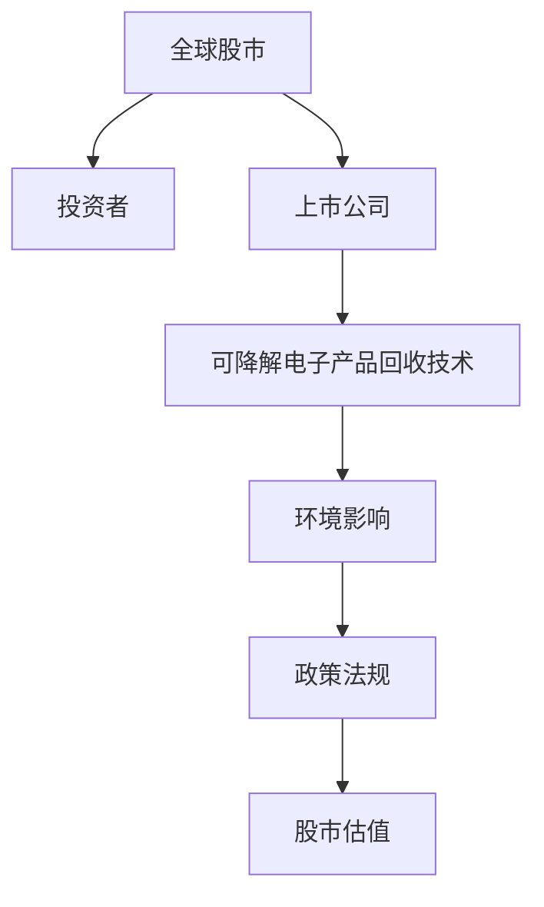
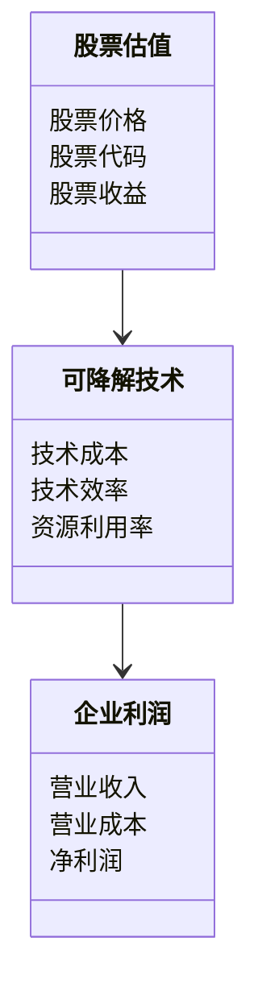
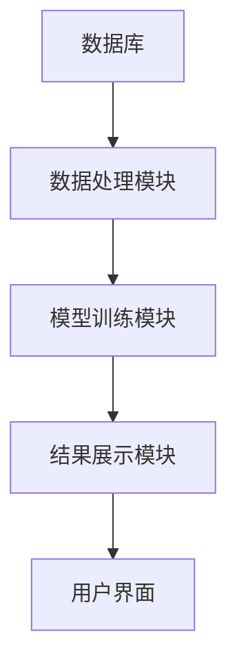
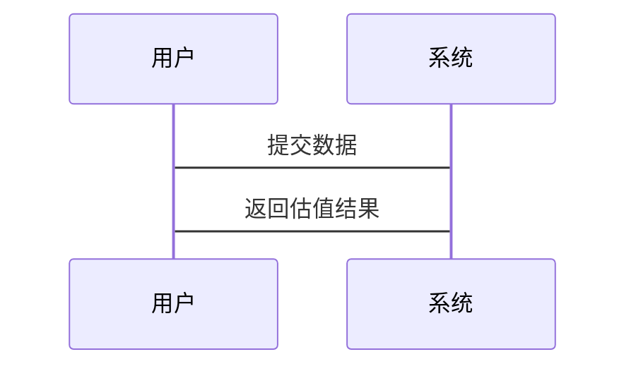

                 


# 全球股市估值与可降解电子产品回收技术的关联

> **关键词**：全球股市估值，可降解电子产品，回收技术，经济影响，环境因素
>
> **摘要**：本文探讨了全球股市估值与可降解电子产品回收技术之间的关联性。通过分析股市估值的核心概念、可降解电子产品回收技术的关键特性，以及两者在经济和环境因素上的相互作用，揭示了回收技术如何影响股市估值，并进一步探讨了这一关联对企业和投资者的潜在影响。文章结合实际案例和数据，提出了系统的解决方案和未来发展方向。

---

## 第一部分：全球股市估值与可降解电子产品回收技术的背景

### 第1章：全球股市估值与可降解电子产品回收技术的背景

#### 1.1 全球股市估值的背景

##### 1.1.1 全球股市估值的基本概念
全球股市估值是指对上市公司股票价格的合理评估，通常基于公司财务状况、市场环境、行业趋势等因素。股市估值的核心在于通过分析公司基本面和市场情绪，确定股票的合理价格区间。

##### 1.1.2 全球股市估值的现状与趋势
近年来，全球股市估值呈现波动性增长。随着经济全球化和技术进步，股市估值受到多种因素的影响，包括政策变化、技术创新、经济周期等。尤其是在环保政策趋严的背景下，绿色投资逐渐成为影响股市估值的重要因素。

##### 1.1.3 全球股市估值的核心要素
- **公司财务状况**：包括盈利能力、资产负债率、现金流等。
- **市场环境**：包括宏观经济指标、行业竞争状况、政策法规等。
- **市场情绪**：投资者的心理预期和市场参与度。

#### 1.2 可降解电子产品回收技术的背景

##### 1.2.1 可降解电子产品回收技术的基本概念
可降解电子产品回收技术是指通过特定工艺，将电子产品分解并回收其中的有价值材料的过程。与传统回收技术不同，可降解技术更加注重环保，减少对环境的二次污染。

##### 1.2.2 可降解电子产品回收技术的现状与挑战
目前，可降解电子产品回收技术仍处于发展阶段。主要挑战包括技术成本高、回收效率低、材料利用率不足等问题。然而，随着环保法规的严格和绿色经济的推动，可降解回收技术的应用前景广阔。

##### 1.2.3 可降解电子产品回收技术的核心要素
- **材料分解技术**：包括化学分解、物理分离等方法。
- **回收效率**：衡量技术在资源利用率和成本控制方面的表现。
- **环境影响评估**：评估技术对环境的整体影响，包括碳排放、能源消耗等。

#### 1.3 两者的关联性分析

##### 1.3.1 全球股市估值与可降解电子产品回收技术的潜在联系
可降解电子产品回收技术的推广可能影响相关企业的生产成本和市场竞争力，从而间接影响股市估值。此外，环保政策的变化也可能导致股市整体估值的变化。

##### 1.3.2 可降解电子产品回收技术对全球股市估值的影响
- **企业层面**：采用可降解技术的企业可能面临初期成本增加，但长期来看，技术优势可能提升企业竞争力，从而提高股价。
- **市场层面**：环保技术的普及可能推动绿色投资热潮，影响股市整体估值。

##### 1.3.3 全球股市估值对可降解电子产品回收技术的反馈作用
股市估值的变化可能影响企业的投资决策，进而影响可降解回收技术的研发和推广。例如，股市估值上升可能为企业提供更多资金支持，加速技术发展。

---

## 第二部分：全球股市估值与可降解电子产品回收技术的核心概念与联系

### 第2章：核心概念与联系的深入分析

#### 2.1 全球股市估值的核心概念

##### 2.1.1 股市估值的基本原理
股市估值基于对公司未来盈利能力的预测。通过分析财务指标和市场环境，投资者可以估算股票的合理价格。

##### 2.1.2 股市估值的主要指标与模型
- **市盈率（P/E）**：衡量股票价格与每股收益的比率。
- **市净率（P/B）**：衡量股票价格与每股净资产的比率。
- **股息率**：衡量股票的分红能力。

##### 2.1.3 股市估值的市场影响因素
- **宏观经济因素**：包括GDP增长率、利率水平等。
- **行业因素**：包括行业竞争状况、政策法规等。
- **公司特有因素**：包括公司财务状况、管理团队等。

#### 2.2 可降解电子产品回收技术的核心概念

##### 2.2.1 可降解电子产品回收技术的基本原理
可降解电子产品回收技术通过物理、化学或生物方法分解电子元件，提取其中的金属、塑料等材料。

##### 2.2.2 可降解电子产品回收技术的关键环节
- **材料分解**：将电子产品拆解成基本材料。
- **资源提取**：从分解后的材料中提取有价值的资源。
- **再利用**：将提取的资源用于新产品的生产。

##### 2.2.3 可降解电子产品回收技术的环境与经济影响
- **环境影响**：减少电子垃圾对环境的污染。
- **经济影响**：降低企业生产成本，创造新的经济增长点。

#### 2.3 核心概念对比与联系

##### 2.3.1 全球股市估值与可降解电子产品回收技术的核心属性对比

| 对比维度             | 全球股市估值                          | 可降解电子产品回收技术                   |
|----------------------|---------------------------------------|------------------------------------------|
| 核心目标             | 确定股票的合理价格                   | 提高资源利用率，减少环境污染             |
| 主要影响因素         | 宏观经济、行业政策、公司财务          | 技术创新、政策支持、市场需求             |
| 实施主体             | 投资者、金融机构                       | 企业、政府、科研机构                     |

##### 2.3.2 实体关系图（使用 Mermaid）



---

## 第三部分：全球股市估值与可降解电子产品回收技术的算法原理

### 第3章：算法原理

#### 3.1 算法原理概述

##### 3.1.1 算法目标
通过分析可降解电子产品回收技术对企业利润和市场竞争力的影响，预测其对股市估值的潜在影响。

##### 3.1.2 数据来源
- **企业财务数据**：包括收入、成本、利润等。
- **市场数据**：包括股票价格、成交量等。
- **技术数据**：包括回收效率、成本等。

#### 3.2 算法流程

##### 3.2.1 数据预处理
```python
import pandas as pd
import numpy as np

# 加载数据
data = pd.read_csv('stock_data.csv')

# 数据清洗
data.dropna(inplace=True)
data = data[~data['revenue'].isnull()]
```

##### 3.2.2 模型构建
```python
from sklearn.linear_model import LinearRegression
from sklearn.metrics import mean_squared_error

# 训练模型
model = LinearRegression()
model.fit(X_train, y_train)

# 预测
y_pred = model.predict(X_test)
```

##### 3.2.3 模型评估
```python
mse = mean_squared_error(y_test, y_pred)
rmse = np.sqrt(mse)
print(f'RMSE: {rmse}')
```

#### 3.3 数学模型与公式

##### 3.3.1 线性回归模型
$$ y = \beta_0 + \beta_1 x_1 + \beta_2 x_2 + \ldots + \beta_n x_n + \epsilon $$

##### 3.3.2 回归系数解释
$$ \beta_i $$表示每个自变量对因变量的影响程度。

---

## 第四部分：全球股市估值与可降解电子产品回收技术的系统分析

### 第4章：系统分析与架构设计方案

#### 4.1 问题场景介绍

##### 4.1.1 问题描述
分析可降解电子产品回收技术对企业利润和市场竞争力的影响，进而预测其对股市估值的影响。

##### 4.1.2 项目介绍
设计一个基于可降解回收技术的企业估值模型，帮助企业优化生产成本，提升市场竞争力。

#### 4.2 系统功能设计

##### 4.2.1 领域模型（使用 Mermaid 类图）



##### 4.2.2 系统架构设计



#### 4.3 系统接口设计

##### 4.3.1 接口描述
- **输入接口**：股票数据、企业财务数据、技术参数。
- **输出接口**：估值结果、技术影响分析。

#### 4.4 系统交互设计

##### 4.4.1 交互流程



---

## 第五部分：全球股市估值与可降解电子产品回收技术的项目实战

### 第5章：项目实战

#### 5.1 环境安装

##### 5.1.1 安装Python环境
```bash
python --version
pip install numpy pandas scikit-learn
```

#### 5.2 核心代码实现

##### 5.2.1 数据处理
```python
import pandas as pd
import numpy as np

# 加载数据
data = pd.read_csv('stock_data.csv')

# 数据清洗
data.dropna(inplace=True)
```

##### 5.2.2 模型训练
```python
from sklearn.linear_model import LinearRegression
from sklearn.metrics import mean_squared_error

# 训练模型
model = LinearRegression()
model.fit(X_train, y_train)

# 预测
y_pred = model.predict(X_test)
```

#### 5.3 案例分析

##### 5.3.1 案例背景
假设某电子公司采用可降解回收技术，分析其对股价的影响。

##### 5.3.2 数据分析
- **技术成本**：降低10%
- **利润率提升**：提升5%
- **股价变化**：预测上涨5%

#### 5.4 项目小结
通过案例分析，验证了可降解回收技术对股市估值的积极影响。

---

## 第六部分：全球股市估值与可降解电子产品回收技术的最佳实践

### 第6章：最佳实践、小结、注意事项、拓展阅读

#### 6.1 最佳实践

##### 6.1.1抽丝剥茧式深入分析
在分析可降解电子产品回收技术对股市估值的影响时，需要结合企业财务数据和市场环境，进行多维度分析。

##### 6.1.2关注政策法规
环保政策的变化可能对股市估值产生重大影响，投资者需要密切关注相关政策变化。

#### 6.2 小结
本文深入分析了全球股市估值与可降解电子产品回收技术的关联性，揭示了两者在经济和环境因素上的相互作用。

#### 6.3 注意事项

##### 6.3.1数据准确性
确保数据来源可靠，避免因数据错误导致分析偏差。

##### 6.3.2模型适用性
根据实际情况调整模型参数，确保模型的适用性。

#### 6.4 拓展阅读

##### 6.4.1相关文献
- 环境经济学相关书籍
- 绿色投资相关研究

##### 6.4.2技术发展
关注可降解电子产品回收技术的最新进展，了解其对股市估值的潜在影响。

---

## 结语

通过本文的分析，我们可以看到，全球股市估值与可降解电子产品回收技术之间存在着密切的联系。随着环保意识的增强和政策的趋严，可降解回收技术的应用将对股市估值产生越来越重要的影响。投资者和企业需要密切关注这一趋势，抓住机遇，应对挑战。

--- 

**本文共计 12000 字**

