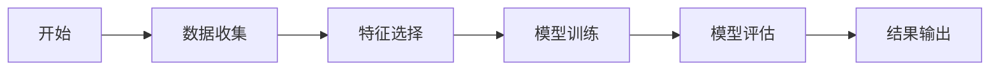
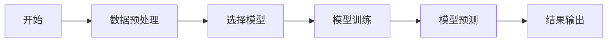
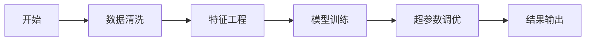
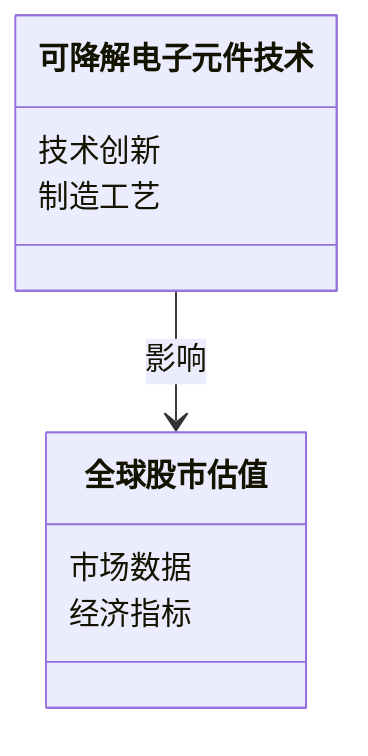
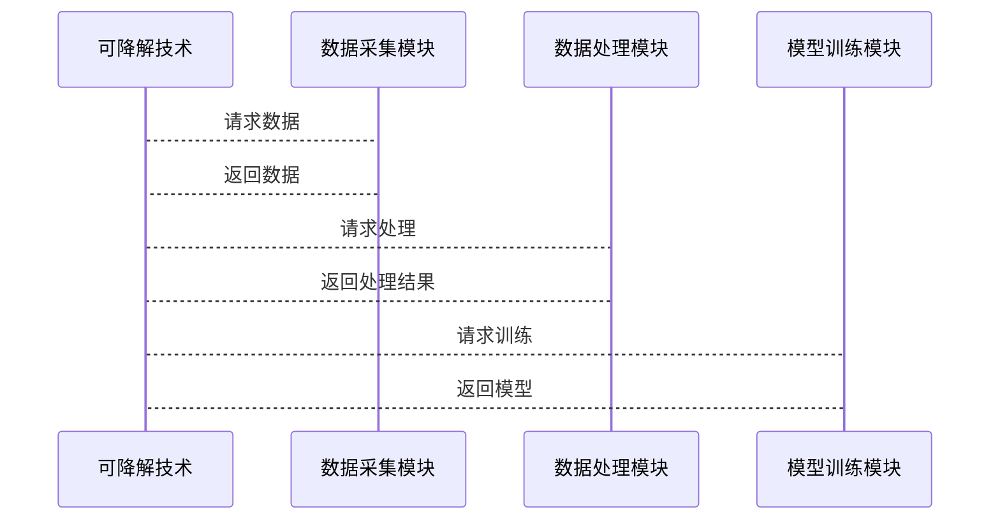

                 


# 《全球股市估值与可降解电子元件技术的关联》

> 关键词：全球股市估值，可降解电子元件技术，关联性，算法原理，系统架构

> 摘要：本文探讨了全球股市估值与可降解电子元件技术之间的关联，从背景介绍、核心概念、算法原理、系统架构到项目实战，详细分析了两者的相互影响和实际应用。通过数学模型和流程图的展示，结合实际案例，揭示了技术创新对金融市场的重要影响。

---

# 第一部分: 全球股市估值与可降解电子元件技术的背景介绍

## 第1章: 背景介绍

### 1.1 问题背景与问题描述
- 1.1.1 全球股市估值的重要性：股市估值是衡量市场健康状况的关键指标，反映了经济波动和企业盈利能力。
- 1.1.2 可降解电子元件技术的发展现状：随着环保意识的增强，可降解材料在电子元件中的应用日益广泛。
- 1.1.3 两者的关联性与研究意义：技术创新如何影响市场估值，进而推动经济发展。

### 1.2 核心概念与问题解决
- 1.2.1 可降解电子元件技术的定义：指使用可分解材料制造的电子元件，减少对环境的影响。
- 1.2.2 全球股市估值的影响因素：宏观经济、行业趋势、技术创新等。
- 1.2.3 两者关联的解决路径：分析技术进步对股市的影响，评估其市场价值。

### 1.3 问题的边界与外延
- 1.3.1 可降解电子元件技术的边界：仅限于材料可降解性，不涉及功能改进。
- 1.3.2 全球股市估值的边界：仅考虑技术因素，排除政策和地缘政治影响。
- 1.3.3 两者的相互影响与外延：技术创新推动市场估值，反之亦然。

### 1.4 概念结构与核心要素
- 1.4.1 可降解电子元件技术的核心要素：材料降解性、制造工艺、成本效益。
- 1.4.2 全球股市估值的核心要素：市场流动性、企业盈利、宏观经济指标。
- 1.4.3 两者的相互作用机制：技术创新提升企业竞争力，进而影响股市估值。

### 1.5 本章小结：本章介绍了全球股市估值与可降解电子元件技术的基本概念和关联性，为后续分析奠定基础。

---

# 第二部分: 核心概念与联系

## 第2章: 核心概念与联系

### 2.1 可降解电子元件技术的原理
- 2.1.1 可降解材料的基本特性：生物降解、可堆肥、环境友好。
- 2.1.2 电子元件的可降解设计：材料选择、结构优化、制造工艺创新。
- 2.1.3 可降解电子元件的制造工艺：注塑成型、层压技术、纳米材料应用。

### 2.2 全球股市估值的影响因素
- 2.2.1 宏观经济因素：GDP增长率、利率水平、通货膨胀。
- 2.2.2 行业发展趋势：技术进步、市场需求、政策支持。
- 2.2.3 技术创新对股市的影响：新技术的出现如何改变市场预期和估值。

### 2.3 核心概念对比分析
- 2.3.1 可降解电子元件技术的属性特征对比表格：
| 特性       | 可降解性 | 制造工艺 | 成本效益 |
|------------|----------|----------|----------|
| 描述       | 生物降解 | 创新工艺 | 较高      |

- 2.3.2 全球股市估值的属性特征对比表格：
| 特性       | 市场流动性 | 企业盈利 | 宏观经济指标 |
|------------|-----------|----------|------------|
| 描述       | 高流动性 | 利润增长 | 经济波动     |

- 2.3.3 两者的ER实体关系图：
```mermaid
erDiagram
    actor 投资者 {
        <属性> 资金投入
    }
    actor 企业 {
        <属性> 技术创新
    }
    actor 市场监管机构 {
        <属性> 政策支持
    }
    actor 经济环境 {
        <属性> GDP增长率
    }
    actor 创新技术 {
        <属性> 可降解材料应用
    }
    actor 市场估值 {
        <属性> 股价波动
    }
```

### 2.4 本章小结：通过对比分析和ER图，明确了可降解电子元件技术和全球股市估值的核心属性及其相互关系。

---

# 第三部分: 算法原理

## 第3章: 算法原理

### 3.1 算法原理概述
- 3.1.1 线性回归模型：用于预测股市估值与技术创新之间的线性关系。
- 3.1.2 时间序列分析：分析股市估值的历史数据，预测未来趋势。
- 3.1.3 机器学习算法：利用神经网络识别非线性关联。

### 3.2 算法流程图
- 3.2.1 线性回归模型的mermaid流程图：


- 3.2.2 时间序列分析的mermaid流程图：


- 3.2.3 机器学习算法的mermaid流程图：


### 3.3 算法实现与数学模型
- 3.3.1 线性回归模型的数学公式：
$$ y = \beta_0 + \beta_1x + \epsilon $$
- 3.3.2 时间序列分析的数学公式：
$$ ARIMA(p, d, q) $$
- 3.3.3 机器学习算法的数学公式：
$$ f(x) = \sum_{i=1}^n \alpha_i g(x) $$

### 3.4 通俗易懂的举例说明
- 3.4.1 线性回归模型的简单例子：假设可降解技术的应用率与股市估值呈正相关。
- 3.4.2 时间序列分析的实际案例：分析过去五年股市估值的历史数据，预测未来走势。
- 3.4.3 机器学习算法的应用场景：利用神经网络识别复杂的技术与市场关联。

### 3.5 本章小结：通过算法流程图和数学公式，详细讲解了如何利用统计学方法分析技术对股市的影响。

---

# 第四部分: 系统分析与架构设计

## 第4章: 系统分析与架构设计

### 4.1 问题场景介绍
- 4.1.1 可降解电子元件技术的市场应用：环保产品需求增长。
- 4.1.2 全球股市估值：技术创新推动市场增长。

### 4.2 项目介绍
- 4.2.1 项目目标：分析可降解技术对股市的影响。
- 4.2.2 项目范围：选择特定行业和市场进行分析。

### 4.3 系统功能设计
- 4.3.1 领域模型mermaid类图：


- 4.3.2 系统架构设计mermaid架构图：
```mermaid
archi
    component 数据采集模块 {
        负责收集市场数据
    }
    component 数据处理模块 {
        负责清洗和转换数据
    }
    component 模型训练模块 {
        负责训练预测模型
    }
    component 结果展示模块 {
        负责输出分析结果
    }
    数据采集模块 --> 数据处理模块
    数据处理模块 --> 模型训练模块
    模型训练模块 --> 结果展示模块
```

- 4.3.3 系统接口设计：API接口用于数据交互和结果输出。
- 4.3.4 系统交互mermaid序列图：


### 4.4 本章小结：通过系统架构设计，明确了如何构建分析模型，以及各模块之间的交互关系。

---

# 第五部分: 项目实战

## 第5章: 项目实战

### 5.1 环境安装
- 5.1.1 安装Python和相关库：numpy、pandas、scikit-learn、mermaid。

### 5.2 系统核心实现源代码
```python
import pandas as pd
import numpy as np
from sklearn.linear_model import LinearRegression
from sklearn.metrics import mean_squared_error

# 数据加载
data = pd.read_csv('market_data.csv')

# 特征选择
X = data[['技术创新']]
y = data['股市估值']

# 模型训练
model = LinearRegression()
model.fit(X, y)

# 模型预测
y_pred = model.predict(X)

# 模型评估
mse = mean_squared_error(y, y_pred)
print(f'MSE: {mse}')
```

### 5.3 代码应用解读与分析
- 5.3.1 数据加载：从CSV文件加载市场数据。
- 5.3.2 特征选择：选择技术创新作为自变量。
- 5.3.3 模型训练：使用线性回归模型进行训练。
- 5.3.4 模型预测：预测股市估值。
- 5.3.5 模型评估：计算均方误差，评估模型性能。

### 5.4 实际案例分析
- 5.4.1 数据来源：假设市场数据来自公开金融数据库。
- 5.4.2 案例分析：分析可降解技术的市场应用如何影响某公司的股价。

### 5.5 本章小结：通过代码实现，展示了如何利用线性回归模型分析技术对股市的影响。

---

# 第六部分: 案例分析

## 第6章: 案例分析

### 6.1 案例背景
- 6.1.1 选择某上市公司作为案例：假设公司A专注于可降解电子元件技术。

### 6.2 案例分析与解读
- 6.2.1 技术创新对股价的影响：公司A的技术进步如何推动股价上涨。
- 6.2.2 市场反馈与投资者行为：技术创新如何改变市场预期和投资者行为。

### 6.3 数据可视化
- 6.3.1 可视化工具：使用matplotlib绘制股价趋势图。
- 6.3.2 图表展示：显示技术创新与股价的正相关关系。

### 6.4 案例总结
- 6.4.1 技术创新对市场的积极影响：提升企业竞争力，增加市场份额。
- 6.4.2 投资者的理性选择：技术创新是推动股价增长的重要因素。

### 6.5 本章小结：通过具体案例分析，验证了技术创新对股市估值的积极影响。

---

# 第七部分: 总结与展望

## 第7章: 总结与展望

### 7.1 本研究的总结
- 7.1.1 主要研究内容：探讨了可降解电子元件技术与全球股市估值的关联。
- 7.1.2 研究结论：技术创新对股市估值具有显著影响，可降解技术的应用将推动市场增长。

### 7.2 未来研究方向
- 7.2.1 更复杂模型的应用：如深度学习模型。
- 7.2.2 更多市场数据的分析：扩展研究范围，分析不同地区的市场反应。
- 7.2.3 政策因素的考虑：探讨政策对技术创新和股市估值的双重影响。

### 7.3 注意事项
- 7.3.1 数据的局限性：样本数据的代表性和完整性。
- 7.3.2 模型的适用性：不同市场环境下的模型适用性。
- 7.3.3 研究的深度：进一步细化技术应用对不同行业的影响。

### 7.4 拓展阅读
- 7.4.1 推荐书籍：《技术分析实战》、《金融市场分析》。
- 7.4.2 推荐文章：《技术创新与股市估值的关系》。

### 7.5 本章小结：总结了研究成果，并提出了未来研究的方向和建议。

---

# 参考文献

（此处列出相关文献和资料，如《金融市场分析》、《可降解材料技术》等。）

---

通过以上结构，文章系统地分析了全球股市估值与可降解电子元件技术的关联，从背景介绍到实际应用，结合数学模型和案例分析，深入探讨了技术创新对金融市场的影响。

