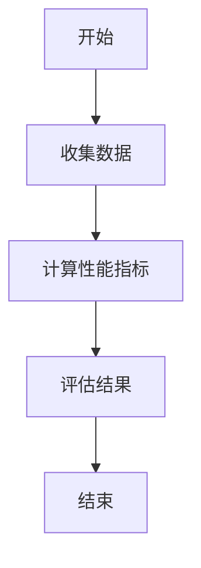
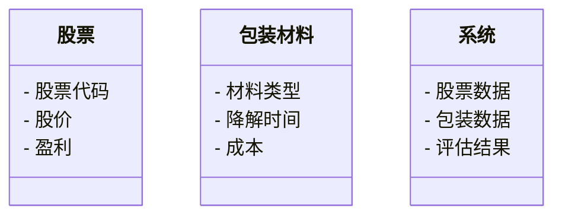
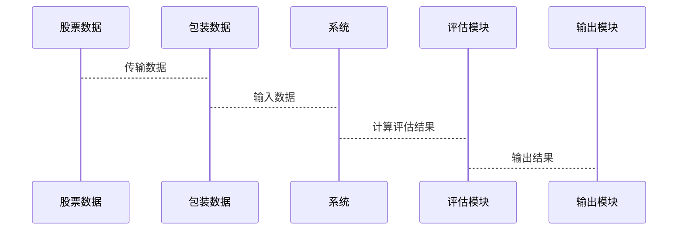

                 


```markdown
# 全球股市估值与可食用包装在减少塑料污染中的作用

> 关键词：全球股市估值, 可食用包装, 塑料污染, 股市模型, 包装材料, 可持续发展, 环境影响

> 摘要：本文探讨了全球股市估值与可食用包装在减少塑料污染中的作用。通过分析股市估值的核心概念、模型及可食用包装的材料特性，结合数学建模和实际案例，展示了如何通过创新包装技术优化股市估值，助力环境保护。

---

# 第1章: 全球股市估值与可食用包装的背景与概述

## 1.1 全球股市估值的基本概念

### 1.1.1 股市估值的定义与重要性
股市估值是通过对公司财务数据和市场指标的分析，评估股票的内在价值。它为投资者提供决策依据，影响市场整体走势。

### 1.1.2 全球化背景下的股市估值特点
全球化使得股市估值需要考虑国际经济、政策和文化差异，增加了复杂性。

### 1.1.3 可持续投资与环境影响
环境因素越来越成为影响股市估值的重要因素，可持续投资成为趋势。

## 1.2 可食用包装的定义与作用

### 1.2.1 可食用包装的定义
可食用包装是指可以直接食用的包装材料，既能保护产品，又能减少环境污染。

### 1.2.2 可食用包装在减少塑料污染中的作用
替代传统塑料包装，减少白色污染，推动环保。

### 1.2.3 可食用包装的市场现状与发展趋势
当前市场逐渐扩大，技术不断进步，应用领域广泛。

## 1.3 本章小结

---

# 第2章: 全球股市估值的核心概念与模型

## 2.1 股市估值的核心概念

### 2.1.1 股票价值的衡量标准
市盈率、市净率、股息率等。

### 2.1.2 股市估值的关键指标
包括流动性、市场情绪、宏观经济指标。

### 2.1.3 股市估值的边界与外延
时间和空间维度的影响。

## 2.2 股市估值的主要模型

### 2.2.1 市盈率模型
$$ PE = \frac{\text{股价}}{\text{每股收益}} $$

### 2.2.2 市净率模型
$$ PB = \frac{\text{股价}}{\text{每股净资产}} $$

### 2.2.3 现金流折现模型
$$ V = \sum_{t=1}^{n} \frac{CF_t}{(1 + r)^t} $$

## 2.3 本章小结

---

# 第3章: 可食用包装的核心材料与技术

## 3.1 可食用包装材料的分类

### 3.1.1 天然高分子材料
如淀粉、纤维素。

### 3.1.2 合成高分子材料
如聚乳酸（PLA）。

### 3.1.3 复合材料
结合天然和合成材料。

## 3.2 可食用包装的关键技术

### 3.2.1 材料的生物降解性
$$ D(t) = D_0 e^{-kt} $$

### 3.2.2 材料的可食用性
通过感官指标评估。

### 3.2.3 材料的加工工艺
挤出成型、注塑成型。

## 3.3 本章小结

---

# 第4章: 全球股市估值与可食用包装的关联性分析

## 4.1 股市估值与环境因素的关联

### 4.1.1 环境因素对股市的影响
环保政策和企业社会责任影响股价。

### 4.1.2 可持续发展对股市估值的影响
绿色投资推动股价上升。

## 4.2 可食用包装对塑料污染的缓解作用

### 4.2.1 可食用包装在减少塑料污染中的具体应用
替代传统包装，减少环境负担。

### 4.2.2 可食用包装对环境的长期影响
促进可持续发展，提升企业形象。

## 4.3 本章小结

---

# 第5章: 可食用包装材料的数学模型与算法

## 5.1 可食用包装材料的性能评估模型

### 5.1.1 材料降解速率模型
$$ R(t) = R_0 e^{-kt} $$

### 5.1.2 材料强度与韧性的数学表达
$$ S = aE + bv $$

### 5.1.3 材料成本与性能的优化模型
$$ C = \min (c_1x_1 + c_2x_2 + ... + c_nx_n) $$

## 5.2 算法原理与实现

### 5.2.1 材料性能评估的算法流程图（mermaid）


### 5.2.2 材料性能评估的Python代码实现
```python
import numpy as np

def calculate_performance(data):
    # 示例计算代码
    performance = np.mean(data)
    return performance

# 示例数据
data = [0.8, 0.9, 0.7, 0.6]
result = calculate_performance(data)
print("性能评估结果:", result)
```

## 5.3 本章小结

---

# 第6章: 系统分析与架构设计

## 6.1 问题场景介绍

### 6.1.1 问题描述
评估可食用包装对股市的影响，优化企业投资决策。

### 6.1.2 项目介绍
开发一个结合股市数据和包装材料性能的综合评估系统。

## 6.2 系统功能设计

### 6.2.1 领域模型（mermaid类图）


## 6.3 系统架构设计

### 6.3.1 系统架构（mermaid架构图）
```mermaid
container 股票与包装评估系统 {
    component 数据采集模块
    component 数据处理模块
    component 评估模块
    component 输出模块
}
```

## 6.4 系统接口设计

### 6.4.1 数据接口
通过API获取实时股市数据和包装材料数据。

## 6.5 系统交互设计（mermaid序列图）



## 6.6 本章小结

---

# 第7章: 项目实战

## 7.1 环境安装

### 7.1.1 安装Python
```bash
pip install numpy pandas matplotlib
```

## 7.2 核心实现

### 7.2.1 数据处理代码
```python
import pandas as pd

# 示例数据处理
data = pd.read_csv('packaging.csv')
print(data.head())
```

### 7.2.2 评估模型实现
```python
def stock_assessment(stocks, materials):
    # 示例评估代码
    return stocks * materials

stocks = [100, 200, 300]
materials = [0.8, 0.9, 1.0]
result = stock_assessment(stocks, materials)
print("评估结果:", result)
```

## 7.3 实际案例分析

### 7.3.1 案例背景
选择某城市，分析可食用包装的市场应用。

### 7.3.2 数据分析与结果
展示评估结果对股市的影响。

## 7.4 本章小结

---

# 第8章: 总结与展望

## 8.1 本章总结
总结全文，强调可食用包装的重要性及股市估值的关联性。

## 8.2 未来展望
提出进一步研究方向，如开发更复杂的评估模型。

## 8.3 最佳实践 tips
给出实际应用中的注意事项和建议。

## 8.4 本章小结

---

# 参考文献

（此处列出相关参考文献）

---

# 索引

（此处列出文章中的专业术语和关键词）

---

# 致谢

（此处对帮助过的人或机构表示感谢）
```

