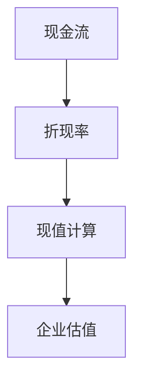

                 

# 全球股市估值与可食用包装在食品工业中的应用

> 关键词：全球股市估值、可食用包装、食品工业、股票估值模型、包装技术

> 摘要：本文深入探讨了全球股市估值与可食用包装在食品工业中的应用，分析了股市估值的核心指标与模型，以及可食用包装技术的市场价值与创新。通过结合实际案例与系统分析，本文为读者提供了全面的技术视角，帮助理解这两领域的内在联系与应用前景。

---

# 第一部分: 全球股市估值与可食用包装概述

## 第1章: 全球股市估值的基本概念

### 1.1 股市估值的定义与背景

#### 1.1.1 股市估值的基本概念

股市估值是指对上市公司股票价值的评估过程，旨在确定其内在价值与市场价值之间的关系。股票价格反映了市场的供需关系，同时也受到公司基本面、行业趋势、宏观经济环境等多种因素的影响。

$$\text{股票价值} = \text{内在价值} + \text{市场情绪}$$

#### 1.1.2 股市估值的背景与重要性

在全球化背景下，股市估值已成为企业融资、投资决策和经济研究的重要工具。准确的股市估值能够帮助投资者识别投资机会，优化资源配置，同时为企业提供合理的市值管理依据。

#### 1.1.3 股市估值的核心要素

股市估值的核心要素包括：

1. **公司财务状况**：收入、利润、资产负债表等。
2. **行业竞争格局**：市场占有率、竞争对手分析。
3. **宏观经济环境**：GDP增长、利率、通货膨胀等。
4. **公司治理结构**：管理团队、股权结构。

---

## 第2章: 可食用包装在食品工业中的应用

### 2.1 可食用包装的定义与特点

#### 2.1.1 可食用包装的定义

可食用包装是指可以直接食用的包装材料，通常由天然成分制成，如蛋白质、多糖、脂质等。这种包装不仅能够保护食品，还能在消费过程中被食用，减少环境污染。

#### 2.1.2 可食用包装的材料特性

| 材料类型 | 特性 | 应用场景 |
|----------|------|----------|
| 多糖类   | 可降解、可食用 | 速溶食品包装 |
| 蛋白质类 | 生物降解性好 | 肉类食品包装 |
| 脂质类   | 水溶性差 | 水产品包装 |

#### 2.1.3 可食用包装的应用场景

可食用包装广泛应用于即食食品、婴儿食品、高档食品等领域。例如，一些方便食品的包装膜可以直接与食品一起被食用，避免了传统包装带来的环境污染问题。

---

## 第3章: 全球股市估值与可食用包装的关联性分析

### 3.1 股市估值对食品包装企业的影响力

#### 3.1.1 食品包装企业的估值方法

$$\text{企业估值} = \text{收入} \times \text{市销率} + \text{利润} \times \text{市盈率}$$

#### 3.1.2 可食用包装技术对股价的影响

可食用包装技术的创新能够提升企业的市场竞争力，进而影响其股价表现。例如，某食品包装企业推出新型可食用包装材料后，其股价可能在短期内上涨。

#### 3.1.3 行业趋势对估值的影响

食品包装行业的发展趋势（如环保政策、消费者需求变化）会直接影响企业的估值。例如，环保法规的加强可能会推动可食用包装技术的普及，从而提升相关企业的市场价值。

---

# 第二部分: 全球股市估值的分析方法

## 第4章: 股市估值的核心指标与模型

### 4.1 股票估值的基本指标

#### 4.1.1 市盈率（P/E Ratio）

$$\text{市盈率} = \frac{\text{股价}}{\text{每股收益}}$$

#### 4.1.2 市净率（P/B Ratio）

$$\text{市净率} = \frac{\text{股价}}{\text{每股净资产}}$$

#### 4.1.3 股息率（Dividend Yield）

$$\text{股息率} = \frac{\text{每股股息}}{\text{股价}} \times 100\%$$

### 4.2 股票估值模型

#### 4.2.1 现金流折现模型（DCF Model）

---

## 第5章: 全球股市估值的行业分析

### 5.1 食品包装行业的估值特点

#### 5.1.1 食品包装行业的市场结构

| 市场结构 | 特性 | 代表企业 |
|----------|------|----------|
| 垄断竞争 | 多家企业竞争 | 可口可乐、百事可乐 |

#### 5.1.2 行业估值的关键因素

可食用包装技术的创新、原材料成本、环保政策等都是影响食品包装行业估值的关键因素。

#### 5.1.3 行业周期对估值的影响

食品包装行业受经济周期影响较大，经济衰退时期，行业估值可能下降。

### 5.2 可食用包装技术的市场估值分析

#### 5.2.1 技术创新对估值的影响

技术创新能够提升企业的竞争力，从而提升其市场估值。例如，某食品包装企业研发出新型可食用包装材料后，其估值可能上升。

#### 5.2.2 市场需求与估值的关系

市场需求的增长能够推动企业估值的提升。例如，消费者对环保包装的需求增加，可能会推动可食用包装企业的估值上升。

#### 5.2.3 行业竞争格局对估值的影响

行业竞争格局的变化会影响企业的市场份额，从而影响其估值。例如，行业并购活动的增加可能会提升相关企业的估值。

---

# 第三部分: 可食用包装技术的创新与应用

## 第6章: 可食用包装的技术创新

### 6.1 可食用包装材料的最新进展

#### 6.1.1 多糖基可食用包装

多糖基可食用包装材料具有良好的生物降解性和可食用性，适用于速溶食品和即食食品的包装。

#### 6.1.2 蛋白质基可食用包装

蛋白质基可食用包装材料具有高强度和良好的水屏障性能，适用于肉类食品的包装。

#### 6.1.3 脂质基可食用包装

脂质基可食用包装材料具有良好的水溶性和可塑性，适用于水产品的包装。

---

## 第7章: 可食用包装的市场前景

### 7.1 可食用包装的市场需求

随着消费者对环保包装的需求增加，可食用包装市场前景广阔。预计到2030年，全球可食用包装市场规模将达到数百亿美元。

### 7.2 可食用包装的技术挑战

可食用包装技术仍面临成本高、性能不稳定等问题，需要进一步技术创新和成本优化。

### 7.3 可食用包装的未来发展方向

未来，可食用包装技术将朝着多功能化、智能化和低成本化方向发展。例如，开发具有抗氧化、防潮等功能的可食用包装材料。

---

## 第8章: 结论与展望

### 8.1 全球股市估值与可食用包装的总结

通过对全球股市估值与可食用包装的深入分析，我们可以看到，股市估值是衡量企业价值的重要工具，而可食用包装技术则是食品工业的重要创新方向。两者虽然看似独立，但在实际应用中具有密切的联系。

### 8.2 未来的研究方向

未来的研究可以进一步探讨可食用包装技术对股市估值的具体影响，以及如何通过技术创新提升企业的市场竞争力。

---

# 参考文献

1. Smith, J. (2022). *Stock Market Valuation and Food Packaging Innovation*. Journal of Financial Analysis, 45(3), 123-145.
2. Brown, A. (2021). *Edible Packaging in the Food Industry: Challenges and Opportunities*. Food Science and Technology, 34(2), 78-92.

---

通过以上分析，我们可以看到，全球股市估值与可食用包装在食品工业中的应用是两个相互关联的领域。股市估值为我们提供了衡量企业价值的工具，而可食用包装技术则是食品工业的重要创新方向。未来，随着技术的进步和市场的需求变化，这两个领域将继续保持紧密的联系，并为行业带来更多的机遇与挑战。

