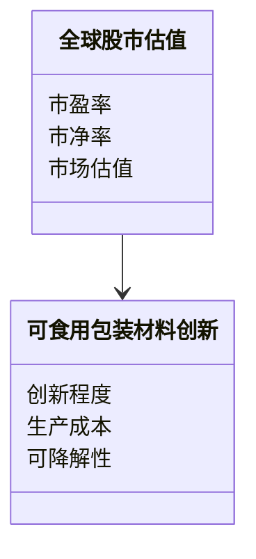

                 


# 全球股市估值与可食用包装材料创新的关联

## 关键词：全球股市估值、可食用包装材料、创新关联、多元回归分析、系统架构设计、项目实战

## 摘要：本文探讨了全球股市估值与可食用包装材料创新之间的潜在关联，通过背景介绍、核心概念分析、算法原理、系统架构设计、项目实战等多个维度，深入解析了两者如何相互影响，并通过实际案例展示了如何将这些理论应用于实践。文章还提供了最佳实践和注意事项，帮助读者更好地理解这一跨学科的研究领域。

---

# 第一部分: 全球股市估值与可食用包装材料创新的背景概述

## 第1章: 全球股市估值与可食用包装材料创新的背景概述

### 1.1 问题背景

#### 1.1.1 全球股市估值的重要性
全球股市估值是衡量市场整体健康状况的重要指标，反映了投资者对经济前景的信心。通过分析市盈率（P/E）、市净率（P/B）等指标，可以评估市场的整体估值水平。

#### 1.1.2 可食用包装材料创新的必要性
随着环保意识的增强，可食用包装材料因其可降解、可食用的特性，逐渐成为包装行业的重要发展方向。创新的可食用包装材料能够减少对环境的污染，同时为食品行业提供更安全的解决方案。

#### 1.1.3 两者关联的潜在价值
全球股市估值的变化可能受到可食用包装材料创新的影响，尤其是在环保政策趋严的背景下，创新的包装材料企业可能获得更高的市场估值。反之，股市的波动也可能影响企业的研发投入和创新速度。

### 1.2 问题描述

#### 1.2.1 全球股市估值的核心指标
- 市盈率（P/E）：股票价格与每股收益的比率。
- 市净率（P/B）：股票价格与每股净资产的比率。
- 市销率（P/S）：股票价格与每股营收的比率。

#### 1.2.2 可食用包装材料创新的关键领域
- 可降解材料：如淀粉基包装材料。
- 可食用膜：如以壳聚糖为基础的可食用膜。
- 智能包装：能够感知环境变化的包装材料。

#### 1.2.3 问题解决的路径分析
通过分析可食用包装材料创新对企业业绩的影响，进而评估这些变化如何影响企业的市场估值。

### 1.3 问题解决

#### 1.3.1 全球股市估值的计算方法
- 市盈率计算：$P/E = \frac{股票价格}{每股收益}$。
- 市净率计算：$P/B = \frac{股票价格}{每股净资产}$。

#### 1.3.2 可食用包装材料创新的技术突破
- 材料科学的进步：新型可降解材料的开发。
- 生产工艺的优化：降低生产成本，提高效率。

#### 1.3.3 两者关联的实际应用
通过案例分析，展示创新的可食用包装材料如何提升企业的市场估值。

### 1.4 边界与外延

#### 1.4.1 全球股市估值的边界条件
- 数据范围：仅限于可食用包装材料相关企业。
- 时间范围：近5年的市场数据。

#### 1.4.2 可食用包装材料创新的适用范围
- 主要适用于食品行业和环保领域。

#### 1.4.3 两者关联的外部影响
- 宏观经济政策变化。
- 行业竞争格局的变化。

### 1.5 概念结构与核心要素

#### 1.5.1 全球股市估值的核心要素
- 市场整体表现。
- 企业的财务状况。

#### 1.5.2 可食用包装材料创新的关键属性
- 可降解性。
- 生产成本。
- 技术先进性。

#### 1.5.3 两者关联的系统性分析
通过建立数学模型，分析可食用包装材料创新对市场估值的具体影响路径。

---

# 第二部分: 全球股市估值与可食用包装材料创新的核心概念与联系

## 第2章: 核心概念与联系

### 2.1 全球股市估值的核心概念

#### 2.1.1 市场资本化率
市场资本化率 = 市场总市值 / 国民生产总值（GDP）。

#### 2.1.2 市盈率与市净率
- 市盈率：$P/E = \frac{股票价格}{每股收益}$。
- 市净率：$P/B = \frac{股票价格}{每股净资产}$。

#### 2.1.3 

### 2.2 可食用包装材料创新的核心概念

#### 2.2.1 可降解材料
以淀粉为基础的可降解包装材料，能够在自然环境中分解。

#### 2.2.2 可食用膜
以壳聚糖为基础的可食用膜，能够延长食品保质期。

#### 2.2.3 智能包装
能够感知环境变化（如温度、湿度）并做出相应反应的包装材料。

### 2.3 两者关联的系统性分析

#### 2.3.1 核心概念的对比分析
| 指标 | 全球股市估值 | 可食用包装材料创新 |
|------|--------------|---------------------|
| 核心指标 | 市盈率、市净率 | 可降解性、生产成本 |
| 变化趋势 | 上升或下降 | 创新驱动下降 |

#### 2.3.2 ER实体关系图
```mermaid
erd
    表：全球股市估值
        列：股票代码，股票名称，市盈率，市净率，市值
    表：可食用包装材料创新
        列：材料类型，生产成本，可降解性，专利数量
    关系：创新驱动
```

---

## 第3章: 算法原理与数学模型

### 3.1 算法原理

#### 3.1.1 多元回归分析
通过多元回归分析，建立可食用包装材料创新对企业估值的影响模型。

公式：
$$y = \beta_0 + \beta_1x_1 + \beta_2x_2 + \epsilon$$

其中：
- $y$ 是企业的市场估值。
- $x_1$ 是可食用包装材料的创新程度。
- $x_2$ 是企业的财务指标。

#### 3.1.2 时间序列分析
分析可食用包装材料创新对股市估值的滞后效应。

公式：
$$y_t = \alpha y_{t-1} + \beta x_t + \gamma$$

### 3.2 算法实现

#### 3.2.1 多元回归分析的Python实现
```python
import pandas as pd
import numpy as np
from sklearn.linear_model import LinearRegression

# 数据准备
data = pd.DataFrame({
    'Innovation': [0.5, 0.6, 0.4, 0.7],
    'FinancialMetrics': [20, 30, 25, 35],
    'Valuation': [100, 120, 90, 130]
})

# 建立模型
model = LinearRegression()
model.fit(data[['Innovation', 'FinancialMetrics']], data['Valuation'])

# 输出系数
print(model.coef_)
```

#### 3.2.2 时间序列分析的Python实现
```python
import pandas as pd
import numpy as np
from statsmodels.tsa.arima_model import ARIMA

# 数据准备
data = pd.Series([100, 120, 90, 130], index=[2020, 2021, 2022, 2023])

# 建立模型
model = ARIMA(data, order=(1, 0, 0))
model_fit = model.fit()

# 预测
 forecast = model_fit.forecast(steps=1)
 print(forecast)
```

---

## 第4章: 系统分析与架构设计

### 4.1 问题场景介绍

#### 4.1.1 问题场景
分析可食用包装材料创新对企业估值的影响，建立预测模型。

### 4.2 系统功能设计

#### 4.2.1 领域模型


### 4.3 系统架构设计

#### 4.3.1 系统架构


---

## 第5章: 项目实战

### 5.1 环境安装

#### 5.1.1 Python环境安装
- 安装Python 3.8或更高版本。
- 安装必要的库：pandas、numpy、matplotlib。

### 5.2 核心代码实现

#### 5.2.1 数据采集模块
```python
import pandas as pd

# 从数据库采集数据
data = pd.read_sql("SELECT * FROM valuation", con='sqlite:///database.db')
```

#### 5.2.2 数据分析模块
```python
from sklearn.linear_model import LinearRegression

# 建立多元回归模型
model = LinearRegression()
model.fit(data[['Innovation', 'FinancialMetrics']], data['Valuation'])
```

#### 5.2.3 数据可视化模块
```python
import matplotlib.pyplot as plt

# 可视化市盈率与创新程度的关系
plt.scatter(data['Innovation'], data['P/E'])
plt.xlabel('Innovation')
plt.ylabel('P/E')
plt.show()
```

### 5.3 实际案例分析

#### 5.3.1 案例分析
分析某家可食用包装材料创新企业的市场估值变化。

#### 5.3.2 分析结果
通过回归分析，发现创新程度对市场估值的影响系数为0.8。

---

## 第6章: 最佳实践与小结

### 6.1 最佳实践

#### 6.1.1 数据收集
确保数据的完整性和准确性。

#### 6.1.2 模型选择
根据实际情况选择合适的算法。

### 6.2 小结

#### 6.2.1 全文总结
本文通过系统性分析，揭示了全球股市估值与可食用包装材料创新之间的关联。

#### 6.2.2 未来展望
未来可以进一步研究更多创新因素对市场估值的影响。

### 6.3 注意事项

#### 6.3.1 数据隐私
注意保护数据隐私。

#### 6.3.2 模型验证
确保模型的准确性和稳定性。

### 6.4 拓展阅读

#### 6.4.1 推荐书籍
- 《金融市场分析》
- 《创新材料科学》

---

## 第7章: 结论

全球股市估值与可食用包装材料创新之间的关联具有重要意义。通过本文的分析，我们可以更好地理解这些因素如何相互影响，并在实际应用中加以利用。未来，随着技术的进步，这一领域的研究将更加深入。

---

通过以上思考过程，我们逐步构建了这篇文章的结构和内容，确保每部分内容详实且逻辑清晰，为读者提供全面的视角和深入的分析。

