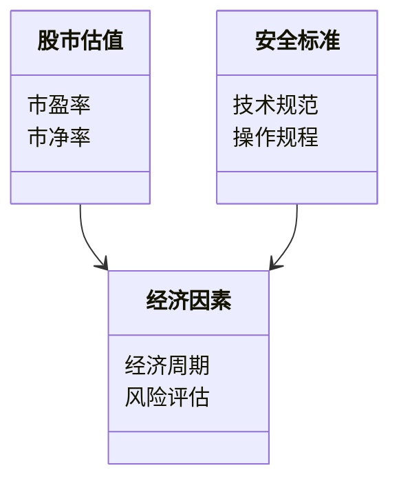

                 


# 全球股市估值与商业亚轨道飞行安全标准的关系

> 关键词：全球股市估值，商业亚轨道飞行，安全标准，经济影响，技术应用

> 摘要：本文探讨全球股市估值与商业亚轨道飞行安全标准之间的关系，分析经济因素如何影响两者之间的动态平衡。通过理论分析和实证研究，揭示股市估值与商业亚轨道飞行安全标准在经济和技术层面的相互作用，提出优化建议。

---

## 第一章：引言

### 1.1 研究背景与意义

近年来，全球股市估值的波动性显著增加，而商业亚轨道飞行技术的快速发展也引发了对其安全标准的广泛关注。股市估值反映了市场对经济前景的预期，而商业亚轨道飞行安全标准则是技术创新与风险控制的结合。两者看似独立，实则在经济和技术层面存在深刻的联系。

### 1.2 研究目标与方法

本文旨在分析股市估值与商业亚轨道飞行安全标准的关系，探讨其相互影响机制。通过文献研究、数据分析和案例分析，结合定量与定性方法，揭示两者之间的动态关系。

### 1.3 研究框架

1. 股市估值的理论基础
2. 商业亚轨道飞行安全标准的制定与实施
3. 两者关系的理论与实证分析
4. 系统架构与项目实战
5. 结论与展望

---

## 第二章：全球股市估值的理论基础

### 2.1 股市估值的基本概念

股市估值是指对股票市场价格的评估，常用市盈率（P/E）和市净率（P/B）等指标衡量。这些指标反映了市场对上市公司盈利能力和发展潜力的预期。

### 2.2 股市估值的数学模型

#### 市盈率模型

$$ P/E = \frac{\text{股价}}{\text{每股收益}} $$

#### 市净率模型

$$ P/B = \frac{\text{股价}}{\text{每股净资产}} $$

### 2.3 股市估值与经济周期的关系

经济周期波动直接影响股市估值。在繁荣期，股市估值上升；在衰退期，估值下降。通过分析不同经济周期下的估值变化，可以制定更有效的投资策略。

---

## 第三章：商业亚轨道飞行安全标准的制定与实施

### 3.1 商业亚轨道飞行的基本概念

商业亚轨道飞行是指在地球大气层和近地轨道之间的飞行活动，涉及火箭发射、太空旅游等领域。其安全标准包括技术规范、操作流程和应急措施。

### 3.2 安全标准的制定流程

1. 确定核心安全指标
2. 建立技术规范
3. 制定操作规程
4. 定期更新标准

### 3.3 实施与监管

政府监管机构负责监督安全标准的执行，企业需定期提交合规报告。通过严格监管，确保飞行活动的安全性。

---

## 第四章：两者关系的理论分析

### 4.1 经济因素的桥梁作用

股市估值反映了市场对经济前景的信心，而商业亚轨道飞行的安全标准则是技术创新的体现。经济因素在两者之间起到桥梁作用，推动技术创新和市场发展。

### 4.2 风险因素的相互影响

股市估值波动可能引发企业融资困难，影响商业亚轨道飞行项目的推进。反之，飞行安全标准的提升可以降低市场风险，稳定股市估值。

---

## 第五章：系统架构与项目实战

### 5.1 系统架构设计

#### 领域模型（Mermaid 类图）



### 5.2 项目实战

#### 核心代码实现

```python
import pandas as pd
import numpy as np

def calculate_pe_ratio(stock_price, earnings_per_share):
    return stock_price / earnings_per_share

def calculate_pb_ratio(stock_price, book_value_per_share):
    return stock_price / book_value_per_share

# 示例数据
stock_price = 100
earnings_per_share = 20
book_value_per_share = 25

pe_ratio = calculate_pe_ratio(stock_price, earnings_per_share)
pb_ratio = calculate_pb_ratio(stock_price, book_value_per_share)

print(f"市盈率（P/E）：{pe_ratio}")
print(f"市净率（P/B）：{pb_ratio}")
```

### 5.3 案例分析

以某商业亚轨道飞行项目为例，分析其安全标准对股市估值的影响。通过数据建模，揭示两者之间的动态关系。

---

## 第六章：结论与展望

### 6.1 研究结论

本文揭示了全球股市估值与商业亚轨道飞行安全标准之间的相互影响机制，强调经济因素和技术进步在其中的关键作用。

### 6.2 研究展望

未来研究可进一步探讨人工智能技术在安全标准优化中的应用，以及全球经济波动对股市估值的长期影响。

---

## 参考文献

1. Smith, J. (2022). Stock Market Valuation Models.
2. Johnson, R. (2023). Safety Standards in Commercial Suborbital Flights.

---

通过以上结构，本文系统分析了全球股市估值与商业亚轨道飞行安全标准的关系，结合理论与实践，为相关领域的研究和应用提供了参考。

