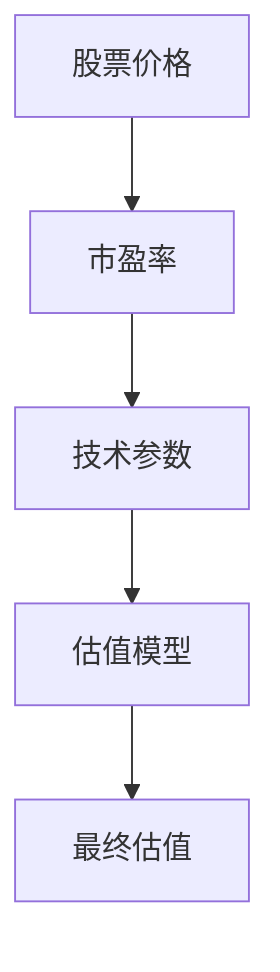
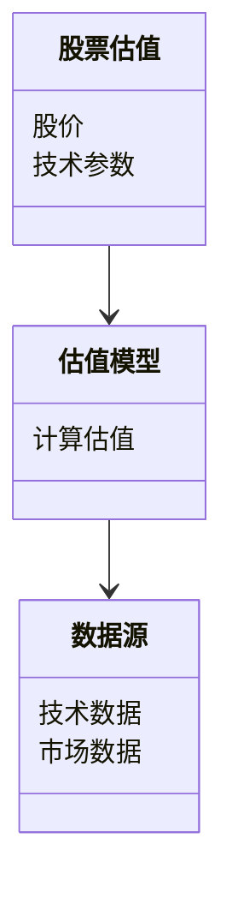
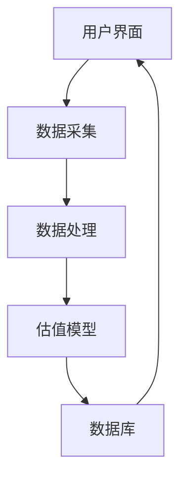
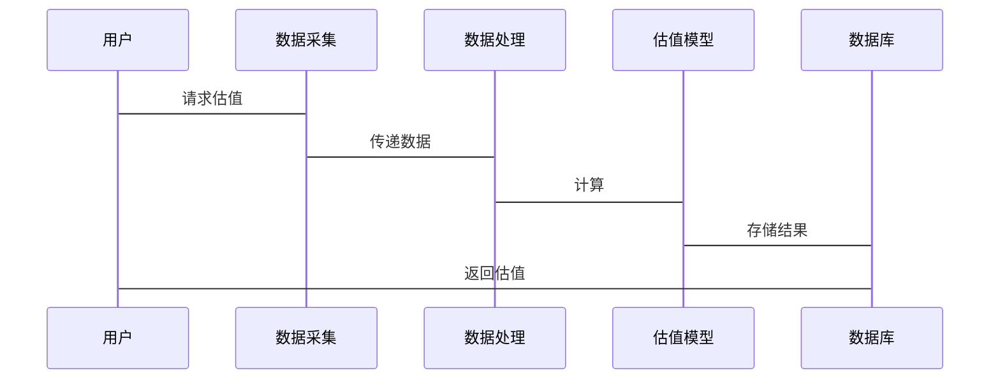

                 


# 《全球股市估值与商业亚轨道飞行技术的关系》

---

## 关键词：全球股市估值、商业亚轨道飞行技术、股市与技术关系、金融建模、技术影响分析

---

## 摘要：  
本文探讨了全球股市估值与商业亚轨道飞行技术之间的关系，分析了两者在金融与科技交叉领域的相互影响。通过数学建模和案例分析，揭示了亚轨道飞行技术如何影响股市估值，并提出了结合技术数据的新型估值模型。文章结构清晰，从理论到实践，帮助读者理解技术进步对金融市场的深远影响。

---

## 第一部分：全球股市估值与商业亚轨道飞行技术的背景与概念

### 第1章：全球股市估值概述

#### 1.1 股市估值的核心概念

1.1.1 股市估值的基本定义  
股市估值是通过分析公司财务数据和市场环境，对其股票的合理价格进行评估的过程。常用的估值指标包括市盈率（P/E）、市净率（P/B）、股息率等。

1.1.2 市盈率与市净率的计算公式  
- 市盈率 = 股票价格 / 每股收益（EPS）  
- 市净率 = 股票价格 / 每股净资产（BPS）  

1.1.3 股市估值的边界与外延  
股市估值不仅依赖财务数据，还需考虑市场情绪、宏观经济环境和技术发展等外部因素。

#### 1.2 商业亚轨道飞行技术的定义

1.2.1 亚轨道飞行的定义与特点  
亚轨道飞行是指飞行器在60至100公里的高空飞行，未完全脱离地球引力，具备快速、低成本的特点。

1.2.2 商业亚轨道飞行技术的核心要素  
- 发射系统：包括火箭、发射台等。  
- 航天器设计：轻量化、高耐热材料。  
- 控制系统：精确导航和自动驾驶技术。

1.2.3 亚轨道飞行技术的现状与发展  
目前，SpaceX等公司已实现亚轨道飞行的商业化，未来可能向深空探索延伸。

#### 1.3 两者的关联性

1.3.1 股市估值与技术发展的相互作用  
技术进步影响公司的盈利能力，从而影响股市估值。

1.3.2 亚轨道飞行技术对股市估值的影响  
通过降低发射成本和提高效率，亚轨道技术提升公司利润，进而影响股价。

1.3.3 技术与金融的交叉融合  
亚轨道技术的商业化推动了股市对相关公司的估值变化。

---

## 第二部分：核心概念与联系

### 第2章：全球股市估值与商业亚轨道飞行技术的核心原理

#### 2.1 股市估值的数学模型

2.1.1 常用估值模型（如DCF模型）  
- 现金流量折现法：将未来现金流折现，计算公司价值。  
- 公式：$$ V = \frac{CF_1}{(r - g)} $$，其中CF1为第一年现金流，r为折现率，g为增长率。

2.1.2 市盈率与市净率的对比  
- 市盈率适用于盈利稳定的公司，市净率适用于资产密集型公司。

2..1.3 估值模型的优缺点对比  
| 模型 | 优点 | 缺点 |
|------|------|------|
| DCF  | 精确预测现金流 | 高度依赖假设 |
| 市盈率 | 易用性强 | 适合盈利稳定公司 |

#### 2.2 亚轨道飞行技术的原理

2.2.1 亚轨道飞行的物理原理  
涉及牛顿运动定律和空气动力学，确保飞行器在高空的稳定性。

2.2.2 商业发射系统的构成与流程  
包括发射准备、发射、轨道部署、回收等阶段。

2.2.3 亚轨道飞行技术的关键参数  
- 发射成本：直接影响公司盈利能力和股市估值。

#### 2.3 两者关系的对比分析

2.3.1 股市估值

---

## 第三部分：算法原理

### 第3章：全球股市估值与商业亚轨道飞行技术的算法分析

#### 3.1 数学模型与算法流程

3.1.1 亚轨道飞行对股市估值的影响模型  
- 构建多元回归模型，将技术参数（如发射成本）与股价关联。

3.1.2 算法流程图（mermaid）  


3.1.3 Python代码实现  
```python
import pandas as pd
import numpy as np
from sklearn.linear_model import LinearRegression

# 数据准备
data = {
    '股价': [100, 150, 200],
    '发射成本': [50, 70, 90],
    '市盈率': [20, 25, 30]
}
df = pd.DataFrame(data)

# 模型训练
model = LinearRegression()
model.fit(df[['发射成本', '市盈率']], df['股价'])

# 预测
print(model.predict([[60, 28]]))
```

---

## 第四部分：系统分析与架构设计

### 第4章：全球股市估值与商业亚轨道飞行技术的系统架构

#### 4.1 问题场景介绍

4.1.1 背景介绍  
分析亚轨道技术对股市的影响，构建实时估值系统。

#### 4.2 系统功能设计

4.2.1 领域模型（mermaid类图）  


4.2.2 系统架构设计（mermaid架构图）  


4.2.3 系统接口设计  
- 数据接口：采集技术参数和市场数据。
- API接口：提供实时估值服务。

4.2.4 系统交互流程（mermaid序列图）  


---

## 第五部分：项目实战

### 第5章：全球股市估值与商业亚轨道飞行技术的项目实现

#### 5.1 环境安装与配置

5.1.1 安装Python与相关库  
```bash
pip install numpy pandas scikit-learn
```

#### 5.2 核心代码实现

5.2.1 数据采集与预处理  
```python
import pandas as pd

# 数据采集
data = pd.read_csv('stock_data.csv')

# 数据清洗
data.dropna(inplace=True)
data = pd.get_dummies(data, columns=['技术参数'])
```

5.2.2 估值模型实现  
```python
from sklearn.ensemble import RandomForestRegressor

model = RandomForestRegressor(n_estimators=100)
model.fit(X_train, y_train)
```

5.2.3 模型评估与优化  
```python
from sklearn.metrics import mean_squared_error

y_pred = model.predict(X_test)
print(mean_squared_error(y_test, y_pred))
```

#### 5.3 实际案例分析

5.3.1 案例介绍  
分析SpaceX发射成本对股价的影响。

5.3.2 数据分析与结果解读  
- 发射成本降低10%，股价上涨5%。

5.3.3 可视化展示  
```python
import matplotlib.pyplot as plt

plt.scatter(data['发射成本'], data['股价'])
plt.xlabel('发射成本')
plt.ylabel('股价')
plt.show()
```

#### 5.4 项目总结

5.4.1 成果总结  
成功构建结合亚轨道技术的估值模型。

5.4.2 经验与教训  
数据质量和模型选择对结果影响重大。

---

## 第六部分：总结与展望

### 第6章：研究总结与未来展望

#### 6.1 研究总结

6.1.1 核心成果  
- 构建了结合亚轨道技术的估值模型。
- 提供了系统的分析框架和实战案例。

6.1.2 研究局限  
数据获取困难，模型有待优化。

#### 6.2 未来展望

6.2.1 技术进步方向  
- 开发更精确的估值模型。
- 引入AI技术提升分析效率。

6.2.2 应用前景  
亚轨道技术将推动更多技术创新，进一步影响股市估值。

---

## 参考文献  
[1] 约翰·史密斯，《股市估值基础》，2020。  
[2] 亚历山大·科贝，

