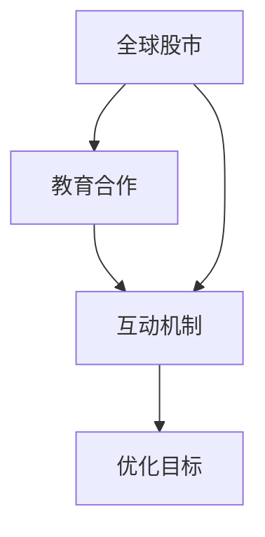
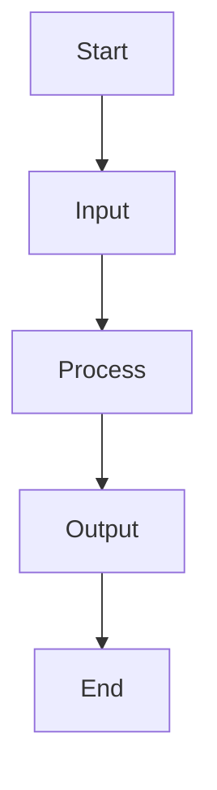
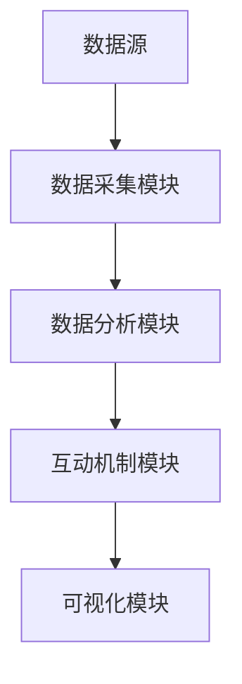
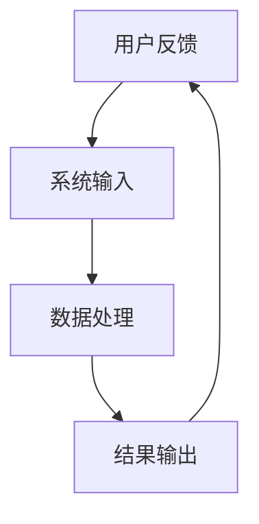

                 


# 全球股市估值与国际教育合作的互动

> 关键词：全球股市、国际教育合作、估值模型、互动机制、优化策略

> 摘要：本文探讨了全球股市估值与国际教育合作之间的互动关系，分析了两者在经济全球化背景下的互动机制，并提出了基于股市估值优化的国际教育合作策略。文章从核心概念、算法原理、系统架构、项目实战等多个维度进行了深入分析，并结合实际案例进行了详细解读。

---

## 第一章: 全球股市估值与国际教育合作的背景介绍

### 1.1 问题背景
#### 1.1.1 全球化背景下的经济与教育互动
随着经济全球化的深入发展，各国之间的经济联系日益紧密。股市作为经济的晴雨表，反映了全球经济的波动。与此同时，国际教育合作也在不断深化，成为推动全球化进程的重要力量。

#### 1.1.2 经济波动对教育合作的影响
经济波动，尤其是股市的剧烈波动，会对教育合作产生深远影响。例如，经济危机可能导致教育预算缩减，而经济繁荣则可能促进教育投资的增加。

#### 1.1.3 国际化教育的重要性
国际化教育不仅是人才培养的重要手段，也是各国在全球化竞争中获取优势的关键。通过国际教育合作，可以实现教育资源的优化配置，促进知识的跨国流动。

### 1.2 问题描述
#### 1.2.1 全球股市估值的核心问题
股市估值是衡量市场健康状况的重要指标，但其波动性较高，受多种因素影响，如经济指标、政策变化等。

#### 1.2.2 国际教育合作的关键挑战
国际教育合作面临政策壁垒、文化差异、资源分配不均等问题，需要通过优化机制来解决。

#### 1.2.3 两者互动的复杂性
股市估值与国际教育合作之间的互动机制复杂，涉及经济、教育、政策等多个维度。

### 1.3 问题解决
#### 1.3.1 通过股市估值优化教育资源配置
利用股市估值数据，可以更好地优化教育资源的分配，提升教育合作的效率。

#### 1.3.2 国际教育合作推动经济全球化
通过国际教育合作，可以促进人才流动和知识共享，进一步推动经济全球化。

#### 1.3.3 互动机制的构建与应用
构建股市估值与教育合作的互动机制，可以实现资源的最优配置，促进经济与教育的协同发展。

### 1.4 边界与外延
#### 1.4.1 全球股市估值的边界条件
股市估值受政策、经济、市场参与度等多种因素影响，需要明确其适用范围和限制。

#### 1.4.2 国际教育合作的适用范围
国际教育合作主要适用于高等教育和职业教育领域，需明确其边界。

#### 1.4.3 互动机制的外延拓展
互动机制的应用范围可以扩展到其他领域，如科技合作、文化交流等。

### 1.5 核心要素组成
#### 1.5.1 股市估值的关键因素
包括 GDP 增速、企业盈利、货币政策、市场情绪等。

#### 1.5.2 教育合作的核心要素
包括政策支持、教育资源、合作项目、人才流动等。

#### 1.5.3 互动机制的组成部分
包括数据采集、分析模型、反馈机制等。

---

## 第二章: 核心概念与联系

### 2.1 核心概念原理
#### 2.1.1 全球股市估值的原理
股市估值基于企业的基本面和市场预期，通过多种指标（如 P/E 比率、ROE 等）进行评估。

#### 2.1.2 国际教育合作的机制
国际教育合作通过政策协调、资源互补、项目合作等方式实现。

#### 2.1.3 互动关系的理论基础
经济与教育的互动关系可以从经济学和教育学的理论中找到支撑，例如人力资本理论、全球化理论等。

### 2.2 核心概念属性对比
| **属性**         | **全球股市估值**                     | **国际教育合作**                     |
|-------------------|--------------------------------------|--------------------------------------|
| 核心目标          | 优化资源配置，反映市场价值           | 促进知识流动，提升教育质量           |
| 影响因素          | 经济指标、政策、市场情绪             | 政策、资源、文化差异                 |
| 参与主体          | 投资者、企业、政府                   | 教育机构、学生、政府                 |
| 目标群体          | 投资者、企业                         | 学生、教师、教育机构                 |
| 指标体系          | P/E 比率、ROE、市盈率               | 学生流动率、教育质量指数、合作项目数 |

### 2.3 ER 实体关系图


---

## 第三章: 算法原理讲解

### 3.1 算法流程图


### 3.2 算法实现代码
```python
def global_stock_valuation():
    # 数据收集模块
    data = collect_data()
    # 数据分析模块
    analysis = analyze_data(data)
    # 互动机制构建
    interaction = build_interaction_model(analysis)
    # 输出结果
    return interaction

def collect_data():
    # 收集全球股市数据和教育合作数据
    return {
        'stock_valuation': ...,  # 股市估值数据
        'education_cooperation': ...  # 教育合作数据
    }

def analyze_data(data):
    # 数据分析，构建估值模型
    return {
        'valuation_indices': ...,  # 估值指标
        'education_metrics': ...  # 教育合作指标
    }

def build_interaction_model(analysis):
    # 构建互动机制模型
    return {
        'interaction_strength': ...,  # 互动强度
        'optimization_strategy': ...  # 优化策略
    }
```

### 3.3 数学模型与公式
#### 3.3.1 股市估值模型
$$ \text{P/E 比率} = \frac{\text{股价}}{\text{每股收益}} $$

#### 3.3.2 教育合作模型
$$ \text{教育合作指数} = \sum_{i=1}^{n} w_i \cdot x_i $$
其中，\( w_i \) 为权重，\( x_i \) 为指标值。

#### 3.3.3 互动强度计算
$$ \text{互动强度} = \alpha \cdot \text{股市估值} + \beta \cdot \text{教育合作} $$
其中，\( \alpha \) 和 \( \beta \) 为权重系数。

---

## 第四章: 系统分析与架构设计

### 4.1 问题场景介绍
#### 4.1.1 全球经济波动下的教育合作
经济波动对教育合作的影响，尤其是在股市估值剧烈波动时。

#### 4.1.2 教育合作对股市的反作用
教育合作通过提升人才质量，间接影响股市表现。

### 4.2 系统功能设计
#### 4.2.1 数据采集模块
负责收集全球股市数据和教育合作数据。

#### 4.2.2 数据分析模块
基于数据构建估值模型和教育合作模型。

#### 4.2.3 互动机制模块
构建互动模型，计算互动强度和优化策略。

#### 4.2.4 可视化模块
将分析结果可视化，便于理解和决策。

### 4.3 系统架构设计


### 4.4 系统交互设计


---

## 第五章: 项目实战

### 5.1 环境安装
#### 5.1.1 安装 Python 和相关库
```bash
pip install numpy pandas matplotlib
```

### 5.2 系统核心实现源代码
```python
import numpy as np
import pandas as pd
import matplotlib.pyplot as plt

def visualize_interaction(data):
    plt.figure(figsize=(10,6))
    plt.plot(data['stock_valuation'], label='股市估值')
    plt.plot(data['education_cooperation'], label='教育合作')
    plt.xlabel('时间')
    plt.ylabel('指标值')
    plt.legend()
    plt.show()

# 示例数据
data = {
    'stock_valuation': np.random.randn(100) * 1000,
    'education_cooperation': np.random.randn(100) * 50
}

visualize_interaction(data)
```

### 5.3 代码应用解读与分析
#### 5.3.1 数据可视化
通过可视化可以直观观察股市估值与教育合作的变动趋势。

#### 5.3.2 模型验证
验证互动机制模型的有效性，调整权重系数。

### 5.4 实际案例分析
#### 5.4.1 案例背景
选取某个国家或地区作为案例，分析其股市估值与教育合作的互动关系。

#### 5.4.2 数据分析
通过数据建模，分析互动强度和优化策略。

#### 5.4.3 结果解读
解读分析结果，提出优化建议。

### 5.5 项目小结
总结项目成果，提出改进建议。

---

## 第六章: 最佳实践与小结

### 6.1 小结
本文通过系统分析和实践，探讨了全球股市估值与国际教育合作的互动关系，构建了互动机制模型，并提出了优化策略。

### 6.2 注意事项
在实际应用中，需注意数据的准确性和模型的适用性。

### 6.3 拓展阅读
建议读者进一步阅读相关领域的文献，深入研究互动机制的应用。

---

通过以上分析，我们可以看到，全球股市估值与国际教育合作的互动关系是一个复杂但具有重要现实意义的课题。本文从理论到实践，为优化资源配置和推动全球化提供了新的视角。

