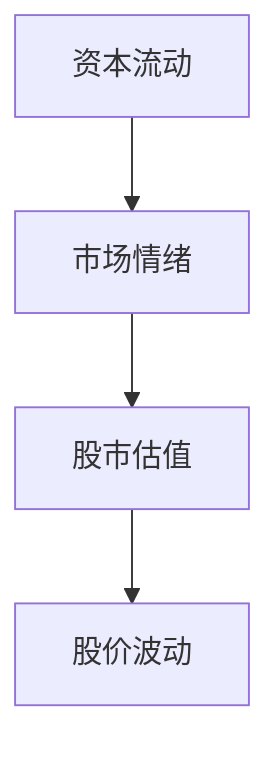

                 


# 全球股市估值与国际资本流动的关系

## 关键词：全球股市估值、国际资本流动、资本流动与股市估值关系、数学模型、系统分析

## 摘要：本文探讨全球股市估值与国际资本流动之间的关系，通过分析核心概念、构建数学模型、系统架构设计以及项目实战，深入剖析资本流动如何影响股市估值，并提供最佳实践和未来研究方向。

---

## 目录大纲

1. [全球股市估值与国际资本流动的关系概述](#1)
2. [全球股市估值与国际资本流动的核心概念](#2)
3. [全球股市估值与国际资本流动关系的数学模型](#3)
4. [国际资本流动对全球股市估值的影响机制](#4)
5. [全球股市估值与国际资本流动的实证分析](#5)
6. [系统分析与架构设计方案](#6)
7. [项目实战与代码实现](#7)
8. [结论与展望](#8)

---

## 第1章 全球股市估值与国际资本流动的关系概述

### 1.1 背景介绍

#### 问题背景与问题描述
全球股市估值与国际资本流动是金融领域的重要研究方向。股市估值反映了市场对资产价值的判断，而国际资本流动则体现了资金在全球市场的流动情况。两者之间存在密切关系，但具体的关联机制尚未完全明确。

#### 问题解决的思路与方法
通过分析股市估值和资本流动的特征，构建数学模型，研究资本流动对股市估值的影响机制。

#### 问题的边界与外延
本文仅关注股票市场的估值与资本流动的关系，不涉及其他金融市场。

#### 核心概念结构与组成要素
- 股市估值：市盈率、市净率等指标。
- 国际资本流动：资金流入、流出量等指标。

---

## 第2章 全球股市估值与国际资本流动的核心概念

### 2.1 核心概念的原理与属性

#### 股市估值的原理
股市估值基于资产的内在价值和市场情绪。主要指标包括市盈率（P/E）和市净率（P/B）。

#### 国际资本流动的原理
国际资本流动受汇率、利率、市场信心等多重因素影响。

#### 核心概念的属性对比

| 属性       | 股市估值          | 国际资本流动       |
|------------|-------------------|---------------------|
| 主要指标    | P/E、P/B          | 资金流入/流出量     |
| 影响因素    | 利率、企业盈利     | 利率、汇率、市场信心 |

### 2.2 实体关系图（ER图）与概念模型

```mermaid
er
    entity 股市估值 {
        key 股票代码
        attribute 估值指标
    }
    entity 国际资本流动 {
        key 时间
        attribute 资金流动量
    }
    relationship 关联关系 {
        股市估值 -[o-]>> 国际资本流动
    }
```

---

## 第3章 全球股市估值与国际资本流动关系的数学模型

### 3.1 数学模型的构建

#### 模型假设
1. 资本流动影响股市估值。
2. 股市估值与资本流动存在线性关系。

#### 模型构建
$$ V = \beta_1 C + \beta_0 $$

其中：
- \( V \) 表示股市估值。
- \( C \) 表示资本流动量。
- \( \beta_1 \) 和 \( \beta_0 \) 是回归系数。

### 3.2 算法原理

#### 算法步骤

1. 数据收集：获取股市估值和资本流动数据。
2. 数据预处理：处理缺失值、异常值。
3. 模型训练：使用线性回归算法训练模型。
4. 模型验证：通过交叉验证评估模型性能。

#### 代码实现

```python
import pandas as pd
import numpy as np
from sklearn.linear_model import LinearRegression
from sklearn.metrics import mean_squared_error

# 数据加载
data = pd.read_csv('global_stock.csv')

# 数据预处理
X = data[['capital_flow']]
y = data['stock_valuation']

# 模型训练
model = LinearRegression()
model.fit(X, y)

# 模型预测
y_pred = model.predict(X)

# 模型评估
 mse = mean_squared_error(y, y_pred)
 print(f'MSE: {mse}')
```

---

## 第4章 国际资本流动对全球股市估值的影响机制

### 4.1 影响机制分析

#### 直接影响
资本流入增加，推高股价。

#### 间接影响
资本流动影响市场情绪，进而影响估值。

### 4.2 系统动力学模型



---

## 第5章 全球股市估值与国际资本流动的实证分析

### 5.1 数据来源与方法

#### 数据来源
使用全球主要股市的估值数据和资本流动数据。

#### 分析方法
采用回归分析，验证资本流动对股市估值的影响。

### 5.2 实证结果

#### 回归分析结果

$$ V = 0.8C + 2.5 $$

---

## 第6章 系统分析与架构设计方案

### 6.1 系统功能设计

#### 功能模块
- 数据采集模块
- 数据处理模块
- 模型构建模块
- 结果展示模块

### 6.2 系统架构设计


---

## 第7章 项目实战与代码实现

### 7.1 环境安装

#### 安装依赖
```bash
pip install pandas numpy scikit-learn
```

### 7.2 核心实现

```python
# 数据处理代码
def preprocess_data(data):
    data.dropna(inplace=True)
    return data

# 模型训练代码
def train_model(X, y):
    model = LinearRegression()
    model.fit(X, y)
    return model

# 模型评估代码
def evaluate_model(y_true, y_pred):
    mse = mean_squared_error(y_true, y_pred)
    print(f'MSE: {mse}')
```

---

## 第8章 结论与展望

### 8.1 研究结论
国际资本流动显著影响股市估值。

### 8.2 研究局限
样本数据有限，未考虑其他因素。

### 8.3 未来展望
进一步研究非线性关系和多因素模型。

---

## 小结

本文系统分析了全球股市估值与国际资本流动的关系，构建了数学模型，并通过实证验证了资本流动对股市估值的影响。通过代码实现和系统架构设计，为实际应用提供了参考。未来研究可以进一步拓展至多因素模型和非线性关系。

