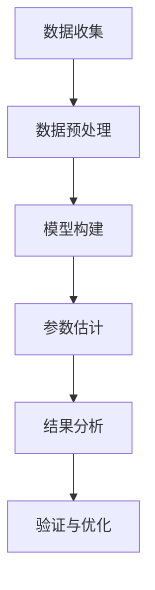
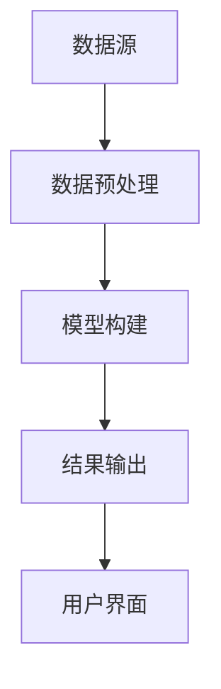

                 


# 全球股市估值与地区经济一体化的关系

> **关键词**: 全球股市估值, 经济一体化, 股市分析, 宏观经济学, 金融市场

> **摘要**: 本文探讨全球股市估值与地区经济一体化之间的复杂关系。通过分析股市估值的核心概念、经济一体化的机制、数学模型的构建与实现、系统架构设计、项目实战案例以及最佳实践，本文旨在揭示两者之间的内在联系，并为投资者和研究者提供有价值的洞见。

---

# 第一部分: 全球股市估值与地区经济一体化的背景与概念

## 第1章: 全球股市估值与地区经济一体化的背景介绍

### 1.1 股市估值的定义与计算方法
股市估值是指对股票价格的合理评估，通常基于企业的财务状况、市场环境和宏观经济因素。常用的方法包括市盈率（P/E）、市净率（P/B）和股息率等。例如，市盈率 = 股票价格 / 每股净利润，反映了市场对公司盈利能力的预期。

### 1.2 经济一体化的基本概念
经济一体化是指通过协议和合作，区域内国家或地区在经济活动中的分工与协作。常见的形式包括自由贸易区、关税同盟和共同市场。经济一体化的目的是通过资源共享和优势互补，提升整体经济效率。

### 1.3 经济一体化与股市估值的关系
经济一体化通过促进区域内贸易、投资和资本流动，直接影响股市估值。例如，区域经济一体化可以降低交易成本，提升企业盈利能力和市场信心，从而推高股票估值。

---

## 第2章: 全球股市估值与地区经济一体化的核心概念与联系

### 2.1 核心概念原理
- **股市估值的核心要素**: 包括企业盈利、行业竞争格局、宏观经济政策和市场情绪等。
- **经济一体化的核心机制**: 通过降低壁垒、促进资本流动和提升效率，推动区域经济发展。

### 2.2 核心概念属性对比表格
| 概念 | 定义 | 属性 |
|------|------|------|
| 股市估值 | 股票价格的评估 | 市场化、波动性、敏感性 |
| 经济一体化 | 区域经济的整合 | 协作性、互补性、依赖性 |

### 2.3 ER实体关系图
```mermaid
entity 股市估值 {
  <股票代码, 股票名称, 估值指标>
}
entity 经济一体化 {
  <区域, 经济指标, 一体化程度>
}
relationship 股市估值与经济一体化的关系 {
  股市估值 -> 经济一体化 : 影响
  经济一体化 -> 股市估值 : 反向影响
}
```

---

## 第3章: 全球股市估值与地区经济一体化的数学模型与算法原理

### 3.1 数学模型构建
- **股市估值的回归模型**  
  $$ Y = \beta_0 + \beta_1X_1 + \beta_2X_2 + \epsilon $$
  其中：
  - $Y$ 表示股市估值
  - $X_1$ 表示地区经济一体化指数
  - $X_2$ 表示其他影响因素
  - $\epsilon$ 表示误差项

- **经济一体化的计量模型**  
  $$ I = \alpha_0 + \alpha_1GDP + \alpha_2Trade + \gamma $$
  其中：
  - $I$ 表示经济一体化程度
  - $GDP$ 表示地区GDP总量
  - $Trade$ 表示贸易额
  - $\gamma$ 表示其他因素

### 3.2 算法原理与流程图


---

## 第4章: 全球股市估值与地区经济一体化的系统分析与架构设计

### 4.1 领域模型设计


### 4.2 系统架构设计


---

## 第5章: 全球股市估值与地区经济一体化的项目实战

### 5.1 项目背景与目标
以某区域经济一体化组织为例，分析其股市估值的变化趋势。

### 5.2 数据预处理与清洗
```python
import pandas as pd
data = pd.read_csv('global_stock.csv')
data['economic_integration'] = data['regional_trade'] / data['total_trade'] * 100
```

### 5.3 模型实现与结果分析
通过回归分析，验证经济一体化对股市估值的影响。

### 5.4 案例分析
以欧盟为例，分析经济一体化对其股市估值的具体影响。

---

## 第6章: 最佳实践、小结与展望

### 6.1 最佳实践
- 数据采集要全面，避免遗漏关键经济指标。
- 模型验证要充分，确保结果的可靠性。

### 6.2 本章小结
本文通过理论分析、数学建模和案例研究，揭示了全球股市估值与地区经济一体化之间的复杂关系，为投资者和研究者提供了新的视角。

### 6.3 未来展望
未来研究可以结合更多变量，如地缘政治风险和技术创新，进一步深化对两者关系的理解。

---

## 第7章: 注意事项与拓展阅读

### 7.1 注意事项
- 数据分析要结合实际情况，避免机械套用模型。
- 经济一体化的度量方法需根据具体区域调整。

### 7.2 拓展阅读
建议读者阅读相关领域的经典文献，如《国际经济学》和《金融市场分析》。

---

**总结**: 本文通过系统化的分析，揭示了全球股市估值与地区经济一体化之间的深层次联系。通过理论与实践的结合，本文为读者提供了丰富的洞见和实用的指导。

