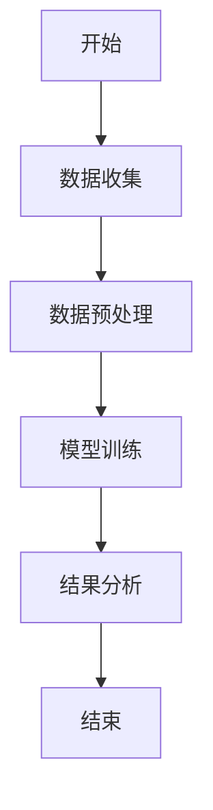
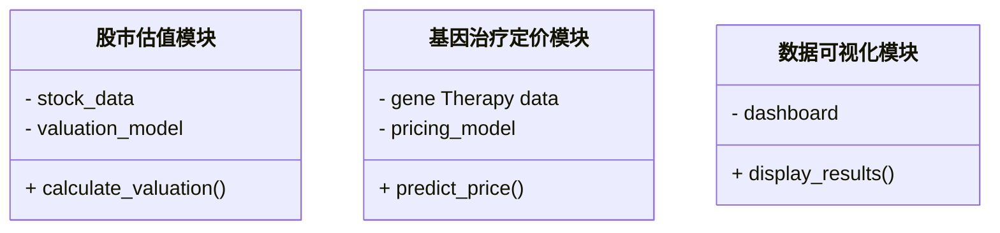
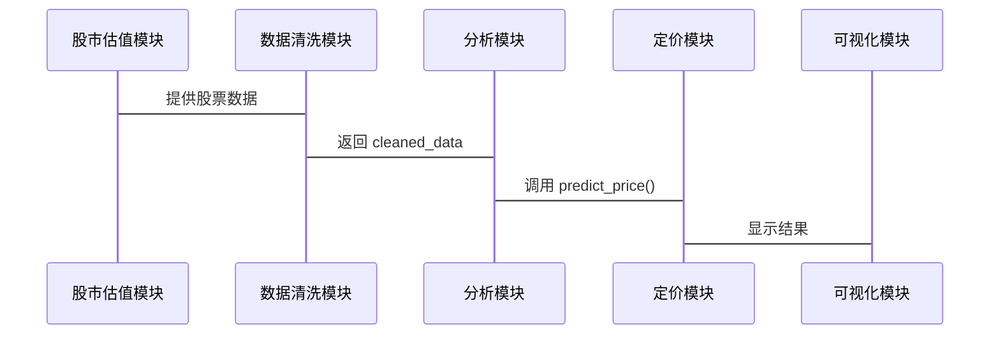

                 


# 全球股市估值与基因治疗定价模式的关系

> **关键词**：股市估值、基因治疗、定价模式、数据分析、算法模型、系统设计

> **摘要**：本文探讨全球股市估值与基因治疗定价模式之间的关系，通过分析核心概念、算法原理、系统架构设计和项目实战，揭示两者之间的联系及其在实际应用中的相互影响。文章结合理论与实践，提供详细的模型和代码示例，为读者提供深入的理解和应用指导。

---

## 第一部分：背景介绍

### 第1章：全球股市估值与基因治疗定价模式的背景

#### 1.1 全球股市估值概述
- **1.1.1 股市估值的基本概念**  
  股市估值是通过分析公司的财务数据和市场因素，评估其股票的内在价值。常用指标包括市盈率（P/E）、市净率（P/B）和股息率等。

- **1.1.2 影响股市估值的主要因素**  
  包括宏观经济指标（GDP、利率）、行业趋势、公司业绩、市场情绪等。

- **1.1.3 全球主要股市指数及其特点**  
  如道琼斯指数、标普500、纳斯达克指数和MSCI指数等，各有不同的行业分布和市场表现。

#### 1.2 基因治疗的现状与挑战
- **1.2.1 基因治疗的定义与技术进展**  
  基因治疗是通过修改基因组来治疗疾病，如CRISPR技术的应用。

- **1.2.2 基因治疗的市场规模与增长趋势**  
  全球市场规模预计在2030年达到数百亿美元，增长迅速。

- **1.2.3 基因治疗定价的主要挑战**  
  包括研发成本高昂、市场需求不确定性和定价政策的复杂性。

---

## 第二部分：核心概念与联系

### 第2章：全球股市估值与基因治疗定价模式的核心概念

#### 2.1 核心概念的定义与特点
- **2.1.1 股市估值的核心要素**  
  包括收益、现金流、资产状况等。

- **2.1.2 基因治疗定价模式的属性**  
  包括成本回收、患者可及性和市场接受度。

- **2.1.3 两者之间的联系与区别**  
  区别在于股市估值是基于现有数据的评估，而基因治疗定价涉及未来的收益预测。

#### 2.2 核心概念的属性对比
- **对比分析表**：

| 属性                | 股市估值                  | 基因治疗定价模式         |
|---------------------|--------------------------|--------------------------|
| 基础数据          | 财务报表、市场指标        | 研发成本、临床数据        |
| 定价目标          | 股票价格                  | 药物价格                  |
| 时间跨度          | 短期到长期                | 中长期                   |
| 影响因素          | 宏观经济、行业趋势        | 研发成本、市场需求        |

#### 2.3 ER实体关系图架构
```mermaid
er
    股市估值
    基因治疗定价模式
    股市估值与基因治疗定价的关系
```

---

## 第三部分：算法原理讲解

### 第3章：全球股市估值与基因治疗定价模式的算法原理

#### 3.1 算法原理概述
- **3.1.1 股市估值的算法模型**  
  使用多元回归模型分析股票价格与财务指标的关系。

- **3.1.2 基因治疗定价的算法模型**  
  应用机器学习算法预测药物的市场需求和价格弹性。

#### 3.2 算法流程图


#### 3.3 算法实现代码
```python
import pandas as pd
import numpy as np

# 示例代码：简单线性回归模型
def stock_valuation_model(data):
    X = data[['revenue', 'net_profit']]
    y = data['stock_price']
    # 增加截距项
    X = sm.add_constant(X)
    model = sm.OLS(y, X)
    results = model.fit()
    return results.params

# 使用公式法
from statsmodels import formula
results_formula = formula.ols(formula='stock_price ~ revenue + net_profit', data=data).fit()
print(results_formula.summary())
```

#### 3.4 数学模型与公式
$$
\text{股票价格} = \beta_0 + \beta_1 \times \text{收入} + \beta_2 \times \text{净利润} + \epsilon
$$
其中，$\beta_0$、$\beta_1$、$\beta_2$为回归系数，$\epsilon$为误差项。

---

## 第四部分：系统分析与架构设计

### 第4章：系统分析与架构设计方案

#### 4.1 问题场景介绍
- 开发一个结合股市数据和基因治疗数据的分析系统，帮助投资者和药企制定更科学的定价策略。

#### 4.2 项目介绍
- 系统功能：数据采集、分析模型、可视化界面、定价建议。
- 项目目标：优化定价模型，降低研发风险。

#### 4.3 系统功能设计


#### 4.4 系统架构设计


#### 4.5 系统接口设计
- RESTful API接口：用于数据传输和模型调用。
- 数据交互序列图：


---

## 第五部分：项目实战

### 第5章：项目实战

#### 5.1 环境安装
- 安装Python、Pandas、NumPy、Scikit-learn等库。
- 安装Jupyter Notebook进行数据分析和可视化。

#### 5.2 核心代码实现
```python
# 数据清洗代码
def clean_data(data):
    # 删除缺失值
    data = data.dropna()
    # 标准化处理
    from sklearn.preprocessing import StandardScaler
    scaler = StandardScaler()
    scaled_data = scaler.fit_transform(data[['revenue', 'net_profit']])
    return scaled_data

# 模型训练代码
from sklearn.linear_model import LinearRegression
model = LinearRegression()
model.fit(X_train, y_train)
print('模型系数：', model.coef_)
print('模型截距：', model.intercept_)
```

#### 5.3 案例分析
- 分析某基因治疗药物的历史定价，结合股市数据预测其市场表现。
- 通过实际数据验证模型的准确性，调整参数以优化结果。

#### 5.4 项目小结
- 项目成功展示了如何将股市估值与基因治疗定价结合。
- 提供了实用的代码和模型，便于读者实践。

---

## 第六部分：总结与展望

### 第6章：总结与展望

#### 6.1 全文总结
- 本文深入探讨了股市估值与基因治疗定价的关系，结合理论与实践，提供了系统的分析和解决方案。

#### 6.2 问题的局限性
- 数据不足：部分基因治疗数据稀缺，影响模型准确性。
- 时间跨度：短期数据可能无法反映长期趋势。

#### 6.3 未来展望
- 结合更多数据源，如患者数据和治疗效果。
- 引入机器学习模型，提高预测准确性。

#### 6.4 最佳实践 Tips
- 数据清洗是关键，确保数据质量。
- 模型调参需谨慎，避免过拟合。
- 及时关注市场动态，更新模型。

---

## 附录

### 附录A：常用工具与库
- Python、Pandas、NumPy、Scikit-learn等。

### 附录B：相关文献
- 推荐阅读的相关书籍和论文。

---

通过本文的系统分析和实践，读者可以深入理解股市估值与基因治疗定价模式的关系，并在实际项目中应用这些方法和模型。希望本文能为相关领域的研究和实践提供有价值的参考。

