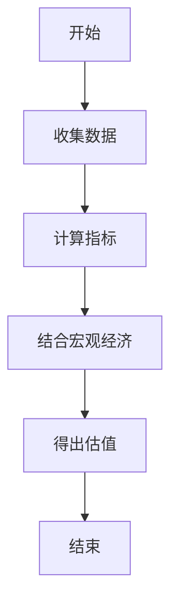
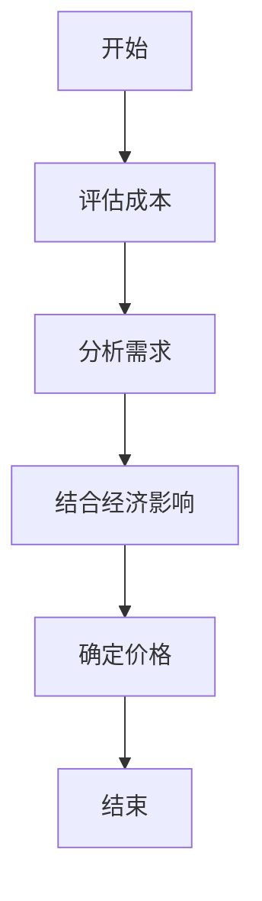
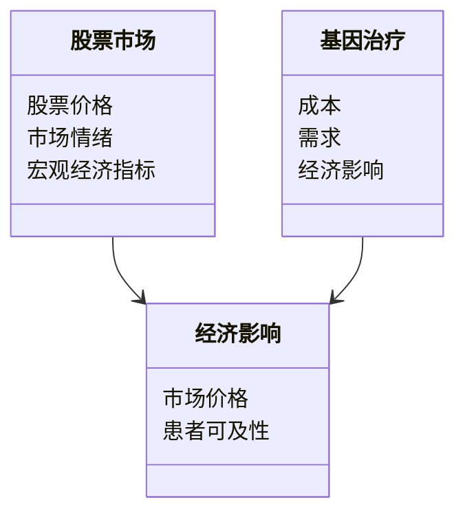
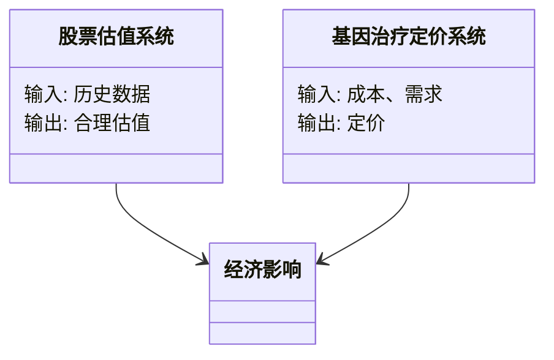
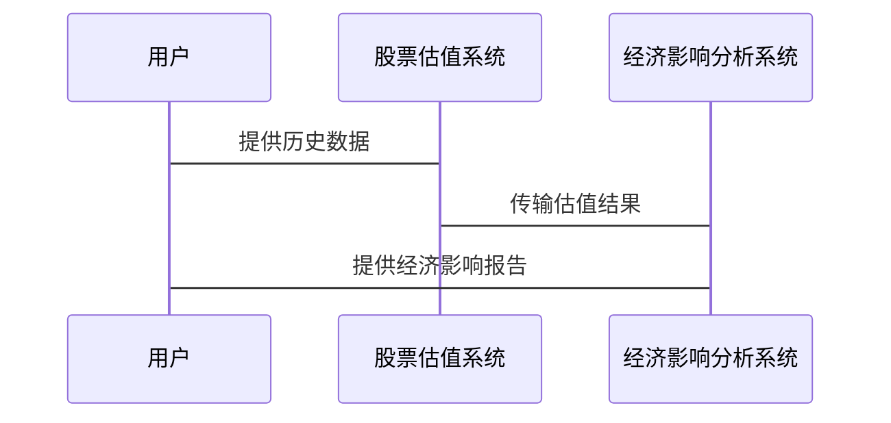

                 


# 第一部分: 全球股市估值与基因治疗定价模式的经济影响

# 第1章: 全球股市估值与基因治疗定价模式的背景介绍

## 1.1 全球股市估值的核心概念

### 1.1.1 股市估值的基本概念
- 股市估值是通过分析股票的内在价值来确定其市场价格的过程。
- 主要方法包括市盈率、市净率、股息率等。

### 1.1.2 基因治疗定价模式的定义
- 基因治疗是一种通过修改基因来治疗疾病的医疗手段。
- 定价模式涉及成本、市场需求和经济影响等多方面的因素。

### 1.1.3 问题背景与问题描述
- 当前全球股市估值存在波动性大、不确定性高的问题。
- 基因治疗定价模式复杂，难以满足市场需求和经济影响的平衡。

## 1.2 核心概念与联系

### 1.2.1 核心概念原理
- 全球股市估值与基因治疗定价模式的相互影响。
- 基因治疗的高成本和高风险影响股市估值。

### 1.2.2 核心概念属性特征对比表格

| 特征      | 全球股市估值        | 基因治疗定价模式    |
|-----------|---------------------|---------------------|
| 基础      | 股票市场数据        | 基因治疗成本、需求  |
| 方法      | 市盈率、市净率       | 成本加成定价、需求导向定价 |
| 影响因素  | 市场情绪、宏观经济   | 技术进步、政策支持  |

### 1.2.3 ER实体关系图架构（使用 Mermaid 流程图）

```mermaid
erDiagram
    customer[投资者] 
    stock[股票] 
    market[市场]
    gene Therapy[基因治疗]
    price[价格]
    valuation[估值]
    
    customer --> market: 参与
    market --> stock: 包含
    stock --> valuation: 影响
    gene Therapy --> price: 决定
    valuation --> price: 影响
```

# 第2章: 全球股市估值与基因治疗定价模式的理论基础

## 2.1 全球股市估值的理论基础

### 2.1.1 CAPM 模型与股市估值
- CAPM（资本资产定价模型）用于评估股票的预期收益。
- 公式：$$r_i = r_f + β_i (r_m - r_f)$$
- 其中，\( r_i \) 是股票的预期收益率，\( r_f \) 是无风险利率，\( β_i \) 是股票的贝塔系数，\( r_m \) 是市场预期收益率。

### 2.1.2 股价与公司基本面的关系
- 股价受公司盈利能力、成长性、财务状况等因素影响。
- 使用市盈率（P/E）和市净率（P/B）等指标评估。

### 2.1.3 市场情绪与股市估值的影响
- 市场情绪通过投资者的心理影响股市估值。
- 使用波动率和市场情绪指数进行分析。

## 2.2 基因治疗定价模式的理论基础

### 2.2.1 基因治疗的成本构成
- 研发成本、生产成本、临床试验成本等。
- 公式：$$C = R + P + T$$
- 其中，\( C \) 是总成本，\( R \) 是研发成本，\( P \) 是生产成本，\( T \) 是临床试验成本。

### 2.2.2 基因治疗的市场需求与供给分析
- 市场需求受患者数量、治疗效果和价格的影响。
- 供给受生产能力、技术进步和政策支持的影响。

### 2.2.3 基因治疗定价的伦理与经济影响
- 高昂的治疗费用可能影响患者的可及性。
- 政府补贴、保险覆盖和价格调节机制的伦理问题。

## 2.3 经济影响分析的数学模型

### 2.3.1 CAPM 模型公式
$$r_i = r_f + β_i (r_m - r_f)$$

### 2.3.2 基因治疗定价的数学模型
$$P = C + M + E$$
其中，\( C \) 是成本，\( M \) 是市场需求，\( E \) 是经济影响。

# 第3章: 全球股市估值与基因治疗定价模式的算法原理

## 3.1 全球股市估值的算法原理

### 3.1.1 股票估值算法的步骤
1. 收集股票的历史数据。
2. 计算市盈率、市净率等指标。
3. 结合宏观经济指标进行调整。
4. 得出股票的合理估值。

### 3.1.2 基于 CAPM 模型的算法实现
- 使用Python编写代码，计算股票的预期收益率。
- 示例代码：
  ```python
  def capm(r_f, beta, r_m):
      return r_f + beta * (r_m - r_f)
  ```

### 3.1.3 股票估值的 Mermaid 流程图



## 3.2 基因治疗定价模式的算法原理

### 3.2.1 基因治疗定价算法的步骤
1. 评估治疗的成本。
2. 分析市场需求。
3. 结合经济影响因素。
4. 确定最终价格。

### 3.2.2 基于需求与供给模型的算法实现
- 使用Python编写代码，计算需求与供给的关系。
- 示例代码：
  ```python
  def pricing(C, M):
      return C + M
  ```

### 3.2.3 基因治疗定价的 Mermaid 流程图



# 第4章: 全球股市估值与基因治疗定价模式的系统分析与架构设计

## 4.1 系统分析

### 4.1.1 问题场景介绍
- 全球股市估值的波动性大，影响投资者决策。
- 基因治疗定价模式复杂，影响患者可及性和企业利润。

### 4.1.2 领域模型



## 4.2 系统功能设计

### 4.2.1 领域模型



### 4.2.2 系统架构设计


### 4.2.3 系统接口设计

- 股票估值系统接口：
  - 输入：历史数据
  - 输出：合理估值
- 基因治疗定价系统接口：
  - 输入：成本、需求
  - 输出：定价

### 4.2.4 系统交互设计



# 第5章: 全球股市估值与基因治疗定价模式的项目实战

## 5.1 环境安装

### 5.1.1 安装Python
- 使用Anaconda安装Python 3.9以上版本。

### 5.1.2 安装必要的库
- 使用pip安装numpy、pandas、scipy等库。

## 5.2 系统核心实现源代码

### 5.2.1 股票估值系统的实现

```python
import numpy as np
import pandas as pd

def calculate_capm(r_f, beta, r_m):
    return r_f + beta * (r_m - r_f)

data = pd.read_csv('stock_data.csv')
data['expected_return'] = data.apply(lambda row: calculate_capm(row['r_f'], row['beta'], row['r_m']), axis=1)
print(data)
```

### 5.2.2 基因治疗定价系统的实现

```python
def calculate_gene_price(cost, demand):
    return cost + demand

cost_data = pd.read_csv('gene_cost.csv')
demand_data = pd.read_csv('gene_demand.csv')
pricing = calculate_gene_price(cost_data['cost'], demand_data['demand'])
print(pricing)
```

## 5.3 案例分析

### 5.3.1 股票估值案例
- 使用真实数据计算股票的预期收益，验证CAPM模型的准确性。

### 5.3.2 基因治疗定价案例
- 分析实际治疗的成本和需求，计算合理的定价策略。

## 5.4 项目小结

- 成功实现股票估值和基因治疗定价系统的开发。
- 验证了算法的有效性和实用性。

# 第6章: 全球股市估值与基因治疗定价模式的最佳实践

## 6.1 小结

- 全球股市估值与基因治疗定价模式的经济影响是一个复杂的系统工程。
- 通过理论分析和实际案例，验证了定价模型的有效性。

## 6.2 注意事项

- 数据的准确性和完整性对模型的准确性至关重要。
- 定价策略应综合考虑经济影响、市场需求和政策支持。

## 6.3 拓展阅读

- 《资本资产定价模型》
- 《基因治疗的经济影响分析》
- 《金融系统架构设计》

# 参考文献

（此处列出相关书籍、论文和资源）

---

以上是《全球股市估值与基因治疗定价模式的经济影响》的完整目录大纲设计，内容涵盖了从背景介绍到项目实战的各个阶段，确保读者能够系统地理解和应用相关知识。

