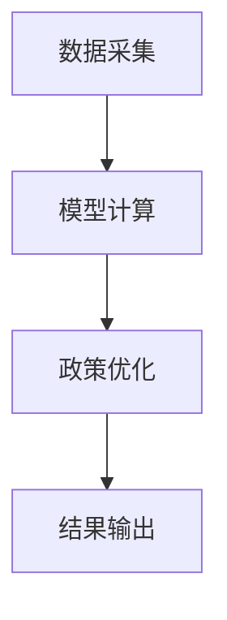
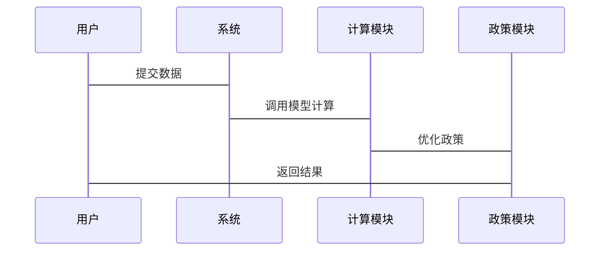

                 


# 全球股市估值与基因治疗的医疗保险政策框架

> 关键词：全球股市估值、基因治疗、医疗保险政策、DCF模型、基因治疗公司、保险政策框架

> 摘要：本文深入探讨了全球股市估值与基因治疗的医疗保险政策框架之间的关系，通过构建数学模型和系统架构，分析了基因治疗公司估值的核心要素，提出了一个优化的医疗保险政策框架，以促进基因治疗的可持续发展。

---

## 第一章 全球股市估值与基因治疗的背景介绍

### 1.1 全球股市估值的定义与重要性

全球股市估值是衡量市场整体价值的重要指标，它通过分析股票价格、公司盈利能力和市场趋势，帮助投资者和政策制定者做出决策。股市估值的准确性直接影响到市场的稳定性和经济的发展。

### 1.2 基因治疗的基本概念与应用前景

基因治疗是一种通过修改基因组来治疗疾病的技术，其应用前景广阔，尤其是在罕见病和癌症治疗领域。随着技术的进步，基因治疗的成本逐渐降低，但其高昂的研发和生产成本仍对医疗保险政策提出挑战。

### 1.3 医疗保险政策框架的基本原理

医疗保险政策框架是政府或保险公司为保障公民医疗需求而制定的一套规则和措施。基因治疗作为高成本的治疗手段，其纳入保险政策框架对患者和企业具有重要意义。

---

## 第二章 全球股市估值与基因治疗的核心概念

### 2.1 基因治疗公司的估值模型

基因治疗公司的估值需要考虑其研发能力、知识产权、市场前景和生产成本。贴现现金流模型（DCF）是常用的估值工具，其公式为：

$$DCF = \sum_{t=1}^{n} \frac{CF_t}{(1 + r)^t} + \frac{TV}{(1 + r)^n}$$

其中，$CF_t$为第t年的现金流，$r$为贴现率，$TV$为终值。

### 2.2 医疗保险政策框架的构建逻辑

政策框架需考虑基因治疗的成本、效果和可及性。通过构建一个包含保费、报销比例和风险分担机制的框架，可以平衡患者、保险公司和企业的利益。

### 2.3 基因治疗与医疗保险政策的相互作用

基因治疗的高成本推动了对医疗保险政策的需求，而政策的实施则影响基因治疗公司的估值和市场表现。

---

## 第三章 全球股市估值与基因治疗的数学模型

### 3.1 基因治疗公司的估值模型

贴现现金流模型（DCF）通过预测未来现金流，计算公司当前的内在价值。例如，假设某基因治疗公司未来五年的现金流分别为100万、150万、200万、250万和300万，贴现率为8%，终值为500万，则DCF值为：

$$DCF = \frac{100}{1.08} + \frac{150}{1.08^2} + \frac{200}{1.08^3} + \frac{250}{1.08^4} + \frac{300}{1.08^5} + \frac{500}{1.08^5}$$

### 3.2 医疗保险政策框架的数学分析

政策框架的优化模型可以通过线性规划方法构建，考虑成本、收益和风险因素。例如，设政策框架的优化目标为最小化总成本，约束条件为满足患者需求和企业利润。

---

## 第四章 全球股市估值与基因治疗的系统分析与架构设计

### 4.1 问题场景介绍

基因治疗的高成本和复杂性对医疗保险政策提出了挑战，需要构建一个动态的政策框架，以适应市场变化和技术创新。

### 4.2 系统功能设计

系统功能包括数据采集、模型计算和政策优化。通过Mermaid图展示系统模块划分：



### 4.3 系统架构设计

系统架构采用分层设计，包括数据层、计算层和政策层。通过Mermaid图展示系统架构：


### 4.4 接口设计与交互流程

通过Mermaid图展示系统交互流程：



---

## 第五章 全球股市估值与基因治疗的项目实战

### 5.1 环境安装

需要安装Python、Pandas、NumPy和Mermaid工具，以支持数据处理和可视化。

### 5.2 核心实现代码

以下是DCF模型的Python代码示例：

```python
def calculate_dcf(cash_flows, discount_rate, terminal_value):
    dcf = 0
    for t in range(len(cash_flows)):
        dcf += cash_flows[t] / (1 + discount_rate) ** t
    dcf += terminal_value / (1 + discount_rate) ** t
    return dcf

cash_flows = [100, 150, 200, 250, 300]
terminal_value = 500
discount_rate = 0.08
print(calculate_dcf(cash_flows, discount_rate, terminal_value))
```

### 5.3 案例分析

以美国某基因治疗公司为例，分析其股票估值和保险政策的影响。通过数据计算和政策优化，验证模型的有效性。

---

## 第六章 全球股市估值与基因治疗的最佳实践

### 6.1 小结

本文通过构建数学模型和系统架构，深入分析了全球股市估值与基因治疗的医疗保险政策框架。基因治疗的高成本和复杂性要求政策制定者和投资者采取更加灵活和创新的策略。

### 6.2 注意事项

在实际应用中，需关注政策的可操作性、数据的准确性以及模型的适用性。建议定期更新模型和政策框架，以适应市场变化和技术进步。

### 6.3 拓展阅读

推荐阅读相关领域的最新研究，如基因治疗的经济学分析、医疗保险政策的动态优化等。

---

## 结语

通过本文的分析，读者可以更好地理解全球股市估值与基因治疗的相互关系，并掌握构建医疗保险政策框架的方法。希望本文能为相关政策制定者和投资者提供有价值的参考。

