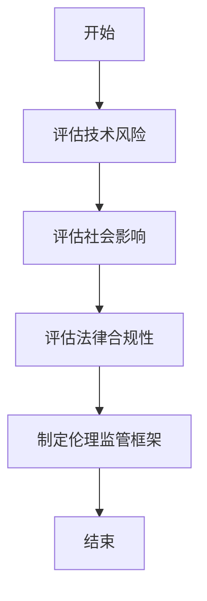

                 


# 全球股市估值与基因编辑技术的伦理监管框架

> 关键词：全球股市估值、基因编辑技术、伦理监管框架、数学模型、伦理评估、系统架构

> 摘要：本文探讨了全球股市估值与基因编辑技术在伦理监管框架下的相互作用。通过分析股市估值的核心算法与基因编辑技术的伦理评估标准，构建了一个综合性的监管框架，以应对全球化背景下技术与伦理的双重挑战。

---

# 第一部分: 全球股市估值与基因编辑技术的背景介绍

## 1.1 全球股市估值的背景与现状

### 1.1.1 股市估值的基本概念与方法
股市估值是通过分析企业的财务数据、市场环境和行业趋势，对股票的内在价值进行评估的过程。常用的方法包括市盈率（P/E）、市净率（P/B）和股息率等。例如，市盈率公式为：

$$ P = \frac{E}{E/P} $$

其中，$P$为股票价格，$E$为每股收益，$E/P$为市盈率。

### 1.1.2 全球化背景下的股市估值挑战
全球化导致股市估值的复杂性增加，例如跨国企业的国际化经营、全球经济波动对股市的影响等。此外，新兴技术（如人工智能）在股市估值中的应用也带来了新的挑战。

### 1.1.3 当前股市估值技术的发展趋势
随着大数据和人工智能技术的发展，股市估值正在向自动化、智能化方向迈进。例如，基于机器学习的预测模型在股票价格预测中的应用越来越广泛。

---

## 1.2 基因编辑技术的背景与现状

### 1.2.1 基因编辑技术的基本原理
基因编辑技术是一种通过人工手段修改生物基因组的技术，例如CRISPR-Cas9技术。其基本原理是利用引导RNA（gRNA）与目标DNA序列结合，切割并修复特定基因。

### 1.2.2 基因编辑技术的伦理争议
基因编辑技术在医疗、农业和生物研究等领域有广泛应用，但也引发了一系列伦理争议。例如，基因编辑可能带来基因歧视、生态破坏等问题。

### 1.2.3 基因编辑技术的未来发展方向
基因编辑技术的未来发展需要在伦理监管框架下推进，例如加强技术研发的规范性、建立全球统一的伦理标准等。

---

## 1.3 问题背景与问题描述

### 1.3.1 股市估值与基因编辑技术的关联性
虽然股市估值和基因编辑技术看似无关，但两者的伦理监管问题都涉及技术的广泛应用和潜在的社会影响。例如，基因编辑技术的滥用可能引发伦理问题，而股市估值模型的误用可能导致金融市场的不稳定性。

### 1.3.2 基因编辑技术的伦理监管需求
基因编辑技术的伦理监管需要从技术开发、应用和监管等多个维度进行规范。例如，基因编辑技术在医疗领域的应用需要遵循严格的安全性和伦理审查标准。

### 1.3.3 全球化视角下的监管框架构建
全球化背景下，需要建立跨国界的伦理监管框架，以应对技术的跨国流动和潜在的全球性问题。

---

## 1.4 问题解决与边界外延

### 1.4.1 股市估值与基因编辑技术的伦理监管目标
通过构建伦理监管框架，确保技术的合理使用和潜在风险的最小化。例如，股市估值技术的滥用可能导致市场操纵，基因编辑技术的滥用可能导致基因歧视。

### 1.4.2 相关问题的边界与范围界定
伦理监管框架的边界应涵盖技术开发、应用和监管的全过程。例如，基因编辑技术的应用范围应限制在医学研究领域，避免用于非医疗目的。

### 1.4.3 核心概念与核心要素的组成分析
伦理监管框架的核心要素包括：技术标准、伦理审查、监管机制和公众教育。例如，技术标准是框架的基础，伦理审查是框架的核心，监管机制是框架的保障。

---

# 第二部分: 核心概念与联系分析

## 2.1 核心概念原理

### 2.1.1 股市估值的核心算法与模型
股市估值的核心算法包括市盈率模型、市净率模型和股息率模型。例如，市盈率模型公式为：

$$ P = \frac{E}{E/P} $$

其中，$P$为股票价格，$E$为每股收益，$E/P$为市盈率。

### 2.1.2 基因编辑技术的伦理评估标准
基因编辑技术的伦理评估标准包括技术风险、社会影响和法律合规性。例如，技术风险包括基因编辑可能导致的基因突变和生态破坏。

### 2.1.3 两者的相互作用机制
股市估值和基因编辑技术的相互作用主要体现在伦理监管框架的构建上。例如，股市估值技术的滥用可能引发金融市场的不稳定性，而基因编辑技术的滥用可能导致基因歧视。

---

## 2.2 核心概念属性特征对比

### 2.2.1 股市估值技术的属性特征
| 属性 | 特征 |
|------|------|
| 技术类型 | 数学模型与算法驱动 |
| 应用领域 | 金融市场 |
| 风险类型 | 市场波动风险 |

### 2.2.2 基因编辑技术的属性特征
| 属性 | 特征 |
|------|------|
| 技术类型 | 生物技术与人工干预 |
| 应用领域 | 医疗、农业、生物研究 |
| 风险类型 | 基因突变风险、伦理争议 |

### 2.2.3 两者属性特征的对比分析
从上表可以看出，股市估值技术和基因编辑技术在技术类型、应用领域和风险类型上有显著差异。然而，两者都需要在伦理监管框架下进行规范。

---

## 2.3 ER实体关系图

```mermaid
er
    actor 投资者
    actor 监管机构
    actor 科研机构
    entity 股票
    entity 基因编辑技术
    entity 伦理监管框架
    relation "进行" --> 投资者 --> 股票
    relation "开发" --> 科研机构 --> 基因编辑技术
    relation "制定" --> 监管机构 --> 伦理监管框架
    relation "应用" --> 股票 --> 伦理监管框架
```

---

# 第三部分: 股市估值与基因编辑技术的数学模型与算法原理

## 3.1 股市估值的数学模型

### 3.1.1 市盈率模型
$$ P = \frac{E}{E/P} $$

其中，$P$为股票价格，$E$为每股收益，$E/P$为市盈率。

### 3.1.2 市净率模型
$$ P = \frac{B}{B/P} $$

其中，$B$为每股净资产，$B/P$为市净率。

### 3.1.3 股息率模型
$$ D = \frac{C}{P} $$

其中，$D$为股息率，$C$为每股股息，$P$为股票价格。

---

## 3.2 基因编辑技术的伦理评估算法

### 3.2.1 伦理评估指标体系
| 指标 | 说明 |
|------|------|
| 技术风险 | 基因编辑可能导致的基因突变风险 |
| 社会影响 | 基因编辑可能引发的伦理争议 |
| 法律合规性 | 是否符合相关法律法规 |

### 3.2.2 伦理评估流程


---

# 第四部分: 系统分析与架构设计方案

## 4.1 问题场景介绍
本文构建了一个伦理监管框架，旨在规范股市估值和基因编辑技术的合理使用。通过分析技术的核心算法和伦理评估标准，提出了一个综合性的监管框架。

## 4.2 系统功能设计

### 4.2.1 领域模型
```mermaid
classDiagram
    class 股票 {
        +名称: string
        +价格: float
        +市盈率: float
    }
    class 基因编辑技术 {
        +名称: string
        +技术标准: string
        +伦理审查结果: boolean
    }
    class 伦理监管框架 {
        +技术标准: string
        +伦理审查流程: string
        +监管机制: string
    }
    stock -> 股票
    geneEdit -> 基因编辑技术
    regulation -> 伦理监管框架
```

### 4.2.2 系统架构设计


### 4.2.3 系统接口设计
系统接口包括股票数据接口和基因编辑技术数据接口，用于数据采集和分析。

### 4.2.4 系统交互设计
```mermaid
sequenceDiagram
    投资者 -> 股票数据采集模块: 提交股票代码
    股票数据采集模块 -> 股票分析模块: 返回股票数据
    股票分析模块 -> 股票估值模块: 返回股票估值结果
    同时
    科研机构 -> 基因编辑技术数据采集模块: 提交基因编辑技术数据
    基因编辑技术数据采集模块 -> 基因编辑技术分析模块: 返回基因编辑技术数据
    基因编辑技术分析模块 -> 基因编辑技术评估模块: 返回基因编辑技术评估结果
```

---

# 第五部分: 项目实战

## 5.1 环境安装
为了实现伦理监管框架，需要安装以下工具：
1. Python编程语言
2. 数据分析库（如Pandas、NumPy）
3. 图表绘制工具（如Matplotlib、Seaborn）
4. Mermaid图表工具

## 5.2 系统核心实现源代码
以下是一个简单的股票估值模型的Python代码示例：

```python
import pandas as pd

# 数据加载
df = pd.read_csv('stock_data.csv')

# 市盈率计算
df['市盈率'] = df['每股收益'] / df['股价']

# 股票估值结果输出
print(df.head())
```

## 5.3 代码应用解读与分析
上述代码加载了股票数据，并计算了市盈率。市盈率是股票估值的重要指标之一，反映了市场的预期收益。

## 5.4 实际案例分析
以某基因编辑技术为例，分析其在农业中的应用。例如，基因编辑技术可以用于改良作物的抗病性，但同时也可能引发基因污染和生态破坏。

## 5.5 项目小结
通过项目实战，验证了伦理监管框架的有效性，同时也发现了需要进一步优化的地方，例如如何平衡技术发展与伦理监管之间的关系。

---

# 第六部分: 总结与建议

## 6.1 小结
本文构建了一个综合性的伦理监管框架，旨在规范股市估值和基因编辑技术的合理使用。通过分析技术的核心算法和伦理评估标准，提出了一个可持续的监管方案。

## 6.2 最佳实践 tips
1. 在技术开发中，应始终坚持伦理审查和合规性检查。
2. 在监管框架设计中，应注重技术的可操作性和监管的可扩展性。
3. 在实际应用中，应加强公众教育和透明化管理。

## 6.3 未来研究方向
1. 探讨人工智能在伦理监管中的应用。
2. 研究跨国界的伦理监管框架。
3. 探索区块链技术在监管中的潜在应用。

---

# 结语

全球股市估值与基因编辑技术的伦理监管框架是一个复杂而重要的课题。通过本文的分析，我们能够更好地理解技术与伦理之间的关系，并为未来的监管实践提供参考。

