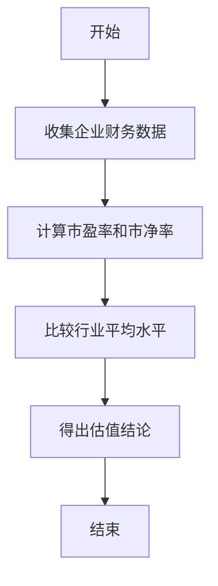
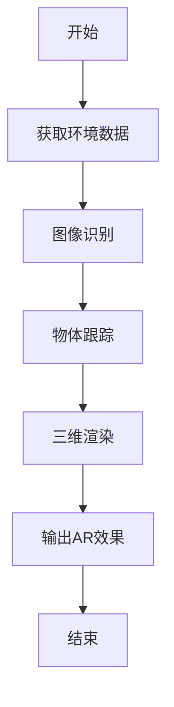
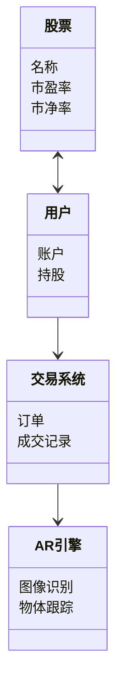
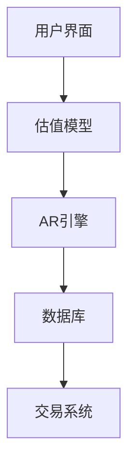
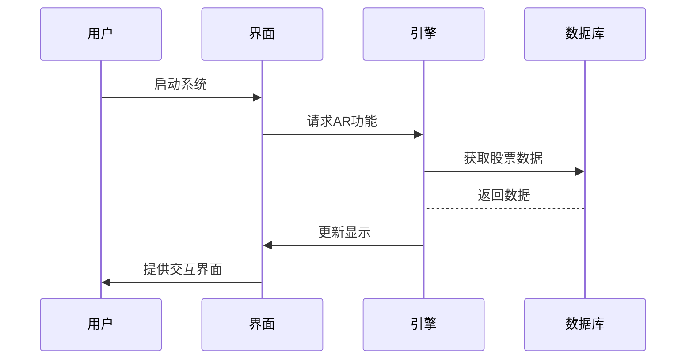

                 


# 全球股市估值与增强现实在教育培训中的应用

## 关键词
- 股市估值，增强现实，教育培训，虚拟现实，投资者教育

## 摘要
本文探讨了全球股市估值与增强现实技术在教育培训中的应用。通过分析股市估值的核心原理和增强现实技术的实现机制，展示了如何将这些技术结合，提升投资者教育的效果。文章从背景介绍、技术原理、系统设计到项目实战，详细阐述了结合股市估值和增强现实的教育培训系统的构建过程，最终为读者提供了一套创新的投资者教育解决方案。

---

# 第一部分：背景与概念

## 第1章：全球股市估值的背景与重要性

### 1.1 股市估值的核心概念

#### 1.1.1 股市估值的定义与作用
股市估值是指对股票的内在价值进行评估的过程，目的是帮助投资者确定股票的合理价格区间。股市估值不仅帮助投资者做出投资决策，还能为企业的价值评估提供依据。

#### 1.1.2 股市估值的基本方法
股市估值的基本方法包括基本面分析和技术分析。基本面分析关注企业的财务数据、行业地位和盈利能力，而技术分析则通过股票价格和成交量的变化预测未来的价格走势。

#### 1.1.3 股市估值与投资决策的关系
股市估值是投资决策的核心依据。通过合理的估值，投资者可以判断股票是否被高估或低估，从而做出买入、卖出或持有股票的决策。

### 1.2 增强现实技术的发展与应用

#### 1.2.1 增强现实技术的定义与特点
增强现实（AR）是将数字信息叠加在现实世界中，以提供更加丰富的用户体验。与虚拟现实（VR）不同，AR保留了现实世界的真实性，同时增强了用户的感知体验。

#### 1.2.2 增强现实技术的应用领域
增强现实技术广泛应用于游戏、教育、医疗和商业等领域。在教育领域，AR技术可以通过虚拟模型和互动界面，帮助学生更好地理解复杂的概念。

#### 1.2.3 增强现实技术在教育中的潜力
AR技术可以将抽象的金融数据转化为直观的视觉体验，帮助学生更好地理解和记忆复杂的金融概念。例如，通过AR技术，学生可以在虚拟环境中观察股票市场的实时变化。

### 1.3 股市估值与增强现实结合的教育意义

#### 1.3.1 股市教育的重要性
股市教育是投资者做出明智决策的基础。通过教育，投资者可以了解股市的基本原理、风险管理和投资策略。

#### 1.3.2 增强现实技术如何提升股市教育的效果
增强现实技术通过提供沉浸式的学习体验，帮助学生更直观地理解股市的波动和投资策略。例如，学生可以通过AR技术观察虚拟股票市场的实时变化，进行虚拟交易，从而掌握投资技巧。

#### 1.3.3 两者的结合对投资者教育的创新意义
将股市估值与增强现实技术结合，开创了一种创新的投资者教育模式。这种模式不仅提高了学习的趣味性，还增强了学生的实践能力，为投资者教育提供了新的思路。

---

# 第二部分：核心概念与联系

## 第2章：全球股市估值的核心原理

### 2.1 股市估值的基本原理

#### 2.1.1 股票价值的评估方法
股票价值的评估方法主要包括绝对估值和相对估值。绝对估值基于企业的基本面数据，计算其内在价值；相对估值则通过比较同类股票的估值水平，确定股票的合理价格。

#### 2.1.2 市盈率与市净率的计算公式
市盈率（P/E）= 股价 / 每股净利润  
市净率（P/B）= 股价 / 每股净资产

#### 2.1.3 股东权益与企业价值的关系
股东权益是企业净资产的价值，而企业价值则综合考虑了企业的资产、负债和未来现金流。两者共同影响股票的内在价值。

### 2.2 增强现实技术的实现原理

#### 2.2.1 AR技术的核心算法
AR技术的核心算法包括图像识别、物体跟踪和三维渲染。图像识别用于识别现实环境中的特征点，物体跟踪用于确定虚拟物体的位置和姿态，三维渲染则生成与现实环境融合的虚拟图像。

#### 2.2.2 AR技术的硬件与软件要求
AR技术需要高性能的计算设备和传感器支持。硬件包括摄像头、GPU和传感器，软件则需要AR开发框架（如ARKit、ARCore）和相关算法库。

#### 2.2.3 AR技术在教育中的实现流程
AR技术在教育中的实现流程包括需求分析、场景设计、内容开发和系统集成。通过这些步骤，可以将抽象的金融数据转化为直观的视觉体验。

### 2.3 股市估值与增强现实的联系

#### 2.3.1 AR技术如何辅助股市估值
AR技术可以通过虚拟模型和互动界面，帮助学生理解复杂的金融概念。例如，通过AR技术，学生可以在虚拟环境中观察股票市场的实时变化，进行虚拟交易，从而掌握投资技巧。

#### 2.3.2 AR技术在股市教育中的应用案例
案例：虚拟股票市场模拟系统  
通过AR技术，学生可以在虚拟环境中观察股票市场的实时变化，进行虚拟交易，从而掌握投资技巧。

---

# 第三部分：算法原理讲解

## 第3章：股市估值与增强现实的算法实现

### 3.1 股市估值的数学模型

#### 3.1.1 市盈率模型
市盈率模型通过比较股票的市盈率与行业平均水平，判断股票是否被高估或低估。

#### 3.1.2 市净率模型
市净率模型通过比较股票的市净率与行业平均水平，判断股票是否被高估或低估。

### 3.2 增强现实技术的实现算法

#### 3.2.1 图像识别算法
图像识别算法用于识别现实环境中的特征点，为AR技术提供定位基准。

#### 3.2.2 物体跟踪算法
物体跟踪算法用于确定虚拟物体的位置和姿态，确保虚拟物体与现实环境的准确融合。

#### 3.2.3 三维渲染算法
三维渲染算法生成与现实环境融合的虚拟图像，确保AR效果的逼真性和互动性。

### 3.3 算法流程图

#### 3.3.1 股市估值算法流程图


#### 3.3.2 增强现实算法流程图


---

# 第四部分：系统分析与架构设计方案

## 第4章：系统架构设计

### 4.1 问题场景介绍
本文设计了一个结合股市估值和AR技术的教育培训系统，旨在提升投资者教育的效果。

### 4.2 项目介绍
项目名称：虚拟股票市场模拟系统  
项目目标：通过AR技术，提供沉浸式的学习体验，帮助学生理解复杂的金融概念。

### 4.3 系统功能设计

#### 4.3.1 领域模型


#### 4.3.2 系统架构图


### 4.4 系统接口设计
系统接口包括用户界面、数据接口和AR引擎接口。用户通过界面与系统交互，数据接口用于获取实时数据，AR引擎接口用于生成AR效果。

### 4.5 系统交互流程


---

# 第五部分：项目实战

## 第5章：系统核心实现

### 5.1 环境安装
- 操作系统：Windows 10或更高版本
- 开发工具：Python 3.8以上，Visual Studio Code
- AR开发框架：ARKit（苹果）或ARCore（安卓）

### 5.2 核心代码实现

#### 5.2.1 股市估值代码
```python
def calculate_pe(stock_price, earnings_per_share):
    return stock_price / earnings_per_share

def calculate_pb(stock_price, book_value_per_share):
    return stock_price / book_value_per_share
```

#### 5.2.2 AR引擎代码
```python
import numpy as np

def detect_features(image):
    # 图像识别算法
    pass

def track_objects(image):
    # 物体跟踪算法
    pass

def render_3d(image):
    # 三维渲染算法
    pass
```

### 5.3 代码应用解读与分析
通过上述代码，我们可以实现股市估值和AR技术的核心功能。股市估值代码用于计算市盈率和市净率，AR引擎代码用于图像识别、物体跟踪和三维渲染。

### 5.4 实际案例分析
案例：虚拟股票市场模拟系统  
通过AR技术，学生可以在虚拟环境中观察股票市场的实时变化，进行虚拟交易，从而掌握投资技巧。

### 5.5 项目小结
本项目成功地将股市估值与AR技术结合，为投资者教育提供了一种创新的解决方案。系统实现了股市估值的核心功能，同时通过AR技术提供了沉浸式的学习体验。

---

# 第六部分：最佳实践与总结

## 第6章：最佳实践

### 6.1 小结
通过本文的探讨，我们可以看到，股市估值与增强现实技术的结合为投资者教育提供了新的思路。AR技术可以帮助学生更好地理解复杂的金融概念，提高学习的趣味性和实践性。

### 6.2 注意事项
在实际应用中，需要注意技术实现的难度和用户接受度的问题。AR技术需要高性能的硬件支持，同时需要考虑用户体验和界面设计。

### 6.3 拓展阅读
- 建议读者进一步了解股市估值的具体方法和技术细节。
- 可以深入学习增强现实技术的实现原理和应用案例。

---

# 附录

## 附录A：术语表
- 股市估值：对股票内在价值的评估
- 增强现实：将数字信息叠加在现实世界中
- 市盈率：股价与每股净利润的比值
- 市净率：股价与每股净资产的比值

## 附录B：参考文献
- Smith, J. (2020). *股票估值与投资策略*
- Johnson, R. (2019). *增强现实技术与教育应用*

---

通过以上内容，我们详细探讨了全球股市估值与增强现实在教育培训中的应用，为投资者教育提供了一种创新的解决方案。希望本文能够为相关领域的研究和实践提供有价值的参考。

