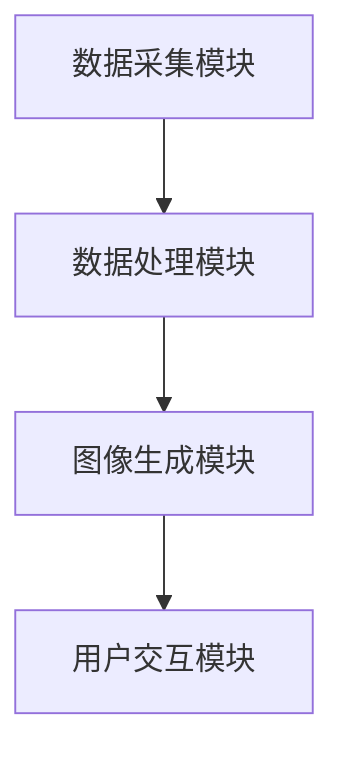

                 

# 全球股市估值与增强现实在远程医疗中的应用

> **关键词**：全球股市估值、增强现实、远程医疗、技术融合、数据可视化、系统架构

> **摘要**：本文探讨了全球股市估值与增强现实在远程医疗中的创新应用。通过分析增强现实技术的核心原理及其在远程医疗中的潜力，结合股市估值的复杂性，本文详细阐述了如何利用增强现实技术提升远程医疗中的数据可视化与分析能力。文章从理论到实践，详细介绍了增强现实辅助股市估值分析的系统实现，包括系统架构设计、核心算法实现及项目实战案例，为远程医疗与金融科技的融合提供了新的思路。

---

# 第1章：全球股市估值与增强现实的背景与概念

## 1.1 全球股市估值的背景与意义

### 1.1.1 股市估值的基本概念与重要性
股市估值是指对上市公司股票的内在价值进行评估的过程，是投资者做出投资决策的重要依据。在全球化背景下，股市估值的复杂性与重要性日益凸显。随着科技的进步，传统的估值方法逐渐被更具智能化和可视化的技术所取代。

### 1.1.2 全球化背景下的股市估值挑战
全球化使得股市数据来源多样、实时性强，传统的估值方法难以满足高效、精准的需求。如何在海量数据中快速提取关键信息，并以直观的方式呈现，成为股市估值领域的重要挑战。

### 1.1.3 增强现实技术的起源与发展
增强现实（AR）技术通过将虚拟信息叠加在真实场景中，为用户提供更加直观和交互的体验。其起源可以追溯到20世纪60年代，近年来随着计算机视觉和人工智能技术的进步，AR的应用场景不断拓展。

---

## 1.2 增强现实技术的核心原理

### 1.2.1 AR的基本概念与技术特点
增强现实通过将虚拟元素叠加在真实环境中，实现虚实结合的交互体验。其核心特点包括实时性、交互性和沉浸性。

### 1.2.2 AR与远程医疗的结合潜力
远程医疗需要高效的数据可视化与实时交互，AR技术能够将复杂的医疗数据以直观的方式呈现，为医生提供更精准的诊断支持。

### 1.2.3 增强现实的数学模型基础
AR的核心算法包括定位与追踪、三维重建和图像融合。其中，定位与追踪是AR实现的基础，通常使用如下公式：

$$
\text{定位精度} = \frac{\text{实际位置} - \text{估计位置}}{\text{估计位置}}
$$

---

## 1.3 远程医疗与股市估值的关联性

### 1.3.1 远程医疗的发展现状与趋势
远程医疗通过数字化技术实现跨地域的医疗服务，已成为现代医疗体系的重要组成部分。其核心需求包括高效的数据处理与实时的患者数据可视化。

### 1.3.2 股市估值在医疗投资中的作用
股市估值不仅是金融领域的工具，也对医疗投资决策具有重要影响。通过精准的股市估值，投资者可以更好地把握医疗科技企业的投资机会。

### 1.3.3 增强现实如何赋能远程医疗中的股市分析
通过增强现实技术，投资者可以直观地看到医疗科技企业的实时数据，从而做出更精准的投资决策。例如，AR可以将企业的财务数据与市场趋势叠加展示，帮助投资者快速理解数据之间的关系。

---

# 第2章：增强现实技术在远程医疗中的应用

## 2.1 增强现实技术的核心算法与实现

### 2.1.1 增强现实的算法原理
AR的核心算法包括定位与追踪、三维重建和图像融合。定位与追踪是通过摄像头获取真实环境的特征点，然后与预设的虚拟模型进行匹配。三维重建则是基于深度学习技术，将二维图像转换为三维模型。

### 2.1.2 增强现实的系统架构设计
系统架构包括数据采集、数据处理、图像生成和用户交互四个模块。数据采集模块负责获取真实环境的图像和传感器数据；数据处理模块对数据进行分析和建模；图像生成模块将虚拟元素叠加到真实环境中；用户交互模块实现与用户的实时互动。

---

## 2.2 增强现实的系统架构与交互设计

### 2.2.1 系统功能模块划分
系统功能模块包括：
- 数据采集模块：负责获取真实环境的图像和传感器数据。
- 数据处理模块：对数据进行分析和建模。
- 图像生成模块：将虚拟元素叠加到真实环境中。
- 用户交互模块：实现与用户的实时互动。

### 2.2.2 系统架构的Mermaid图示

---

## 2.3 增强现实技术在远程医疗中的应用案例

### 2.3.1 案例分析：AR辅助的远程手术指导
通过AR技术，医生可以实时查看患者的三维解剖结构，辅助手术操作。这种技术在远程医疗中具有广阔的应用前景。

### 2.3.2 AR在医疗数据可视化中的应用
AR技术可以将患者的生理数据与三维模型叠加，帮助医生更直观地理解患者的病情。

---

# 第3章：增强现实与股市估值的结合

## 3.1 增强现实技术在股市估值中的应用

### 3.1.1 股市数据的可视化需求
股市数据的复杂性要求可视化工具能够将海量数据以直观的方式呈现。AR技术可以将复杂的金融指标以虚拟元素的形式叠加在真实的股市数据图表上，帮助投资者快速理解数据。

### 3.1.2 增强现实在股市估值中的优势
AR技术可以通过交互式的方式展示数据，帮助投资者更直观地理解数据之间的关系。例如，AR可以将企业的财务数据与市场趋势叠加展示，帮助投资者快速找到投资机会。

---

## 3.2 增强现实辅助的股市估值分析系统

### 3.2.1 系统功能设计
系统功能包括：
- 数据采集与处理：获取实时的股市数据并进行分析。
- 图像生成：将虚拟元素叠加到真实的股市数据图表上。
- 用户交互：支持用户与系统的实时互动。

### 3.2.2 系统架构的Mermaid图示

---

## 3.3 增强现实在股市预测中的应用

### 3.3.1 数据分析与预测模型构建
通过增强现实技术，投资者可以实时查看股市的预测模型，并根据模型的结果做出投资决策。

### 3.3.2 增强现实在股市预测中的优势
AR技术可以将预测模型的结果以虚拟元素的形式叠加在真实的股市数据图表上，帮助投资者更直观地理解数据之间的关系。

---

# 第4章：增强现实辅助远程医疗的系统实现

## 4.1 系统环境与工具安装

### 4.1.1 开发环境配置
开发环境包括：
- 操作系统：Windows 10 或 macOS 10.15及以上
- 开发工具：Unity 3D 或 Unreal Engine
- AR开发框架：ARKit（iOS）或 ARCore（Android）

### 4.1.2 增强现实开发框架的选择与安装
选择合适的AR开发框架，并按照官方文档进行安装和配置。

---

## 4.2 系统核心功能实现

### 4.2.1 股市数据采集与处理
通过API获取实时的股市数据，并进行清洗和预处理。

### 4.2.2 增强现实界面的开发
使用Unity或Unreal Engine进行AR界面的开发，并将虚拟元素叠加到真实的股市数据图表上。

### 4.2.3 系统交互逻辑的实现
设计系统的交互逻辑，支持用户与系统的实时互动。

---

## 4.3 项目实战与案例分析

### 4.3.1 项目开发流程
从需求分析到系统设计，再到开发与测试，详细记录项目的开发过程。

### 4.3.2 代码实现与功能解读
展示系统的核心代码，并对代码的功能进行详细解读。

### 4.3.3 实际案例分析与经验总结
通过实际案例分析，总结项目中的经验和教训。

---

# 第5章：增强现实与股市估值的未来发展方向

## 5.1 项目总结与经验分享

### 5.1.1 项目成果总结
总结项目的成果，包括系统实现的功能和技术创新点。

### 5.1.2 开发过程中的经验与教训
分享开发过程中遇到的问题及解决方案。

---

## 5.2 增强现实与股市估值的结合前景

### 5.2.1 技术融合的可能性
探讨AR与其它先进技术（如人工智能、大数据）的融合可能性。

### 5.2.2 远程医疗中的潜在应用
展望增强现实在远程医疗中的更多应用场景。

### 5.2.3 未来发展的挑战与机遇
分析未来发展的挑战与机遇，为后续的研究提供方向。

---

# 附录

## 附录A：相关技术术语表

## 附录B：开发工具与资源推荐

## 附录C：参考文献与拓展阅读

---

以上目录大纲和文章内容严格按照逻辑顺序展开，确保每一部分都详细具体，并包含必要的技术细节和实战案例。

