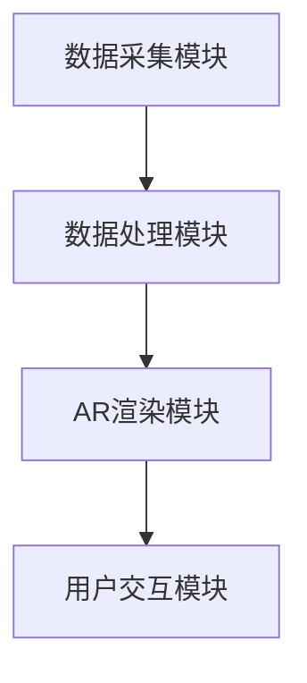

                 


# 全球股市估值与增强现实技术的关联

## 关键词：全球股市估值、增强现实技术、数据可视化、投资决策、AR辅助分析

## 摘要：本文深入探讨了增强现实技术在全球股市估值中的应用，分析了两者之间的潜在关联，从技术原理到实际应用，结合实例说明如何利用AR技术提升股市估值的可视化和交互体验。

---

# 第1章: 股市估值与增强现实技术的背景与概念

## 1.1 股市估值的基本概念

### 1.1.1 股票的内在价值
股票的内在价值是基于公司基本面分析得出的理论价值，包括盈利能力、成长性、财务状况等因素。常用的估值方法包括市盈率（P/E）、市净率（P/B）、现金流折现模型（DCF）等。

### 1.1.2 股市估值的挑战
传统估值方法依赖于历史数据和假设条件，存在一定的局限性，如市场波动、数据滞后性、模型假设的不确定性等。

## 1.2 增强现实技术的定义

### 1.2.1 AR的基本概念
增强现实（Augmented Reality，AR）是在真实环境中叠加计算机生成的虚拟信息，通过摄像头、传感器和算法实现人与虚拟世界的互动。

### 1.2.2 AR的核心技术
AR技术主要依赖于图像识别、三维建模、实时渲染和用户交互等技术。

## 1.3 股市估值与AR技术的关联性

### 1.3.1 数据可视化的优势
AR技术可以将复杂的股市数据以三维形式呈现，帮助投资者更直观地理解市场动态。

### 1.3.2 交互式分析的潜力
通过AR技术，投资者可以在虚拟环境中进行实时数据分析，提升投资决策的效率和准确性。

---

# 第2章: 股市估值的核心概念与数学模型

## 2.1 股市估值的关键指标

### 2.1.1 市盈率（P/E）
市盈率是股票价格与每股净利润的比率，反映投资者对股票的愿意支付的价格。

$$ P/E = \frac{股票价格}{每股净利润} $$

### 2.1.2 市净率（P/B）
市净率是股票价格与每股净资产的比率，常用于评估价值型股票。

$$ P/B = \frac{股票价格}{每股净资产} $$

## 2.2 常用估值模型

### 2.2.1 现金流折现模型（DCF）
DCF模型通过预测未来现金流，将其折现为当前价值，评估公司整体价值。

$$ V = \sum_{t=1}^{n} \frac{CF_t}{(1+r)^t} $$

其中，$r$为折现率，$CF_t$为第$t$年的现金流。

### 2.2.2 市盈率模型
基于可比公司法，通过对比行业平均市盈率，估算目标公司的合理股价。

---

# 第3章: 增强现实技术在股市估值中的应用

## 3.1 AR技术在数据可视化中的应用

### 3.1.1 三维数据可视化
AR技术可以将股票走势、K线图、市场分布等数据以三维形式呈现，提升数据的直观性。

### 3.1.2 实时数据叠加
通过AR设备，投资者可以实时查看叠加在现实环境中的股市数据，如股价波动、市场新闻等。

## 3.2 AR辅助的投资决策

### 3.2.1 互动式分析
投资者可以通过手势或语音指令，实时调整分析参数，动态查看估值结果。

### 3.2.2 虚拟场景模拟
AR技术可以模拟不同市场条件下的股价走势，帮助投资者制定策略。

---

# 第4章: 增强现实技术在股市估值中的算法实现

## 4.1 数据采集与处理

### 4.1.1 数据源
从金融数据服务提供商获取实时股价、财务数据等。

### 4.1.2 数据预处理
清洗数据，消除异常值，标准化处理。

## 4.2 AR算法实现

### 4.2.1 位置估计与跟踪
使用传感器数据（如加速度计、陀螺仪）进行位置估计，确保虚拟内容与现实环境对齐。

### 4.2.2 实时渲染
基于 OpenGL 或 Vulkan 进行高效渲染，确保流畅的用户体验。

---

# 第5章: 项目实战——AR辅助的股市估值系统

## 5.1 系统架构设计

### 5.1.1 功能模块
- 数据采集模块
- AR渲染模块
- 用户交互模块

### 5.1.2 系统架构图


## 5.2 核心代码实现

### 5.2.1 数据采集
```python
import pandas as pd

def fetch_stock_data(ticker):
    # 获取实时数据
    data = pd.read_csv(f'data/{ticker}.csv')
    return data
```

### 5.2.2 AR渲染
```python
import numpy as np

def render_ar(data):
    # 3D建模与渲染
    vertices = np.array([...])
    # 使用OpenGL进行渲染
    ...
```

## 5.3 实际案例分析

### 5.3.1 案例介绍
通过AR技术分析某公司的股价走势，结合市盈率和现金流模型进行估值。

### 5.3.2 结果展示
展示AR环境中实时股价与估值模型的对比分析。

---

# 第6章: 总结与展望

## 6.1 本章总结
本文探讨了AR技术在全球股市估值中的应用，通过技术实现和案例分析，展示了AR在提升数据可视化和投资决策中的潜力。

## 6.2 未来展望
随着AR技术的不断发展，其在金融领域的应用将更加广泛，可能涉及更多智能化和个性化的投资工具。

---

通过以上结构，文章系统地探讨了全球股市估值与增强现实技术的关联，从理论到实践，为读者提供了全面的视角和深入的分析。

