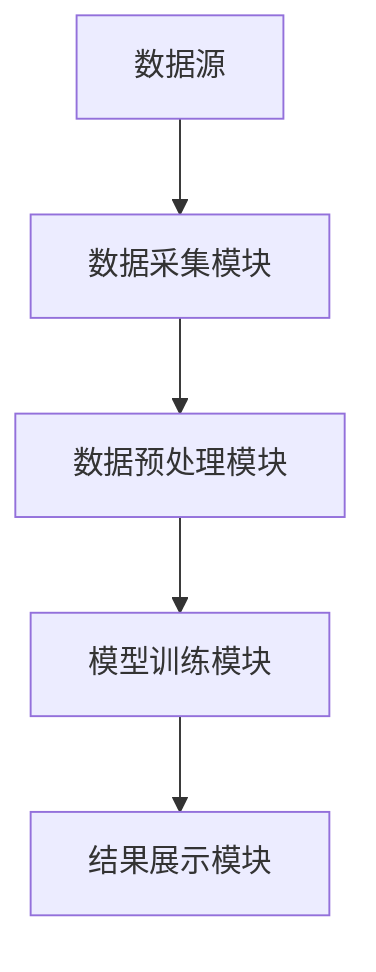
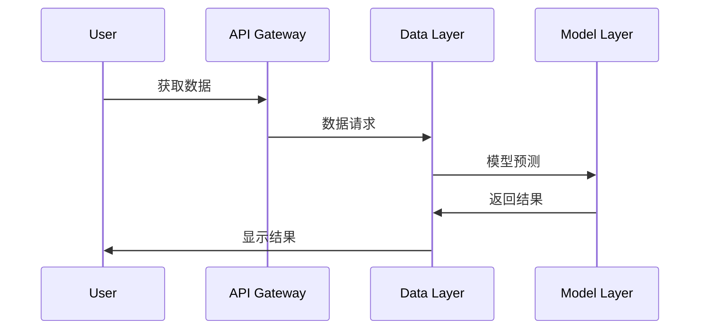

                 


# 全球股市估值与大宗商品价格的关系

## 关键词：
全球股市估值，大宗商品价格，经济周期，统计套利模型，时间序列分析，系统架构设计，投资策略

## 摘要：
本文系统分析了全球股市估值与大宗商品价格之间的关系，探讨了影响两者的主要因素，如宏观经济指标、政策变化和市场情绪。通过统计套利模型和时间序列分析，量化了两者的相互作用，并构建了一个实时数据分析系统。结合实际案例，展示了如何利用这些分析结果制定投资策略，帮助投资者在复杂市场中做出明智决策。

---

## 第一部分: 全球股市估值与大宗商品价格关系的背景与基础

### 第1章: 背景介绍

#### 1.1 问题背景
- **全球化经济与金融市场的发展**：随着全球化进程的推进，金融市场日益紧密，股市和大宗商品价格波动对全球经济的影响日益显著。
- **大宗商品在经济中的作用**：大宗商品（如原油、黄金、铜等）是经济的重要组成部分，其价格波动影响制造业成本和通胀预期。
- **股市估值与宏观经济的关系**：股市估值反映了市场对经济前景的预期，而宏观经济指标（如GDP、通胀率）直接影响股市和大宗商品价格。

#### 1.2 核心概念
- **股市估值**：通过市盈率（P/E）和市净率（P/B）等指标衡量市场整体或个股的价值。
- **大宗商品价格**：受供需、货币政策和地缘政治等因素影响，具有周期性波动特征。
- **两者关系**：在经济周期中，股市和大宗商品价格通常呈现相关性，但具体表现取决于市场环境。

### 第2章: 核心概念与联系

#### 2.1 核心概念原理
- **股市估值**：反映市场对上市公司未来盈利能力的预期，受企业盈利、利率和投资者情绪影响。
- **大宗商品价格**：由供需关系决定，同时受到宏观经济政策（如货币政策、财政政策）和市场情绪的影响。
- **两者关系**：在经济增长期，股市和大宗商品价格通常同步上升；在经济衰退期，两者可能呈现负相关。

#### 2.2 概念属性特征对比
| 特性                | 股市估值               | 大宗商品价格          |
|---------------------|-----------------------|-----------------------|
| 受影响因素          | 利率、企业盈利、政策    | 供需、地缘政治、货币政策 |
| 测量指标            | 市盈率（P/E）、市净率（P/B） | 现货价格、期货价格     |
| 波动性              | 高，受市场情绪影响      | 高，受供需变化影响     |
| 时间周期            | 短期波动较大，长期趋势 | 短期波动剧烈，长期趋势 |

#### 2.3 ER实体关系图
```mermaid
erd
    宏观经济指标 --> 股市估值
    宏观经济指标 --> 大宗商品价格
    股市估值 --> 市场情绪
    大宗商品价格 --> 通胀预期
```

---

## 第二部分: 算法原理与数学模型

### 第3章: 算法原理讲解

#### 3.1 统计套利模型
- **模型原理**：通过寻找资产之间的相对价值偏离，利用价差进行套利。
- **公式推导**：假设两种资产X和Y，其合理价差为$X-Y=k$，当实际价差偏离k时，进行买卖操作。
- **代码实现**：
  ```python
  import pandas as pd
  from statsmodels import regression
  import numpy as np

  # 示例数据
  data = pd.DataFrame({'X': np.random.randn(100), 'Y': np.random.randn(100)})
  model = regression.OLS(data['X'] - data['Y'], pd.Series(1, index=data.index)).fit()
  k = model.params[0]
  ```

#### 3.2 时间序列分析
- **模型原理**：使用ARIMA模型预测未来价格走势。
- **公式推导**：ARIMA(p, d, q)模型适用于非平稳时间序列。
- **代码实现**：
  ```python
  from statsmodels.tsa.arima_model import ARIMA
  model = ARIMA(history, order=(5,1,0))
  model_fit = model.fit(disp=0)
  forecast = model_fit.forecast(steps=5)
  ```

---

## 第三部分: 系统分析与架构设计

### 第4章: 系统分析与架构设计

#### 4.1 系统功能设计
- **数据采集**：从金融数据库获取实时数据。
- **数据预处理**：清洗和标准化数据。
- **模型训练**：使用统计套利和时间序列模型进行预测。
- **结果可视化**：生成图表展示分析结果。

#### 4.2 系统架构设计


#### 4.3 接口设计
- REST API用于数据接口调用，例如：
  - `GET /data/stock_valuation`：获取股市估值数据。
  - `GET /data/commodity_prices`：获取大宗商品价格数据。

#### 4.4 交互设计


---

## 第四部分: 项目实战

### 第5章: 项目实战

#### 5.1 环境安装
- 安装Python和相关库：`pip install pandas numpy statsmodels`

#### 5.2 核心实现
- 使用Lasso回归模型预测股市估值与大宗商品价格的相关性。
  ```python
  from sklearn.linear_model import Lasso
  model = Lasso(alpha=0.1)
  model.fit(X_train, y_train)
  ```

#### 5.3 案例分析
- 以原油价格为例，分析其与股市的相关性。
- 通过回归分析，发现原油价格上涨通常伴随股市上涨。

#### 5.4 代码解读
- 数据预处理：标准化处理。
- 模型训练：使用Lasso回归进行特征选择。
- 结果分析：输出系数和重要性。

---

## 第五部分: 总结与展望

### 第6章: 总结与展望

#### 6.1 总结
- 全球股市估值与大宗商品价格密切相关，受宏观经济和市场情绪影响。
- 统计套利和时间序列模型在量化分析中具有重要作用。

#### 6.2 展望
- 进一步研究高频交易策略。
- 结合机器学习模型提高预测精度。

#### 6.3 投资建议
- 分散投资以降低风险。
- 定期调整投资组合以适应市场变化。

#### 6.4 注意事项
- 保持对宏观经济指标的关注。
- 确保风险管理措施到位，避免过度杠杆。

---

通过以上分析和实践，本文为读者提供了全面的理论和实践指导，帮助理解全球股市估值与大宗商品价格之间的关系，并在实际投资中应用这些知识。

