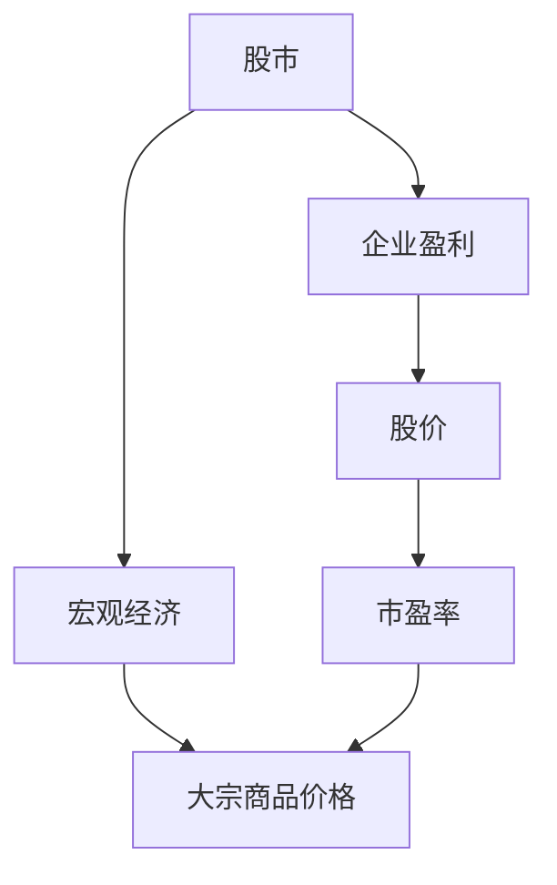

                 


# 全球股市估值与大宗商品价格的相关性

> 关键词：全球股市估值、大宗商品价格、相关性分析、经济周期、投资策略

> 摘要：本文深入探讨全球股市估值与大宗商品价格之间的相关性，通过数据分析、理论建模和实证分析，揭示两者在宏观经济环境下的互动关系，并为投资者提供基于相关性分析的投资策略和风险管理建议。

---

## 第一部分：背景介绍

### 第1章：问题背景

#### 1.1.1 全球化经济与金融市场的复杂性
全球化背景下，金融市场呈现出高度复杂性，股市和大宗商品市场之间的相互作用日益显著。股市估值与大宗商品价格的变化不仅影响企业利润和投资者决策，还对整体经济运行产生重要影响。

#### 1.1.2 大宗商品在经济中的作用
大宗商品（如原油、黄金、铜等）是全球经济的重要组成部分，其价格波动往往与宏观经济指标（如通胀率、GDP增速）密切相关。同时，大宗商品价格的变化也会影响企业的生产成本和利润，进而影响股市估值。

#### 1.1.3 股市估值与宏观经济的关系
股市估值是衡量市场健康状况的重要指标，通常通过市盈率（P/E）和市净率（P/B）等指标衡量。股市估值的变化反映了市场对经济前景的预期，而这种预期又会受到大宗商品价格波动的影响。

---

### 第2章：核心概念

#### 2.1.1 股市估值的定义与计算方法
股市估值是指对上市公司股票内在价值的评估，常用的指标包括：
- 市盈率（P/E）：股价/每股收益
- 市净率（P/B）：股价/每股净资产
- 市销率（P/S）：股价/每股收入

#### 2.1.2 大宗商品的定义与分类
大宗商品是指具有高度流动性和标准化的实物商品，通常分为四类：
- 能源类：原油、天然气
- 农产品类：小麦、大豆
- 金属类：黄金、铜
- 石油类：原油、成品油

#### 2.1.3 相关性的定义与衡量方法
相关性是指两个变量之间变动的相互关系，通常用相关系数（Pearson相关系数）衡量：
- 相关系数范围：[-1, 1]
- 正相关：系数为正，表示两者同向变动
- 负相关：系数为负，表示两者反向变动

---

## 第二部分：核心概念与联系

### 第3章：核心概念原理

#### 3.1.1 股市估值的核心要素
- 企业盈利：主要影响因素
- 利率水平：影响企业融资成本
- 市场情绪：影响短期波动

#### 3.1.2 大宗商品价格的影响因素
- 供需关系：主要驱动因素
- 宏观经济政策：如货币政策、财政政策
- 地缘政治风险：如战争、制裁

#### 3.1.3 两者相关性的理论基础
- 经济周期理论：在经济上行周期，股市和大宗商品价格通常同步上升
- 货币流动性理论：流动性增加时，股市和大宗商品价格均可能上涨

---

### 第4章：概念属性特征对比

#### 4.1 概念属性特征对比表格
| 概念       | 股市估值 | 大宗商品价格 |
|------------|----------|--------------|
| 定义       | 股票的内在价值 | 商品的市场交易价格 |
| 影响因素   | 利率、企业盈利、市场情绪 | 供需、地缘政治、经济周期 |
| 计量方法   | 市盈率、市净率 | 现货价格、期货价格 |

---

### 第5章：ER实体关系图



---

## 第三部分：相关性分析与理论模型

### 第6章：历史数据分析

#### 6.1 数据来源与时间范围
- 数据来源：全球主要股市指数（如标普500、沪深300）和大宗商品价格数据（如布伦特原油、黄金）
- 时间范围：1970年至今

#### 6.2 数据清洗与预处理
- 去除缺失值
- 标准化处理
- 异常值处理

#### 6.3 数据可视化
- 线图：显示股市估值和大宗商品价格的长期趋势
- 散点图：展示两者之间的关系

---

### 第7章：相关性验证

#### 7.1 相关性计算
- 使用Pearson相关系数计算股市估值与大宗商品价格的相关性
- 示例：原油价格与标普500指数的相关系数为0.6

#### 7.2 相关性矩阵与热力图
- 使用Python的pandas和seaborn库生成相关性矩阵和热力图

---

## 第四部分：理论模型构建

### 第8章：数学模型与公式

#### 8.1 多元回归模型
$$ y = \beta_0 + \beta_1x_1 + \beta_2x_2 + \epsilon $$
- $y$：股市估值
- $x_1$：大宗商品价格
- $x_2$：宏观经济指标（如GDP增速）

#### 8.2 时间序列模型
$$ y_t = \phi_1y_{t-1} + \theta_1\epsilon_{t-1} + \epsilon_t $$

---

## 第五部分：实证分析与结果解读

### 第9章：数据分析方法

#### 9.1 数据分组与对比
- 按经济周期分组：繁荣期、衰退期
- 按地区分组：发达国家 vs 发展中国家

#### 9.2 模型拟合与验证
- 使用R平方值衡量模型拟合度
- 残差分析验证模型假设

---

## 第六部分：投资策略与风险管理

### 第10章：投资策略

#### 10.1 套利机会
- 利用股市估值与大宗商品价格的短期偏差
- 示例：当原油价格上涨导致股市估值下降时，可以买入原油期货对冲风险

#### 10.2 对冲策略
- 通过做空大宗商品或买入股指期货来对冲市场风险

---

## 第七部分：结论与展望

### 第11章：结论

#### 11.1 核心发现
- 股市估值与大宗商品价格之间存在显著的相关性
- 经济周期和地缘政治是影响相关性的主要因素

#### 11.2 展望
- 更复杂的相关性模型
- 大数据分析与AI技术的应用

---

## 第八部分：附录

### 第12章：代码示例

#### 12.1 数据获取与处理
```python
import pandas as pd
import numpy as np
import matplotlib.pyplot as plt
```

#### 12.2 相关性分析
```python
data = pd.read_csv('market_data.csv')
correlation = data['stock_val'].corr(data['commodity_price'])
print(f"相关系数为：{correlation}")
```

---

## 总结

本文通过理论分析和实证研究，深入探讨了全球股市估值与大宗商品价格之间的相关性，并为投资者提供了实用的投资策略和风险管理建议。

