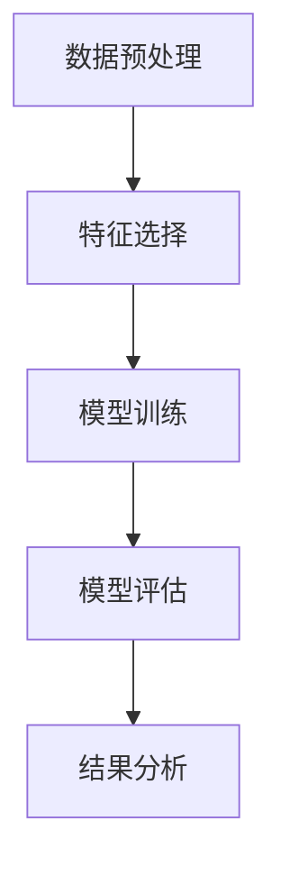

                 


# 全球股市估值与太空经济发展的关系

> 关键词：全球股市估值, 太空经济发展, 经济关系, 机器学习, 数据分析

> 摘要：本文探讨全球股市估值与太空经济发展之间的复杂关系，分析其相互影响和潜在联系。通过背景介绍、核心概念、算法原理、数学模型、系统架构、项目实战等多维度的分析，结合实例和数据，揭示两者如何通过经济、技术和社会因素相互作用，为投资者和研究者提供深入的见解。

---

## 第一部分：全球股市估值与太空经济发展的背景

### 第1章：背景介绍

#### 1.1 问题背景
- 1.1.1 全球股市估值的现状与挑战
  - 股市估值的核心指标（市盈率、市净率等）及其影响因素。
  - 近年来股市波动的典型案例分析。
- 1.1.2 太空经济发展的现状与趋势
  - 太空经济的主要领域：卫星通信、太空探索、太空资源开发。
  - 太空经济的驱动因素：技术进步、政策支持、商业需求。
- 1.1.3 两者的相互作用与潜在联系
  - 太空经济如何影响股市估值，反之亦然。
  - 全球化背景下，股市与太空经济的联动效应。

#### 1.2 问题描述
- 1.2.1 股市估值的核心影响因素
  - 公司业绩、行业趋势、宏观经济环境。
- 1.2.2 太空经济对全球经济的潜在影响
  - 太空经济对科技产业的推动作用。
  - 对新兴行业的投资机会分析。
- 1.2.3 问题解决的必要性与可行性
  - 研究股市估值与太空经济的关系，为投资者提供参考。
  - 技术可行性分析：大数据、人工智能的应用潜力。

#### 1.3 问题解决与边界
- 1.3.1 股市估值与太空经济的关系模型
  - 理论模型的构建与验证。
- 1.3.2 边界与外延
  - 研究的范围与限制。
  - 如何避免过度外推。
- 1.3.3 核心要素与概念结构
  - 核心概念的定义与分类。

---

## 第二部分：全球股市估值与太空经济发展的核心概念与联系

### 第2章：核心概念与联系

#### 2.1 核心概念原理
- 2.1.1 股市估值的核心指标与方法
  - 市盈率（P/E）、市净率（P/B）、股息率等。
- 2.1.2 太空经济的主要领域与驱动因素
  - 卫星通信、太空探索、太空资源开发。
- 2.1.3 两者的相互作用机制
  - 太空经济如何通过技术创新影响股市估值。
  - 股市资金流动如何推动太空经济发展。

#### 2.2 核心概念属性对比
- 2.2.1 股市估值与太空经济的属性对比表格

| 属性                | 股市估值       | 太空经济       |
|---------------------|----------------|----------------|
| 核心指标           | P/E, P/B      | 发射成本、技术成熟度 |
| 主要影响因素       | 宏观经济、政策 | 技术、政策、资本 |
| 发展趋势           | 波动性         | 增长潜力       |

#### 2.3 ER实体关系图
- 使用 Mermaid 绘制的 ER 实体关系图，展示股市、太空经济、企业、政策等实体之间的关系。

```mermaid
er
    actor 投资者
    actor 企业
    actor 政策制定者
    actor 技术开发商
    entity 股市估值
    entity 太空经济
    entity 企业业绩
    entity 政策支持
    entity 技术创新
    entity 资金流动
    股东 -> 股市估值: 影响
    企业 -> 股市估值: 影响
    政策制定者 -> 政策支持: 制定
    技术开发商 -> 技术创新: 开发
    投资者 -> 资金流动: 投资
    股市估值 <-> 太空经济: 相互影响
```

---

## 第三部分：全球股市估值与太空经济发展的算法原理

### 第3章：算法原理与实现

#### 3.1 算法原理
- 3.1.1 算法选择与原理
  - 使用回归分析预测股市估值与太空经济的关系。
  - 机器学习模型（如随机森林）的应用。
- 3.1.2 数据预处理
  - 数据清洗、特征选择、标准化处理。
- 3.1.3 模型训练与评估
  - 训练数据集的构建与划分。
  - 模型的评估指标（准确率、召回率等）。

#### 3.2 算法实现
- 使用 Mermaid 绘制的算法流程图。



- 使用 Python 实现回归分析模型的代码示例：

```python
import pandas as pd
import numpy as np
from sklearn.linear_model import LinearRegression
from sklearn.metrics import r2_score

# 数据加载与预处理
data = pd.read_csv('stock_space.csv')
features = data[['P/E', 'P/B', 'market_cap']]
target = data['space_investment']

# 模型训练
model = LinearRegression()
model.fit(features, target)

# 模型预测与评估
predictions = model.predict(features)
print("R² Score:", r2_score(target, predictions))
```

#### 3.3 算法数学模型
- 使用 LaTeX 格式公式，展示回归分析的数学模型：

$$ y = \beta_0 + \beta_1x_1 + \beta_2x_2 + \epsilon $$

其中：
- $y$ 是目标变量（如股市估值）。
- $x_1, x_2$ 是自变量（如 P/E、P/B）。
- $\beta_0, \beta_1, \beta_2$ 是回归系数。
- $\epsilon$ 是误差项。

---

## 第四部分：全球股市估值与太空经济发展的系统分析与架构设计

### 第4章：系统分析与架构设计方案

#### 4.1 系统分析
- 4.1.1 问题场景介绍
  - 如何利用大数据分析股市与太空经济的关系。
- 4.1.2 项目介绍
  - 数据来源、数据规模、数据类型。

#### 4.2 系统功能设计
- 使用 Mermaid 绘制领域模型类图。

```mermaid
classDiagram
    class 股市估值 {
        P/E
        P/B
        股价
    }
    class 太空经济 {
        发射成本
        技术成熟度
        投资规模
    }
    class 投资者 {
        资金流动
        投资决策
    }
    股市估值 <--|-> 太空经济
    投资者 --> 股市估值
    投资者 --> 太空经济
```

#### 4.3 系统架构设计
- 使用 Mermaid 绘制系统架构图。

```mermaid
container 股市估值系统 {
    component 数据采集模块 {
        接收股市数据
    }
    component 分析模块 {
        计算估值指标
    }
    component 预测模块 {
        预测股市走势
    }
}
container 太空经济系统 {
    component 数据采集模块 {
        接收太空经济数据
    }
    component 分析模块 {
        分析技术趋势
    }
    component 预测模块 {
        预测经济走势
    }
}
```

---

## 第五部分：全球股市估值与太空经济发展的项目实战

### 第5章：项目实战

#### 5.1 环境安装与配置
- Python 3.8+
- 数据处理库：Pandas、NumPy
- 可视化库：Matplotlib、Seaborn
- 机器学习库：Scikit-learn

#### 5.2 核心代码实现
- 数据清洗与特征选择的代码示例：

```python
import pandas as pd
import numpy as np
import matplotlib.pyplot as plt
import seaborn as sns

# 加载数据
data = pd.read_csv('stock_space.csv')

# 数据清洗
data.dropna(inplace=True)
data = data[~data['market_cap'].isin([0])]

# 特征选择
features = ['P/E', 'P/B', 'market_cap']
target = 'space_investment'

# 数据可视化
sns.heatmap(data[features].corr(), annot=True, cmap='coolwarm')
plt.show()
```

#### 5.3 案例分析与解读
- 分析某段时间内股市估值与太空经济投资的关系，展示数据可视化结果。

---

## 第六部分：总结与展望

### 第6章：总结与展望

#### 6.1 小结
- 全球股市估值与太空经济发展的关系是复杂而深刻的。
- 数据分析与机器学习模型在揭示这种关系中起着关键作用。

#### 6.2 注意事项
- 数据的准确性和完整性至关重要。
- 模型的选择与调优需要结合实际场景。

#### 6.3 拓展阅读
- 推荐相关书籍和论文，供读者深入学习。

---

通过以上结构，文章从背景、理论、算法、系统设计、项目实战等多个维度全面分析了全球股市估值与太空经济发展的关系，为读者提供了深入的见解和实用的技术指导。

