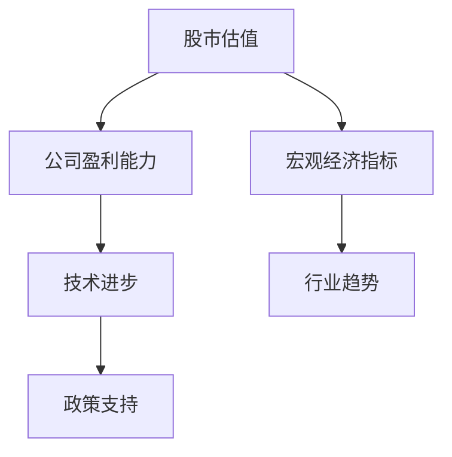
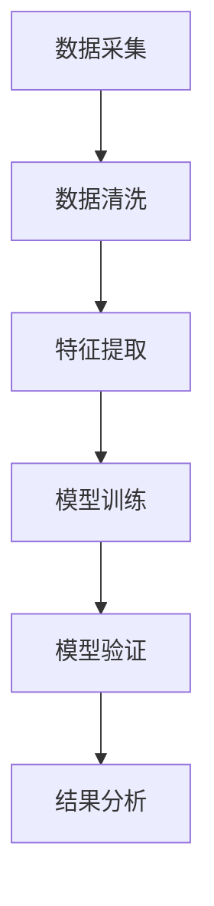
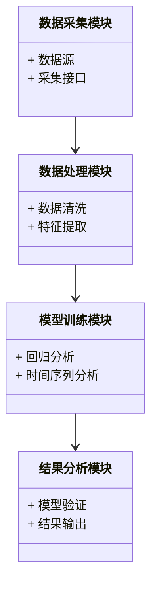
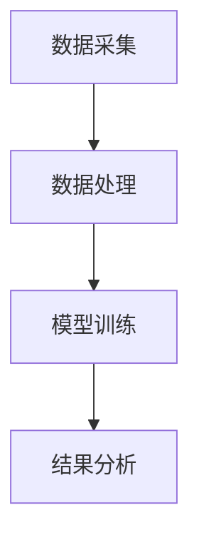

                 


# 全球股市估值与太阳能技术进步的关系

> 关键词：全球股市估值，太阳能技术，技术进步，股市分析，技术经济

> 摘要：本文探讨了全球股市估值与太阳能技术进步之间的关系，分析了太阳能技术进步对股市估值的影响机制，并通过统计建模和实证分析，揭示了两者之间的内在联系。文章从背景介绍、核心概念、算法原理、系统分析到项目实战，全面阐述了这一主题。

---

# 第一部分：全球股市估值与太阳能技术进步的关系概述

## 第1章：背景介绍

### 1.1 问题背景与重要性

#### 1.1.1 全球股市估值的核心概念
全球股市估值是指通过对上市公司的财务数据、市场环境和行业趋势等多方面因素的分析，评估其股票的内在价值。股市估值是投资者进行投资决策的重要依据，也是反映经济运行状况的重要指标。

#### 1.1.2 太阳能技术进步的定义与特征
太阳能技术进步是指在太阳能发电、储能和应用领域的技术创新和效率提升。随着技术的进步，太阳能的成本逐步降低，效率逐步提高，市场竞争力不断增强。

#### 1.1.3 两者关系的研究意义
太阳能技术的进步不仅影响能源行业的市场结构，还可能对相关上市公司的股票估值产生深远影响。研究这种关系有助于投资者更好地理解市场波动，企业更好地把握技术发展方向。

### 1.2 问题描述与研究目标

#### 1.2.1 全球股市估值的主要影响因素
股市估值受多种因素影响，包括宏观经济指标、行业趋势、公司基本面、政策法规等。其中，技术进步是影响公司盈利能力的重要因素。

#### 1.2.2 太阳能技术进步对股市估值的潜在影响
太阳能技术进步可能通过降低成本、提高效率、扩大市场需求等方式影响相关公司的盈利能力，从而影响其股票估值。

#### 1.2.3 研究目标与问题边界
本文旨在探讨太阳能技术进步对全球股市估值的影响机制，构建统计模型，分析两者之间的关系，并提出相关建议。

### 1.3 问题解决与研究方法

#### 1.3.1 统计分析与数据建模
通过回归分析、时间序列分析等统计方法，建立太阳能技术进步与股市估值之间的关系模型。

#### 1.3.2 实证研究与案例分析
结合具体案例，分析太阳能技术进步对相关公司股票估值的实际影响。

#### 1.3.3 综合评估与结果验证
通过模型验证和实证分析，确认技术进步对股市估值的影响，并提出改进建议。

---

## 第2章：核心概念与联系

### 2.1 全球股市估值的理论框架

#### 2.1.1 股市估值的基本原理
股市估值的核心是通过对公司财务数据和市场环境的分析，评估其股票的内在价值。常用的方法包括市盈率（P/E）、市净率（P/B）等指标。

#### 2.1.2 主要估值模型与方法
- **市盈率模型**：$$ P/E = \frac{\text{股票价格}}{\text{每股净利润}} $$
- **现金流折现模型（DCF）**：$$ \text{企业价值} = \sum_{t=1}^{n} \frac{\text{自由现金流}}{(1+r)^t} $$

#### 2.1.3 影响股市估值的关键因素
- 宏观经济指标（GDP、利率、通货膨胀）
- 行业趋势（能源转型、政策支持）
- 公司基本面（盈利能力、成长性）

### 2.2 太阳能技术进步的核心要素

#### 2.2.1 太阳能技术的分类与演进
- **光伏发电技术**：晶体硅、薄膜电池等
- **储能技术**：电池储能、超级电容器
- **智能电网技术**：能量管理、配电自动化

#### 2.2.2 技术进步对成本与效率的影响
- 技术进步降低了太阳能发电的成本，提高了转换效率
- 成本下降使太阳能发电更具竞争力

#### 2.2.3 技术进步对市场竞争力的提升
- 技术创新提高了企业的市场占有率
- 技术进步增强了企业的盈利能力

### 2.3 两者关系的理论模型

#### 2.3.1 理论模型构建
- 太阳能技术进步影响企业的盈利能力
- 盈利能力变化影响股市估值

#### 2.3.2 模型的变量与假设
- 自变量：太阳能技术进步指数（如专利数量、技术成熟度）
- 因变量：股市估值指标（如市盈率、市净率）
- 假设：技术进步与股市估值正相关

#### 2.3.3 模型的验证与优化
- 通过实证数据验证模型的拟合度
- 根据验证结果优化模型参数

### 2.4 核心概念对比分析

#### 2.4.1 表格对比：股市估值与太阳能技术进步的核心要素
| 比较维度 | 股市估值 | 太阳能技术进步 |
|----------|----------|----------------|
| 核心目标 | 评估股票价值 | 提升能源效率 |
| 主要影响因素 | 宏观经济、公司基本面 | 技术创新、政策支持 |
| 评价指标 | P/E、P/B | 转换效率、成本 |

#### 2.4.2 图表展示：ER实体关系图


---

## 第3章：算法原理与数学模型

### 3.1 统计分析方法

#### 3.1.1 数据预处理与清洗
- 数据来源：全球股市数据、太阳能技术专利数据
- 数据清洗：去除缺失值、异常值

#### 3.1.2 回归分析与相关性检验
- 线性回归：$$ y = \beta_0 + \beta_1x_1 + \epsilon $$
- 相关性检验：计算变量之间的相关系数

#### 3.1.3 时间序列分析
- ARIMA模型：$$ ARIMA(p, d, q) $$

### 3.2 统计模型的构建与实现

#### 3.2.1 线性回归模型
- 自变量：技术进步指数（X）
- 因变量：股市估值（Y）
- 回归方程：$$ Y = \beta_0 + \beta_1X + \epsilon $$

#### 3.2.2 多元回归模型
- 包括更多变量：$$ Y = \beta_0 + \beta_1X_1 + \beta_2X_2 + \epsilon $$

#### 3.2.3 贝叶斯回归模型
- 使用贝叶斯方法估计回归系数
- 后验分布：$$ \beta \sim N(\mu, \sigma^2) $$

### 3.3 数学模型与公式

#### 3.3.1 线性回归模型公式
$$ Y = \beta_0 + \beta_1X + \epsilon $$

#### 3.3.2 时间序列模型公式
$$ ARIMA(p, d, q) $$

### 3.4 算法实现与流程图


---

## 第4章：系统分析与架构设计

### 4.1 数据采集与处理系统

#### 4.1.1 数据源与数据格式
- 数据来源：全球股市数据库、太阳能技术专利数据库
- 数据格式：CSV、JSON

#### 4.1.2 数据清洗与预处理
- 去除缺失值
- 标准化数据

#### 4.1.3 数据存储与管理
- 使用数据库存储清洗后的数据
- 数据表结构设计

### 4.2 系统功能设计

#### 4.2.1 领域模型：类图设计


#### 4.2.2 系统架构设计：分层架构
- 数据层：数据存储与访问
- 业务逻辑层：数据处理与模型训练
- 表现层：结果展示与用户交互

#### 4.2.3 接口设计与交互流程
- RESTful API接口设计
- 数据流图展示交互流程

### 4.3 系统架构图



---

## 第5章：项目实战

### 5.1 环境安装与配置

#### 5.1.1 数据分析工具安装
- Python：安装Anaconda
- R语言：安装RStudio

#### 5.1.2 开发环境配置
- 安装必要的库：pandas、numpy、scikit-learn

### 5.2 核心代码实现

#### 5.2.1 数据清洗与预处理代码
```python
import pandas as pd

# 读取数据
data = pd.read_csv('solar_stock.csv')

# 删除缺失值
data.dropna(inplace=True)

# 标准化处理
from sklearn.preprocessing import StandardScaler
scaler = StandardScaler()
data_scaled = scaler.fit_transform(data)
```

#### 5.2.2 模型训练代码
```python
from sklearn.linear_model import LinearRegression
from sklearn.metrics import mean_squared_error

# 训练模型
model = LinearRegression()
model.fit(X_train, y_train)

# 预测与评估
y_pred = model.predict(X_test)
mse = mean_squared_error(y_test, y_pred)
print('MSE:', mse)
```

### 5.3 项目小结

#### 5.3.1 最佳实践 tips
- 数据清洗是关键
- 选择合适的模型
- 模型验证与优化

#### 5.3.2 小结
本文通过理论分析和实证研究，揭示了太阳能技术进步对全球股市估值的影响机制，并提出了相关建议。研究结果表明，技术进步对股市估值具有显著影响。

#### 5.3.3 注意事项
- 数据质量影响结果
- 模型选择需结合实际
- 结果需结合市场实际情况

#### 5.3.4 拓展阅读
- 《 stocks valuation and renewable energy》
- 《技术进步对能源市场的影响》

