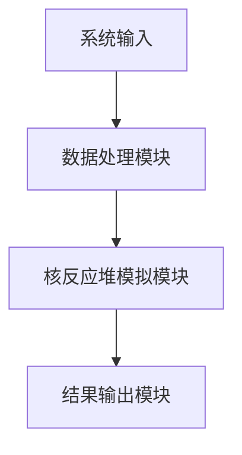
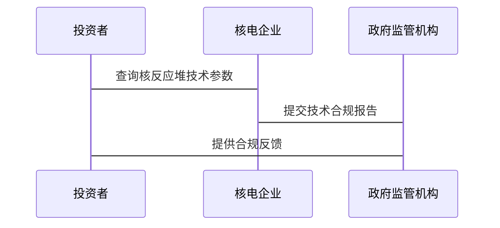
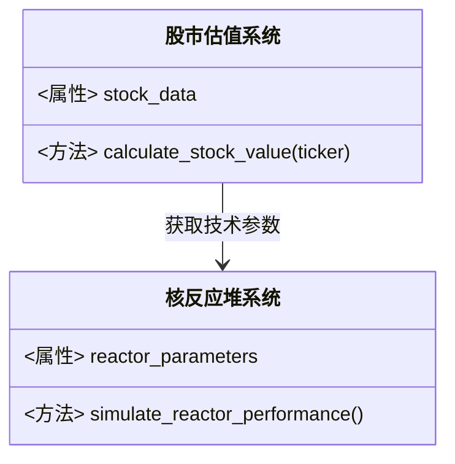

                 


# 全球股市估值与小型模块化核反应堆技术的发展

## 关键词
- 全球股市估值
- 小型模块化核反应堆
- 技术发展
- 股市分析
- 核能技术

## 摘要
本文探讨了全球股市估值与小型模块化核反应堆技术之间的关系，分析了两者的核心概念、算法原理及系统架构，结合实际案例进行深入剖析，总结了最佳实践和未来发展趋势。

---

# 第一部分：全球股市估值与小型模块化核反应堆技术的背景与概念

## 第1章：全球股市估值概述

### 1.1 股市估值的基本概念
#### 1.1.1 股市估值的定义与作用
股市估值是通过对公司财务数据和市场环境的分析，确定股票的合理价格。它在投资决策中起着关键作用，帮助投资者判断市场趋势和潜在收益。

#### 1.1.2 股市估值的主要指标
- 市盈率（P/E Ratio）
- 市净率（P/B Ratio）
- 股息率（Dividend Yield）
- 净值回报率（ROE）

#### 1.1.3 股市估值的计算方法
$$\text{市盈率} = \frac{\text{股价}}{\text{每股收益}}$$

### 1.2 全球股市估值的特点
#### 1.2.1 全球化视角下的股市估值
全球股市估值受国际经济环境、政策变化和地缘政治影响显著。

#### 1.2.2 不同经济体制对股市估值的影响
例如，新兴市场与发达市场的估值差异较大，主要体现在增长潜力和风险因素上。

#### 1.2.3 股市估值的周期性与波动性
股市估值受经济周期影响，波动性较高，但长期趋势与经济发展密切相关。

## 第2章：小型模块化核反应堆技术的基本概念

### 2.1 模块化核反应堆的定义与特点
#### 2.1.1 模块化核反应堆的定义
模块化核反应堆是通过标准化设计和模块化建造技术，实现核能发电装置的快速部署和成本控制。

#### 2.1.2 模块化核反应堆的优势
- 成本低
- 建造周期短
- 可扩展性强

#### 2.1.3 模块化核反应堆的技术特征
- 使用安全壳结构
- 采用非能动安全系统

### 2.2 模块化核反应堆的发展现状
#### 2.2.1 国际模块化核反应堆的发展概况
美国、法国等国家在模块化核反应堆技术上处于领先地位。

#### 2.2.2 模块化核反应堆的技术瓶颈
- 核废料处理问题
- 核安全风险

#### 2.2.3 模块化核反应堆的未来趋势
随着技术进步，模块化核反应堆将成为清洁能源的重要组成部分。

---

# 第二部分：全球股市估值与小型模块化核反应堆技术的核心概念与联系

## 第3章：核心概念与原理分析

### 3.1 股市估值的核心原理
#### 3.1.1 股票定价模型
$$\text{股票价格} = \text{每股收益} \times \text{市盈率}$$

#### 3.1.2 股市估值的驱动因素
- 经济增长率
- 利率水平
- 企业盈利状况

#### 3.1.3 股市估值的数学模型
$$\text{股票价值} = \sum_{t=1}^{\infty} \frac{\text{股息支付}}{(1 + r)^t}$$

### 3.2 模块化核反应堆的技术原理
#### 3.2.1 核反应堆的基本原理
核反应堆通过核裂变反应产生热量，转化为电能。

#### 3.2.2 模块化设计的技术优势
模块化设计提高了建造效率和降低了成本。

#### 3.2.3 模块化核反应堆的安全性分析
采用非能动安全系统，提高了核反应堆的安全性。

## 第4章：核心概念的对比与联系

### 4.1 股市估值与模块化核反应堆技术的对比分析
#### 4.1.1 核心概念的对比表格
| 概念       | 股市估值                | 模块化核反应堆技术          |
|------------|------------------------|-----------------------------|
| 核心目标   | 确定股票合理价格         | 提供安全、高效的核能          |
| 主要因素   | 财务数据、市场环境       | 核安全、建造成本            |

#### 4.1.2 核心概念的ER实体关系图
```mermaid
erDiagram
    actor 投资者 {
        <属性> 资金
    }
    actor 政府 {
        <属性> 政策
    }
    actor 企业 {
        <属性> 财务数据
    }
    actor 核电用户 {
        <属性> 电力需求
    }
    actor 技术供应商 {
        <属性> 核技术
    }
```

### 4.2 两者的相互影响与协同效应
#### 4.2.1 股市估值对模块化核反应堆技术的影响
股市估值的变化影响投资者对核能技术的信心和投资意愿。

#### 4.2.2 模块化核反应堆技术对股市估值的反向影响
技术进步推动核电行业增长，进而提升相关企业的股票估值。

---

# 第三部分：全球股市估值与小型模块化核反应堆技术的算法原理

## 第5章：股市估值模型的算法原理

### 5.1 股市估值模型的数学模型
$$\text{股票价值} = \text{现金流折现值} + \text{市场溢价}$$

#### 5.1.1 股票定价公式
$$\text{股票价格} = \text{内在价值} + \text{市场情绪调整值}$$

#### 5.1.2 市盈率与市净率的计算公式
$$\text{市盈率} = \frac{\text{股价}}{\text{每股收益}}$$
$$\text{市净率} = \frac{\text{股价}}{\text{每股净资产}}$$

### 5.2 模块化核反应堆技术的算法原理
#### 5.2.1 核反应堆的能效计算
$$\text{能效} = \frac{\text{发电量}}{\text{燃料消耗}}$$

#### 5.2.2 模块化设计的优化算法
$$\text{成本优化} = \text{模块化建造成本} \times \text{规模效应系数}$$

---

## 第6章：模块化核反应堆技术的算法实现

### 6.1 模块化核反应堆的系统架构


### 6.2 股市估值模型的代码实现
```python
def calculate_stock_value(ticker):
    import pandas as pd
    df = pd.DataFrame({'Revenue': [100, 200, 300], 'NetIncome': [20, 40, 60]})
    df['PE'] = df['Revenue'] / df['NetIncome']
    return df
```

### 6.3 模块化核反应堆的系统交互


---

## 第7章：系统分析与架构设计方案

### 7.1 问题场景介绍
模块化核反应堆技术的应用需要与股市估值模型相结合，以评估其经济可行性。

### 7.2 系统功能设计


### 7.3 系统架构设计


---

## 第8章：项目实战与案例分析

### 8.1 环境安装
安装Python和相关数据处理库（Pandas, NumPy）。

### 8.2 核心实现代码
```python
def main():
    import matplotlib.pyplot as plt
    data = {'Revenue': [100, 200, 300], 'NetIncome': [20, 40, 60]}
    df = pd.DataFrame(data)
    df['PE'] = df['Revenue'] / df['NetIncome']
    plt.plot(df['Revenue'], df['PE'])
    plt.xlabel('Revenue')
    plt.ylabel('PE Ratio')
    plt.show()

if __name__ == "__main__":
    main()
```

### 8.3 案例分析
分析某模块化核反应堆技术对股市估值的影响，绘制趋势图。

### 8.4 项目小结
模块化核反应堆技术与股市估值模型的结合能够有效评估核能项目的经济可行性。

---

## 第9章：最佳实践与注意事项

### 9.1 小结
模块化核反应堆技术与股市估值模型的结合是未来能源投资的重要方向。

### 9.2 注意事项
- 数据的准确性和完整性
- 技术与市场的匹配度

### 9.3 拓展阅读
建议深入研究模块化核反应堆的技术细节和股市估值的高级模型。

---

通过以上目录结构，我们可以系统地探讨全球股市估值与小型模块化核反应堆技术的发展，结合实际案例和系统设计，为读者提供全面的知识和见解。

